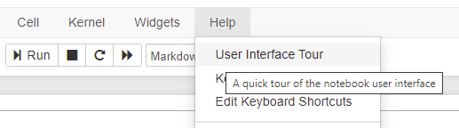
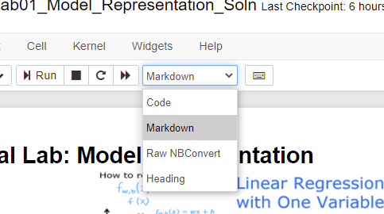
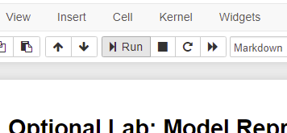

<!-- 本文件由课程原始 Notebook 转换并翻译。代码与公式保留原样。 -->
<!-- 原文件：1. Supervised Machine Learning - Regression and Classification/week 1/C1_W1_Lab01_Python_Jupyter_Soln.ipynb -->

# 可选实验：Python 与 Jupyter Notebook 简介
欢迎来到第一个可选实验！ 
可选实验的作用包括：
- 提供课程相关的补充说明；
- 通过动手示例巩固课程内容；
- 展示编程作业中会用到的常见代码模式。

## 学习目标
在本实验中，你会：
- 简要了解 Jupyter Notebook；
- 熟悉 Jupyter Notebook 的基本界面；
- 区分 Markdown 单元格和代码单元格（code cell）；
- 练习基础 Python 语法。

熟悉 Jupyter Notebook 最直接的方法，是从顶部的 `Help` 菜单启动界面导览：

<figure>
    <center> <center/>
<figure/>

本课程使用 Jupyter Notebook 的两类单元格。像当前这样用于说明文字的单元格称为 `Markdown Cells`，名称来自它所用的轻量标记语言。你不需要自己编写 Markdown 单元格，但应了解下图所示的 `cell pulldown`，以便在单元格类型设置错误时恢复正确状态。

<figure>
   
<figure/>

另一类常用单元格是代码单元格（code cell），用于编写并运行代码：

```python
#This is  a 'Code' Cell
print("This is  code cell")
```

```text
This is  code cell
```

## Python
你可以在代码单元格中编写并运行 Python。 
选中单元格后，可以用以下任一方式运行代码：
- 按 `Shift+Enter`；或
- 点击工具栏上的运行按钮。
<figure>
    
<figure/>

### print 语句
Python 常使用 f-string 格式化输出。
尝试在下方创建自己的打印语句，  
并分别使用上述两种方式运行单元格。

```python
# print statements
variable = "right in the strings!"
print(f"f strings allow you to embed variables {variable}")
```

```text
f strings allow you to embed variables right in the strings!
```

```python
# This a code cell
print('good job')
```

```text
good job
```

```python
# Print with f string
a = 'good'
print(f'Jessica is {a} girl')
```

```text
Jessica is good girl
```

# 恭喜完成！
现在你已经了解 Jupyter Notebook 的基本操作。
