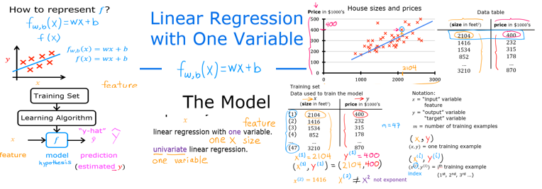
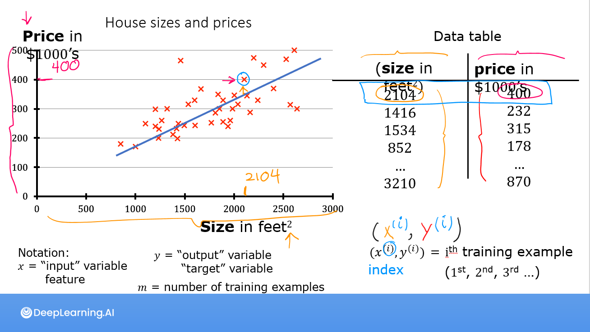
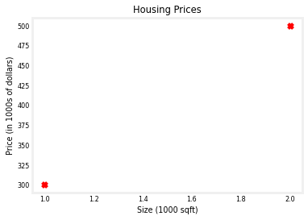
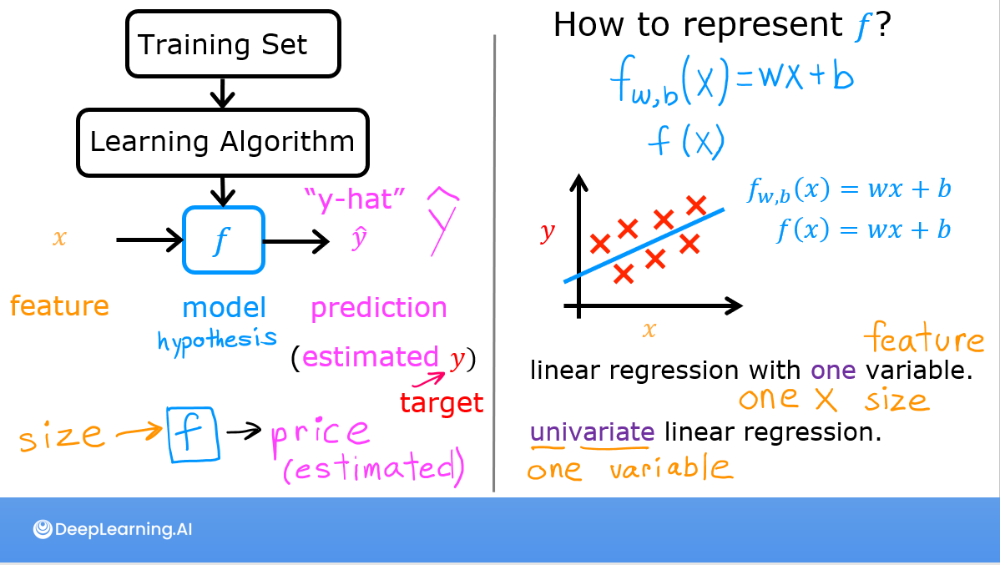
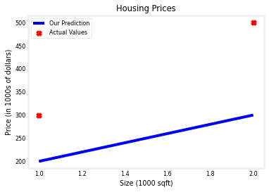

<!-- 本文件由课程原始 Notebook 转换并翻译。代码与公式保留原样。 -->
<!-- 原文件：1. Supervised Machine Learning - Regression and Classification/week 1/C1_W1_Lab02_Model_Representation_Soln.ipynb -->

# 可选实验： 模型表示

<figure>
 
</figure>

## 学习目标
在本实验中，你会：
- 实现单变量线性回归模型 $f_{w,b}$。

## 符号说明
以下是你将遇到的一些标记的摘要。

| 符号 | 说明 | Python（如适用） |
|:---|:---|:---|
| $a$ | 标量，使用普通斜体 | — |
| $\mathbf{a}$ | 向量，使用粗体 | — |
| **回归** |  |  |
| $\mathbf{x}$ | 训练样本的特征值；本实验中为房屋面积（单位：1,000 平方英尺） | `x_train` |
| $\mathbf{y}$ | 训练样本的目标值；本实验中为房屋价格（单位：1,000 美元） | `y_train` |
| $x^{(i)}, y^{(i)}$ | 第 $i$ 个训练样本 | `x_i`, `y_i` |
| $m$ | 训练样本数量 | `m` |
| $w$ | 模型参数：权重 | `w` |
| $b$ | 模型参数：偏置 | `b` |
| $f_{w,b}(x^{(i)})$ | 模型对样本 $x^{(i)}$ 的预测：$f_{w,b}(x^{(i)})=wx^{(i)}+b$ | `f_wb` |

## 所用工具
在本实验中你将使用：
- NumPy，一个流行的科学计算库
- Matplotlib，一个常用的数据可视化库

```python
import numpy as np
import matplotlib.pyplot as plt
plt.style.use('./deeplearning.mplstyle')
```

# 问题说明
 

与讲座相同，本实验使用房价预测作为示例。
本实验使用只有两个数据点的简单数据集：一套 1,000 平方英尺的房屋售价 300,000 美元，另一套 2,000 平方英尺的房屋售价 500,000 美元。这两个样本构成训练集。为简化数值，面积以 1,000 平方英尺为单位，价格以 1,000 美元为单位。

|大小(1 000 sqft)|价格(1 000美元)|
| -------------------| ------------------------ |
| 1.0               | 300                      |
| 2.0               | 500                      |

目标是用一条直线拟合这两个训练样本，从而预测其他房屋的价格，例如面积为 1,200 平方英尺的房屋。

运行下面的代码单元格，创建 `x_train` 和 `y_train`。两组数据都存储为一维 NumPy 数组。

```python
# x_train is the input variable (size in 1000 square feet)
# y_train is the target (price in 1000s of dollars)
x_train = np.array([1.0, 2.0])
y_train = np.array([300.0, 500.0])
print(f"x_train = {x_train}")
print(f"y_train = {y_train}")
```

```text
x_train = [1. 2.]
y_train = [300. 500.]
```

> **说明**：课程会经常使用 Python 的 f-string 输出格式，详见 [Python 文档](https://docs.python.org/3/tutorial/inputoutput.html)。生成输出时，花括号中的表达式会先求值。

### 训练样本数 $m$
课程用 `m` 表示训练样本数。NumPy 数组的 `.shape` 属性返回各维度的长度；这里 `x_train.shape[0]` 就是数组长度，也就是训练样本数。

```python
# m is the number of training examples
print(f"x_train.shape: {x_train.shape}")
m = x_train.shape[0]
print(f"Number of training examples is: {m}")
```

```text
x_train.shape: (2,)
Number of training examples is: 2
```

也可以使用 Python 的 `len()` 函数得到相同结果。

```python
# m is the number of training examples
m = len(x_train)
print(f"Number of training examples is: {m}")
```

```text
Number of training examples is: 2
```

### 训练样本 $x_i, y_i$

用 x$^{(i)}$ 和 y$^{(i)}$ 表示第 $i$ 个训练样本。Python 的索引从 0 开始，因此 x$^{(0)}$ 与 y$^{(0)}$ 为 (1.0, 300.0)，x$^{(1)}$ 与 y$^{(1)}$ 为 (2.0, 500.0)。

访问 NumPy 数组中的元素时，用方括号指定索引。例如，`x_train[0]` 表示 `x_train` 中索引为 0 的元素。
运行下面的代码，读取第 $i$ 个训练样本。

```python
i = 0 # Change this to 1 to see (x^1, y^1)

x_i = x_train[i]
y_i = y_train[i]
print(f"(x^({i}), y^({i})) = ({x_i}, {y_i})")
```

```text
(x^(0), y^(0)) = (1.0, 300.0)
```

### 绘制数据

下面使用 Matplotlib 的 `scatter()` 函数绘制训练数据。
- 参数 `marker` 和 `c` 将数据点显示为红色叉号，而不是默认的蓝色圆点。

还可以用 Matplotlib 为图形设置标题和坐标轴标签。

```python
# Plot the data points
plt.scatter(x_train, y_train, marker='x', c='r')
# Set the title
plt.title("Housing Prices")
# Set the y-axis label
plt.ylabel('Price (in 1000s of dollars)')
# Set the x-axis label
plt.xlabel('Size (1000 sqft)')
plt.show()
```



## 模型函数

如讲座所述，线性回归的模型函数把输入 `x` 映射为预测值 `y`（即 $\hat y$）：

$$
f_{w,b}(x^{(i)}) = wx^{(i)} + b \tag{1}
$$

上式表示一条直线；不同的 $w$ 和 $b$ 会得到不同的直线。<br/> <br/> <br/> <br/> <br/>

下面先令 $w=100$、$b=100$，观察这两个参数如何决定模型直线。 

**注意：**你可以返回这个单元格，修改模型参数 $w$ 和 $b$。

```python
w = 100
b = 100
print(f"w: {w}")
print(f"b: {b}")
```

```text
w: 100
b: 100
```

下面计算两个训练样本对应的预测值 $f_{w,b}(x^{(i)})$。逐个样本写出计算式为：

$x^{(0)}$, `f_wb = w * x[0] + b`

$x^{(1)}$, `f_wb = w * x[1] + b`

样本较多时，逐个书写会很繁琐。因此，`compute_model_output` 函数使用 `for` 循环计算全部样本的预测值。
> **说明：**参数说明中的 `ndarray (m,)` 表示形状为 `(m,)` 的一维 NumPy 数组；`scalar` 表示标量，即没有数组维度的单个数值。
> **说明：**`np.zeros(n)` 返回一个包含 $n$ 个零的一维 NumPy 数组。

```python
def compute_model_output(x, w, b):
    """
    Computes the prediction of a linear model
    Args:
      x (ndarray (m,)): Data, m examples 
      w,b (scalar)    : model parameters  
    Returns
      f_wb (ndarray (m,)): model prediction
    """
    m = x.shape[0]
    f_wb = np.zeros(m)
    for i in range(m):
        f_wb[i] = w * x[i] + b
        
    return f_wb
```

现在调用 `compute_model_output` 并绘制模型输出。

```python
tmp_f_wb = compute_model_output(x_train, w, b,)

# Plot our model prediction
plt.plot(x_train, tmp_f_wb, c='b',label='Our Prediction')

# Plot the data points
plt.scatter(x_train, y_train, marker='x', c='r',label='Actual Values')

# Set the title
plt.title("Housing Prices")
# Set the y-axis label
plt.ylabel('Price (in 1000s of dollars)')
# Set the x-axis label
plt.xlabel('Size (1000 sqft)')
plt.legend()
plt.show()
```



可以看到，$w=100$、$b=100$ 得到的直线并不能拟合训练数据。

### 挑战
尝试不同的 $w$ 和 $b$。要使直线拟合这些数据，参数应取什么值？

#### 提示
点击下方绿色的“提示”，可以查看一组可尝试的 $w$ 和 $b$。

<details>
<summary>
    <font size='3', color='darkgreen'><b>提示</b></font>
</summary>
    <p>
    <ul>
        <li>尝试 $w=200$、$b=100$。 </li>
    </ul>
    </p>

### 预测
确定模型参数后，就可以预测新样本。现在预测一套 1,200 平方英尺房屋的价格；由于 $x$ 以 1,000 平方英尺为单位，因此输入 $x=1.2$。

```python
w = 200                         
b = 100    
x_i = 1.2
cost_1200sqft = w * x_i + b    

print(f"${cost_1200sqft:.0f} thousand dollars")
```

```text
$340 thousand dollars
```

# 恭喜完成！
在本实验中你已经学会了：
  - 线性回归（linear regression）可以建立输入特征与目标值之间的关系；
     - 在本例中，特征（feature）是房屋面积，目标值是房价；
     - 简单线性回归模型包含参数 $w$ 和 $b$，需要利用训练数据拟合这些参数；
     - 参数确定后，模型便可用于预测新数据。

```python

```
