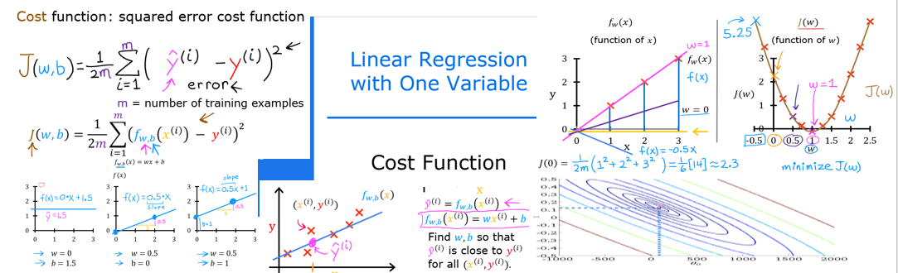
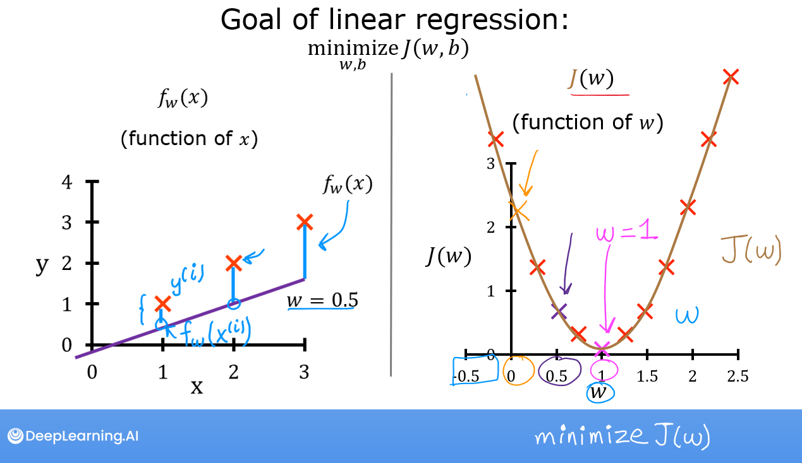

<!-- 本文件由课程原始 Notebook 转换并翻译。代码与公式保留原样。 -->
<!-- 原文件：1. Supervised Machine Learning - Regression and Classification/week 1/C1_W1_Lab03_Cost_function_Soln.ipynb -->

# 可选实验： 代价函数
<figure>
    <center> </center>
</figure>

## 学习目标
在本实验中你会：
- 你将执行并探索`cost`函数用于线性回归（linear regression）一个变量。

## 所用工具
在本实验中我们将利用：
- NumPy，一个流行的科学计算库
- Matplotlib，用于绘图数据的流行库
- 本地绘图常规lab_utils_uni.py本地目录中的文件

```python
# Importing libraries
import numpy as np
%matplotlib widget
import matplotlib.pyplot as plt
from lab_utils_uni import plt_intuition, plt_stationary, plt_update_onclick, soup_bowl
plt.style.use('./deeplearning.mplstyle')
```

## 问题说明

你需要一个模型 可以预测住房价格 根据房子的大小。
使用前面实验中的数据：一套面积为 1,000 平方英尺的房屋售价为 \$300,000，另一套面积为 2,000 平方英尺的房屋售价为 \$500,000。


|大小(1 000 sqft)|价格(1 000美元)|
| -------------------| ------------------------ |
| 1                 | 300                      |
| 2                  | 500                      |

```python
x_train = np.array([1.0, 2.0])           #(size in 1000 square feet), 1000 and 2000 feets
y_train = np.array([300.0, 500.0])           #(price in 1000s of dollars), USD 300000 and USD 500000
```

## 计算代价
这个任务中的“代价”一词可能有点混乱，因为数据是住房代价。**代价是衡量我们模型对房屋目标价格的预测程度**。“价格”一词用于住房数据。

一个变量的代价方程式是：
  $$
  J(w,b) = \frac{1}{2m} \sum\limits_{i = 0}^{m-1} (f_{w,b}(x^{(i)}) - y^{(i)})^2 \tag{1}
  $$
 
其中
  $$
  f_{w,b}(x^{(i)}) = wx^{(i)} + b \tag{2}
  $$
  
- $f_{w,b}(x^{(i)})$比如我们的预测$i$使用参数$w,b$.  
- $(f_{w,b}(x^{(i)}) -y^{(i)})^2$是目标值与预测值之间的平方差。
- 对全部 $m$ 个训练样本的平方误差求和，再除以 `2m`，即可得到代价 $J(w,b)$。  
> 注意：课程公式中的求和下标通常从 1 到 $m$，代码中的索引则从 0 到 $m-1$。

下面的代码遍历所有训练样本来计算代价。每次循环中：
- `f_wb`，计算出预测
- 计算目标值与预测值之差，并对差值取平方。
- 这笔代价将计入总代价。

```python
# Function to yield total 'cost' 
# 'Cost': measure how well our model is predicting the target
def compute_cost(x, y, w, b): 
    """
    Computes the cost function for linear regression.
    
    Args:
      x (ndarray (m,)): Data, m examples 
      y (ndarray (m,)): target values
      w,b (scalar)    : model parameters  
    
    Returns
        total_cost (float): The cost of using w,b as the parameters for linear regression
               to fit the data points in x and y
    """
    # number of training examples
    m = x.shape[0] 
    
    cost_sum = 0 
    for i in range(m): 
        f_wb = w * x[i] + b   
        cost = (f_wb - y[i]) ** 2  
        cost_sum = cost_sum + cost  
    total_cost = (1 / (2 * m)) * cost_sum  

    return total_cost
```

## 代价函数（cost function）直觉

你的目标是找到一个模型$f_{w,b}(x) = wx + b$参数$w,b$，可以准确预测输入的房屋值$x$代价是衡量训练数据中模型的准确性的一个尺度。

以上代价方程式(1)显示：$w$和$b$可以选择这样的预测$f_{w,b}(x)$匹配目标数据$y$，则$(f_{w,b}(x^{(i)}) - y^{(i)})^2 $单词将是零，代价是最小的。在这个简单的两点例子中，你可以做到这一点!

在前一个实验中，你发现 $b=100$ 时可以得到合适的拟合。这里固定 $b=100$，再观察不同 $w$ 对代价的影响。

<br/>
下面使用滑块调整 $w$，观察代价如何变化。交互图可能需要几秒钟更新。

```python
plt_intuition(x_train,y_train)
```

```text
Canvas(toolbar=Toolbar(toolitems=[('Home', 'Reset original view', 'home', 'home'), ('Back', 'Back to previous …
```

图中有几点值得注意：
- 当$w = 200$，与上一个实验
- 由于目标与petition的区别在代价方程中是平方的，代价在当$w$不是太大就是太小
- 使用`w`和`b`以最小化代价结果来选择与数据完全匹配的行。

## 代价函数可视化 - 3D

你可以通过三维曲面图或等高线图，观察代价函数如何随 `w` 和 `b` 的变化而变化。
本课程中的部分绘图代码较为复杂，因此已经提供了相应的绘图函数。阅读这些代码有助于加深理解，但并非完成课程的必要条件；相关函数位于本地的 `lab_utils_uni.py` 中。

### 更大的数据集
查看更多几个数据点的情景很有启发性。 本数据集包括不在同一行的数据点。 这对代价方程意味着什么 ?$w$，以及$b$那样我们就要花零块了?

```python
# Create larger dataset
x_train = np.array([1.0, 1.7, 2.0, 2.5, 3.0, 3.2])
y_train = np.array([250, 300, 480,  430,   630, 730,])
```

在轮廓图中，单击一个点来选择`w`和`b`。请使用轮廓来引导你的选择。注意，更新图表需要几秒钟。

```python
# Plotting
plt.close('all') 
fig, ax, dyn_items = plt_stationary(x_train, y_train)
updater = plt_update_onclick(fig, ax, x_train, y_train, dyn_items)
```

```text
Canvas(toolbar=Toolbar(toolitems=[('Home', 'Reset original view', 'home', 'home'), ('Back', 'Back to previous …
```

上面请注意左边图中的虚线。这些是你在图中每个示例所分担的代价。训练集（training set）在此情况下，数值约为$w=209$和$b=2.4$注意，由于我们的训练样本没有上线，最低代价不是零。

### 代价曲面
平方误差代价函数形成碗状的凸曲面，因此只有一个全局最小值。由于 $w$ 和 $b$ 的数值尺度不同，前面的图不易直接看出这种对称结构；下图展示了讲座中介绍的 $w$-$b$ 代价曲面：

```python
# Plotting convex
soup_bowl()
```

```text
Canvas(toolbar=Toolbar(toolitems=[('Home', 'Reset original view', 'home', 'home'), ('Back', 'Back to previous …
```

# 恭喜完成！
你学到了以下知识：
 - 代价方程可以衡量你的预测与你的训练数据相匹配的程度。
 - 最大限度地降低代价可提供最佳价值：$w$, $b$.

```python

```
