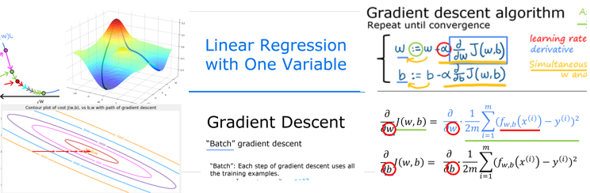
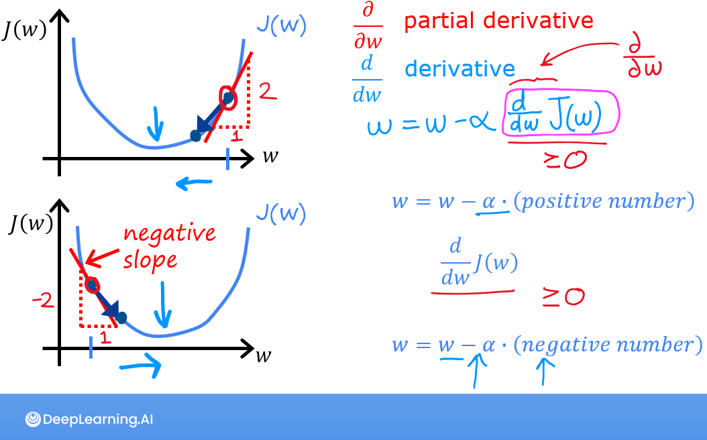
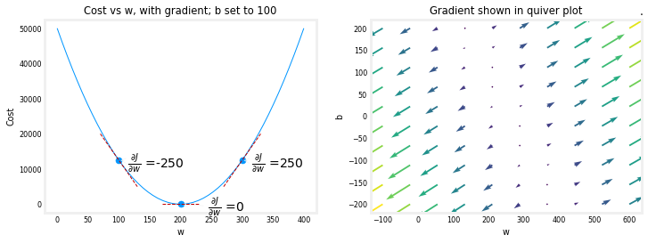
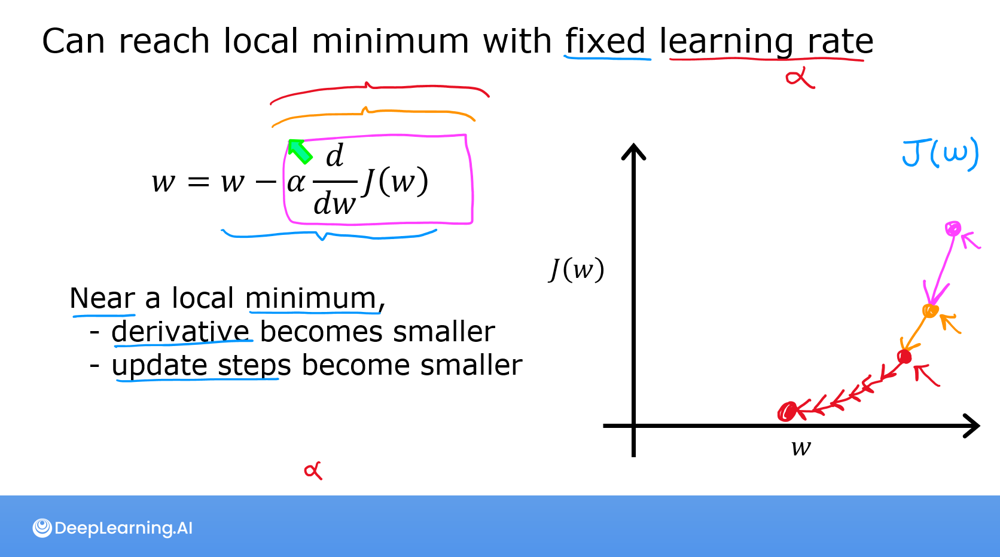
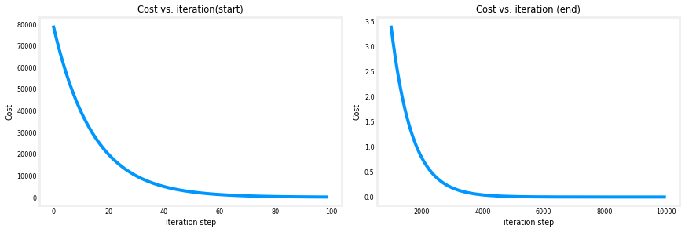
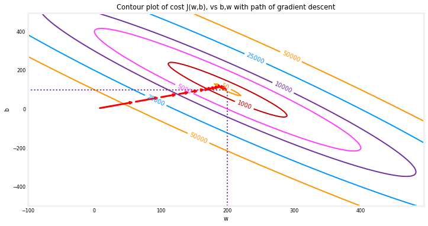
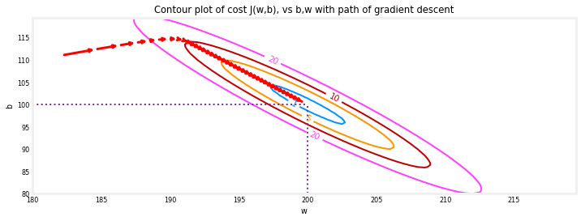
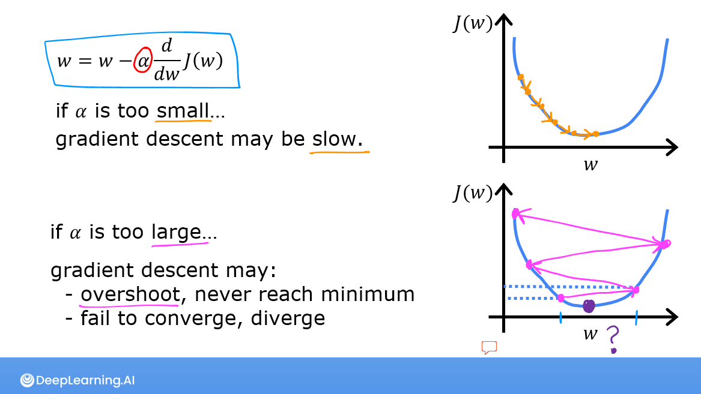
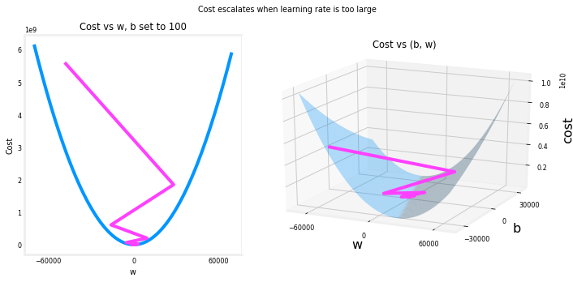

<!-- 本文件由课程原始 Notebook 转换并翻译。代码与公式保留原样。 -->
<!-- 原文件：1. Supervised Machine Learning - Regression and Classification/week 1/C1_W1_Lab04_Gradient_Descent_Soln.ipynb -->

# 可选实验： 用于线性回归的梯度下降（gradient descent for linear regression）

<figure>
    <center> </center>
</figure>

## 学习目标
在本实验中，你会：
- 自动优化进程$w$和$b$使用梯度下降（gradient descent）.

## 所用工具
在本实验中，我们将利用：
- NumPy，一个流行的科学计算库
- Matplotlib，用于绘图数据的流行库
- 绘制常规lab_utils.py本地目录中的文件

```python
import math, copy
import numpy as np
import matplotlib.pyplot as plt
plt.style.use('./deeplearning.mplstyle')
from lab_utils_uni import plt_house_x, plt_contour_wgrad, plt_divergence, plt_gradients
```

<a name="toc_40291_2"></a>
# 问题说明

使用前面实验中的数据：一套面积为 1,000 平方英尺的房屋售价为 \$300,000，另一套面积为 2,000 平方英尺的房屋售价为 \$500,000。

|大小(1 000 sqft)|价格(1 000美元)|
| ----------------| ------------------------ |
| 1               | 300                      |
| 2               | 500                      |

```python
# Load our data set
x_train = np.array([1.0, 2.0])   #features
y_train = np.array([300.0, 500.0])   #target value
```

<a name="toc_40291_2.0.1"></a>
### Compute_Cost
这是在最后实验-我们又需要它了

```python
#Function to calculate the cost
def compute_cost(x, y, w, b):
   
    m = x.shape[0] 
    cost = 0
    
    for i in range(m):
        f_wb = w * x[i] + b
        cost = cost + (f_wb - y[i])**2
    total_cost = 1 / (2 * m) * cost

    return total_cost
```

<a name="toc_40291_2.1"></a>
## 梯度下降内容提要
到目前为止，你已经开发了一个线性模型 预测$f_{w,b}(x^{(i)})$:
$$
f_{w,b}(x^{(i)}) = wx^{(i)} + b \tag{1}
$$
在线性回归（linear regression）中，需要利用训练数据拟合参数 $w,b$，使预测 $f_{w,b}(x^{(i)})$ 与目标值 $y^{(i)}$ 之间的误差尽可能小。代价函数 $J(w,b)$ 汇总了全部训练样本 $(x^{(i)},y^{(i)})$ 上的误差。
$$
J(w,b) = \frac{1}{2m} \sum\limits_{i = 0}^{m-1} (f_{w,b}(x^{(i)}) - y^{(i)})^2\tag{2}
$$

在演讲中，梯度下降* 被描述为：

$$
\begin{align*} \text{repeat}&\text{ until convergence:} \; \lbrace \newline
\;  w &= w -  \alpha \frac{\partial J(w,b)}{\partial w} \tag{3}  \; \newline 
 b &= b -  \alpha \frac{\partial J(w,b)}{\partial b}  \newline \rbrace
\end{align*}
$$
何处，参数$w$, $b$同时更新。
该梯度（gradient）定义为：
$$
\begin{align}
\frac{\partial J(w,b)}{\partial w}  &= \frac{1}{m} \sum\limits_{i = 0}^{m-1} (f_{w,b}(x^{(i)}) - y^{(i)})x^{(i)} \tag{4}\\
  \frac{\partial J(w,b)}{\partial b}  &= \frac{1}{m} \sum\limits_{i = 0}^{m-1} (f_{w,b}(x^{(i)}) - y^{(i)}) \tag{5}\\
\end{align}
$$

这里的**同时更新**表示：先计算所有参数的偏导数，再统一更新参数。

<a name="toc_40291_2.2"></a>
## 执行梯度下降
你会执行梯度下降一个算法特征（feature）。你需要三种功能。
- `compute_gradient`执行上述方程式(4)和(5)
- `compute_cost`执行以上方程式(2)(代码来自上一个实验)
- `gradient_descent`：调用梯度函数和代价函数，迭代更新模型参数。

命名惯例：
- Python 中表示偏导数的变量遵循统一命名规则，例如 $\frac{\partial J(w,b)}{\partial b}$ 记为 `dj_db`。
- 例如，$\frac{\partial J(w,b)}{\partial b}$ 表示 $J(w,b)$ 对 $b$ 的偏导数。

<a name="toc_40291_2.3"></a>
### compute_gradient
<a name='ex-01'></a>
`compute_gradient`执行上文(4)和(5)和返回$\frac{\partial J(w,b)}{\partial w}$,$\frac{\partial J(w,b)}{\partial b}$。嵌入式注释描述操作。

```python
def compute_gradient(x, y, w, b): 
    """
    Computes the gradient for linear regression 
    Args:
      x (ndarray (m,)): Data, m examples 
      y (ndarray (m,)): target values
      w,b (scalar)    : model parameters  
    Returns
      dj_dw (scalar): The gradient of the cost w.r.t. the parameters w
      dj_db (scalar): The gradient of the cost w.r.t. the parameter b     
     """
    
    # Number of training examples
    m = x.shape[0]    
    dj_dw = 0
    dj_db = 0
    
    for i in range(m):  
        f_wb = w * x[i] + b 
        dj_dw_i = (f_wb - y[i]) * x[i] 
        dj_db_i = f_wb - y[i] 
        dj_db += dj_db_i
        dj_dw += dj_dw_i 
    dj_dw = dj_dw / m 
    dj_db = dj_db / m 
        
    return dj_dw, dj_db
```

<br/>

讲座说明了梯度下降如何利用当前点处代价函数对参数的偏导数更新该参数。
使用 `compute_gradient` 函数计算并绘制代价函数对参数 $w_0$ 的偏导数。

```python
plt_gradients(x_train,y_train, compute_cost, compute_gradient)
plt.show()
```



左图显示代价曲线对 $w$ 的偏导数 $\frac{\partial J(w,b)}{\partial w}$：曲线右侧导数为正，左侧导数为负，因此梯度下降会沿碗状曲面移向导数为零的最低点。
 
左图固定 $b=100$，梯度下降同时使用 $\frac{\partial J(w,b)}{\partial w}$ 和 $\frac{\partial J(w,b)}{\partial b}$ 更新参数。右图用箭头显示梯度：箭头方向由两个偏导数决定，长度反映梯度大小。
注意到梯度（gradient）离最低点的* 距离。梯度（gradient）从当前值中$w$或$b$。此选项将参数向降低代价的方向移动。

<a name="toc_40291_2.5"></a>
### 梯度下降
现在可以计算梯度了梯度下降，以上方程式(3)所述，可在下文`gradient_descent`。下文将利用这一功能寻找最佳价值。$w$和$b$训练数据。

```python
def gradient_descent(x, y, w_in, b_in, alpha, num_iters, cost_function, gradient_function): 
    """
    Performs gradient descent to fit w,b. Updates w,b by taking 
    num_iters gradient steps with learning rate alpha
    
    Args:
      x (ndarray (m,))  : Data, m examples 
      y (ndarray (m,))  : target values
      w_in,b_in (scalar): initial values of model parameters  
      alpha (float):     Learning rate
      num_iters (int):   number of iterations to run gradient descent
      cost_function:     function to call to produce cost
      gradient_function: function to call to produce gradient
      
    Returns:
      w (scalar): Updated value of parameter after running gradient descent
      b (scalar): Updated value of parameter after running gradient descent
      J_history (List): History of cost values
      p_history (list): History of parameters [w,b] 
      """
    
    # An array to store cost J and w's at each iteration primarily for graphing later
    J_history = []
    p_history = []
    b = b_in
    w = w_in
    
    for i in range(num_iters):
        # Calculate the gradient and update the parameters using gradient_function
        dj_dw, dj_db = gradient_function(x, y, w , b)     

        # Update Parameters using equation (3) above
        b = b - alpha * dj_db                            
        w = w - alpha * dj_dw                            

        # Save cost J at each iteration
        if i<100000:      # prevent resource exhaustion 
            J_history.append( cost_function(x, y, w , b))
            p_history.append([w,b])
        # Print cost every at intervals 10 times or as many iterations if < 10
        if i% math.ceil(num_iters/10) == 0:
            print(f"Iteration {i:4}: Cost {J_history[-1]:0.2e} ",
                  f"dj_dw: {dj_dw: 0.3e}, dj_db: {dj_db: 0.3e}  ",
                  f"w: {w: 0.3e}, b:{b: 0.5e}")
 
    return w, b, J_history, p_history #return w and J,w history for graphing
```

```python
# initialize parameters
w_init = 0
b_init = 0
# some gradient descent settings
iterations = 10000
tmp_alpha = 1.0e-2
# run gradient descent
w_final, b_final, J_hist, p_hist = gradient_descent(x_train ,y_train, w_init, b_init, tmp_alpha, 
                                                    iterations, compute_cost, compute_gradient)
print(f"(w,b) found by gradient descent: ({w_final:8.4f},{b_final:8.4f})")
```

```text
Iteration    0: Cost 7.93e+04  dj_dw: -6.500e+02, dj_db: -4.000e+02   w:  6.500e+00, b: 4.00000e+00
Iteration 1000: Cost 3.41e+00  dj_dw: -3.712e-01, dj_db:  6.007e-01   w:  1.949e+02, b: 1.08228e+02
Iteration 2000: Cost 7.93e-01  dj_dw: -1.789e-01, dj_db:  2.895e-01   w:  1.975e+02, b: 1.03966e+02
Iteration 3000: Cost 1.84e-01  dj_dw: -8.625e-02, dj_db:  1.396e-01   w:  1.988e+02, b: 1.01912e+02
Iteration 4000: Cost 4.28e-02  dj_dw: -4.158e-02, dj_db:  6.727e-02   w:  1.994e+02, b: 1.00922e+02
Iteration 5000: Cost 9.95e-03  dj_dw: -2.004e-02, dj_db:  3.243e-02   w:  1.997e+02, b: 1.00444e+02
Iteration 6000: Cost 2.31e-03  dj_dw: -9.660e-03, dj_db:  1.563e-02   w:  1.999e+02, b: 1.00214e+02
Iteration 7000: Cost 5.37e-04  dj_dw: -4.657e-03, dj_db:  7.535e-03   w:  1.999e+02, b: 1.00103e+02
Iteration 8000: Cost 1.25e-04  dj_dw: -2.245e-03, dj_db:  3.632e-03   w:  2.000e+02, b: 1.00050e+02
Iteration 9000: Cost 2.90e-05  dj_dw: -1.082e-03, dj_db:  1.751e-03   w:  2.000e+02, b: 1.00024e+02
(w,b) found by gradient descent: (199.9929,100.0116)
```

 
慢慢来，注意一下梯度下降进程。

- 如讲座幻灯片所述，代价开始大幅迅速下降。
- 偏导数 `dj_dw` 和 `dj_db` 也逐渐减小：初期下降较快，接近最小值时变慢。此时梯度较小，因此参数在代价曲面的“碗底”附近更新得更慢。
- 进展缓慢，尽管学习率（learning rate）阿尔法 仍然固定

### 代价与梯度下降
代价随迭代次数的曲线可用于检查梯度下降是否正常：成功运行时，代价应持续降低。初期下降很快，因此可用不同尺度分别观察初期和后期的变化。

```python
# plot cost versus iteration  
fig, (ax1, ax2) = plt.subplots(1, 2, constrained_layout=True, figsize=(12,4))
ax1.plot(J_hist[:100])
ax2.plot(1000 + np.arange(len(J_hist[1000:])), J_hist[1000:])
ax1.set_title("Cost vs. iteration(start)");  ax2.set_title("Cost vs. iteration (end)")
ax1.set_ylabel('Cost')            ;  ax2.set_ylabel('Cost') 
ax1.set_xlabel('iteration step')  ;  ax2.set_xlabel('iteration step') 
plt.show()
```



### 预测
现在你发现了参数的最佳值$w$和$b$，你现在可以使用模型来根据我们学到的参数来预测住房价值。如预期的那样，预测值与同一住房的训练值几乎相同。此外，预测中没有的值与预期值一致。

```python
print(f"1000 sqft house prediction {w_final*1.0 + b_final:0.1f} Thousand dollars")
print(f"1200 sqft house prediction {w_final*1.2 + b_final:0.1f} Thousand dollars")
print(f"2000 sqft house prediction {w_final*2.0 + b_final:0.1f} Thousand dollars")
```

```text
1000 sqft house prediction 300.0 Thousand dollars
1200 sqft house prediction 340.0 Thousand dollars
2000 sqft house prediction 500.0 Thousand dollars
```

<a name="toc_40291_2.6"></a>
## 绘图
你可以显示进步梯度下降执行期间，通过按代价的轮廓图(w,b)计算代价。

```python
fig, ax = plt.subplots(1,1, figsize=(12, 6))
plt_contour_wgrad(x_train, y_train, p_hist, ax)
```



上面的轮廓图显示$cost(w,b)$涵盖范围$w$和$b$。代价水平以环表示。使用红箭头的重叠是路径。梯度下降。这里有一些事情需要注意：
- 这条道路使其目标取得稳步(莫诺尼克)进展。
- 最初的步骤远大于接近目标的步骤。

**缩放视图**显示了梯度下降的最后几步。随着梯度接近 0，相邻步骤之间的距离逐渐缩小。

```python
fig, ax = plt.subplots(1,1, figsize=(12, 4))
plt_contour_wgrad(x_train, y_train, p_hist, ax, w_range=[180, 220, 0.5], b_range=[80, 120, 0.5],
            contours=[1,5,10,20],resolution=0.5)
```



<a name="toc_40291_2.7.1"></a>
### 增加学习率

<figure>
 
</figure>
课堂中讨论了式 (3) 中学习率$\alpha$ 的合理取值。$\alpha$ 越大，梯度下降通常收敛得越快；但如果 $\alpha$ 过大，梯度下降就会发散。上图展示了一个平稳收敛的示例。

增大学习率 $\alpha$，观察会发生什么：

```python
# initialize parameters
w_init = 0
b_init = 0
# set alpha to a large value
iterations = 10
tmp_alpha = 8.0e-1
# run gradient descent
w_final, b_final, J_hist, p_hist = gradient_descent(x_train ,y_train, w_init, b_init, tmp_alpha, 
                                                    iterations, compute_cost, compute_gradient)
```

```text
Iteration    0: Cost 2.58e+05  dj_dw: -6.500e+02, dj_db: -4.000e+02   w:  5.200e+02, b: 3.20000e+02
Iteration    1: Cost 7.82e+05  dj_dw:  1.130e+03, dj_db:  7.000e+02   w: -3.840e+02, b:-2.40000e+02
Iteration    2: Cost 2.37e+06  dj_dw: -1.970e+03, dj_db: -1.216e+03   w:  1.192e+03, b: 7.32800e+02
Iteration    3: Cost 7.19e+06  dj_dw:  3.429e+03, dj_db:  2.121e+03   w: -1.551e+03, b:-9.63840e+02
Iteration    4: Cost 2.18e+07  dj_dw: -5.974e+03, dj_db: -3.691e+03   w:  3.228e+03, b: 1.98886e+03
Iteration    5: Cost 6.62e+07  dj_dw:  1.040e+04, dj_db:  6.431e+03   w: -5.095e+03, b:-3.15579e+03
Iteration    6: Cost 2.01e+08  dj_dw: -1.812e+04, dj_db: -1.120e+04   w:  9.402e+03, b: 5.80237e+03
Iteration    7: Cost 6.09e+08  dj_dw:  3.156e+04, dj_db:  1.950e+04   w: -1.584e+04, b:-9.80139e+03
Iteration    8: Cost 1.85e+09  dj_dw: -5.496e+04, dj_db: -3.397e+04   w:  2.813e+04, b: 1.73730e+04
Iteration    9: Cost 5.60e+09  dj_dw:  9.572e+04, dj_db:  5.916e+04   w: -4.845e+04, b:-2.99567e+04
```

上图中，$w$ 和 $b$ 在正负值之间来回跳动，且绝对值逐次增大；$\frac{\partial J(w,b)}{\partial w}$ 不断变号，代价也持续上升。这说明学习率过大，算法正在发散。
下面用图形直观展示这一过程。

```python
plt_divergence(p_hist, J_hist,x_train, y_train)
plt.show()
```



上方，左图显示$w$初几个步骤的进展梯度下降. $w$振荡从正向负，代价迅速增长.梯度下降正在运行于两个$w$和$b$同时，人们需要右侧的三维图图来进行完整图片。

## 恭喜完成！
在本实验中你：
- 详细情况梯度下降对于一个变量。
- 开发了计算程序梯度（gradient）
- 直观的梯度（gradient）这是
- 已完成a梯度下降常规
- 使用梯度下降查找参数
- 研究了扩大规模的影响学习率

```python

```
