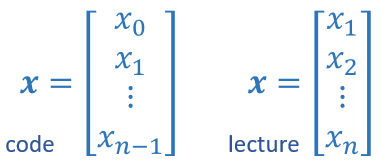
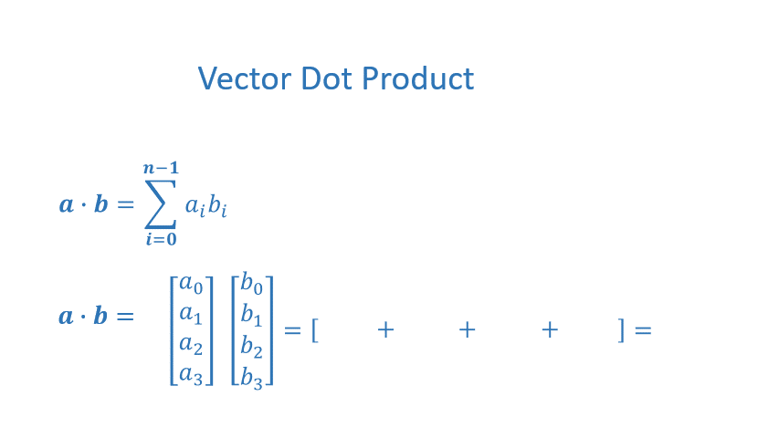
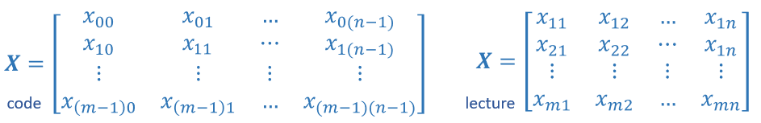

<!-- 本文件由课程原始 Notebook 转换并翻译。代码与公式保留原样。 -->
<!-- 原文件：1. Supervised Machine Learning - Regression and Classification/week 2/C1_W2_Lab01_Python_Numpy_Vectorization_Soln.ipynb -->

# 可选实验： Python, NumPy和向量化（vectorization）
简介本课程使用的一些科学计算。NumPy科学计算软件包及其使用Python.

# 内容提要
- [&nbsp;&nbsp;1.1 Goals](#toc_40015_1.1)
- [&nbsp;&nbsp;1.2 Useful References](#toc_40015_1.2)
- [2 Python and NumPy <a name='Python and NumPy'></a>](#toc_40015_2)
- [3 Vectors](#toc_40015_3)
- [&nbsp;&nbsp;3.1 Abstract](#toc_40015_3.1)
- [&nbsp;&nbsp;3.2 NumPy Arrays](#toc_40015_3.2)
- [&nbsp;&nbsp;3.3 Vector Creation](#toc_40015_3.3)
- [&nbsp;&nbsp;3.4 Operations on Vectors](#toc_40015_3.4)
- [4 Matrices](#toc_40015_4)
- [&nbsp;&nbsp;4.1 Abstract](#toc_40015_4.1)
- [&nbsp;&nbsp;4.2 NumPy Arrays](#toc_40015_4.2)
- [&nbsp;&nbsp;4.3 Matrix Creation](#toc_40015_4.3)
- [&nbsp;&nbsp;4.4 Operations on Matrices](#toc_40015_4.4)

```python
import numpy as np    # it is an unofficial standard to use np for numpy
import time
```

<a name="toc_40015_1.1"></a>
## 1.1 目标
在本实验中，你会：
- 回顾课程 1 所需的 NumPy 和 Python 基础功能。

<a name="toc_40015_1.2"></a>
## 1.2 有用的参考资料
- NumPy文件，包括基本导言：[NumPy.org](https://NumPy.org/doc/stable/)
- 挑战性特征（feature）专题：[NumPy Broadcasting](https://NumPy.org/doc/stable/user/basics.broadcasting.html)

<a name="toc_40015_2"></a>
# 2 Python和NumPy <a name='Python and NumPy'></a> <a name='Python and NumPy'> </a>
Python是在此课程中我们将使用的编程语言。它有一套数字数据类型和算术操作。NumPy是一个可以扩展Python添加更丰富的数据集，包括更多的数字类型、向量、矩阵和许多矩阵函数。NumPy和Python一起工作相当无缝。Python算术操作器正在工作NumPy数据类型和数量NumPy函数将接受Python数据类型。

<a name="toc_40015_3"></a>
# 3 向量
<a name="toc_40015_3.1"></a>
## 3.1 摘要
向量，因为你将在此课程中使用它们，是命令数组。在标记中，向量用小写粗体字母表示，例如$\mathbf{x}$。向量的元素都是相同的类型。例如，向量不包含字符和数字。数组中的元素数往往被称为 *dimension *，尽管数学家可能更喜欢 *rank *。所显示的向量具有一个维度。$n$。在数学设置中，索引通常从 1 到 n 。在计算机科学和这些实验中，索引通常从 0 到 n-1。在标记中，向量的元素，如果单独引用，将在下标中表示索引，例如：$0^{th}$向量的元素$\mathbf{x}$这是$x_0$。注意，此处x不是粗体。

<a name="toc_40015_3.2"></a>
## 3.2 NumPy矩阵

NumPy 的基本数据结构是可索引的 n 维同类型数组（元素类型由 `dtype` 指定）。这里“维度”指数组索引轴的数量；在课程 1 中，向量通常表示为 NumPy 一维数组。

 - 1-D 数组，形状(n):n 元素索引 [0] 至 [n-1]

<a name="toc_40015_3.3"></a>
## 3.3 向量生成

数据创建常规NumPy将通常具有第一个参数，即对象的形状。这可以是一维结果的单个值，也可以是指定结果形状的拖曳(n,m,...)。下面是使用这些常规创建向量的例子。

```python
# NumPy routines which allocate memory and fill arrays with value
a = np.zeros(4);                print(f"np.zeros(4) :   a = {a}, a shape = {a.shape}, a data type = {a.dtype}")
a = np.zeros((4,));             print(f"np.zeros(4,) :  a = {a}, a shape = {a.shape}, a data type = {a.dtype}")
a = np.random.random_sample(4); print(f"np.random.random_sample(4): a = {a}, a shape = {a.shape}, a data type = {a.dtype}")
```

```text
np.zeros(4) :   a = [0. 0. 0. 0.], a shape = (4,), a data type = float64
np.zeros(4,) :  a = [0. 0. 0. 0.], a shape = (4,), a data type = float64
np.random.random_sample(4): a = [0.2270434  0.99142376 0.47346445 0.70626093], a shape = (4,), a data type = float64
```

一些数据创建常规不会发生形状的拖转 :

```python
# NumPy routines which allocate memory and fill arrays with value but do not accept shape as input argument
a = np.arange(4.);              print(f"np.arange(4.):     a = {a}, a shape = {a.shape}, a data type = {a.dtype}")
a = np.random.rand(4);          print(f"np.random.rand(4): a = {a}, a shape = {a.shape}, a data type = {a.dtype}")
```

```text
np.arange(4.):     a = [0. 1. 2. 3.], a shape = (4,), a data type = float64
np.random.rand(4): a = [0.64428513 0.91720481 0.78745444 0.59467687], a shape = (4,), a data type = float64
```

数值也可以手工指定。

```python
# NumPy routines which allocate memory and fill with user specified values
a = np.array([5,4,3,2]);  print(f"np.array([5,4,3,2]):  a = {a},     a shape = {a.shape}, a data type = {a.dtype}")
a = np.array([5.,4,3,2]); print(f"np.array([5.,4,3,2]): a = {a}, a shape = {a.shape}, a data type = {a.dtype}")
```

```text
np.array([5,4,3,2]):  a = [5 4 3 2],     a shape = (4,), a data type = int64
np.array([5.,4,3,2]): a = [5. 4. 3. 2.], a shape = (4,), a data type = float64
```

这些都创造了一维向量`a`包含四个要素。`a.shape`返回维度。这里我们看到a.shape = `(4,)`表示含有4个元素的1-d数组。

<a name="toc_40015_3.4"></a>
## 3.4 对向量的操作
让我们用向量探索一些操作。
<a name="toc_40015_3.4.1"></a>
### 3.4.1 索引
可以通过索引和切片访问向量中的元素。NumPy 提供了丰富的索引与切片功能；本节只介绍课程所需的基础用法。更多细节请参阅 [Slicing and Indexing](https://numpy.org/doc/stable/reference/arrays.indexing.html)。
* **索引**：根据元素在数组中的位置访问单个元素。
* **切片**：根据索引范围取得数组中的一组元素。
NumPy 的索引从 0 开始，因此向量 $\mathbf{a}$ 的第 3 个元素写作 `a[2]`。

```python
#vector indexing operations on 1-D vectors
a = np.arange(10)
print(a)

#access an element
print(f"a[2].shape: {a[2].shape} a[2]  = {a[2]}, Accessing an element returns a scalar")

# access the last element, negative indexes count from the end
print(f"a[-1] = {a[-1]}")

#indexs must be within the range of the vector or they will produce and error
try:
    c = a[10]
except Exception as e:
    print("The error message you'll see is:")
    print(e)
```

```text
[0 1 2 3 4 5 6 7 8 9]
a[2].shape: () a[2]  = 2, Accessing an element returns a scalar
a[-1] = 9
The error message you'll see is:
index 10 is out of bounds for axis 0 with size 10
```

<a name="toc_40015_3.4.2"></a>
### 3.4.2 切片
切片使用一组三个值创建一系列指数(`start:stop:step`。一个子集的值也是有效的。其使用最好用实例来解释：

```python
#vector slicing operations
a = np.arange(10)
print(f"a         = {a}")

#access 5 consecutive elements (start:stop:step)
c = a[2:7:1];     print("a[2:7:1] = ", c)

# access 3 elements separated by two 
c = a[2:7:2];     print("a[2:7:2] = ", c)

# access all elements index 3 and above
c = a[3:];        print("a[3:]    = ", c)

# access all elements below index 3
c = a[:3];        print("a[:3]    = ", c)

# access all elements
c = a[:];         print("a[:]     = ", c)
```

```text
a         = [0 1 2 3 4 5 6 7 8 9]
a[2:7:1] =  [2 3 4 5 6]
a[2:7:2] =  [2 4 6]
a[3:]    =  [3 4 5 6 7 8 9]
a[:3]    =  [0 1 2]
a[:]     =  [0 1 2 3 4 5 6 7 8 9]
```

<a name="toc_40015_3.4.3"></a>
### 3.4.3 单一向量操作
有一些有用的操作，涉及单个向量上的操作。

```python
a = np.array([1,2,3,4])
print(f"a             : {a}")
# negate elements of a
b = -a 
print(f"b = -a        : {b}")

# sum all elements of a, returns a scalar
b = np.sum(a) 
print(f"b = np.sum(a) : {b}")

b = np.mean(a)
print(f"b = np.mean(a): {b}")

b = a**2
print(f"b = a**2      : {b}")
```

```text
a             : [1 2 3 4]
b = -a        : [-1 -2 -3 -4]
b = np.sum(a) : 10
b = np.mean(a): 2.5
b = a**2      : [ 1  4  9 16]
```

<a name="toc_40015_3.4.4"></a>
### 3.4.4 向量元素操作
大多数NumPy算术、逻辑和比较操作也适用于向量。这些运算符按元素逐项工作。例如，
$$
c_i = a_i + b_i
$$

```python
a = np.array([ 1, 2, 3, 4])
b = np.array([-1,-2, 3, 4])
print(f"Binary operators work element wise: {a + b}")
```

```text
Binary operators work element wise: [0 0 6 8]
```

当然，要正确操作，向量必须大小相同：

```python
#try a mismatched vector operation
c = np.array([1, 2])
try:
    d = a + c
except Exception as e:
    print("The error message you'll see is:")
    print(e)
```

```text
The error message you'll see is:
operands could not be broadcast together with shapes (4,) (2,)
```

<a name="toc_40015_3.4.5"></a>
### 3.4.5 Scalar向量操作
向量可以用scalar值来“缩放 ” 。 scalar值只是一个数字。 scalar乘以向量的所有元素 。

```python
a = np.array([1, 2, 3, 4])

# multiply a by a scalar
b = 5 * a 
print(f"b = 5 * a : {b}")
```

```text
b = 5 * a : [ 5 10 15 20]
```

<a name="toc_40015_3.4.6"></a>
### 3.4.6 向量向量点积
点积是线性代数和 NumPy 中的基本运算，本课程会频繁使用，应熟练掌握。



点积将数值乘以两个向量元素，然后将结果相加。
向量点积要求两个向量的维度相同。

下面实现一个简单的点积函数：

**使用循环**实现一个函数，计算并返回输入向量 $a$ 与 $b$ 的点积：
$$
x = \sum_{i=0}^{n-1} a_i b_i
$$
假设两者`a`和`b`是同一个形状。

```python
def my_dot(a, b): 
    """
   Compute the dot product of two vectors
 
    Args:
      a (ndarray (n,)):  input vector 
      b (ndarray (n,)):  input vector with same dimension as a
    
    Returns:
      x (scalar): 
    """
    x=0
    for i in range(a.shape[0]):
        x = x + a[i] * b[i]
    return x
```

```python
# test 1-D
a = np.array([1, 2, 3, 4])
b = np.array([-1, 4, 3, 2])
print(f"my_dot(a, b) = {my_dot(a, b)}")
```

```text
my_dot(a, b) = 24
```

注意，两个向量的点积返回一个标量。

下面使用 `np.dot` 完成相同运算。

```python
# test 1-D
a = np.array([1, 2, 3, 4])
b = np.array([-1, 4, 3, 2])
c = np.dot(a, b)
print(f"NumPy 1-D np.dot(a, b) = {c}, np.dot(a, b).shape = {c.shape} ") 
c = np.dot(b, a)
print(f"NumPy 1-D np.dot(b, a) = {c}, np.dot(a, b).shape = {c.shape} ")
```

```text
NumPy 1-D np.dot(a, b) = 24, np.dot(a, b).shape = () 
NumPy 1-D np.dot(b, a) = 24, np.dot(a, b).shape = ()
```

以上各位将注意到，1-D的成果与我们的执行相吻合。

<a name="toc_40015_3.4.7"></a>
### 3.4.7 速度的必要性：向量对循环
NumPy 还能提高存储效率，下面进行比较。

```python
# Comparison of calculation between vectorized and loop (without vectorized)
np.random.seed(1)
a = np.random.rand(10000000)  # very large arrays
b = np.random.rand(10000000)

tic = time.time()  # capture start time
c = np.dot(a, b)
toc = time.time()  # capture end time

print(f"np.dot(a, b) =  {c:.4f}")
print(f"Vectorized version duration: {1000*(toc-tic):.4f} ms ")

tic = time.time()  # capture start time
c = my_dot(a,b)
toc = time.time()  # capture end time

print(f"my_dot(a, b) =  {c:.4f}")
print(f"loop version duration: {1000*(toc-tic):.4f} ms ")

del(a);del(b)  #remove these big arrays from memory
```

```text
np.dot(a, b) =  2501072.5817
Vectorized version duration: 165.2324 ms 
my_dot(a, b) =  2501072.5817
loop version duration: 9801.0440 ms
```

向量化（vectorization）能显著提升此示例的运行速度。NumPy 会利用 GPU 和现代 CPU 的单指令多数据（SIMD）能力并行执行多个运算；对于通常规模很大的机器学习数据集，这一点尤其重要。

<a name="toc_12345_3.4.8"></a>
### 3.4.8 课程1中的向量操作
向量向量操作将经常出现在课程1. 这就是为什么：
- 展望未来，我们的例子将被存储在一个数组中，`X_train`这将在上下文中作更多的解释，但在此必须指出，这是一个2维数组或矩阵(见下一节关于矩阵)。
- `w`将是形状的1维向量(n,)。
- 我们将通过循环实例来进行操作，通过编制X索引来提取每个实例以单独开展工作。`X[i]`
- `X[i]`返回形状(n)的值，1维向量。因此，操作涉及`X[i]`通常为向量向量。

这是一个有点长的解释， 但调整和理解你的操作的形状 在进行向量操作时很重要。

```python
# show common Course 1 example
X = np.array([[1],[2],[3],[4]])
w = np.array([2])
c = np.dot(X[1], w)

print(f"X[1] has shape {X[1].shape}")
print(f"w has shape {w.shape}")
print(f"c has shape {c.shape}")
```

```text
X[1] has shape (1,)
w has shape (1,)
c has shape ()
```

<a name="toc_40015_4"></a>
# 4 矩阵

<a name="toc_40015_4.1"></a>
## 4.1 摘要
Matrices，是二维数组。矩阵的元素都是相同的类型。在标记中，矩阵用capitol表示，粗体字母如$\mathbf{X}$在这个实验和其他实验里`m`经常是行数和`n`在数学设置中，索引中的数字通常从1到n。在计算机科学和这些实验中，索引将从0到n-1。
<figure>
    <center> <center/>
    <figcaption>通用矩阵符号， 1 索引为行， 2 为列</figcaption>
<figure/>

<a name="toc_40015_4.2"></a>
## 4.2 NumPy矩阵

NumPy 的基本数据结构是可索引的 n 维同类型数组（元素类型由 `dtype` 指定）。这里“维度”指数组索引轴的数量；在课程 1 中，向量通常表示为 NumPy 一维数组。

在课程1中，使用二维矩阵来保存训练数据。$m$实例$n$ 特征创建一个(m,n)数组。课程1不直接在矩阵上操作，但通常提取一个实例作为向量并以此进行操作。下面将审查：
- 数据创建
- 切片和索引

<a name="toc_40015_4.3"></a>
## 4.3 矩阵创建
创建 1- D 向量的相同函数将创建 2- D 或 n- D 数组。 以下是一些实例

下面给出二维数组的形状示例。NumPy 用括号中的数字表示各维度长度；打印二维数组时，每一行单独显示。

```python
a = np.zeros((1, 5))                                       
print(f"a shape = {a.shape}, a = {a}")                     

a = np.zeros((2, 1))                                                                   
print(f"a shape = {a.shape}, a = {a}") 

a = np.random.random_sample((1, 1))  
print(f"a shape = {a.shape}, a = {a}")
```

```text
a shape = (1, 5), a = [[0. 0. 0. 0. 0.]]
a shape = (2, 1), a = [[0.]
 [0.]]
a shape = (1, 1), a = [[0.04997798]]
```

也可以手动指定数据。请在打印时添加与格式相匹配的括号。

```python
# NumPy routines which allocate memory and fill with user specified values
a = np.array([[5], [4], [3]]);   print(f" a shape = {a.shape}, np.array: a = {a}")
a = np.array([[5],   # One can also
              [4],   # separate values
              [3]]); #into separate rows
print(f" a shape = {a.shape}, np.array: a = {a}")
```

```text
 a shape = (3, 1), np.array: a = [[5]
 [4]
 [3]]
 a shape = (3, 1), np.array: a = [[5]
 [4]
 [3]]
```

<a name="toc_40015_4.4"></a>
## 4.4 矩阵运算
让我们用矩阵来探索一些操作。

<a name="toc_40015_4.4.1"></a>
### 4.4.1 索引

矩阵包括第二个索引。两个索引描述 [row, 列]。访问也可以返回一个元素或一行/栏。见下文：

```python
#vector indexing operations on matrices
a = np.arange(6).reshape(-1, 2)   #reshape is a convenient way to create matrices
print(f"a.shape: {a.shape}, \na= {a}")

#access an element
print(f"\na[2,0].shape:   {a[2, 0].shape}, a[2,0] = {a[2, 0]},     type(a[2,0]) = {type(a[2, 0])} Accessing an element returns a scalar\n")

#access a row
print(f"a[2].shape:   {a[2].shape}, a[2]   = {a[2]}, type(a[2])   = {type(a[2])}")
```

```text
a.shape: (3, 2), 
a= [[0 1]
 [2 3]
 [4 5]]

a[2,0].shape:   (), a[2,0] = 4,     type(a[2,0]) = <class 'numpy.int64'> Accessing an element returns a scalar

a[2].shape:   (2,), a[2]   = [4 5], type(a[2])   = <class 'numpy.ndarray'>
```

值得注意最后一个实例。 只需指定行将即可访问矩阵返回a *1-D向量*。

* *调整形状**  
前一个例子[reshape](https://numpy.org/doc/stable/reference/generated/numpy.reshape.html)来塑造数组。
`a = np.arange(6).reshape(-1, 2) `   
此代码线首先创建了由6个元素组成的 *1-D 向量*。 然后使用重塑命令将向量重塑成 *2-D* 数组。 这本可以被写入 :
`a = np.arange(6).reshape(3, 2) `  
要到达同一个3行，2列数组。
- 1 参数告诉常规根据数组大小和列数来计算行数。

<a name="toc_40015_4.4.2"></a>
### 4.4.2 切片
切片使用一组三个值创建一系列指数(`start:stop:step`。一个子集的值也是有效的。其使用最好用实例来解释：

```python
#vector 2-D slicing operations
a = np.arange(20).reshape(-1, 10)
print(f"a = \n{a}")

#access 5 consecutive elements (start:stop:step)
print("a[0, 2:7:1] = ", a[0, 2:7:1], ",  a[0, 2:7:1].shape =", a[0, 2:7:1].shape, "a 1-D array")

#access 5 consecutive elements (start:stop:step) in two rows
print("a[:, 2:7:1] = \n", a[:, 2:7:1], ",  a[:, 2:7:1].shape =", a[:, 2:7:1].shape, "a 2-D array")

# access all elements
print("a[:,:] = \n", a[:,:], ",  a[:,:].shape =", a[:,:].shape)

# access all elements in one row (very common usage)
print("a[1,:] = ", a[1,:], ",  a[1,:].shape =", a[1,:].shape, "a 1-D array")
# same as
print("a[1]   = ", a[1],   ",  a[1].shape   =", a[1].shape, "a 1-D array")
```

```text
a = 
[[ 0  1  2  3  4  5  6  7  8  9]
 [10 11 12 13 14 15 16 17 18 19]]
a[0, 2:7:1] =  [2 3 4 5 6] ,  a[0, 2:7:1].shape = (5,) a 1-D array
a[:, 2:7:1] = 
 [[ 2  3  4  5  6]
 [12 13 14 15 16]] ,  a[:, 2:7:1].shape = (2, 5) a 2-D array
a[:,:] = 
 [[ 0  1  2  3  4  5  6  7  8  9]
 [10 11 12 13 14 15 16 17 18 19]] ,  a[:,:].shape = (2, 10)
a[1,:] =  [10 11 12 13 14 15 16 17 18 19] ,  a[1,:].shape = (10,) a 1-D array
a[1]   =  [10 11 12 13 14 15 16 17 18 19] ,  a[1].shape   = (10,) a 1-D array
```

<a name="toc_40015_5.0"></a>
## 恭喜完成！
本实验回顾了课程 1 所需的 Python 和 NumPy 基础。

```python

```
