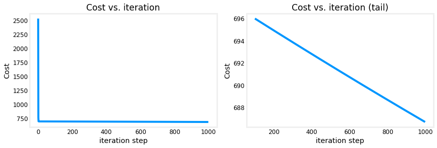

<!-- 本文件由课程原始 Notebook 转换并翻译。代码与公式保留原样。 -->
<!-- 原文件：1. Supervised Machine Learning - Regression and Classification/week 2/C1_W2_Lab02_Multiple_Variable_Soln.ipynb -->

# 可选实验： 多变量线性回归（linear regression）

本实验扩展前面实现的数据结构和回归例程，使其支持多个特征。需要修改的函数较多，但多数只是对原有代码的小幅调整。
# 内容提要
- [&nbsp;&nbsp;1.1 Goals](#toc_15456_1.1)
- [&nbsp;&nbsp;1.2 Tools](#toc_15456_1.2)
- [&nbsp;&nbsp;1.3 Notation](#toc_15456_1.3)
- [2 Problem Statement](#toc_15456_2)
- [&nbsp;&nbsp;2.1 Matrix X containing our examples](#toc_15456_2.1)
- [&nbsp;&nbsp;2.2 Parameter vector w, b](#toc_15456_2.2)
- [3 Model Prediction With Multiple Variables](#toc_15456_3)
- [&nbsp;&nbsp;3.1 Single Prediction element by element](#toc_15456_3.1)
- [&nbsp;&nbsp;3.2 Single Prediction, vector](#toc_15456_3.2)
- [4 Compute Cost With Multiple Variables](#toc_15456_4)
- [5 Gradient Descent With Multiple Variables](#toc_15456_5)
- [&nbsp;&nbsp;5.1 Compute Gradient with Multiple Variables](#toc_15456_5.1)
- [&nbsp;&nbsp;5.2 Gradient Descent With Multiple Variables](#toc_15456_5.2)
- [6 Congratulations](#toc_15456_6)

<a name="toc_15456_1.1"></a>
## 1.1 目标
- 扩展前面实现的回归例程，使其支持多个输入特征。
    - 扩展数据结构以支持多个特征（feature）
    - 重写预测、代价和梯度（gradient）支持多个程序特征
    - 使用 NumPy 的 `np.dot` 简洁、高效地完成向量点积

<a name="toc_15456_1.2"></a>
## 1.2 工具
在本实验中，我们将利用：
- NumPy，一个流行的科学计算库
- Matplotlib，用于绘图数据的流行库

```python
import copy, math
import numpy as np
import matplotlib.pyplot as plt
plt.style.use('./deeplearning.mplstyle')
np.set_printoptions(precision=2)  # reduced display precision on numpy arrays
```

<a name="toc_15456_1.3"></a>
## 1.3 标注
下面汇总多特征场景中会用到的符号。  

| 符号 | 说明 | Python（如适用） |
|:---|:---|:---|
| $a$ | 标量，使用普通斜体 | — |
| $\mathbf{a}$ | 向量，使用粗体 | — |
| $\mathbf{A}$ | 矩阵，使用粗体大写字母 | — |
| **回归** |  |  |
| $\mathbf{X}$ | 训练样本矩阵 | `X_train` |
| $\mathbf{y}$ | 训练样本的目标值 | `y_train` |
| $\mathbf{x}^{(i)}, y^{(i)}$ | 第 $i$ 个训练样本 | `X[i]`, `y[i]` |
| $m$ | 训练样本数量 | `m` |
| $n$ | 每个训练样本的特征数量 | `n` |
| $\mathbf{w}$ | 模型参数：权重向量 | `w` |
| $b$ | 模型参数：偏置 | `b` |
| $f_{\mathbf{w},b}(\mathbf{x}^{(i)})$ | 模型对样本 $\mathbf{x}^{(i)}$ 的预测：$f_{\mathbf{w},b}(\mathbf{x}^{(i)})=\mathbf{w}\cdot\mathbf{x}^{(i)}+b$ | `f_wb` |

<a name="toc_15456_2"></a>
# 2 问题说明

你将使用房屋价格预测的激励性实例。训练数据集包含三个实例，其中四个实例。特征下表显示的(大小、卧室、地板和年龄)，请注意，与以前的实验不同，大小为sqft，而不是1000 sqft。这引起了一个问题，你将在下一个问题中加以解决。实验!

|大小( sqft)|卧室数目|楼层数|家庭年龄|价格(1 000美元)|   
| ----------------| ------------------- |----------------- |--------------|-------------- |  
| 2104            | 5                   | 1                | 45           | 460           |  
| 1416            | 3                   | 2                | 40           | 232           |  
| 852             | 2                   | 1                | 35           | 178           |  

你会建立一个线性回归模型使用这些数值，然后可以预测其他房屋的价格。例如，1200平方英尺的房屋，3个卧室，1层，40年。

请运行以下代码单元格（code cell）创建你的`X_train`和`y_train`变量。

```python
X_train = np.array([[2104, 5, 1, 45], [1416, 3, 2, 40], [852, 2, 1, 35]])
y_train = np.array([460, 232, 178])
```

<a name="toc_15456_2.1"></a>
## 2.1 包含我们实例的矩阵 X
与上表类似，实例存储于NumPy矩阵`X_train`。矩阵的每行代表一个示例。当你有$m$训练样本$m$以我们为例，有三个人$n$ 特征(例举四),$\mathbf{X}$是一个带有维度的矩阵($m$, $n$(m行，n列).


$$
\mathbf{X} =
\begin{pmatrix}
 x^{(0)}_0 & x^{(0)}_1 & \cdots & x^{(0)}_{n-1} \\ 
 x^{(1)}_0 & x^{(1)}_1 & \cdots & x^{(1)}_{n-1} \\
 \cdots \\
 x^{(m-1)}_0 & x^{(m-1)}_1 & \cdots & x^{(m-1)}_{n-1} 
\end{pmatrix}
$$
标记 :
- $\mathbf{x}^{(i)}$是含有示例 i 的向量。$\mathbf{x}^{(i)} = (x^{(i)}_0, x^{(i)}_1, \cdots, x^{(i)}_{n-1})$
- $x^{(i)}_j$是例一中的元素j。括号中的上标表示示例数字，而下标则表示一个元素。

显示输入数据。

```python
# data is stored in numpy array/matrix
print(f"X Shape: {X_train.shape}, X Type:{type(X_train)})")
print(X_train)
print(f"y Shape: {y_train.shape}, y Type:{type(y_train)})")
print(y_train)
```

```text
X Shape: (3, 4), X Type:<class 'numpy.ndarray'>)
[[2104    5    1   45]
 [1416    3    2   40]
 [ 852    2    1   35]]
y Shape: (3,), y Type:<class 'numpy.ndarray'>)
[460 232 178]
```

<a name="toc_15456_2.2"></a>
## 2.2 参数向量w, b

* $\mathbf{w}$向量为$n$要素。
  - 每个元素包含一个参数特征。
  - 在我们的数据集，n是4。
  - 概念上，我们画这个作为列向量

$$
\mathbf{w} = \begin{pmatrix}
w_0 \\ 
w_1 \\
\cdots\\
w_{n-1}
\end{pmatrix}
$$
* $b$是 scalar 参数。

为了展示$\mathbf{w}$和$b$将加载一些接近最佳的初始选定值。$\mathbf{w}$是一维NumPy向量 。

```python
b_init = 785.1811367994083
w_init = np.array([ 0.39133535, 18.75376741, -53.36032453, -26.42131618])
print(f"w_init shape: {w_init.shape}, b_init type: {type(b_init)}")
```

```text
w_init shape: (4,), b_init type: <class 'float'>
```

<a name="toc_15456_3"></a>
# 3 具有多个变量的模型预测
多变量线性回归的预测由以下模型给出：

$$
f_{\mathbf{w},b}(\mathbf{x}) =  w_0x_0 + w_1x_1 +... + w_{n-1}x_{n-1} + b \tag{1}
$$
或向量标记中：
$$
f_{\mathbf{w},b}(\mathbf{x}) = \mathbf{w} \cdot \mathbf{x} + b  \tag{2}
$$
其中$\cdot$是向量`dot product`

为了展示点积，我们将使用(1)和(2)进行预测。

<a name="toc_15456_3.1"></a>
## 3.1 按要素分列的单一预测要素
我们之前的预测乘以1特征以一个参数表示值并添加一个偏差（bias）参数。将我们先前的预测执行范围直接扩大到多个特征将执行以上(1)项，利用每个要素的循环，用其参数进行乘数，然后添加偏差参数。

```python
def predict_single_loop(x, w, b): 
    """
    single predict using linear regression
    
    Args:
      x (ndarray): Shape (n,) example with multiple features
      w (ndarray): Shape (n,) model parameters    
      b (scalar):  model parameter     
      
    Returns:
      p (scalar):  prediction
    """
    n = x.shape[0]
    p = 0
    for i in range(n):
        p_i = x[i] * w[i]  
        p = p + p_i         
    p = p + b                
    return p
```

```python
# get a row from our training data
x_vec = X_train[0,:]
print(f"x_vec shape {x_vec.shape}, x_vec value: {x_vec}")

# make a prediction
f_wb = predict_single_loop(x_vec, w_init, b_init)
print(f"f_wb shape {f_wb.shape}, prediction: {f_wb}")
```

```text
x_vec shape (4,), x_vec value: [2104    5    1   45]
f_wb shape (), prediction: 459.9999976194083
```

注意形状`x_vec`这是1DNumPy含有4个元素的向量， (4,) 。 结果，`f_wb`是个神盾局

<a name="toc_15456_3.2"></a>
## 3.2 单一预测，向量

式 (1) 可以像式 (2) 一样写成点积，因此可利用向量运算加速预测。

回顾 Python/NumPy 实验：[NumPy `np.dot()`](https://numpy.org/doc/stable/reference/generated/numpy.dot.html) 可用于计算向量点积。

```python
def predict(x, w, b): 
    """
    single predict using linear regression
    Args:
      x (ndarray): Shape (n,) example with multiple features
      w (ndarray): Shape (n,) model parameters   
      b (scalar):             model parameter 
      
    Returns:
      p (scalar):  prediction
    """
    p = np.dot(x, w) + b     
    return p
```

```python
# get a row from our training data
x_vec = X_train[0,:]
print(f"x_vec shape {x_vec.shape}, x_vec value: {x_vec}")

# make a prediction
f_wb = predict(x_vec,w_init, b_init)
print(f"f_wb shape {f_wb.shape}, prediction: {f_wb}")
```

```text
x_vec shape (4,), x_vec value: [2104    5    1   45]
f_wb shape (), prediction: 459.99999761940825
```

其结果和形状与之前使用循环的版本相同。`np.dot`将被用于这些操作。预测现在是单一的语句。大多数常规将直接执行，而不是调用单独的预测常规。

<a name="toc_15456_4"></a>
# 4 用多个变量计算代价
计算公式代价函数（cost function）有多个变量$J(\mathbf{w},b)$为：
$$
J(\mathbf{w},b) = \frac{1}{2m} \sum\limits_{i = 0}^{m-1} (f_{\mathbf{w},b}(\mathbf{x}^{(i)}) - y^{(i)})^2 \tag{3}
$$
其中：
$$
f_{\mathbf{w},b}(\mathbf{x}^{(i)}) = \mathbf{w} \cdot \mathbf{x}^{(i)} + b  \tag{4}
$$


与以前的实验相比，$\mathbf{w}$和$\mathbf{x}^{(i)}$是向量而不是支持多重的scalars特征。

下面实现公式 (3) 和 (4)。代码沿用本课程的常见写法：循环遍历全部 $m$ 个训练样本。

```python
def compute_cost(X, y, w, b): 
    """
    compute cost
    Args:
      X (ndarray (m,n)): Data, m examples with n features
      y (ndarray (m,)) : target values
      w (ndarray (n,)) : model parameters  
      b (scalar)       : model parameter
      
    Returns:
      cost (scalar): cost
    """
    m = X.shape[0]
    cost = 0.0
    for i in range(m):                                
        f_wb_i = np.dot(X[i], w) + b           #(n,)(n,) = scalar (see np.dot)
        cost = cost + (f_wb_i - y[i])**2       #scalar
    cost = cost / (2 * m)                      #scalar    
    return cost
```

```python
# Compute and display cost using our pre-chosen optimal parameters. 
cost = compute_cost(X_train, y_train, w_init, b_init)
print(f'Cost at optimal w : {cost}')
```

```text
Cost at optimal w : 1.5578904880036537e-12
```

* *预期结果**: 最佳价格： 1.5578904045996674e-12

<a name="toc_15456_5"></a>
# 5 梯度下降（gradient descent）有多个变量
梯度下降用于多个变量：

$$
\begin{align*} \text{repeat}&\text{ until convergence:} \; \lbrace \newline\;
& w_j = w_j -  \alpha \frac{\partial J(\mathbf{w},b)}{\partial w_j} \tag{5}  \; & \text{for j = 0..n-1}\newline
&b\ \ = b -  \alpha \frac{\partial J(\mathbf{w},b)}{\partial b}  \newline \rbrace
\end{align*}
$$

其中，n是数字特征参数$w_j$,  $b$，同时更新，并在

$$
\begin{align}
\frac{\partial J(\mathbf{w},b)}{\partial w_j}  &= \frac{1}{m} \sum\limits_{i = 0}^{m-1} (f_{\mathbf{w},b}(\mathbf{x}^{(i)}) - y^{(i)})x_{j}^{(i)} \tag{6}  \\
\frac{\partial J(\mathbf{w},b)}{\partial b}  &= \frac{1}{m} \sum\limits_{i = 0}^{m-1} (f_{\mathbf{w},b}(\mathbf{x}^{(i)}) - y^{(i)}) \tag{7}
\end{align}
$$
* m 是数据集中训练样本的数量

    
*  $f_{\mathbf{w},b}(\mathbf{x}^{(i)})$是模型的预测，而$y^{(i)}$是目标值

<a name="toc_15456_5.1"></a>
## 5.1 计算梯度（gradient）带有多个变量
计算方程式(6)和(7)的执行如下。执行的方法很多。
- 外环覆盖所有 m 实例 。
    - $\frac{\partial J(\mathbf{w},b)}{\partial b}$例如，可以直接计算和累积
    - 在第二个循环中覆盖所有 n特征：
        - $\frac{\partial J(\mathbf{w},b)}{\partial w_j}$分别计算$w_j$.

```python
def compute_gradient(X, y, w, b): 
    """
    Computes the gradient for linear regression 
    Args:
      X (ndarray (m,n)): Data, m examples with n features
      y (ndarray (m,)) : target values
      w (ndarray (n,)) : model parameters  
      b (scalar)       : model parameter
      
    Returns:
      dj_dw (ndarray (n,)): The gradient of the cost w.r.t. the parameters w. 
      dj_db (scalar):       The gradient of the cost w.r.t. the parameter b. 
    """
    m,n = X.shape           #(number of examples, number of features)
    dj_dw = np.zeros((n,))
    dj_db = 0.

    for i in range(m):                             
        err = (np.dot(X[i], w) + b) - y[i]   
        for j in range(n):                         
            dj_dw[j] = dj_dw[j] + err * X[i, j]    
        dj_db = dj_db + err                        
    dj_dw = dj_dw / m                                
    dj_db = dj_db / m                                
        
    return dj_db, dj_dw
```

```python
#Compute and display gradient 
tmp_dj_db, tmp_dj_dw = compute_gradient(X_train, y_train, w_init, b_init)
print(f'dj_db at initial w,b: {tmp_dj_db}')
print(f'dj_dw at initial w,b: \n {tmp_dj_dw}')
```

```text
dj_db at initial w,b: -1.673925169143331e-06
dj_dw at initial w,b: 
 [-2.73e-03 -6.27e-06 -2.22e-06 -6.92e-05]
```

* *预期结果**:   
dj db, 初始 w, b: -1.67392511229999921e-06
初始 w, b 时的 dj  dw :
[2.73e-03-03 -6.27e-06 -2.22e-06 -6.92e-05]

<a name="toc_15456_5.2"></a>
## 5.2 梯度下降有多个变量
以下常规执行以上方程式(5).

```python
def gradient_descent(X, y, w_in, b_in, cost_function, gradient_function, alpha, num_iters): 
    """
    Performs batch gradient descent to learn w and b. Updates w and b by taking 
    num_iters gradient steps with learning rate alpha
    
    Args:
      X (ndarray (m,n))   : Data, m examples with n features
      y (ndarray (m,))    : target values
      w_in (ndarray (n,)) : initial model parameters  
      b_in (scalar)       : initial model parameter
      cost_function       : function to compute cost
      gradient_function   : function to compute the gradient
      alpha (float)       : Learning rate
      num_iters (int)     : number of iterations to run gradient descent
      
    Returns:
      w (ndarray (n,)) : Updated values of parameters 
      b (scalar)       : Updated value of parameter 
      """
    
    # An array to store cost J and w's at each iteration primarily for graphing later
    J_history = []
    w = copy.deepcopy(w_in)  #avoid modifying global w within function
    b = b_in
    
    for i in range(num_iters):

        # Calculate the gradient and update the parameters
        dj_db,dj_dw = gradient_function(X, y, w, b)   ##None

        # Update Parameters using w, b, alpha and gradient
        w = w - alpha * dj_dw               ##None
        b = b - alpha * dj_db               ##None
      
        # Save cost J at each iteration
        if i<100000:      # prevent resource exhaustion 
            J_history.append( cost_function(X, y, w, b))

        # Print cost every at intervals 10 times or as many iterations if < 10
        if i% math.ceil(num_iters / 10) == 0:
            print(f"Iteration {i:4d}: Cost {J_history[-1]:8.2f}   ")
        
    return w, b, J_history #return final w,b and J history for graphing
```

接下来单元格你将测试执行。

```python
# initialize parameters
initial_w = np.zeros_like(w_init)
initial_b = 0.
# some gradient descent settings
iterations = 1000
alpha = 5.0e-7
# run gradient descent 
w_final, b_final, J_hist = gradient_descent(X_train, y_train, initial_w, initial_b,
                                                    compute_cost, compute_gradient, 
                                                    alpha, iterations)
print(f"b,w found by gradient descent: {b_final:0.2f},{w_final} ")
m,_ = X_train.shape
for i in range(m):
    print(f"prediction: {np.dot(X_train[i], w_final) + b_final:0.2f}, target value: {y_train[i]}")
```

```text
Iteration    0: Cost  2529.46   
Iteration  100: Cost   695.99   
Iteration  200: Cost   694.92   
Iteration  300: Cost   693.86   
Iteration  400: Cost   692.81   
Iteration  500: Cost   691.77   
Iteration  600: Cost   690.73   
Iteration  700: Cost   689.71   
Iteration  800: Cost   688.70   
Iteration  900: Cost   687.69   
b,w found by gradient descent: -0.00,[ 0.2   0.   -0.01 -0.07] 
prediction: 426.19, target value: 460
prediction: 286.17, target value: 232
prediction: 171.47, target value: 178
```

* *预期结果**:    
b, w 发现于梯度下降： -0.00,[ 0.2   0.   -0.01 -0.07]   
预测：426.19，目标值：460
预测：286.17，目标值：232
预测：171.47，目标值：178

```python
# plot cost versus iteration  
fig, (ax1, ax2) = plt.subplots(1, 2, constrained_layout=True, figsize=(12, 4))
ax1.plot(J_hist)
ax2.plot(100 + np.arange(len(J_hist[100:])), J_hist[100:])
ax1.set_title("Cost vs. iteration");  ax2.set_title("Cost vs. iteration (tail)")
ax1.set_ylabel('Cost')             ;  ax2.set_ylabel('Cost') 
ax1.set_xlabel('iteration step')   ;  ax2.set_xlabel('iteration step') 
plt.show()
```



代价仍在下降，我们的预测并不十分准确。实验将探讨如何改进这方面的工作。

<a name="toc_15456_6"></a>
# 6 恭喜完成！
在本实验中你：
- 重新开发用于线性回归，现在有多个变量。
- 使用 NumPy 的 `np.dot` 完成向量化计算
