<!-- 本文件由课程原始 Notebook 转换并翻译。代码与公式保留原样。 -->
<!-- 原文件：1. Supervised Machine Learning - Regression and Classification/week 2/C1_W2_Lab03_Feature_Scaling_and_Learning_Rate_Soln.ipynb -->

# 可选实验： 特征缩放（feature scaling）和学习率（learning rate）(多变量)

## 学习目标
在本实验中你会：
- 使用上一个变量常规实验
- 运行梯度下降（gradient descent）在一个有多个特征（feature）
- 探索学习率 $\alpha$ 对梯度下降的影响。
- 使用 Z-score 标准化进行特征缩放，从而提高梯度下降的效率

## 所用工具
你将使用上一个实验还有Matplotlib和NumPy.

```python
# Importing libraries
import numpy as np
import matplotlib.pyplot as plt

# Visual
from lab_utils_multi import  load_house_data, run_gradient_descent 
from lab_utils_multi import  norm_plot, plt_equal_scale, plot_cost_i_w
from lab_utils_common import dlc
np.set_printoptions(precision=2)

# Layout
plt.style.use('./deeplearning.mplstyle')
```

## 符号说明

| 符号 | 说明 | Python（如适用） |
|:---|:---|:---|
| $a$ | 标量，使用普通斜体 | — |
| $\mathbf{a}$ | 向量，使用粗体 | — |
| $\mathbf{A}$ | 矩阵，使用粗体大写字母 | — |
| **回归** |  |  |
| $\mathbf{X}$ | 训练样本矩阵 | `X_train` |
| $\mathbf{y}$ | 训练样本的目标值 | `y_train` |
| $\mathbf{x}^{(i)}, y^{(i)}$ | 第 $i$ 个训练样本 | `X[i]`, `y[i]` |
| $m$ | 训练样本数量 | `m` |
| $n$ | 每个训练样本的特征数量 | `n` |
| $\mathbf{w}$ | 模型参数：权重向量 | `w` |
| $b$ | 模型参数：偏置 | `b` |
| $f_{\mathbf{w},b}(\mathbf{x}^{(i)})$ | 模型对样本 $\mathbf{x}^{(i)}$ 的预测：$f_{\mathbf{w},b}(\mathbf{x}^{(i)})=\mathbf{w}\cdot\mathbf{x}^{(i)}+b$ | `f_wb` |
| $\frac{\partial J(\mathbf{w},b)}{\partial w_j}$ | 代价函数对参数 $w_j$ 的偏导数 | `dj_dw[j]` |
| $\frac{\partial J(\mathbf{w},b)}{\partial b}$ | 代价函数对参数 $b$ 的偏导数 | `dj_db` |

# 问题说明

与前面的实验一样，本实验仍以房价预测为例。训练集包含多个样本，每个样本有 4 个特征：房屋面积、卧室数、楼层数和房龄。该数据集的规模大于前面实验所用的数据集。

我们希望建立一个线性回归（linear regression）使用这些数值的模型，然后我们就可以预测其他房屋的价格——比如，1200平方英尺的房屋，3个卧室，1层，40年的历史。

## 数据集：
|大小( sqft)|卧室数目|楼层数|家庭年龄|价格(1 000美元)|   
| ----------------| ------------------- |----------------- |--------------|----------------------- |  
| 952             | 2                   | 1                | 65           | 271.5                  |  
| 1244            | 3                   | 2                | 64           | 232                    |  
| 1947            | 3                   | 2                | 17           | 509.8                  |  
| ...             | ...                 | ...              | ...          | ...                    |

```python
# load the dataset
X_train, y_train = load_house_data()
X_features = ['size(sqft)','bedrooms','floors','age']
```

先分别绘制各特征与目标值的关系，了解数据集。

```python
# Plotting # Scatter plot
fig,ax=plt.subplots(1, 4, figsize=(12, 3), sharey=True)
for i in range(len(ax)):
    ax[i].scatter(X_train[:,i],y_train)
    ax[i].set_xlabel(X_features[i])
ax[0].set_ylabel("Price (1000's)")
plt.show()
```

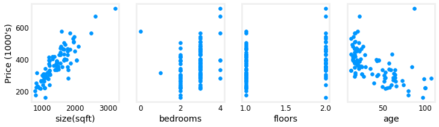

每个绘图特征相对于目标，价格，提供了一些指示特征此外，规模的增加也增加了价格。 卧室和地板似乎对价格没有很大影响。 新建房屋的价格比旧房屋高。

<a name="toc_15456_5"></a>
## 梯度下降有多个变量
下面回顾上一实验推导的多变量梯度下降更新公式。

$$
\begin{align*} \text{repeat}&\text{ until convergence:} \; \lbrace \newline\;
& w_j := w_j -  \alpha \frac{\partial J(\mathbf{w},b)}{\partial w_j} \tag{1}  \; & \text{for j = 0..n-1}\newline
&b\ \ := b -  \alpha \frac{\partial J(\mathbf{w},b)}{\partial b}  \newline \rbrace
\end{align*}
$$

其中，n是数字特征参数$w_j$,  $b$，同时更新，并在

$$
\begin{align}
\frac{\partial J(\mathbf{w},b)}{\partial w_j}  &= \frac{1}{m} \sum\limits_{i = 0}^{m-1} (f_{\mathbf{w},b}(\mathbf{x}^{(i)}) - y^{(i)})x_{j}^{(i)} \tag{2}  \\
\frac{\partial J(\mathbf{w},b)}{\partial b}  &= \frac{1}{m} \sum\limits_{i = 0}^{m-1} (f_{\mathbf{w},b}(\mathbf{x}^{(i)}) - y^{(i)}) \tag{3}
\end{align}
$$
* m 是数据集中训练样本的数量

    
*  $f_{\mathbf{w},b}(\mathbf{x}^{(i)})$是模型的预测，而$y^{(i)}$是目标值

## 学习率
<figure>
    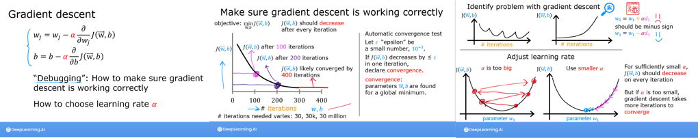
</figure>
讲座讨论了一些与确定学习率 $\alpha$编辑学习率控制参数更新的大小。见上文方程式(1)。它是所有参数共享的。

我们走梯度下降并尝试一些设置$\alpha$我们的数据集

### $\alpha$ = 9.9e-7

```python
#set alpha to 9.9e-7
_, _, hist = run_gradient_descent(X_train, y_train, 10, alpha = 9.9e-7)
```

```text
Iteration Cost          w0       w1       w2       w3       b       djdw0    djdw1    djdw2    djdw3    djdb  
---------------------|--------|--------|--------|--------|--------|--------|--------|--------|--------|--------|
        0 9.55884e+04  5.5e-01  1.0e-03  5.1e-04  1.2e-02  3.6e-04 -5.5e+05 -1.0e+03 -5.2e+02 -1.2e+04 -3.6e+02
        1 1.28213e+05 -8.8e-02 -1.7e-04 -1.0e-04 -3.4e-03 -4.8e-05  6.4e+05  1.2e+03  6.2e+02  1.6e+04  4.1e+02
        2 1.72159e+05  6.5e-01  1.2e-03  5.9e-04  1.3e-02  4.3e-04 -7.4e+05 -1.4e+03 -7.0e+02 -1.7e+04 -4.9e+02
        3 2.31358e+05 -2.1e-01 -4.0e-04 -2.3e-04 -7.5e-03 -1.2e-04  8.6e+05  1.6e+03  8.3e+02  2.1e+04  5.6e+02
        4 3.11100e+05  7.9e-01  1.4e-03  7.1e-04  1.5e-02  5.3e-04 -1.0e+06 -1.8e+03 -9.5e+02 -2.3e+04 -6.6e+02
        5 4.18517e+05 -3.7e-01 -7.1e-04 -4.0e-04 -1.3e-02 -2.1e-04  1.2e+06  2.1e+03  1.1e+03  2.8e+04  7.5e+02
        6 5.63212e+05  9.7e-01  1.7e-03  8.7e-04  1.8e-02  6.6e-04 -1.3e+06 -2.5e+03 -1.3e+03 -3.1e+04 -8.8e+02
        7 7.58122e+05 -5.8e-01 -1.1e-03 -6.2e-04 -1.9e-02 -3.4e-04  1.6e+06  2.9e+03  1.5e+03  3.8e+04  1.0e+03
        8 1.02068e+06  1.2e+00  2.2e-03  1.1e-03  2.3e-02  8.3e-04 -1.8e+06 -3.3e+03 -1.7e+03 -4.2e+04 -1.2e+03
        9 1.37435e+06 -8.7e-01 -1.7e-03 -9.1e-04 -2.7e-02 -5.2e-04  2.1e+06  3.9e+03  2.0e+03  5.1e+04  1.4e+03
w,b found by gradient descent: w: [-0.87 -0.   -0.   -0.03], b: -0.00
```

可以看到代价在**增大**而不是减小。下面绘制结果：

```python
plot_cost_i_w(X_train, y_train, hist)
```

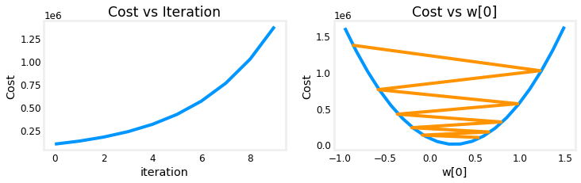

右图显示参数 $w_0$ 在每次迭代中越过最优值，使代价不降反升。该图为便于理解只展示 $w_0$ 的变化；实际每次迭代会同时更新 4 个参数，因此曲线可能略有差异。

### $\alpha$ = 9e-7
把学习率调小，观察结果。

```python
#set alpha to 9e-7
_,_,hist = run_gradient_descent(X_train, y_train, 10, alpha = 9e-7)
```

```text
Iteration Cost          w0       w1       w2       w3       b       djdw0    djdw1    djdw2    djdw3    djdb  
---------------------|--------|--------|--------|--------|--------|--------|--------|--------|--------|--------|
        0 6.64616e+04  5.0e-01  9.1e-04  4.7e-04  1.1e-02  3.3e-04 -5.5e+05 -1.0e+03 -5.2e+02 -1.2e+04 -3.6e+02
        1 6.18990e+04  1.8e-02  2.1e-05  2.0e-06 -7.9e-04  1.9e-05  5.3e+05  9.8e+02  5.2e+02  1.3e+04  3.4e+02
        2 5.76572e+04  4.8e-01  8.6e-04  4.4e-04  9.5e-03  3.2e-04 -5.1e+05 -9.3e+02 -4.8e+02 -1.1e+04 -3.4e+02
        3 5.37137e+04  3.4e-02  3.9e-05  2.8e-06 -1.6e-03  3.8e-05  4.9e+05  9.1e+02  4.8e+02  1.2e+04  3.2e+02
        4 5.00474e+04  4.6e-01  8.2e-04  4.1e-04  8.0e-03  3.2e-04 -4.8e+05 -8.7e+02 -4.5e+02 -1.1e+04 -3.1e+02
        5 4.66388e+04  5.0e-02  5.6e-05  2.5e-06 -2.4e-03  5.6e-05  4.6e+05  8.5e+02  4.5e+02  1.2e+04  2.9e+02
        6 4.34700e+04  4.5e-01  7.8e-04  3.8e-04  6.4e-03  3.2e-04 -4.4e+05 -8.1e+02 -4.2e+02 -9.8e+03 -2.9e+02
        7 4.05239e+04  6.4e-02  7.0e-05  1.2e-06 -3.3e-03  7.3e-05  4.3e+05  7.9e+02  4.2e+02  1.1e+04  2.7e+02
        8 3.77849e+04  4.4e-01  7.5e-04  3.5e-04  4.9e-03  3.2e-04 -4.1e+05 -7.5e+02 -3.9e+02 -9.1e+03 -2.7e+02
        9 3.52385e+04  7.7e-02  8.3e-05 -1.1e-06 -4.2e-03  8.9e-05  4.0e+05  7.4e+02  3.9e+02  1.0e+04  2.5e+02
w,b found by gradient descent: w: [ 7.74e-02  8.27e-05 -1.06e-06 -4.20e-03], b: 0.00
```

整个运行期间代价不断下降，表明α并不太大。

```python
plot_cost_i_w(X_train, y_train, hist)
```

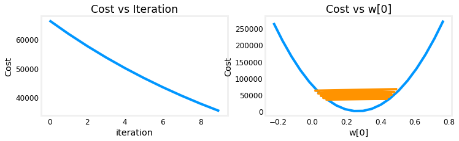

左图显示代价总体下降，但 $w_0$ 仍在最小值附近振荡。`dj_dw[0]` 每次迭代都会改变符号，说明 `w[0]` 反复越过最优值。
该学习率能够使梯度下降收敛。可以增加迭代次数，观察其变化过程。

### $\alpha$ = 1e-7
我们试试小一点的值$\alpha$看看会发生什么

```python
#set alpha to 1e-7
_,_,hist = run_gradient_descent(X_train, y_train, 10, alpha = 1e-7)
```

```text
Iteration Cost          w0       w1       w2       w3       b       djdw0    djdw1    djdw2    djdw3    djdb  
---------------------|--------|--------|--------|--------|--------|--------|--------|--------|--------|--------|
        0 4.42313e+04  5.5e-02  1.0e-04  5.2e-05  1.2e-03  3.6e-05 -5.5e+05 -1.0e+03 -5.2e+02 -1.2e+04 -3.6e+02
        1 2.76461e+04  9.8e-02  1.8e-04  9.2e-05  2.2e-03  6.5e-05 -4.3e+05 -7.9e+02 -4.0e+02 -9.5e+03 -2.8e+02
        2 1.75102e+04  1.3e-01  2.4e-04  1.2e-04  2.9e-03  8.7e-05 -3.4e+05 -6.1e+02 -3.1e+02 -7.3e+03 -2.2e+02
        3 1.13157e+04  1.6e-01  2.9e-04  1.5e-04  3.5e-03  1.0e-04 -2.6e+05 -4.8e+02 -2.4e+02 -5.6e+03 -1.8e+02
        4 7.53002e+03  1.8e-01  3.3e-04  1.7e-04  3.9e-03  1.2e-04 -2.1e+05 -3.7e+02 -1.9e+02 -4.2e+03 -1.4e+02
        5 5.21639e+03  2.0e-01  3.5e-04  1.8e-04  4.2e-03  1.3e-04 -1.6e+05 -2.9e+02 -1.5e+02 -3.1e+03 -1.1e+02
        6 3.80242e+03  2.1e-01  3.8e-04  1.9e-04  4.5e-03  1.4e-04 -1.3e+05 -2.2e+02 -1.1e+02 -2.3e+03 -8.6e+01
        7 2.93826e+03  2.2e-01  3.9e-04  2.0e-04  4.6e-03  1.4e-04 -9.8e+04 -1.7e+02 -8.6e+01 -1.7e+03 -6.8e+01
        8 2.41013e+03  2.3e-01  4.1e-04  2.1e-04  4.7e-03  1.5e-04 -7.7e+04 -1.3e+02 -6.5e+01 -1.2e+03 -5.4e+01
        9 2.08734e+03  2.3e-01  4.2e-04  2.1e-04  4.8e-03  1.5e-04 -6.0e+04 -1.0e+02 -4.9e+01 -7.5e+02 -4.3e+01
w,b found by gradient descent: w: [2.31e-01 4.18e-04 2.12e-04 4.81e-03], b: 0.00
```

整个运行期间代价不断下降，表明$\alpha$并不太大。

```python
plot_cost_i_w(X_train,y_train,hist)
```

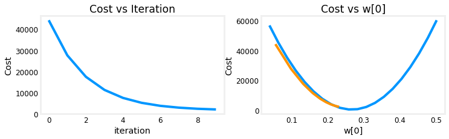

左图显示代价持续下降，$w_0$ 平稳接近最小值且没有振荡。`dj_dw[0]` 在整个过程中保持为负，参数会逐步收敛。

## 特征缩放
<figure>
    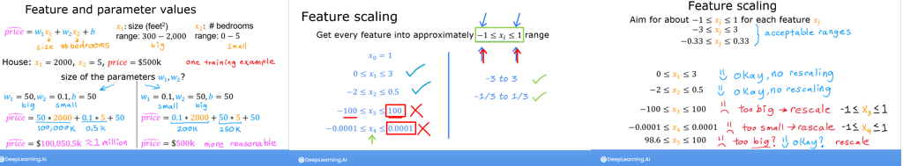
</figure>
讲座描述了重新调整数据集的重要性，以便特征范围相似。
如果你对为何出现这种情况的详情感兴趣， 请点击下面的“ 细节” 标题。 如果不是， 下面的一节将走过如何执行特征缩放。

<details>
<summary>
    <font size='3', color='darkgreen'><b>细节</b></font>
</summary>

再观察 $\alpha=9\times10^{-7}$。这个值已接近可稳定使用的最大学习率；下面只运行少量迭代，展示前几步：

<figure>
    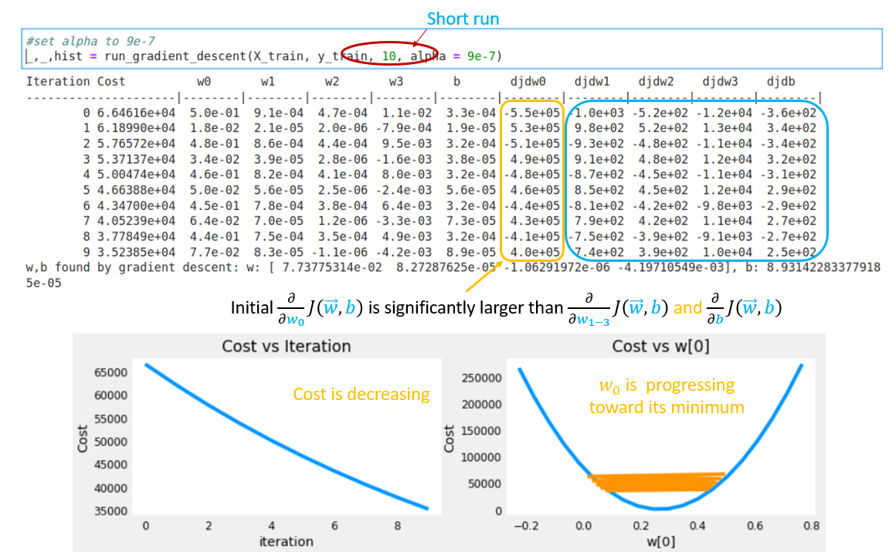
</figure>

以上，虽然代价正在减少，但显然$w_0$与其它参数相比，进展更快，因为梯度（gradient）.

下面的图形显示的是长期运行的结果$\alpha$=9e-7，这需要几个小时。

<figure>
    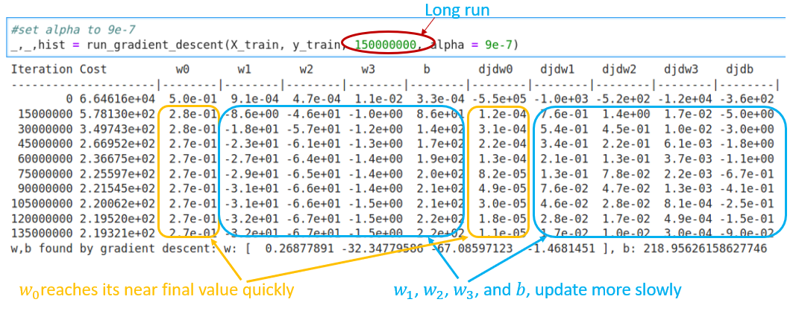
</figure>
    
上面可以看到代价在初始削减后缓慢下降。`w0`和`w1`,`w2`,`w3`还有`dj_dw0`和`dj_dw1-3`. `w0`很快地达到其接近最后的价值`dj_dw0`迅速降至小数值，表明`w0`接近最终值。其他参数减少的速度要慢得多。

为什么，有什么可以改进的吗?
<figure>
    <center> 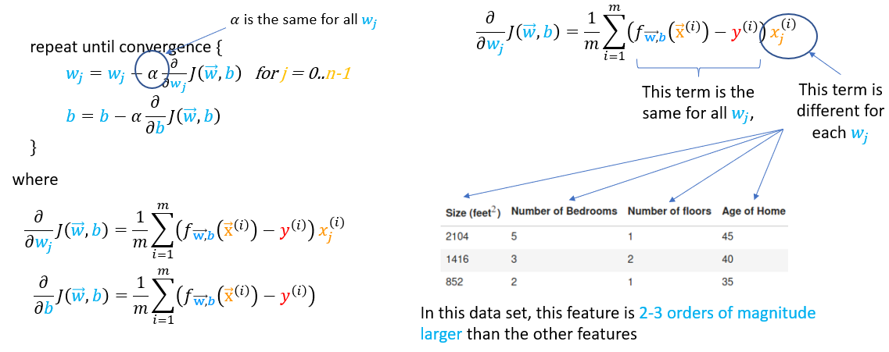</center>
</figure>   

上图显示了为什么$w$'s 更新不均匀。
- 学习率 $\alpha$ 由所有参数的更新共同使用，包括各个 $w_j$ 和 $b$。
- 对于 $w$ 的更新，公共误差项要乘以相应特征；$b$ 的更新不需要乘以特征。
- 特征体积差异很大特征更新速度比其他人快得多。$w_0$乘以“ 大小( sqft) ” , 一般大于 1000, 而$w_1$乘以“卧室数”，一般为2-4。
    
解决办法是特征缩放。

讲座讨论了三种不同的技术：
- 除以最大值：将每个正值特征除以该特征的最大值；更一般的 min-max 缩放使用 $(x-\min)/(\max-\min)$，把特征缩放到 0～1（或经调整后缩放到 -1～1）范围。
- 平均归一化：$x_i := \dfrac{x_i - \mu_i}{max - min} $ 
- 兹分归一化，我们将在下文探讨。

### Z-score 标准化
Z分数归一化后，所有特征将有一个0的平均值和一个1的标准偏差。

要实施 Z-score 标准化， 请调整你在此公式中显示的输入值 :
$$
x^{(i)}_j = \dfrac{x^{(i)}_j - \mu_j}{\sigma_j} \tag{4}
$$
其中，$j$ 表示矩阵 $\mathbf{X}$ 的某个特征（列），$\mu_j$ 和 $\sigma_j$ 分别是该特征的均值和标准差：
$$
\begin{align}
\mu_j &= \frac{1}{m} \sum_{i=0}^{m-1} x^{(i)}_j \tag{5}\\
\sigma^2_j &= \frac{1}{m} \sum_{i=0}^{m-1} (x^{(i)}_j - \mu_j)^2  \tag{6}
\end{align}
$$

> **实现说明：**对特征进行标准化时，应保存训练集的均值和标准差。预测新样本时，必须使用同一组统计量进行变换。

**实现要求：**

```python
def zscore_normalize_features(X):
    """
    computes  X, zcore normalized by column
    
    Args:
      X (ndarray (m,n))     : input data, m examples, n features
      
    Returns:
      X_norm (ndarray (m,n)): input normalized by column
      mu (ndarray (n,))     : mean of each feature
      sigma (ndarray (n,))  : standard deviation of each feature
    """
    # find the mean of each column/feature
    mu     = np.mean(X, axis=0)                 # mu will have shape (n,)
    # find the standard deviation of each column/feature
    sigma  = np.std(X, axis=0)                  # sigma will have shape (n,)
    # element-wise, subtract mu for that column from each example, divide by std for that column
    X_norm = (X - mu) / sigma      

    return (X_norm, mu, sigma)
 
#check our work
#from sklearn.preprocessing import scale
#scale(X_orig, axis=0, with_mean=True, with_std=True, copy=True)
```

下面的图分步展示 Z-score 标准化的过程。

```python
mu     = np.mean(X_train,axis=0)   
sigma  = np.std(X_train,axis=0) 
X_mean = (X_train - mu)
X_norm = (X_train - mu)/sigma      

fig,ax=plt.subplots(1, 3, figsize=(12, 3))
ax[0].scatter(X_train[:,0], X_train[:,3])
ax[0].set_xlabel(X_features[0]); ax[0].set_ylabel(X_features[3]);
ax[0].set_title("unnormalized")
ax[0].axis('equal')

ax[1].scatter(X_mean[:,0], X_mean[:,3])
ax[1].set_xlabel(X_features[0]); ax[0].set_ylabel(X_features[3]);
ax[1].set_title(r"X - $\mu$")
ax[1].axis('equal')

ax[2].scatter(X_norm[:,0], X_norm[:,3])
ax[2].set_xlabel(X_features[0]); ax[0].set_ylabel(X_features[3]);
ax[2].set_title(r"Z-score normalized")
ax[2].axis('equal')
plt.tight_layout(rect=[0, 0.03, 1, 0.95])
fig.suptitle("distribution of features before, during, after normalization")
plt.show()
```

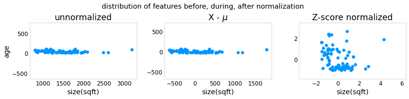

上图展示了训练集中的两个特征：“年龄”和“面积（sqft）”。
- 左图：未标准化数据中，面积（sqft）特征的数值范围和方差远大于房龄；
- 中间：第一步从每个中去除平均值或平均值特征离开特征以零为中心，很难看出“年龄”的差异特征，但“大小(sqft)”显然在零左右。
- 对：第二步由标准偏差除以。特征以类似比例以0为中心。

下面对数据进行 Z-score 标准化，并与原始数据比较。

```python
# normalize the original features
X_norm, X_mu, X_sigma = zscore_normalize_features(X_train)
print(f"X_mu = {X_mu}, \nX_sigma = {X_sigma}")
print(f"Peak to Peak range by column in Raw        X:{np.ptp(X_train,axis=0)}")   
print(f"Peak to Peak range by column in Normalized X:{np.ptp(X_norm,axis=0)}")
```

```text
X_mu = [1.42e+03 2.72e+00 1.38e+00 3.84e+01], 
X_sigma = [411.62   0.65   0.49  25.78]
Peak to Peak range by column in Raw        X:[2.41e+03 4.00e+00 1.00e+00 9.50e+01]
Peak to Peak range by column in Normalized X:[5.85 6.14 2.06 3.69]
```

每列的峰值至峰值范围通过归一化从千因子减少到2-3因子。

```python
fig,ax=plt.subplots(1, 4, figsize=(12, 3))
for i in range(len(ax)):
    norm_plot(ax[i],X_train[:,i],)
    ax[i].set_xlabel(X_features[i])
ax[0].set_ylabel("count");
fig.suptitle("distribution of features before normalization")
plt.show()
fig,ax=plt.subplots(1,4,figsize=(12,3))
for i in range(len(ax)):
    norm_plot(ax[i],X_norm[:,i],)
    ax[i].set_xlabel(X_features[i])
ax[0].set_ylabel("count"); 
fig.suptitle("distribution of features after normalization")

plt.show()
```

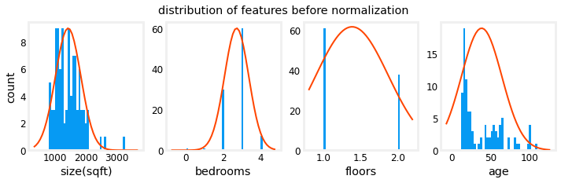

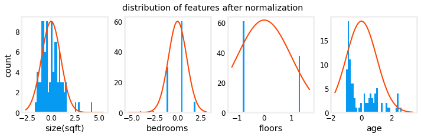

注意，以上，归一化数据(x轴)的范围以零为中心，大致为+/-2. 最重要的是，每个数据的范围相似。特征。

下面在标准化后的数据上重新运行梯度下降。
说明**α的数值大得多**这将加快速度梯度下降。

```python
w_norm, b_norm, hist = run_gradient_descent(X_norm, y_train, 1000, 1.0e-1, )
```

```text
Iteration Cost          w0       w1       w2       w3       b       djdw0    djdw1    djdw2    djdw3    djdb  
---------------------|--------|--------|--------|--------|--------|--------|--------|--------|--------|--------|
        0 5.76170e+04  8.9e+00  3.0e+00  3.3e+00 -6.0e+00  3.6e+01 -8.9e+01 -3.0e+01 -3.3e+01  6.0e+01 -3.6e+02
      100 2.21086e+02  1.1e+02 -2.0e+01 -3.1e+01 -3.8e+01  3.6e+02 -9.2e-01  4.5e-01  5.3e-01 -1.7e-01 -9.6e-03
      200 2.19209e+02  1.1e+02 -2.1e+01 -3.3e+01 -3.8e+01  3.6e+02 -3.0e-02  1.5e-02  1.7e-02 -6.0e-03 -2.6e-07
      300 2.19207e+02  1.1e+02 -2.1e+01 -3.3e+01 -3.8e+01  3.6e+02 -1.0e-03  5.1e-04  5.7e-04 -2.0e-04 -6.9e-12
      400 2.19207e+02  1.1e+02 -2.1e+01 -3.3e+01 -3.8e+01  3.6e+02 -3.4e-05  1.7e-05  1.9e-05 -6.6e-06 -2.7e-13
      500 2.19207e+02  1.1e+02 -2.1e+01 -3.3e+01 -3.8e+01  3.6e+02 -1.1e-06  5.6e-07  6.2e-07 -2.2e-07 -2.6e-13
      600 2.19207e+02  1.1e+02 -2.1e+01 -3.3e+01 -3.8e+01  3.6e+02 -3.7e-08  1.9e-08  2.1e-08 -7.3e-09 -2.6e-13
      700 2.19207e+02  1.1e+02 -2.1e+01 -3.3e+01 -3.8e+01  3.6e+02 -1.2e-09  6.2e-10  6.9e-10 -2.4e-10 -2.6e-13
      800 2.19207e+02  1.1e+02 -2.1e+01 -3.3e+01 -3.8e+01  3.6e+02 -4.1e-11  2.1e-11  2.3e-11 -8.1e-12 -2.7e-13
      900 2.19207e+02  1.1e+02 -2.1e+01 -3.3e+01 -3.8e+01  3.6e+02 -1.4e-12  7.0e-13  7.6e-13 -2.7e-13 -2.6e-13
w,b found by gradient descent: w: [110.56 -21.27 -32.71 -37.97], b: 363.16
```

特征缩放后，梯度下降能够更快地得到准确结果。可以看到，各参数的梯度很快变得很小。对于经过标准化的特征，学习率 0.1 是一个合理的起点。
下面绘制预测值和目标值。预测使用标准化后的特征计算，但图中横轴仍显示原始特征值。

```python
#predict target using normalized features
m = X_norm.shape[0]
yp = np.zeros(m)
for i in range(m):
    yp[i] = np.dot(X_norm[i], w_norm) + b_norm

    # plot predictions and targets versus original features    
fig,ax=plt.subplots(1,4,figsize=(12, 3),sharey=True)
for i in range(len(ax)):
    ax[i].scatter(X_train[:,i],y_train, label = 'target')
    ax[i].set_xlabel(X_features[i])
    ax[i].scatter(X_train[:,i],yp,color=dlc["dlorange"], label = 'predict')
ax[0].set_ylabel("Price"); ax[0].legend();
fig.suptitle("target versus prediction using z-score normalized model")
plt.show()
```

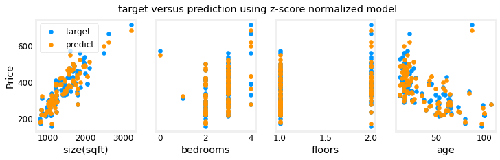

结果表明，模型的预测值与目标值总体吻合。
- 当输入包含多个特征时，无法再用一张二维图完整展示预测结果与所有特征之间的关系。
- 对新样本进行预测时，必须使用训练集得到的均值和标准差进行同样的标准化。

## 预测
训练模型的目的是预测训练集中未出现过的房屋价格。下面预测一套面积为 1,200 平方英尺、3 间卧室、1 层、房龄 40 年的房屋。请注意，新样本必须使用训练集计算得到的均值和标准差进行标准化。

```python
# First, normalize out example.
x_house = np.array([1200, 3, 1, 40])
x_house_norm = (x_house - X_mu) / X_sigma
print(x_house_norm)
x_house_predict = np.dot(x_house_norm, w_norm) + b_norm
print(f" predicted price of a house with 1200 sqft, 3 bedrooms, 1 floor, 40 years old = ${x_house_predict*1000:0.0f}")
```

```text
[-0.53  0.43 -0.79  0.06]
 predicted price of a house with 1200 sqft, 3 bedrooms, 1 floor, 40 years old = $318709
```

* *代价轮廓**  
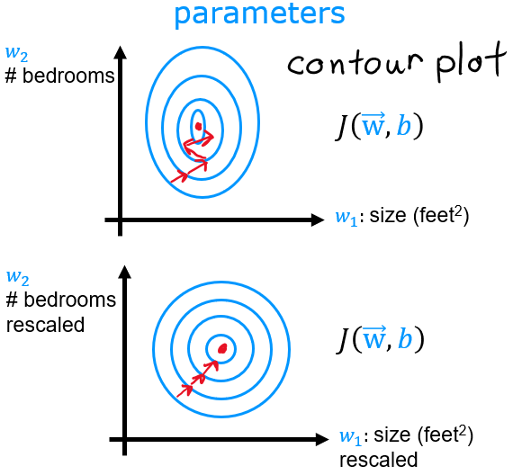另一种观点特征缩放代价轮廓。特征天平不匹配，在轮廓图中，代价相对于参数的图是不对称的。

下图比较特征缩放前后的代价等高线。缩放前，不同参数的尺度差异很大；缩放后，等高线更接近圆形，梯度下降能在各参数方向上取得更均衡的进展。

```python
plt_equal_scale(X_train, X_norm, y_train)
```

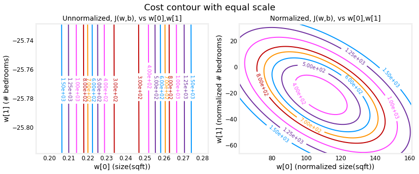

## 恭喜完成！
在本实验中你：
- 使用常规线性回归有多个特征你在之前的实验里发展过
- 探索学习率 $\alpha$ 对梯度下降的影响。
- 发现值特征缩放在加速趋同时使用 Z-score 标准化

## 致谢
住房数据来自[Ames Housing dataset](http://jse.amstat.org/v19n3/decock.pdf)由Dean De Cock编纂，用于数据科学教育。
