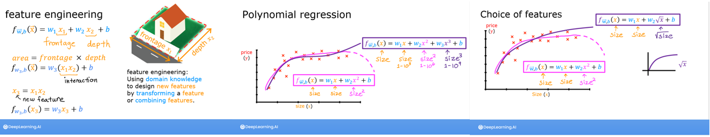
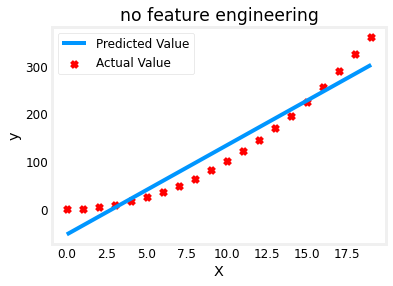
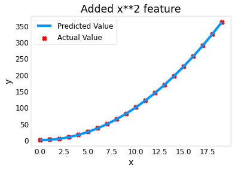
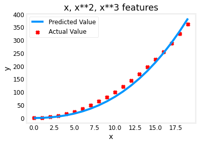
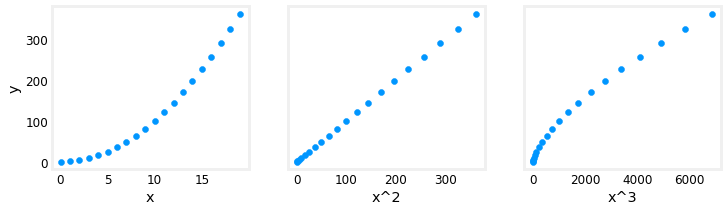
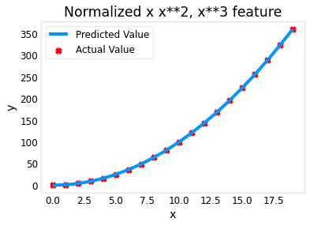
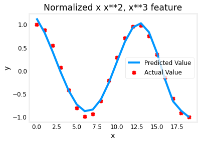

<!-- 本文件由课程原始 Notebook 转换并翻译。代码与公式保留原样。 -->
<!-- 原文件：1. Supervised Machine Learning - Regression and Classification/week 2/C1_W2_Lab04_FeatEng_PolyReg_Soln.ipynb -->

# 可选实验：特征工程与多项式回归



## 学习目标
在本实验中你会：
- 探索特征工程（feature engineering）和多项式回归（polynomial regression），了解如何用线性回归拟合复杂的非线性关系。

## 所用工具
你将使用前面实验中的辅助函数，以及 Matplotlib 和 NumPy。

```python
# Importing libraries
import numpy as np
import matplotlib.pyplot as plt
from lab_utils_multi import zscore_normalize_features, run_gradient_descent_feng
np.set_printoptions(precision=2)  # reduced display precision on numpy arrays
```

<a name='FeatureEng'></a>
# 特征工程（feature engineering）和多项式回归（polynomial regression）概览

标准线性回归模型具有以下形式：
$$
f_{\mathbf{w},b} = w_0x_0 + w_1x_1+ ... + w_{n-1}x_{n-1} + b \tag{1}
$$
如果特征与目标之间存在非线性关系，式 (1) 的原始特征形式可能无法充分拟合数据。例如，房价与居住面积不一定呈线性关系，过小或过大的房屋都可能偏离直线趋势。训练过程只能调整 $\mathbf{w}$ 和 $b$；如果模型仍只含原始特征，无论怎样调整参数，都无法表示某些非线性曲线。

<a name='PolynomialFeatures'></a>
## 多项式特征

下面尝试用已有的线性回归方法拟合非线性数据。先从简单的二次函数 $y=1+x^2$ 开始。

所用辅助函数均可在 `lab_utils.py` 中查看。本实验还会使用 [`np.c_[...]`](https://numpy.org/doc/stable/reference/generated/numpy.c_.html)，它用于按列拼接 NumPy 数组。

```python
# create target data
x = np.arange(0, 20, 1)
y = 1 + x**2
X = x.reshape(-1, 1)

model_w,model_b = run_gradient_descent_feng(X,y,iterations=1000, alpha = 1e-2)

plt.scatter(x, y, marker='x', c='r', label="Actual Value"); plt.title("no feature engineering")
plt.plot(x,X@model_w + model_b, label="Predicted Value");  plt.xlabel("X"); plt.ylabel("y"); plt.legend(); plt.show()
```

```text
Iteration         0, Cost: 1.65756e+03
Iteration       100, Cost: 6.94549e+02
Iteration       200, Cost: 5.88475e+02
Iteration       300, Cost: 5.26414e+02
Iteration       400, Cost: 4.90103e+02
Iteration       500, Cost: 4.68858e+02
Iteration       600, Cost: 4.56428e+02
Iteration       700, Cost: 4.49155e+02
Iteration       800, Cost: 4.44900e+02
Iteration       900, Cost: 4.42411e+02
w,b found by gradient descent: w: [18.7], b: -52.0834
```



```python
print('x:', x)
print('y:', y)
print('X:', X)
```

```text
x: [ 0  1  2  3  4  5  6  7  8  9 10 11 12 13 14 15 16 17 18 19]
y: [  1   2   5  10  17  26  37  50  65  82 101 122 145 170 197 226 257 290
 325 362]
X: [[ 0]
 [ 1]
 [ 2]
 [ 3]
 [ 4]
 [ 5]
 [ 6]
 [ 7]
 [ 8]
 [ 9]
 [10]
 [11]
 [12]
 [13]
 [14]
 [15]
 [16]
 [17]
 [18]
 [19]]
```

正如预期，直线拟合效果并不好。为了表示二次关系，可以把 $x^2$ 作为新的**多项式特征**，使模型写成 $y=w_0x_0^2+b$。
实现方法是变换输入数据：用 `X**2` 替代原始 `X`，让线性回归在新特征 $x^2$ 上拟合模型 $y=w_0x_0^2+b$。

```python
# create target data
x = np.arange(0, 20, 1)
y = 1 + x**2

# Engineer features 
X = x**2      #<-- added engineered feature
```

```python
print('x:', x)
print('y:', y)
print('X:', X)
```

```text
x: [ 0  1  2  3  4  5  6  7  8  9 10 11 12 13 14 15 16 17 18 19]
y: [  1   2   5  10  17  26  37  50  65  82 101 122 145 170 197 226 257 290
 325 362]
X: [  0   1   4   9  16  25  36  49  64  81 100 121 144 169 196 225 256 289
 324 361]
```

```python
X = X.reshape(-1, 1)  #X should be a 2-D Matrix
model_w,model_b = run_gradient_descent_feng(X, y, iterations=10000, alpha = 1e-5)

plt.scatter(x, y, marker='x', c='r', label="Actual Value"); plt.title("Added x**2 feature")
plt.plot(x, np.dot(X,model_w) + model_b, label="Predicted Value"); plt.xlabel("x"); plt.ylabel("y"); plt.legend(); plt.show()
```

```text
Iteration         0, Cost: 7.32922e+03
Iteration      1000, Cost: 2.24844e-01
Iteration      2000, Cost: 2.22795e-01
Iteration      3000, Cost: 2.20764e-01
Iteration      4000, Cost: 2.18752e-01
Iteration      5000, Cost: 2.16758e-01
Iteration      6000, Cost: 2.14782e-01
Iteration      7000, Cost: 2.12824e-01
Iteration      8000, Cost: 2.10884e-01
Iteration      9000, Cost: 2.08962e-01
w,b found by gradient descent: w: [1.], b: 0.0490
```



拟合效果已经很好。图上方显示了参数 $\mathbf{w}$ 和 $b$：`w,b found by gradient descent: w: [1.], b: 0.0490`. 梯度下降把初始参数更新为约 $(1.0, 0.049)$，得到 $y\approx x_0^2+0.049$。继续训练会进一步减小误差。

### 选择特征
<a name='GDF'></a>
上例事先知道应加入 $x^2$。实际问题中通常需要构造多个候选特征，再由训练结果判断哪些特征最有用。例如可以尝试：$y=w_0x_0 + w_1x_1^2 + w_2x_2^3+b$ ? 

运行下一个单元格。

```python
# create target data
x = np.arange(0, 20, 1) # 0-19
y = x**2

# engineer features .
X = np.c_[x, x**2, x**3]   #<-- added engineered feature
```

```python
print('x:', x)
print('y:', y)
print('X:', X)
```

```text
x: [ 0  1  2  3  4  5  6  7  8  9 10 11 12 13 14 15 16 17 18 19]
y: [  0   1   4   9  16  25  36  49  64  81 100 121 144 169 196 225 256 289
 324 361]
X: [[   0    0    0]
 [   1    1    1]
 [   2    4    8]
 [   3    9   27]
 [   4   16   64]
 [   5   25  125]
 [   6   36  216]
 [   7   49  343]
 [   8   64  512]
 [   9   81  729]
 [  10  100 1000]
 [  11  121 1331]
 [  12  144 1728]
 [  13  169 2197]
 [  14  196 2744]
 [  15  225 3375]
 [  16  256 4096]
 [  17  289 4913]
 [  18  324 5832]
 [  19  361 6859]]
```

```python
model_w,model_b = run_gradient_descent_feng(X, y, iterations=10000, alpha=1e-7)

plt.scatter(x, y, marker='x', c='r', label="Actual Value"); plt.title("x, x**2, x**3 features")
plt.plot(x, X@model_w + model_b, label="Predicted Value"); plt.xlabel("x"); plt.ylabel("y"); plt.legend(); plt.show()
```

```text
Iteration         0, Cost: 1.14029e+03
Iteration      1000, Cost: 3.28539e+02
Iteration      2000, Cost: 2.80443e+02
Iteration      3000, Cost: 2.39389e+02
Iteration      4000, Cost: 2.04344e+02
Iteration      5000, Cost: 1.74430e+02
Iteration      6000, Cost: 1.48896e+02
Iteration      7000, Cost: 1.27100e+02
Iteration      8000, Cost: 1.08495e+02
Iteration      9000, Cost: 9.26132e+01
w,b found by gradient descent: w: [0.08 0.54 0.03], b: 0.0106
```



此时 $\mathbf{w}=[0.08,0.54,0.03]$，$b=0.0106$，因此拟合后的模型为：
$$
0.08x + 0.54x^2 + 0.03x^3 + 0.0106
$$
梯度下降为 $x^2$ 对应的参数 $w_1$ 赋予了较大权重，而其他项权重较小。继续训练时，其他项的影响还会进一步减弱。
> 梯度下降会通过增大相关参数、减小无关参数，突出更有用的特征。

让我们回顾一下这个想法：
- 较小的权重通常表示相应特征对当前预测贡献较小；权重接近 0 时，该特征几乎不参与拟合。
- 拟合后，$x^2$ 对应的权重远大于 $x$ 和 $x^3$ 的权重，说明它最能解释这组数据。

### 另一种理解方式
多项式特征是否有用，取决于它与目标值的关系。构造合适的新特征后，目标值可能与该特征近似呈线性关系，从而适合用线性回归建模。

```python
# create target data
x = np.arange(0, 20, 1)
y = x**2

# engineer features .
X = np.c_[x, x**2, x**3]   #<-- added engineered feature
X_features = ['x','x^2','x^3']
```

```python
print('x:', x)
print('y:', y)
print('X:', X)
```

```text
x: [ 0  1  2  3  4  5  6  7  8  9 10 11 12 13 14 15 16 17 18 19]
y: [  0   1   4   9  16  25  36  49  64  81 100 121 144 169 196 225 256 289
 324 361]
X: [[   0    0    0]
 [   1    1    1]
 [   2    4    8]
 [   3    9   27]
 [   4   16   64]
 [   5   25  125]
 [   6   36  216]
 [   7   49  343]
 [   8   64  512]
 [   9   81  729]
 [  10  100 1000]
 [  11  121 1331]
 [  12  144 1728]
 [  13  169 2197]
 [  14  196 2744]
 [  15  225 3375]
 [  16  256 4096]
 [  17  289 4913]
 [  18  324 5832]
 [  19  361 6859]]
```

```python
fig,ax=plt.subplots(1, 3, figsize=(12, 3), sharey=True)
for i in range(len(ax)):
    ax[i].scatter(X[:,i],y)
    ax[i].set_xlabel(X_features[i])
ax[0].set_ylabel("y")
plt.show()
```



上图表明，目标值 $y$ 与新特征 $x^2$ 近似呈线性关系，因此线性回归能够很好地拟合它。

### 缩放特征
如果不同特征的数值尺度相差很大，应进行特征缩放，以加快梯度下降收敛。这里 $x$、$x^2$ 和 $x^3$ 的尺度天然不同，下面使用 Z-score 标准化。

```python
# create target data
x = np.arange(0,20,1)
X = np.c_[x, x**2, x**3]
print(f"Peak to Peak range by column in Raw        X:{np.ptp(X,axis=0)}")

# add mean_normalization 
X = zscore_normalize_features(X)     
print(f"Peak to Peak range by column in Normalized X:{np.ptp(X,axis=0)}")
```

```text
Peak to Peak range by column in Raw        X:[  19  361 6859]
Peak to Peak range by column in Normalized X:[3.3  3.18 3.28]
```

```python
print('x:', x)
print('y:', y)
print('X:', X)
```

```text
x: [ 0  1  2  3  4  5  6  7  8  9 10 11 12 13 14 15 16 17 18 19]
y: [  0   1   4   9  16  25  36  49  64  81 100 121 144 169 196 225 256 289
 324 361]
X: [[-1.65 -1.09 -0.86]
 [-1.47 -1.08 -0.86]
 [-1.3  -1.05 -0.86]
 [-1.13 -1.01 -0.85]
 [-0.95 -0.95 -0.83]
 [-0.78 -0.87 -0.8 ]
 [-0.61 -0.77 -0.76]
 [-0.43 -0.66 -0.7 ]
 [-0.26 -0.52 -0.62]
 [-0.09 -0.37 -0.52]
 [ 0.09 -0.21 -0.39]
 [ 0.26 -0.02 -0.23]
 [ 0.43  0.18 -0.04]
 [ 0.61  0.4   0.19]
 [ 0.78  0.64  0.45]
 [ 0.95  0.89  0.75]
 [ 1.13  1.17  1.1 ]
 [ 1.3   1.46  1.49]
 [ 1.47  1.77  1.93]
 [ 1.65  2.09  2.42]]
```

完成特征缩放后，可以尝试更大的学习率 $\alpha$：

```python
x = np.arange(0,20,1)
y = x**2

X = np.c_[x, x**2, x**3]
X = zscore_normalize_features(X) 

model_w, model_b = run_gradient_descent_feng(X, y, iterations=100000, alpha=1e-1)

plt.scatter(x, y, marker='x', c='r', label="Actual Value"); plt.title("Normalized x x**2, x**3 feature")
plt.plot(x,X@model_w + model_b, label="Predicted Value"); plt.xlabel("x"); plt.ylabel("y"); plt.legend(); plt.show()
```

```text
Iteration         0, Cost: 9.42147e+03
Iteration     10000, Cost: 3.90938e-01
Iteration     20000, Cost: 2.78389e-02
Iteration     30000, Cost: 1.98242e-03
Iteration     40000, Cost: 1.41169e-04
Iteration     50000, Cost: 1.00527e-05
Iteration     60000, Cost: 7.15855e-07
Iteration     70000, Cost: 5.09763e-08
Iteration     80000, Cost: 3.63004e-09
Iteration     90000, Cost: 2.58497e-10
w,b found by gradient descent: w: [5.27e-05 1.13e+02 8.43e-05], b: 123.5000
```



特征缩放使梯度下降更快收敛。
再次观察 $\mathbf{w}$：$x^2$ 对应的 $w_1$ 最大，而 $x^3$ 对应的权重已接近 0。

### 复杂函数
通过特征工程，线性回归也能表示相当复杂的函数：

```python
x = np.arange(0,20,1)
y = np.cos(x/2)

X = np.c_[x, x**2, x**3,x**4, x**5, x**6, x**7, x**8, x**9, x**10, x**11, x**12, x**13]
X = zscore_normalize_features(X) 

model_w,model_b = run_gradient_descent_feng(X, y, iterations=1000000, alpha = 1e-1)

plt.scatter(x, y, marker='x', c='r', label="Actual Value"); plt.title("Normalized x x**2, x**3 feature")
plt.plot(x,X@model_w + model_b, label="Predicted Value"); plt.xlabel("x"); plt.ylabel("y"); plt.legend(); plt.show()
```

```text
Iteration         0, Cost: 2.20188e-01
Iteration    100000, Cost: 1.70074e-02
Iteration    200000, Cost: 1.27603e-02
Iteration    300000, Cost: 9.73032e-03
Iteration    400000, Cost: 7.56440e-03
Iteration    500000, Cost: 6.01412e-03
Iteration    600000, Cost: 4.90251e-03
Iteration    700000, Cost: 4.10351e-03
Iteration    800000, Cost: 3.52730e-03
Iteration    900000, Cost: 3.10989e-03
w,b found by gradient descent: w: [ -1.34 -10.    24.78   5.96 -12.49 -16.26  -9.51   0.59   8.7   11.94
   9.27   0.79 -12.82], b: -0.0073
```



## 恭喜完成！
在本实验中你：
- 了解了如何通过特征工程让线性回归表示复杂、甚至高度非线性的关系；
- 理解了构造多项式特征后进行特征缩放的重要性。

```python

```
