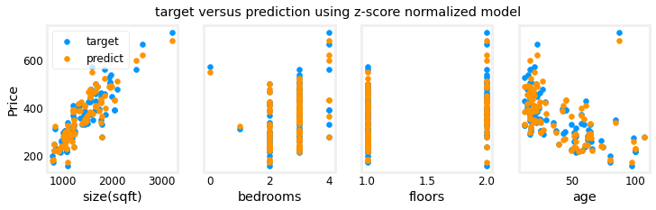

<!-- 本文件由课程原始 Notebook 转换并翻译。代码与公式保留原样。 -->
<!-- 原文件：1. Supervised Machine Learning - Regression and Classification/week 2/C1_W2_Lab05_Sklearn_GD_Soln.ipynb -->

# 可选实验：使用 scikit-learn 进行线性回归

[scikit-learn](https://scikit-learn.org/stable/index.html) 是一个开源、可用于商业项目的机器学习工具库，实现了本课程涉及的多种算法。

## 学习目标
在本实验中你会：
- 使用 scikit-learn 的随机梯度下降（stochastic gradient descent）训练线性回归模型。

## 所用工具
你将使用 scikit-learn、Matplotlib 和 NumPy。

```python
# Importing libraries
import numpy as np
import matplotlib.pyplot as plt
from sklearn.linear_model import SGDRegressor
from sklearn.preprocessing import StandardScaler
from lab_utils_multi import  load_house_data
from lab_utils_common import dlc
np.set_printoptions(precision=2)
plt.style.use('./deeplearning.mplstyle')
```

# 梯度下降
scikit-learn 提供了基于随机梯度下降的回归模型 [sklearn.linear_model.SGDRegressor](https://scikit-learn.org/stable/modules/generated/sklearn.linear_model.SGDRegressor.html#examples-using-sklearn-linear-model-sgdregressor)与前面的梯度下降实现一样，该模型在特征尺度接近时通常表现更好。[sklearn.preprocessing.StandardScaler](https://scikit-learn.org/stable/modules/generated/sklearn.preprocessing.StandardScaler.html#sklearn.preprocessing.StandardScaler)用于进行 Z-score 标准化；scikit-learn 将这一过程称为标准化（standardization）。

### 加载数据集

```python
# Loading data set
X_train, y_train = load_house_data()
X_features = ['size(sqft)','bedrooms','floors','age']
```

```python
# Lets check the first 5 rows of features
X_train[:5]
```

```text
array([[1.24e+03, 3.00e+00, 1.00e+00, 6.40e+01],
       [1.95e+03, 3.00e+00, 2.00e+00, 1.70e+01],
       [1.72e+03, 3.00e+00, 2.00e+00, 4.20e+01],
       [1.96e+03, 3.00e+00, 2.00e+00, 1.50e+01],
       [1.31e+03, 2.00e+00, 1.00e+00, 1.40e+01]])
```

```python
# Let's check the target too
y_train[:5]
```

```text
array([300. , 509.8, 394. , 540. , 415. ])
```

### 缩放并归一化训练数据

```python
# Scaling with StandardScaler
scaler = StandardScaler()
X_norm = scaler.fit_transform(X_train)
print(f"Peak to Peak range by column in Raw        X:{np.ptp(X_train,axis=0)}")   
print(f"Peak to Peak range by column in Normalized X:{np.ptp(X_norm,axis=0)}")
```

```text
Peak to Peak range by column in Raw        X:[2.41e+03 4.00e+00 1.00e+00 9.50e+01]
Peak to Peak range by column in Normalized X:[5.85 6.14 2.06 3.69]
```

### 创建并拟合回归模型

```python
# Training with Stochastic Gradient Descent Regressor 
sgdr = SGDRegressor(max_iter=1000)
sgdr.fit(X_norm, y_train)
print(sgdr)
print(f"number of iterations completed: {sgdr.n_iter_}, number of weight updates: {sgdr.t_}")
```

```text
SGDRegressor(alpha=0.0001, average=False, early_stopping=False, epsilon=0.1,
             eta0=0.01, fit_intercept=True, l1_ratio=0.15,
             learning_rate='invscaling', loss='squared_loss', max_iter=1000,
             n_iter_no_change=5, penalty='l2', power_t=0.25, random_state=None,
             shuffle=True, tol=0.001, validation_fraction=0.1, verbose=0,
             warm_start=False)
number of iterations completed: 142, number of weight updates: 14059.0
```

### 查看参数
这些参数对应标准化后的输入。将尺度变换计入后，拟合结果与前面实验得到的参数非常接近。

```python
# calculating intercept(b) and weight coeficients(w) 
b_norm = sgdr.intercept_
w_norm = sgdr.coef_
print(f"model parameters:                   w: {w_norm}, b:{b_norm}")
print( "model parameters from previous lab: w: [110.56 -21.27 -32.71 -37.97], b: 363.16")
```

```text
model parameters:                   w: [110.34 -21.13 -32.56 -38.02], b:[363.17]
model parameters from previous lab: w: [110.56 -21.27 -32.71 -37.97], b: 363.16
```

### 进行预测
调用 `predict` 对训练数据进行预测；模型内部使用已经拟合的 $w$ 和 $b$。

```python
# make a prediction using sgdr.predict()
y_pred_sgd = sgdr.predict(X_norm)
# make a prediction using w,b. 
y_pred = np.dot(X_norm, w_norm) + b_norm  
print(f"prediction using np.dot() and sgdr.predict match: {(y_pred == y_pred_sgd).all()}")

print(f"Prediction on training set:\n{y_pred[:4]}" )
print(f"Target values \n{y_train[:4]}")
```

```text
prediction using np.dot() and sgdr.predict match: True
Prediction on training set:
[295.18 486.   389.62 492.17]
Target values 
[300.  509.8 394.  540. ]
```

### 绘制结果
下面绘制预测值与真实目标值，直观比较拟合效果。

```python
# plot predictions and targets vs original features # Z-score here means the score after being normalized/standarized   
fig,ax=plt.subplots(1,4,figsize=(12,3),sharey=True)
for i in range(len(ax)):
    ax[i].scatter(X_train[:,i],y_train, label = 'target')
    ax[i].set_xlabel(X_features[i])
    ax[i].scatter(X_train[:,i],y_pred,color=dlc["dlorange"], label = 'predict')
ax[0].set_ylabel("Price"); ax[0].legend();
fig.suptitle("target versus prediction using z-score normalized model")
plt.show()
```



## 恭喜完成！
在本实验中你：
- 使用了开源机器学习工具库 scikit-learn；
- 使用 `StandardScaler` 标准化特征，并使用 `SGDRegressor` 训练线性回归模型。

```python

```
