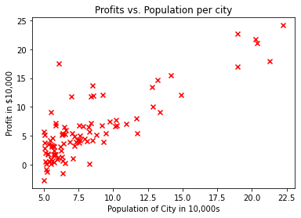
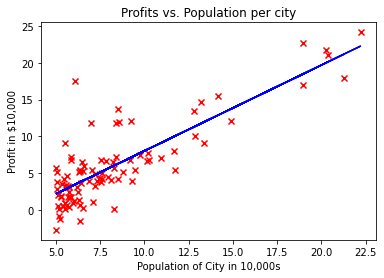

<!-- 本文件由课程原始 Notebook 转换并翻译。代码与公式保留原样。 -->
<!-- 原文件：1. Supervised Machine Learning - Regression and Classification/week 2/C1_W2_Linear_Regression - exam.ipynb -->

# 练习实验：线性回归

欢迎来到第一个练习实验（practice lab）。你将实现单变量线性回归，用城市人口预测餐厅分店的利润。


# 内容提要
- [1 - 软件包](#1)
- [2 - 单变量线性回归](#2)
  - [2.1 问题说明](#2.1)
  - [2.2 数据集](#2.2)
  - [2.3 线性回归复习](#2.3)
  - [2.4 计算代价](#2.4)
    - [练习 1](#ex01)
  - [2.5 梯度下降](#2.5)
    - [练习 2](#ex02)
  - [2.6 使用批量梯度下降学习参数](#2.6)

_**注意：**为避免自动评分出错，请勿编辑或删除非评分单元格，也不要在 Notebook 中新增单元格。_ 
_通过作业后，如果想尝试额外代码，可按 Notebook 末尾的说明解锁非评分单元格。_

<a name="1"></a>
## 1 - 软件包

首先运行下面的单元格，导入本作业所需的全部软件包。
- [NumPy](https://www.numpy.org) 是 Python 中进行数组和矩阵计算的基础库。
- [Matplotlib](https://matplotlib.org) 是 Python 中常用的绘图库。
- `utils.py` 包含本作业所需的辅助函数，无需修改。

```python
import numpy as np
import matplotlib.pyplot as plt
from utils import *
import copy
import math
%matplotlib inline
```

## 2 - 问题说明

假设你经营一家连锁餐厅，正在考虑去哪个城市开设新分店。
- 你希望把生意拓展到可能给餐馆带来高利润的城市。
- 连锁店已经在多个城市设有餐馆，你有关于城市利润和人口的数据。
- 你还知道若干候选城市的人口数据。
    - 
    
请利用现有数据判断哪些城市更可能带来较高利润。

## 3 - 数据集

先加载本作业使用的数据集。
- 下面的 `load_data()` 函数把数据加载到 `x_train` 和 `y_train`：
  - `x_train` 表示城市人口；
  - `y_train` 表示该城市餐厅的月利润，负值表示亏损；
  - `x_train` 和 `y_train` 都是 NumPy 数组。

```python
# load the dataset
x_train, y_train = load_data()
```

#### 查看变量
开始建模前，应先了解数据的内容和结构。
- 一个简单的起点是打印各个变量，查看其中包含的内容。

下面打印 `x_train` 及其数据类型。

```python
# print x_train
print("Type of x_train:",type(x_train))
print("First five elements of x_train are:\n", x_train[:5])
```

```text
Type of x_train: <class 'numpy.ndarray'>
First five elements of x_train are:
 [6.1101 5.5277 8.5186 7.0032 5.8598]
```

`x_train` 是一个包含正浮点数的 NumPy 数组。
- 这些数值以 10,000 人为单位表示城市人口。
- 例如，6.1101 表示该城市人口为 61,101 人。
  
下面打印 `y_train`。

```python
# print y_train
print("Type of y_train:",type(y_train))
print("First five elements of y_train are:\n", y_train[:5])
```

```text
Type of y_train: <class 'numpy.ndarray'>
First five elements of y_train are:
 [17.592   9.1302 13.662  11.854   6.8233]
```

`y_train` 也是 NumPy 数组，其中既有正值也有负值。
- 这些数值表示餐厅在各城市的月利润，单位为 10,000 美元。
  - 例如，17.592 表示月利润为 175,920 美元。
  - -2.6807 表示每月亏损 26,807 美元。

#### 检查变量的维度

了解数据的另一种方法是查看其维度。

打印 `x_train` 和 `y_train` 的形状，确认训练样本数。

```python
print ('The shape of x_train is:', x_train.shape)
print ('The shape of y_train is: ', y_train.shape)
print ('Number of training examples (m):', len(x_train))
```

```text
The shape of x_train is: (97,)
The shape of y_train is:  (97,)
Number of training examples (m): 97
```

城市人口和月利润数组都包含 97 个数据点，且都是一维 NumPy 数组。

#### 数据可视化

通过可视化来理解数据往往是有益的。
- 对于此数据集，你可以使用散点图来可视化数据，因为这里只需展示人口与利润两个变量。
- 实际问题往往包含两个以上的属性，例如人口、平均家庭收入、月利润和月销售额。此时仍可用散点图分别观察各对属性之间的关系。

```python
# Create a scatter plot of the data. To change the markers to red "x",
# we used the 'marker' and 'c' parameters
plt.scatter(x_train, y_train, marker='x', c='r') 

# Set the title
plt.title("Profits vs. Population per city")
# Set the y-axis label
plt.ylabel('Profit in $10,000')
# Set the x-axis label
plt.xlabel('Population of City in 10,000s')
plt.show()
```



目标是建立一个能够拟合这些数据的线性回归模型。
- 训练完成后，输入新城市的人口，模型就能估计餐厅在该城市的月利润。

<a name="4"></a>
## 4 - 复习：线性回归

在本练习中，你将根据数据拟合线性回归参数 $(w,b)$。
- 单变量线性回归用函数 $f_{w,b}(x)$ 把输入 $x$（城市人口）映射为预测值（餐厅月利润）：
    $$
    f_{w,b}(x) = wx + b
    $$
    

- 训练线性回归模型时，需要找到最能拟合数据集的参数 $(w,b)$。

    - 代价函数（cost function）$J(w,b)$ 用于衡量一组参数 $(w,b)$ 的拟合效果。
      - $J$ 是 $(w,b)$ 的函数，因此参数不同，代价值也会不同。
  
    - 选择使数据拟合效果最佳的 $(w,b)$，也就是让 $J(w,b)$ 最小的参数。


- 可以使用**梯度下降（gradient descent）**寻找使 $J(w,b)$ 尽可能小的参数。 
  - 梯度下降每迭代一步，都会把 $(w,b)$ 向较低代价的方向更新。
  

- 训练后的模型接收输入特征 $x$（城市人口），并输出预测 $f_{w,b}(x)$（预计月利润）。

<a name="5"></a>
## 5 - 计算代价

梯度下降反复调整 $(w,b)$，使代价 $J(w,b)$ 逐步减小。
- 每次更新参数后计算 $J(w,b)$，可以用来监测训练是否正常进行。
- 本节将实现代价函数，以便在运行梯度下降时检查训练进展。

#### 代价函数
对于单变量线性回归，代价函数定义为：

$$
J(w,b) = \frac{1}{2m} \sum\limits_{i = 0}^{m-1} (f_{w,b}(x^{(i)}) - y^{(i)})^2
$$

- $f_{w,b}(x^{(i)})$ 是模型对第 $i$ 个城市利润的预测，$y^{(i)}$ 是数据中记录的实际利润。
- $m$ 是数据集中的训练样本数。

#### 模型预测

- 对于单变量线性回归，第 $i$ 个样本的预测为：

$$
f_{w,b}(x^{(i)}) = wx^{(i)} + b
$$

这是斜率为 $w$、截距为 $b$ 的直线方程。

#### 实现

请完成 `compute_cost()`，计算代价 $J(w,b)$。

<a name="ex01"></a>
### 练习 1

在 `compute_cost` 中完成以下步骤：

* 遍历所有训练样本，并对每个样本计算：
    * 模型预测值
    $$
    f_{wb}(x^{(i)}) =  wx^{(i)} + b 
    $$
   
    * 该样本对应的平方误差

    $$
    cost^{(i)} =  (f_{wb} - y^{(i)})^2
    $$
    

* 汇总全部样本，并返回总代价
$$
J(\mathbf{w},b) = \frac{1}{2m} \sum\limits_{i = 0}^{m-1} cost^{(i)}
$$
  * 其中 $m$ 是训练样本数，$\sum$ 表示求和。

如果遇到困难，可以查看代码单元格后面的提示。

```python
# UNQ_C1
# GRADED FUNCTION: compute_cost

def compute_cost(x, y, w, b): 
    """
    Computes the cost function for linear regression.
    
    Args:
        x (ndarray): Shape (m,) Input to the model (Population of cities) 
        y (ndarray): Shape (m,) Label (Actual profits for the cities)
        w, b (scalar): Parameters of the model
    
    Returns
        total_cost (float): The cost of using w,b as the parameters for linear regression
               to fit the data points in x and y
    """
    # number of training examples
    m = x.shape[0] 
    
    # You need to return this variable correctly
    total_cost = 0
    
    ### START CODE HERE ###
    cost = 0
    for i in range(m):
        f_wb = w * x[i] + b
        cost = cost + (f_wb - y[i])**2
    total_cost = 1/ (2 * m) * cost
    ### END CODE HERE ### 

    return total_cost
```

<details>
  <summary><font size="3" color="darkgreen"><b>点击查看提示</b></font></summary>
    
    
   * 可以用循环实现求和。例如，$h = \sum\limits_{i = 0}^{m-1} 2i$编码如下：
    
    ```Python 
    h = 0
    for i in range(m):
        h = h + 2*i
    ```
  
   * 本题可以循环遍历 `x`，把每次迭代得到的 `cost` 累加到循环外初始化的 `cost_sum`。

   * 最后令 `total_cost = cost_sum / (2*m)` 并返回。
   * 如果刚开始使用 Python，请确保代码使用一致的空格或制表符缩进，否则可能得到错误结果或触发 `IndentationError: unexpected indent`。详情可参考社区中的 [说明](https://community.deeplearning.ai/t/indentation-in-python-indentationerror-unexpected-indent/159398)。

    <details>
          <summary><font size="2" color="darkblue"><b>点击查看更多提示</b></font></summary>
        
    * 下面给出了该函数的整体结构：
    
    ```Python 
    def compute_cost(x, y, w, b):
        # number of training examples
        m = x.shape[0] 
    
        # You need to return this variable correctly
        total_cost = 0
    
        ### START CODE HERE ###  
        # Variable to keep track of sum of cost from each example
        cost_sum = 0
    
        # Loop over training examples
        for i in range(m):
            # Your code here to get the prediction f_wb for the ith example
            f_wb = 
            # Your code here to get the cost associated with the ith example
            cost = 
        
            # Add to sum of cost for each example
            cost_sum = cost_sum + cost 

        # Get the total cost as the sum divided by (2*m)
        total_cost = (1 / (2 * m)) * cost_sum
        ### END CODE HERE ### 

        return total_cost
    ```
    
    * 如果仍有困难，可以展开下面的提示，查看 `f_wb` 和 `cost` 的计算方式。
    
    <details>
          <summary><font size="2" color="darkblue"><b>计算 `f_wb` 的提示</b></font></summary>
&emsp; 若以 $a$、$b$、$c$ 分别表示 <code>x[i]</code>、<code>w</code>、<code>b</code>，则 $h=ab+c$ 可写为 <code>h = a * b + c</code>。
          <details>
              <summary><font size="2" color="blue"><b>&emsp; 更多计算 f 的提示</b></font></summary>
&emsp; &emsp; 可以写为 <code>f_wb = w * x[i] + b</code>。
           </details>
    </details>

     <details>
          <summary><font size="2" color="darkblue"><b>计算代价的提示</b></font></summary>
&emsp; &emsp; 变量 `z` 的平方可写为 `z**2`。
          <details>
              <summary><font size="2" color="blue"><b>&emsp; 更多计算代价的提示</b></font></summary>
&emsp; &emsp; 可以写为 <code>cost = (f_wb - y[i]) ** 2</code>。
          </details>
    </details>
        
    </details>

</details>

运行下面的测试代码，检查实现是否正确：

```python
# Compute cost with some initial values for paramaters w, b
initial_w = 2
initial_b = 1

cost = compute_cost(x_train, y_train, initial_w, initial_b)
print(type(cost))
print(f'Cost at initial w: {cost:.3f}')

# Public tests
from public_tests import *
compute_cost_test(compute_cost)
```

```text
<class 'numpy.float64'>
Cost at initial w: 75.203
All tests passed!
```

**预期输出**:
<table>
  <tr>
    <td> <b>初始代价：<b> 75.203 </td> 
  </tr>
</table>

<a name="6"></a>
## 6 - 梯度下降

本节将实现线性回归参数 $w$ 和 $b$ 的梯度计算。

正如讲座录像中所描述的，梯度下降算法为：

$$
\begin{align*}& \text{repeat until convergence:} \; \lbrace \newline \; & \phantom {0000} b := b -  \alpha \frac{\partial J(w,b)}{\partial b} \newline       \; & \phantom {0000} w := w -  \alpha \frac{\partial J(w,b)}{\partial w} \tag{1}  \; &
\newline & \rbrace\end{align*}
$$

每次迭代都应同时更新参数 $w$ 和 $b$，其中：
$$
\frac{\partial J(w,b)}{\partial b}  = \frac{1}{m} \sum\limits_{i = 0}^{m-1} (f_{w,b}(x^{(i)}) - y^{(i)}) \tag{2}
$$
$$
\frac{\partial J(w,b)}{\partial w}  = \frac{1}{m} \sum\limits_{i = 0}^{m-1} (f_{w,b}(x^{(i)}) -y^{(i)})x^{(i)} \tag{3}
$$
* m 是数据集中训练样本的数量

    
*  $f_{w,b}(x^{(i)})$是模型的预测，而$y^{(i)}$，是目标值


你将实现 `compute_gradient`，用于计算 $\frac{\partial J(w)}{\partial w}$, $\frac{\partial J(w)}{\partial b}$

<a name="ex02"></a>
### 练习 2

在 `compute_gradient` 中完成以下步骤：

* 遍历所有训练样本，并对每个样本计算：
    * 模型预测值
    $$
    f_{wb}(x^{(i)}) =  wx^{(i)} + b 
    $$
   
    * 该样本对参数 $w$ 和 $b$ 的梯度贡献
        $$
        \frac{\partial J(w,b)}{\partial b}^{(i)}  =  (f_{w,b}(x^{(i)}) - y^{(i)}) 
        $$
        $$
        \frac{\partial J(w,b)}{\partial w}^{(i)}  =  (f_{w,b}(x^{(i)}) -y^{(i)})x^{(i)} 
        $$
    

* 汇总所有样本的梯度并返回平均值
    $$
    \frac{\partial J(w,b)}{\partial b}  = \frac{1}{m} \sum\limits_{i = 0}^{m-1} \frac{\partial J(w,b)}{\partial b}^{(i)}
    $$
    
    $$
    \frac{\partial J(w,b)}{\partial w}  = \frac{1}{m} \sum\limits_{i = 0}^{m-1} \frac{\partial J(w,b)}{\partial w}^{(i)} 
    $$
  * 其中 $m$ 是训练样本数，$\sum$ 表示求和。

如果遇到困难，可以查看代码单元格后面的提示。

```python
# UNQ_C2
# GRADED FUNCTION: compute_gradient
def compute_gradient(x, y, w, b): 
    """
    Computes the gradient for linear regression 
    Args:
      x (ndarray): Shape (m,) Input to the model (Population of cities) 
      y (ndarray): Shape (m,) Label (Actual profits for the cities)
      w, b (scalar): Parameters of the model  
    Returns
      dj_dw (scalar): The gradient of the cost w.r.t. the parameters w
      dj_db (scalar): The gradient of the cost w.r.t. the parameter b     
     """
    
    # Number of training examples
    m = x.shape[0]
    
    # You need to return the following variables correctly
    dj_dw = 0
    dj_db = 0
    
    ### START CODE HERE ###
    for i in range(m):
        f_wb = w * x[i] + b
        dj_dw_i = (f_wb - y[i]) * x[i]
        dj_db_i = f_wb - y[i]
        dj_db += dj_db_i
        dj_dw += dj_dw_i
    dj_dw = dj_dw / m
    dj_db = dj_db / m
    
    ### END CODE HERE ### 
        
    return dj_dw, dj_db
```

<details>
  <summary><font size="3" color="darkgreen"><b>点击查看提示</b></font></summary>
    
   * 可以用循环实现求和。例如，$h = \sum\limits_{i = 0}^{m-1} 2i$编码如下：
    
   ```Python 
    h = 0
    for i in range(m):
        h = h + 2*i
   ```
    
   * 循环遍历所有样本，把每个样本的梯度贡献累加到循环外初始化的 `dj_dw` 和 `dj_db`。

   * 循环结束后，将 `dj_dw` 和 `dj_db` 分别除以 $m$ 再返回。    
    <details>
          <summary><font size="2" color="darkblue"><b>点击查看更多提示</b></font></summary>
        
    * 下面给出了该函数的整体结构：
    
    ```Python 
    def compute_gradient(x, y, w, b): 
        """
        Computes the gradient for linear regression 
        Args:
          x (ndarray): Shape (m,) Input to the model (Population of cities) 
          y (ndarray): Shape (m,) Label (Actual profits for the cities)
          w, b (scalar): Parameters of the model  
        Returns
          dj_dw (scalar): The gradient of the cost w.r.t. the parameters w
          dj_db (scalar): The gradient of the cost w.r.t. the parameter b     
        """
    
        # Number of training examples
        m = x.shape[0]
    
        # You need to return the following variables correctly
        dj_dw = 0
        dj_db = 0
    
        ### START CODE HERE ### 
        # Loop over examples
        for i in range(m):  
            # Your code here to get prediction f_wb for the ith example
            f_wb = 
            
            # Your code here to get the gradient for w from the ith example 
            dj_dw_i = 
        
            # Your code here to get the gradient for b from the ith example 
            dj_db_i = 
     
            # Update dj_db : In Python, a += 1  is the same as a = a + 1
            dj_db += dj_db_i
        
            # Update dj_dw
            dj_dw += dj_dw_i
    
        # Divide both dj_dw and dj_db by m
        dj_dw = dj_dw / m
        dj_db = dj_db / m
        ### END CODE HERE ### 
        
        return dj_dw, dj_db
    ```
        
    * 如果仍有困难，可以展开下面的提示，查看 `f_wb` 和 `cost` 的计算方式。
    
    <details>
          <summary><font size="2" color="darkblue"><b>计算 `f_wb` 的提示</b></font></summary>
&emsp; &emsp; 你在上次练习中这样做了 ! 若以 $a$、$b$、$c$ 分别表示 (<code>x[i]</code>, <code>w</code>和<code>b</code>你可以计算公式$h = ab + c$编码为<code>h = a * b + c</code>
          <details>
              <summary><font size="2" color="blue"><b>&emsp; 更多计算 f 的提示</b></font></summary>
&emsp; &emsp; 可以写为 <code>f_wb = w * x[i] + b</code>。
           </details>
    </details>
        
    <details>
          <summary><font size="2" color="darkblue"><b>计算 `dj_dw_i` 的提示</b></font></summary>
&emsp; 若以 $a$、$b$、$c$ 分别表示 <code>f_wb</code>、<code>y[i]</code>、<code>x[i]</code>，则 $h=(a-b)c$ 可写为 <code>h = (a-b) * c</code>。
          <details>
              <summary><font size="2" color="blue"><b>&emsp; 更多计算 f 的提示</b></font></summary>
&emsp; &emsp; 你可以计算 dj  dw i<code>dj_dw_i = (f_wb - y[i]) * x[i] </code>
           </details>
    </details>
        
    <details>
          <summary><font size="2" color="darkblue"><b>计算 `dj_db_i` 的提示</b></font></summary>
&emsp; &emsp; 你可以将 dj  db i 计算为<code> dj_db_i = f_wb - y[i] </code>
    </details>
        
    </details>

</details>

运行下面的单元格，在两组不同的初始参数 $w,b$ 上检查 `compute_gradient`。

```python
# Compute and display gradient with w initialized to zeroes
initial_w = 0
initial_b = 0

tmp_dj_dw, tmp_dj_db = compute_gradient(x_train, y_train, initial_w, initial_b)
print('Gradient at initial w, b (zeros):', tmp_dj_dw, tmp_dj_db)

compute_gradient_test(compute_gradient)
```

```text
Gradient at initial w, b (zeros): -65.32884974555672 -5.83913505154639
Using X with shape (4, 1)
All tests passed!
```

现在在数据集上运行梯度下降算法。

**预期输出**:
<table>
  <tr>
    <td> <b>初始参数处的梯度<b></td>
    <td> -65.32884975 -5.83913505154639</td> 
  </tr>
</table>

```python
# Compute and display cost and gradient with non-zero w
test_w = 0.2
test_b = 0.2
tmp_dj_dw, tmp_dj_db = compute_gradient(x_train, y_train, test_w, test_b)

print('Gradient at test w, b:', tmp_dj_dw, tmp_dj_db)
```

```text
Gradient at test w, b: -47.41610118114435 -4.007175051546391
```

**预期输出**:
<table>
  <tr>
    <td> <b>测试参数处的梯度<b></td>
    <td> -47.41610118 -4.007175051546391</td> 
  </tr>
</table>

<a name="2.6"></a>
### 2.6 使用 batch 梯度下降

下面使用批量梯度下降训练线性回归模型。“批量”表示每次迭代都会使用全部训练样本。
- 本节代码已经提供，只需依次运行下面的单元格。

- 判断梯度下降是否正常运行的一种有效方法，是观察 $J(w,b)$ 是否随着每次迭代而减小。

- 如果梯度和代价都计算正确，并为学习率 $\alpha$ 选择了合适的值，$J(w,b)$ 不应增大，并应在算法结束前逐渐收敛到稳定值。

```python
def gradient_descent(x, y, w_in, b_in, cost_function, gradient_function, alpha, num_iters): 
    """
    Performs batch gradient descent to learn theta. Updates theta by taking 
    num_iters gradient steps with learning rate alpha
    
    Args:
      x :    (ndarray): Shape (m,)
      y :    (ndarray): Shape (m,)
      w_in, b_in : (scalar) Initial values of parameters of the model
      cost_function: function to compute cost
      gradient_function: function to compute the gradient
      alpha : (float) Learning rate
      num_iters : (int) number of iterations to run gradient descent
    Returns
      w : (ndarray): Shape (1,) Updated values of parameters of the model after
          running gradient descent
      b : (scalar)                Updated value of parameter of the model after
          running gradient descent
    """
    
    # number of training examples
    m = len(x)
    
    # An array to store cost J and w's at each iteration — primarily for graphing later
    J_history = []
    w_history = []
    w = copy.deepcopy(w_in)  #avoid modifying global w within function
    b = b_in
    
    for i in range(num_iters):

        # Calculate the gradient and update the parameters
        dj_dw, dj_db = gradient_function(x, y, w, b )  

        # Update Parameters using w, b, alpha and gradient
        w = w - alpha * dj_dw               
        b = b - alpha * dj_db               

        # Save cost J at each iteration
        if i<100000:      # prevent resource exhaustion 
            cost =  cost_function(x, y, w, b)
            J_history.append(cost)

        # Print cost every at intervals 10 times or as many iterations if < 10
        if i% math.ceil(num_iters/10) == 0:
            w_history.append(w)
            print(f"Iteration {i:4}: Cost {float(J_history[-1]):8.2f}   ")
        
    return w, b, J_history, w_history #return w and J,w history for graphing
```

现在运行上述梯度下降算法，学习数据集对应的参数。

```python
# initialize fitting parameters. Recall that the shape of w is (n,)
initial_w = 0.
initial_b = 0.

# some gradient descent settings
iterations = 1500
alpha = 0.01

w,b,_,_ = gradient_descent(x_train ,y_train, initial_w, initial_b, 
                     compute_cost, compute_gradient, alpha, iterations)
print("w,b found by gradient descent:", w, b)
```

```text
Iteration    0: Cost     6.74   
Iteration  150: Cost     5.31   
Iteration  300: Cost     4.96   
Iteration  450: Cost     4.76   
Iteration  600: Cost     4.64   
Iteration  750: Cost     4.57   
Iteration  900: Cost     4.53   
Iteration 1050: Cost     4.51   
Iteration 1200: Cost     4.50   
Iteration 1350: Cost     4.49   
w,b found by gradient descent: 1.166362350335582 -3.63029143940436
```

**预期输出**:
<table>
  <tr>
    <td> <b>梯度下降得到的 w、b<b></td>
    <td> 1.16636235 -3.63029143940436</td> 
  </tr>
</table>

现在使用梯度下降得到的参数绘制拟合直线。

对单个样本的预测为$f(x^{(i)})= wx^{(i)}+b$. 

要计算整个数据集的预测，可以遍历所有训练样本并逐一计算，如下面的代码所示。

```python
m = x_train.shape[0]
predicted = np.zeros(m)

for i in range(m):
    predicted[i] = w * x_train[i] + b
```

下面绘制预测直线，观察它与训练数据的拟合情况。

```python
# Plot the linear fit
plt.plot(x_train, predicted, c = "b")

# Create a scatter plot of the data. 
plt.scatter(x_train, y_train, marker='x', c='r') 

# Set the title
plt.title("Profits vs. Population per city")
# Set the y-axis label
plt.ylabel('Profit in $10,000')
# Set the x-axis label
plt.xlabel('Population of City in 10,000s')
```

```text
Text(0.5, 0, 'Population of City in 10,000s')
```



最后，用学到的 $w,b$ 预测人口为 35,000 和 70,000 的城市可能获得的利润。

- 模型输入的城市人口以 10,000 人为单位。

- 因此，35 000人对应的模型输入为：`np.array([3.5])`

- 同样，70 000人对应的模型输入为：`np.array([7.])`

```python
predict1 = 3.5 * w + b
print('For population = 35,000, we predict a profit of $%.2f' % (predict1*10000))

predict2 = 7.0 * w + b
print('For population = 70,000, we predict a profit of $%.2f' % (predict2*10000))
```

```text
For population = 35,000, we predict a profit of $4519.77
For population = 70,000, we predict a profit of $45342.45
```

**预期输出**:
<table>
  <tr>
    <td> <b>对于人口为 35,000 的城市，预测利润为：<b></td>
    <td> \$4519.77 </td> 
  </tr>
  
  <tr>
    <td> <b>对于人口为 70,000 的城市，预测利润为：<b></td>
    <td> \$45342.45 </td> 
  </tr>
</table>

**恭喜完成线性回归练习！**下一周你将学习如何建立分类模型。

<details>
  <summary><font size="2" color="darkgreen"><b>如果已经通过作业并希望尝试额外代码，可展开这里的说明。</b></font></summary>
    <p><i><b>请仅在作业通过后修改单元格属性，以免影响自动评分。</b></i>
    <ol>
        <li>在 Notebook 菜单中选择 `View` > `Cell Toolbar` > `Edit Metadata`。</li>
        <li>在需要锁定或解锁的代码单元格上点击 `Edit Metadata`。</li>
        <li>将 `editable` 属性设为：
            <ul>
                <li>要解锁，设为 `true`；</li>
                <li>要锁定，设为 `false`。</li>
            </ul>
        </li>
        <li>完成后选择 `View` > `Cell Toolbar` > `None` 隐藏元数据工具栏。</li>
    </ol>
    <p>下面的演示展示了完整操作：
        <br>
        <span>按上述步骤即可解锁单元格。</span>
</details>
