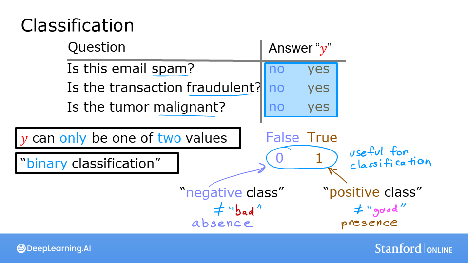
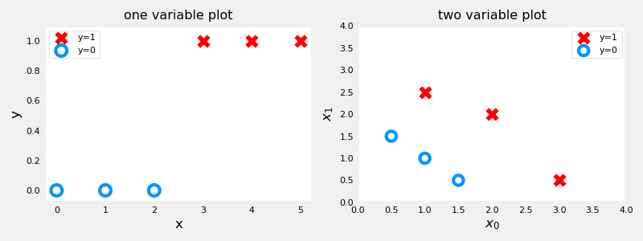
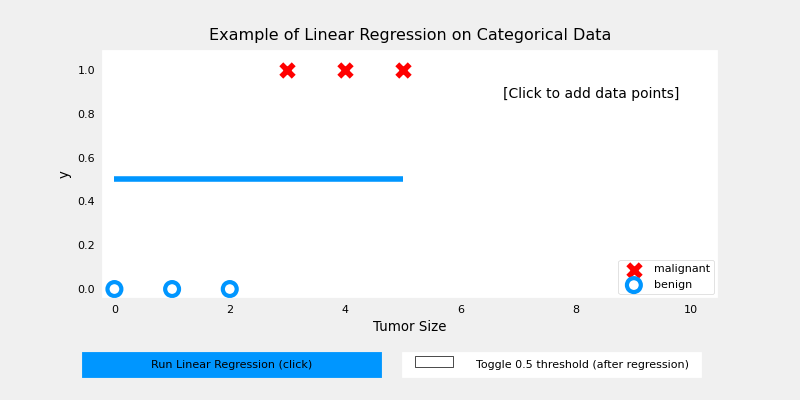

<!-- 本文件由课程原始 Notebook 转换并翻译。代码与公式保留原样。 -->
<!-- 原文件：1. Supervised Machine Learning - Regression and Classification/week 3/C1_W3_Lab01_Classification_Soln.ipynb -->

# 可选实验：分类

在本实验中，你会对比回归（regression）和分类。

```python
# Importing libraries
import numpy as np
%matplotlib widget
import matplotlib.pyplot as plt
from lab_utils_common import dlc, plot_data
from plt_one_addpt_onclick import plt_one_addpt_onclick
plt.style.use('./deeplearning.mplstyle')
```

## 分类问题
分类问题的例子包括判断邮件是否为垃圾邮件、判断肿瘤是恶性还是良性。这些都属于二分类（binary classification），目标只有两种可能结果，常表示为“是/否”“true/false”或“1/0”。

绘制分类数据时，常用不同符号表示不同类别。下图用红色 `X` 表示正类，用蓝色 `O` 表示负类。

```python
x_train = np.array([0., 1, 2, 3, 4, 5])
y_train = np.array([0,  0, 0, 1, 1, 1])
X_train2 = np.array([[0.5, 1.5], [1,1], [1.5, 0.5], [3, 0.5], [2, 2], [1, 2.5]])
y_train2 = np.array([0, 0, 0, 1, 1, 1])
```

```python
pos = y_train == 1
neg = y_train == 0

fig,ax = plt.subplots(1,2,figsize=(8,3))
#plot 1, single variable
ax[0].scatter(x_train[pos], y_train[pos], marker='x', s=80, c = 'red', label="y=1")
ax[0].scatter(x_train[neg], y_train[neg], marker='o', s=100, label="y=0", facecolors='none', 
              edgecolors=dlc["dlblue"],lw=3)

ax[0].set_ylim(-0.08,1.1)
ax[0].set_ylabel('y', fontsize=12)
ax[0].set_xlabel('x', fontsize=12)
ax[0].set_title('one variable plot')
ax[0].legend()

#plot 2, two variables
plot_data(X_train2, y_train2, ax[1])
ax[1].axis([0, 4, 0, 4])
ax[1].set_ylabel('$x_1$', fontsize=12)
ax[1].set_xlabel('$x_0$', fontsize=12)
ax[1].set_title('two variable plot')
ax[1].legend()
plt.tight_layout()
plt.show()
```



注：
- 在单变量图中，正类样本用位于 $y=1$ 的红色“X”表示，负类样本用位于 $y=0$ 的蓝色“O”表示。
   - 相比之下，线性回归的目标 $y$ 不限于两个类别，可以取连续值。
- 在双特征图中，两个坐标轴都用于表示输入特征，因此类别不再画在 $y$ 轴上；正类样本显示为红色“X”，负类样本显示为蓝色“O”。
    - 多变量线性回归若用相似方式展示，还需要额外维度表示连续目标值。

## 线性回归方法
上周你使用线性回归构建了预测模型。让我们用讲座中描述的简单例子来尝试这个方法。模型会根据肿瘤大小来预测肿瘤是否是良性或恶性。请尝试如下：
- 点击“运行线性回归”，为当前数据拟合线性模型。
    - 观察拟合结果，线性模型并不能自然表示这组分类数据。
一种改进方式是对线性回归的输出应用**阈值**。
- 勾选“切换 0.5 阈值”，观察应用阈值后的分类结果。
    - 此时预测与现有数据基本吻合。
- *重要*:接着在图的最右侧（肿瘤大小接近 10）增加一个恶性样本，再重新运行线性回归。
    - 此时拟合直线发生移动，导致 $x=3$ 的原有样本被错误分类。
- 如需清除或更新图形，请重新运行包含绘图命令的单元格。

```python
w_in = np.zeros((1))
b_in = 0
plt.close('all') 
addpt = plt_one_addpt_onclick( x_train,y_train, w_in, b_in, logistic=False)
```



这个例子表明，直接把线性回归用于分类并不可靠：新增样本会移动拟合直线和阈值交点，从而改变原有样本的分类结果。

## 恭喜完成！
在本实验中你：
- 探索了二分类数据的表示方式；
- 理解了线性回归不适合直接解决分类问题。

```python

```

```python

```
