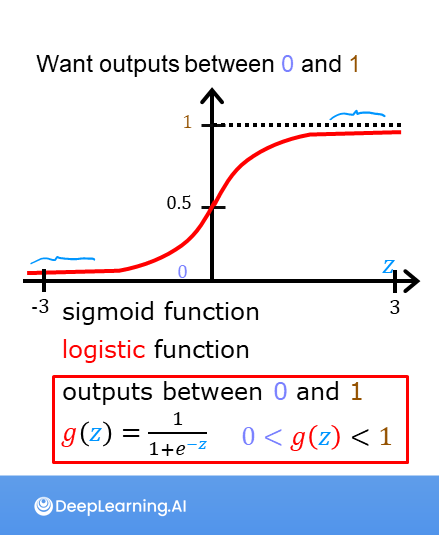
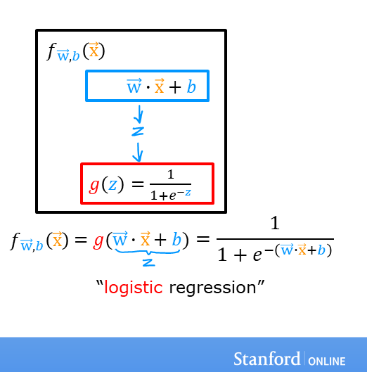

<!-- 本文件由课程原始 Notebook 转换并翻译。代码与公式保留原样。 -->
<!-- 原文件：1. Supervised Machine Learning - Regression and Classification/week 3/C1_W3_Lab02_Sigmoid_function_Soln.ipynb -->

# 可选实验： 逻辑回归

在本非评分实验中，你会：
- 探索 sigmoid 函数（又称逻辑函数）；
- 理解逻辑回归（logistic regression）如何使用 sigmoid 函数。

```python
# Importing libraries
import numpy as np
%matplotlib widget
import matplotlib.pyplot as plt
from plt_one_addpt_onclick import plt_one_addpt_onclick
from lab_utils_common import draw_vthresh
plt.style.use('./deeplearning.mplstyle')
```

## sigmoid（逻辑）函数
对于分类任务，可以先从熟悉的线性模型 $f_{\mathbf{w},b}(\mathbf{x}^{(i)}) = \mathbf{w} \cdot  \mathbf{x}^{(i)} + b$ 出发，用它根据 $x$ 计算中间值。
- 对于分类模型，我们希望预测值位于 0～1，因为目标变量 $y$ 只能取 0 或 1。
- sigmoid 函数可以把任意实数输入映射到 0～1。


下面实现 sigmoid 函数并观察其输出。

## sigmoid 函数公式

sigmoid 函数定义为：

$$
g(z) = \frac{1}{1+e^{-z}}\tag{1}
$$

在逻辑回归中，sigmoid 函数的输入 $z$ 就是线性模型的输出。
- 对于单个样本，$z$ 是标量；
- 对于 $m$ 个样本，$z$ 可以是包含 $m$ 个值的向量，每个值对应一个样本；
- sigmoid 函数的实现应同时支持标量输入和向量输入。
下面用 Python 实现。

NumPy 提供 [`exp()`](https://numpy.org/doc/stable/reference/generated/numpy.exp.html)，可对输入数组 `z` 的每个元素计算指数 $e^z$。
 
它也支持标量输入。

```python
# Input is an array. 
input_array = np.array([1,2,3])
exp_array = np.exp(input_array)

print("Input to exp:", input_array)
print("Output of exp:", exp_array)

# Input is a single number
input_val = 1  
exp_val = np.exp(input_val)

print("Input to exp:", input_val)
print("Output of exp:", exp_val)
```

```text
Input to exp: [1 2 3]
Output of exp: [ 2.72  7.39 20.09]
Input to exp: 1
Output of exp: 2.718281828459045
```

下面给出 `sigmoid` 的 Python 实现。

```python
# Defining sigmoid function g(z)
def sigmoid(z):
    """
    Compute the sigmoid of z

    Args:
        z (ndarray): A scalar, numpy array of any size.

    Returns:
        g (ndarray): sigmoid(z), with the same shape as z
         
    """

    g = 1/(1+np.exp(-z))
   
    return g
```

查看该函数对不同 `z` 值的输出。

```python
# Generate an array of evenly spaced values between -10 and 10
z_tmp = np.arange(-10,11)

# Use the function implemented above to get the sigmoid values
y = sigmoid(z_tmp)

# Code for pretty printing the two arrays next to each other
np.set_printoptions(precision=3) 
print("Input (z), Output (sigmoid(z))")
print(np.c_[z_tmp, y])
```

```text
Input (z), Output (sigmoid(z))
[[-1.000e+01  4.540e-05]
 [-9.000e+00  1.234e-04]
 [-8.000e+00  3.354e-04]
 [-7.000e+00  9.111e-04]
 [-6.000e+00  2.473e-03]
 [-5.000e+00  6.693e-03]
 [-4.000e+00  1.799e-02]
 [-3.000e+00  4.743e-02]
 [-2.000e+00  1.192e-01]
 [-1.000e+00  2.689e-01]
 [ 0.000e+00  5.000e-01]
 [ 1.000e+00  7.311e-01]
 [ 2.000e+00  8.808e-01]
 [ 3.000e+00  9.526e-01]
 [ 4.000e+00  9.820e-01]
 [ 5.000e+00  9.933e-01]
 [ 6.000e+00  9.975e-01]
 [ 7.000e+00  9.991e-01]
 [ 8.000e+00  9.997e-01]
 [ 9.000e+00  9.999e-01]
 [ 1.000e+01  1.000e+00]]
```

左列是输入 `z`，右列是 `sigmoid(z)`。当 `z` 从 -10 增大到 10 时，输出从接近 0 平滑增加到接近 1。

下面用 Matplotlib 绘制 sigmoid 曲线。

```python
# Plot z vs sigmoid(z)
fig,ax = plt.subplots(1,1,figsize=(5,3))
ax.plot(z_tmp, y, c="b")

ax.set_title("Sigmoid function")
ax.set_ylabel('sigmoid(z)')
ax.set_xlabel('z')
draw_vthresh(ax,0)
```

```text
Canvas(toolbar=Toolbar(toolitems=[('Home', 'Reset original view', 'home', 'home'), ('Back', 'Back to previous …
```

可以看到，当 $z$ 趋向负无穷时 sigmoid 输出趋近 0；当 $z$ 趋向正无穷时输出趋近 1。

## 逻辑回归
逻辑回归模型在熟悉的线性回归输出上应用 sigmoid 函数，如下所示：

$$
f_{\mathbf{w},b}(\mathbf{x}^{(i)}) = g(\mathbf{w} \cdot \mathbf{x}^{(i)} + b ) \tag{2}
$$

其中

$$
g(z) = \frac{1}{1+e^{-z}}\tag{3}
$$

下面把逻辑回归应用到肿瘤的二分类示例。  
首先，加载参数的示例和初始值。

```python
x_train = np.array([0., 1, 2, 3, 4, 5])
y_train = np.array([0,  0, 0, 1, 1, 1])

w_in = np.zeros((1))
b_in = 0
```

尝试以下步骤：
- 点击“运行逻辑回归”，为当前训练数据拟合模型；
    - 注意，得到的模型能够很好地拟合数据。
    - 橙色直线表示 $z$，即 $\mathbf{w} \cdot \mathbf{x}^{(i)} + b$，也就是线性模型的输出。
再应用阈值，把预测概率转换为类别：
- 勾选“切换 0.5 阈值”，观察应用阈值后的分类结果。
    - 预测与训练数据相符。
    - 在肿瘤大小接近 10 的区域增加更多样本，再重新运行逻辑回归。
    - 与线性回归不同，加入新的大肿瘤样本后，逻辑回归仍能保持合理的分类边界。

```python
plt.close('all')
addpt = plt_one_addpt_onclick( x_train,y_train, w_in, b_in, logistic=True)
```

```text
Canvas(toolbar=Toolbar(toolitems=[('Home', 'Reset original view', 'home', 'home'), ('Back', 'Back to previous …
```

## 恭喜完成！
你已经了解逻辑回归如何利用 sigmoid 函数输出 0～1 之间的预测概率。

```python

```
