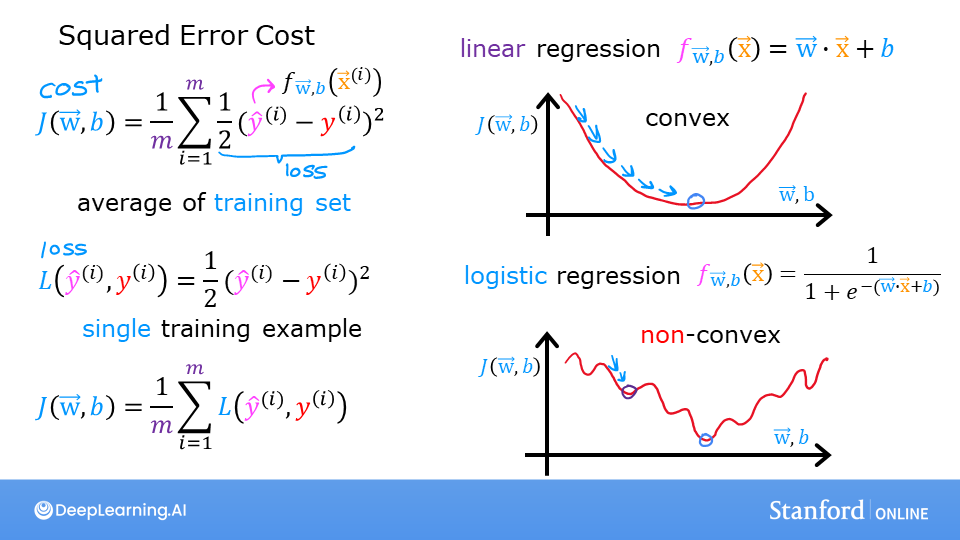
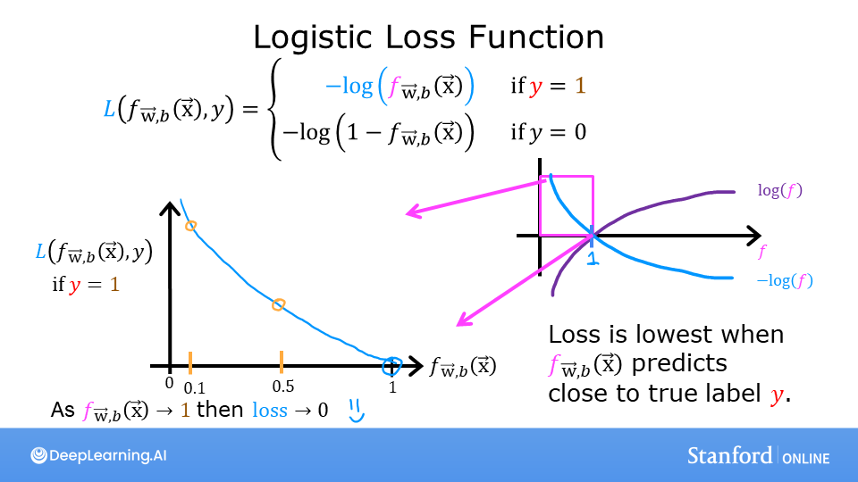
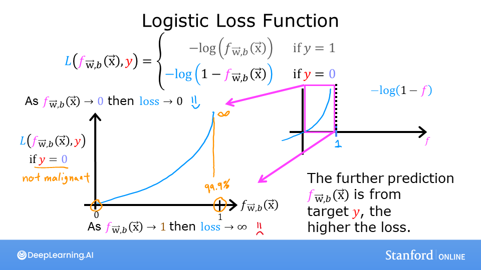
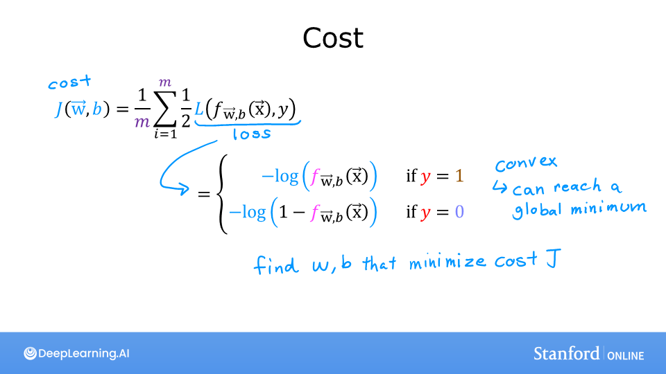

<!-- 本文件由课程原始 Notebook 转换并翻译。代码与公式保留原样。 -->
<!-- 原文件：1. Supervised Machine Learning - Regression and Classification/week 3/C1_W3_Lab04_LogisticLoss_Soln.ipynb -->

# 可选实验：逻辑回归与逻辑损失

在本非评分实验中，你会：
- 理解平方误差损失不适合逻辑回归的原因；
- 理解逻辑损失（logistic loss）函数。

```python
import numpy as np
%matplotlib widget
import matplotlib.pyplot as plt
from plt_logistic_loss import  plt_logistic_cost, plt_two_logistic_loss_curves, plt_simple_example
from plt_logistic_loss import soup_bowl, plt_logistic_squared_error
plt.style.use('./deeplearning.mplstyle')
```

## 逻辑回归能否使用平方误差？
在线性回归中，我们使用平方误差代价函数（squared-error cost function）：
对单变量线性回归，平方误差代价为：
  $$
  J(w,b) = \frac{1}{2m} \sum\limits_{i = 0}^{m-1} (f_{w,b}(x^{(i)}) - y^{(i)})^2 \tag{1}
  $$
 
其中
  $$
  f_{w,b}(x^{(i)}) = wx^{(i)} + b \tag{2}
  $$

在线性回归中，平方误差代价是凸函数，梯度下降可以沿着平滑曲面到达全局最小值。

```python
soup_bowl()
```

```text
Canvas(toolbar=Toolbar(toolitems=[('Home', 'Reset original view', 'home', 'home'), ('Back', 'Back to previous …
```

平方误差适合线性回归。直接把它用于逻辑回归看似自然，但逻辑回归的预测 $f_{w,b}(x)$ 包含非线性的 sigmoid：$f_{w,b}(x^{(i)})=\operatorname{sigmoid}(wx^{(i)}+b)$。下面观察此时代价函数的曲面。

这是我们的训练数据：

```python
x_train = np.array([0., 1, 2, 3, 4, 5],dtype=np.longdouble)
y_train = np.array([0,  0, 0, 1, 1, 1],dtype=np.longdouble)
plt_simple_example(x_train, y_train)
```

```text
Canvas(toolbar=Toolbar(toolitems=[('Home', 'Reset original view', 'home', 'home'), ('Back', 'Back to previous …
```

下面绘制平方误差代价关于参数的曲面：
  $$
  J(w,b) = \frac{1}{2m} \sum\limits_{i = 0}^{m-1} (f_{w,b}(x^{(i)}) - y^{(i)})^2
  $$
 
其中
  $$
  f_{w,b}(x^{(i)}) = sigmoid(wx^{(i)} + b )
  $$

```python
plt.close('all')
plt_logistic_squared_error(x_train,y_train)
plt.show()
```

```text
Canvas(toolbar=Toolbar(toolitems=[('Home', 'Reset original view', 'home', 'home'), ('Back', 'Back to previous …
```

与线性回归的碗形曲面不同，这个曲面包含多个起伏，梯度下降更难优化。    

逻辑回归需要更适合 sigmoid 非线性性质的代价函数。损失函数（loss function）如下所述。

## 逻辑损失函数




逻辑回归使用专门针对二元目标 $y\in\{0,1\}$ 的损失函数。

> **术语说明：**在这一课程中，使用这些定义：
- **损失（loss）**衡量单个样本的预测值与目标值之间的差异；
- **代价（cost）**汇总整个训练集上的损失。


定义如下：
* $loss(f_{\mathbf{w},b}(\mathbf{x}^{(i)}), y^{(i)})$是单个数据点的损失，即：

$$
\begin{equation}
  loss(f_{\mathbf{w},b}(\mathbf{x}^{(i)}), y^{(i)}) = \begin{cases}
    - \log\left(f_{\mathbf{w},b}\left( \mathbf{x}^{(i)} \right) \right) & \text{if }y^{(i)}=1\text{}\\
    - \log \left( 1 - f_{\mathbf{w},b}\left( \mathbf{x}^{(i)} \right) \right) & \text{if }y^{(i)}=0\text{}
  \end{cases}
\end{equation}
$$


*  $f_{\mathbf{w},b}(\mathbf{x}^{(i)})$是模型的预测，而$y^{(i)}$是目标值。

*  $f_{\mathbf{w},b}(\mathbf{x}^{(i)}) = g(\mathbf{w} \cdot\mathbf{x}^{(i)}+b)$，其中 $g$ 是 sigmoid 函数。
* 注释惯例：`log`指自然对数。

该损失函数根据目标值使用两条不同曲线：$y=0$ 时使用一条，$y=1$ 时使用另一条。预测与目标一致时损失接近 0；预测越偏离目标，损失增长越快。

```python
plt_two_logistic_loss_curves()
```

```text
Canvas(toolbar=Toolbar(toolitems=[('Home', 'Reset original view', 'home', 'home'), ('Back', 'Back to previous …
```

把两种情况合起来看，损失曲线的作用与平方误差类似：都惩罚错误预测。$f_{\mathbf{w},b}$ 是 sigmoid 的输出，严格位于 0 和 1 之间。

上面的分段定义可以合并成便于实现的单个表达式：
    $$
    loss(f_{\mathbf{w},b}(\mathbf{x}^{(i)}), y^{(i)}) = (-y^{(i)} \log\left(f_{\mathbf{w},b}\left( \mathbf{x}^{(i)} \right) \right) - \left( 1 - y^{(i)}\right) \log \left( 1 - f_{\mathbf{w},b}\left( \mathbf{x}^{(i)} \right) \right)
    $$
  
这个表达式看起来较复杂，但 $y^{(i)}$ 只能取 0 或 1，因此只需分别检查两种情况：
当 $y^{(i)}=0$ 时，左侧第一项为 0：
$$
\begin{align}
loss(f_{\mathbf{w},b}(\mathbf{x}^{(i)}), 0) &= (-(0) \log\left(f_{\mathbf{w},b}\left( \mathbf{x}^{(i)} \right) \right) - \left( 1 - 0\right) \log \left( 1 - f_{\mathbf{w},b}\left( \mathbf{x}^{(i)} \right) \right) \\
&= -\log \left( 1 - f_{\mathbf{w},b}\left( \mathbf{x}^{(i)} \right) \right)
\end{align}
$$
当 $y^{(i)}=1$ 时，右侧第二项为 0：
$$
\begin{align}
  loss(f_{\mathbf{w},b}(\mathbf{x}^{(i)}), 1) &=  (-(1) \log\left(f_{\mathbf{w},b}\left( \mathbf{x}^{(i)} \right) \right) - \left( 1 - 1\right) \log \left( 1 - f_{\mathbf{w},b}\left( \mathbf{x}^{(i)} \right) \right)\\
  &=  -\log\left(f_{\mathbf{w},b}\left( \mathbf{x}^{(i)} \right) \right)
\end{align}
$$

得到逻辑损失后，对全部训练样本的损失取平均即可构成代价函数。下面观察前述简单示例中代价随参数变化的曲面：

```python
plt.close('all')
cst = plt_logistic_cost(x_train,y_train)
```

```text
Canvas(toolbar=Toolbar(toolitems=[('Home', 'Reset original view', 'home', 'home'), ('Back', 'Back to previous …
```

该曲线适合使用梯度下降：它没有平台、局部极小值或不连续点。虽然形状不像平方误差那样呈碗状，但在代价较小时仍保持非零斜率并继续下降。可以用鼠标旋转上面的三维图观察。

## 恭喜完成！
在本实验中，你：
 - 理解了平方误差损失不适合逻辑回归；
 - 推导并观察了适用于二分类任务的逻辑损失函数。
