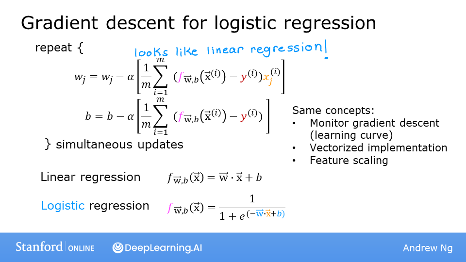

<!-- 本文件由课程原始 Notebook 转换并翻译。代码与公式保留原样。 -->
<!-- 原文件：1. Supervised Machine Learning - Regression and Classification/week 3/C1_W3_Lab06_Gradient_Descent_Soln.ipynb -->

# 可选实验： 用于逻辑回归的梯度下降（gradient descent for logistic regression）

## 学习目标
在本实验中，你会：
- 理解逻辑回归的梯度下降更新；
- 在熟悉的数据集上观察梯度下降过程。

```python
# Importing libraries
import copy, math
import numpy as np
%matplotlib widget
import matplotlib.pyplot as plt
from lab_utils_common import  dlc, plot_data, plt_tumor_data, sigmoid, compute_cost_logistic
from plt_quad_logistic import plt_quad_logistic, plt_prob
plt.style.use('./deeplearning.mplstyle')
```

## 数据集
先使用与决策边界实验相同的双特征数据集。

```python
X_train = np.array([[0.5, 1.5], [1,1], [1.5, 0.5], [3, 0.5], [2, 2], [1, 2.5]])
y_train = np.array([0, 0, 0, 1, 1, 1])
```

```python
X_train
```

```text
array([[0.5, 1.5],
       [1. , 1. ],
       [1.5, 0.5],
       [3. , 0.5],
       [2. , 2. ],
       [1. , 2.5]])
```

```python
y_train
```

```text
array([0, 0, 0, 1, 1, 1])
```

和以前一样，我们将使用辅助函数来绘制此数据。标签 $y=1$ 的样本显示为红色叉号，标签 $y=0$ 的样本显示为蓝色圆点。

```python
fig,ax = plt.subplots(1,1,figsize=(4,4))
plot_data(X_train, y_train, ax)

ax.axis([0, 4, 0, 3.5])
ax.set_ylabel('$x_1$', fontsize=12)
ax.set_xlabel('$x_0$', fontsize=12)
plt.show()
```

```text
Canvas(toolbar=Toolbar(toolitems=[('Home', 'Reset original view', 'home', 'home'), ('Back', 'Back to previous …
```

## 逻辑回归的梯度下降


梯度下降按以下规则更新参数：
$$
\begin{align*}
&\text{repeat until convergence:} \; \lbrace \\
&  \; \; \;w_j = w_j -  \alpha \frac{\partial J(\mathbf{w},b)}{\partial w_j} \tag{1}  \; & \text{for j := 0..n-1} \\ 
&  \; \; \;  \; \;b = b -  \alpha \frac{\partial J(\mathbf{w},b)}{\partial b} \\
&\rbrace
\end{align*}
$$

每次迭代都应同时更新 $b$ 和所有 $w_j$，其中：
$$
\begin{align*}
\frac{\partial J(\mathbf{w},b)}{\partial w_j}  &= \frac{1}{m} \sum\limits_{i = 0}^{m-1} (f_{\mathbf{w},b}(\mathbf{x}^{(i)}) - y^{(i)})x_{j}^{(i)} \tag{2} \\
\frac{\partial J(\mathbf{w},b)}{\partial b}  &= \frac{1}{m} \sum\limits_{i = 0}^{m-1} (f_{\mathbf{w},b}(\mathbf{x}^{(i)}) - y^{(i)}) \tag{3} 
\end{align*}
$$

* m 是数据集中训练样本的数量
* $f_{\mathbf{w},b}(x^{(i)})$是模型的预测，而$y^{(i)}$是目标
* 对于逻辑回归模型：
    $z = \mathbf{w} \cdot \mathbf{x} + b$  
    $f_{\mathbf{w},b}(x) = g(z)$  
其中，$g(z)$ 是 sigmoid 函数 :
    $g(z) = \frac{1}{1+e^{-z}}$

### 梯度下降的实现
实现梯度下降需要两个部分：
- `gradient_descent` 实现式 (1) 的参数更新循环；该函数由课程实验提供。
- `compute_gradient_logistic` 计算式 (2)、(3) 中的当前梯度；你将在本周练习作业中实现它。

#### 梯度计算：代码说明
需要为 $b$ 和每个 $w_j$ 计算式 (2)、(3)。一种实现步骤如下：

- 初始化变量以累积`dj_dw`和`dj_db`
- 遍历每个训练样本：
    - 计算该样本的误差 $g(\mathbf{w} \cdot \mathbf{x}^{(i)} + b) - \mathbf{y}^{(i)}$
    - 再遍历该样本的每个输入特征 $x_j^{(i)}$：
        - 将误差乘以 $x_j^{(i)}$，累加到 `dj_dw[j]`；
    - 将误差累加到 `dj_db`。

- 最后将 `dj_db` 和 `dj_dw` 除以样本数 $m$。
- 在 NumPy 中，$\mathbf{x}^{(i)}$ 可写为 `X[i, :]` 或 `X[i]`，$x_j^{(i)}$ 可写为 `X[i, j]`。

```python
def compute_gradient_logistic(X, y, w, b): 
    """
    Computes the gradient for logistic regression 
 
    Args:
      X (ndarray (m,n): Data, m examples with n features
      y (ndarray (m,)): target values
      w (ndarray (n,)): model parameters  
      b (scalar)      : model parameter
    Returns
      dj_dw (ndarray (n,)): The gradient of the cost w.r.t. the parameters w. 
      dj_db (scalar)      : The gradient of the cost w.r.t. the parameter b. 
    """
    m,n = X.shape
    dj_dw = np.zeros((n,))                           #(n,)
    dj_db = 0.

    for i in range(m):
        f_wb_i = sigmoid(np.dot(X[i],w) + b)          #(n,)(n,)=scalar
        err_i  = f_wb_i  - y[i]                       #scalar
        for j in range(n):
            dj_dw[j] = dj_dw[j] + err_i * X[i,j]      #scalar
        dj_db = dj_db + err_i
    dj_dw = dj_dw/m                                   #(n,)
    dj_db = dj_db/m                                   #scalar
        
    return dj_db, dj_dw
```

运行下面的单元格，检查梯度函数的实现。

```python
X_tmp = np.array([[0.5, 1.5], [1,1], [1.5, 0.5], [3, 0.5], [2, 2], [1, 2.5]])
y_tmp = np.array([0, 0, 0, 1, 1, 1])
w_tmp = np.array([2.,3.])
b_tmp = 1.
dj_db_tmp, dj_dw_tmp = compute_gradient_logistic(X_tmp, y_tmp, w_tmp, b_tmp)
print(f"dj_db: {dj_db_tmp}" )
print(f"dj_dw: {dj_dw_tmp.tolist()}" )
```

```text
dj_db: 0.49861806546328574
dj_dw: [0.498333393278696, 0.49883942983996693]
```

**预期输出**
``` 
dj_db: 0.49861806546328574
dj_dw: [0.498333393278696, 0.49883942983996693]
```

#### 梯度下降代码
下面的代码实现式 (1)。可以把函数中的每一步与上面的更新公式逐项对应。

```python
def gradient_descent(X, y, w_in, b_in, alpha, num_iters): 
    """
    Performs batch gradient descent
    
    Args:
      X (ndarray (m,n)   : Data, m examples with n features
      y (ndarray (m,))   : target values
      w_in (ndarray (n,)): Initial values of model parameters  
      b_in (scalar)      : Initial values of model parameter
      alpha (float)      : Learning rate
      num_iters (scalar) : number of iterations to run gradient descent
      
    Returns:
      w (ndarray (n,))   : Updated values of parameters
      b (scalar)         : Updated value of parameter 
    """
    # An array to store cost J and w's at each iteration primarily for graphing later
    J_history = []
    w = copy.deepcopy(w_in)  #avoid modifying global w within function
    b = b_in
    
    for i in range(num_iters):
        # Calculate the gradient and update the parameters
        dj_db, dj_dw = compute_gradient_logistic(X, y, w, b)   

        # Update Parameters using w, b, alpha and gradient
        w = w - alpha * dj_dw               
        b = b - alpha * dj_db               
      
        # Save cost J at each iteration
        if i<100000:      # prevent resource exhaustion 
            J_history.append( compute_cost_logistic(X, y, w, b) )

        # Print cost every at intervals 10 times or as many iterations if < 10
        if i% math.ceil(num_iters / 10) == 0:
            print(f"Iteration {i:4d}: Cost {J_history[-1]}   ")
        
    return w, b, J_history         #return final w,b and J history for graphing
```

下面在数据集上运行梯度下降。

```python
w_tmp  = np.zeros_like(X_train[0])
b_tmp  = 0.
alph = 0.1
iters = 10000

w_out, b_out, _ = gradient_descent(X_train, y_train, w_tmp, b_tmp, alph, iters) 
print(f"\nupdated parameters: w:{w_out}, b:{b_out}")
```

```text
Iteration    0: Cost 0.684610468560574   
Iteration 1000: Cost 0.1590977666870456   
Iteration 2000: Cost 0.08460064176930081   
Iteration 3000: Cost 0.05705327279402531   
Iteration 4000: Cost 0.042907594216820076   
Iteration 5000: Cost 0.034338477298845684   
Iteration 6000: Cost 0.028603798022120097   
Iteration 7000: Cost 0.024501569608793   
Iteration 8000: Cost 0.02142370332569295   
Iteration 9000: Cost 0.019030137124109114   

updated parameters: w:[5.28 5.08], b:-14.222409982019837
```

#### 绘制梯度下降结果

```python
fig,ax = plt.subplots(1,1,figsize=(5,4))
# plot the probability 
plt_prob(ax, w_out, b_out)

# Plot the original data
ax.set_ylabel(r'$x_1$')
ax.set_xlabel(r'$x_0$')   
ax.axis([0, 4, 0, 3.5])
plot_data(X_train,y_train,ax)

# Plot the decision boundary
x0 = -b_out/w_out[0]
x1 = -b_out/w_out[1]
ax.plot([0,x0],[x1,0], c=dlc["dlblue"], lw=1)
plt.show()
```

```text
Canvas(toolbar=Toolbar(toolitems=[('Home', 'Reset original view', 'home', 'home'), ('Back', 'Back to previous …
```

在上述图中：
 - 背景阴影表示预测为 $y=1$ 的概率；
 - 概率为 0.5 的等值线就是决策边界。

## 另一个数据集
下面换用只有两个参数 $w$ 和 $b$ 的数据集，以便用等高线图展示代价函数并观察梯度下降。

```python
x_train = np.array([0., 1, 2, 3, 4, 5])
y_train = np.array([0,  0, 0, 1, 1, 1])
```

和以前一样，我们将使用辅助函数来绘制此数据。标签 $y=1$显示为红色十字，而数据点为标签 $y=0$显示为蓝圆。

```python
fig,ax = plt.subplots(1,1,figsize=(4,3))
plt_tumor_data(x_train, y_train, ax)
plt.show()
```

```text
Canvas(toolbar=Toolbar(toolitems=[('Home', 'Reset original view', 'home', 'home'), ('Back', 'Back to previous …
```

如下图中，请尝试：
- 点击右上方的等高线图，改变 $w$ 和 $b$；
    - 图形更新可能需要一两秒；
    - 观察左上图中代价值的变化；
    - 注意遍历每个训练样本：(垂直点线)的损失累积代价
- 点击橙色按钮运行梯度下降；
    - 观察代价持续下降；右下图的纵轴为 $\log(\text{cost})$；
    - 在等高线图中单击，为新一轮运行设置新的起点。
- 若要重置图形，请重新运行该单元格。

```python
w_range = np.array([-1, 7])
b_range = np.array([1, -14])
quad = plt_quad_logistic( x_train, y_train, w_range, b_range )
```

```text
Canvas(toolbar=Toolbar(toolitems=[('Home', 'Reset original view', 'home', 'home'), ('Back', 'Back to previous …
```

## 恭喜完成！
在本实验中，你：
- 回顾并实现了逻辑回归的梯度计算；
- 使用这些函数运行了梯度下降；
    - 在单特征数据集上观察了训练结果；
    - 在双特征数据集上观察了代价曲面与参数更新。

```python

```
