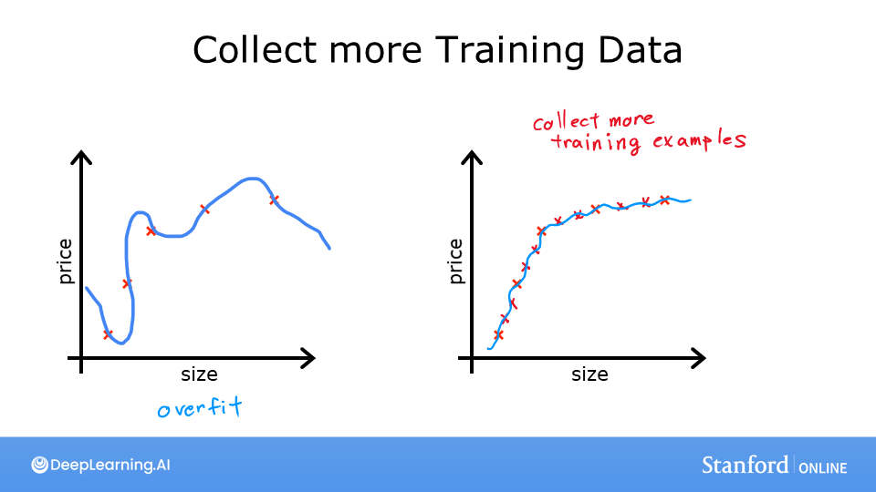
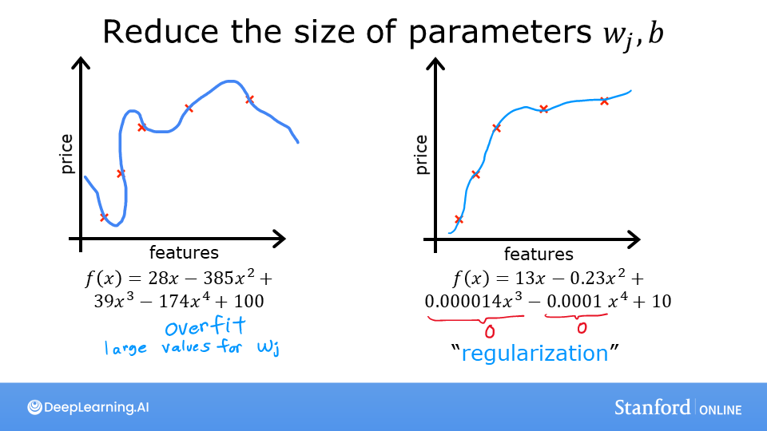
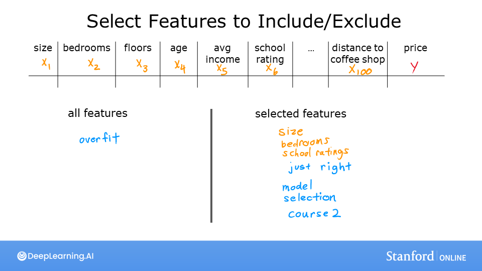

<!-- 本文件由课程原始 Notebook 转换并翻译。代码与公式保留原样。 -->
<!-- 原文件：1. Supervised Machine Learning - Regression and Classification/week 3/C1_W3_Lab08_Overfitting_Soln.ipynb -->

# 非评分实验：过拟合





## 学习目标
在本实验中你会探索：
- 过拟合（overfitting）在什么情况下发生；
- 缓解过拟合的常用方法。

```python
%matplotlib widget
import matplotlib.pyplot as plt
from ipywidgets import Output
from plt_overfit import overfit_example, output
plt.style.use('./deeplearning.mplstyle')
```

# 过拟合
本周讲座介绍了过拟合。运行下面的单元格生成交互图，再按后续说明探索不同模型复杂度和数据点对拟合结果的影响。

```python
plt.close("all")
display(output)
ofit = overfit_example(False)
```

```text
Output()
```

```text
Canvas(toolbar=Toolbar(toolitems=[('Home', 'Reset original view', 'home', 'home'), ('Back', 'Back to previous …
```

在以上图中，你可以：
- 在回归（regression）与分类示例之间切换；
- 添加数据
- 选择多项式次数；
- 拟合模型。

建议尝试：
- 令多项式次数为 1 并拟合，观察欠拟合（underfitting）；
- 令多项式次数为 6 并拟合，观察过拟合（overfitting）；
- 调整多项式次数，寻找“恰好拟合”的模型。
- 添加数据 :
    - 加入离群点，观察它如何加剧过拟合；
    - 加入符合总体趋势的样本，观察更多数据如何减轻过拟合；
- 切换 `Regression` 和 `Categorical`，分别观察回归与分类情形。

如需重置，请重新运行单元格。点击控件后请等待图形更新，再进行下一次操作。

操作说明：
- “Ideal” 曲线表示生成数据时使用的真实函数；样本是在该函数上加入噪声得到的。
- 交互图中的 `fit` 为提高响应速度使用适合小数据集的数值方法，并非课程前面实现的梯度下降。

## 恭喜完成！
你已经直观了解过拟合的成因及部分缓解方法。下一个实验将学习常用方法之一：正则化（regularization）。

```python

```
