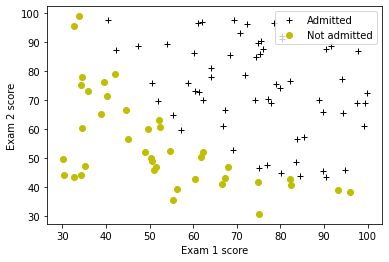
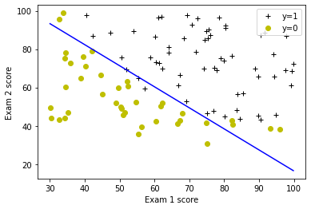
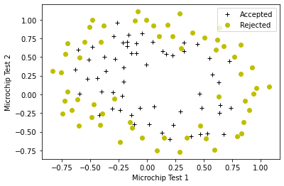
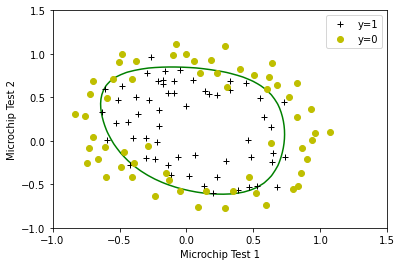

<!-- 本文件由课程原始 Notebook 转换并翻译。代码与公式保留原样。 -->
<!-- 原文件：1. Supervised Machine Learning - Regression and Classification/week 3/assignment/C1_W3_Logistic_Regression.ipynb -->

# 逻辑回归

在此过程中，你将执行逻辑回归（logistic regression）并将其应用到两个不同的数据集。


# 内容提要
- [ 1 - Packages ](#1)
- [ 2 - Logistic Regression](#2)
  - [ 2.1 Problem Statement](#2.1)
  - [ 2.2 Loading and visualizing the data](#2.2)
  - [ 2.3  Sigmoid function](#2.3)
  - [ 2.4 Cost function for logistic regression](#2.4)
  - [ 2.5 Gradient for logistic regression](#2.5)
  - [ 2.6 Learning parameters using gradient descent ](#2.6)
  - [ 2.7 Plotting the decision boundary](#2.7)
  - [ 2.8 Evaluating logistic regression](#2.8)
- [ 3 - Regularized Logistic Regression](#3)
  - [ 3.1 Problem Statement](#3.1)
  - [ 3.2 Loading and visualizing the data](#3.2)
  - [ 3.3 Feature mapping](#3.3)
  - [ 3.4 Cost function for regularized logistic regression](#3.4)
  - [ 3.5 Gradient for regularized logistic regression](#3.5)
  - [ 3.6 Learning parameters using gradient descent](#3.6)
  - [ 3.7 Plotting the decision boundary](#3.7)
  - [ 3.8 Evaluating regularized logistic regression model](#3.8)

_**注意：**为避免自动评分出错，请勿编辑或删除非评分单元格，也不要在 Notebook 中新增单元格。_ 
_通过作业后，如果想尝试额外代码，可按 Notebook 末尾的说明解锁非评分单元格。_

<a name="1"></a>
## 1 - 软件包

首先运行下面的单元格，导入本作业所需的全部软件包。
- [numpy](https://www.numpy.org)是科学计算的基本软件包Python.
- [matplotlib](http://matplotlib.org)是一个用于绘制图表的著名库Python.
-  ``utils.py`` 包含此任务的助手函数。 你不需要修改此文件中的代码 。

```python
import numpy as np
import matplotlib.pyplot as plt
from utils import *
import copy
import math

%matplotlib inline
```

<a name="2"></a>
## 2 - 逻辑回归

在这部分练习中，你会建立一个逻辑回归以预测学生是否进入大学。

<a name="2.1"></a>
### 2.1 问题说明

假设你是大学系的管理员，你想根据两个考试的结果确定每个申请人的录取机会。
* 你拥有来自以往申请人的历史数据，可以用作训练集（training set）逻辑回归。 
* 对于每个训练样本，你在两次考试和录取决定中都会获得申请人的分数。
* 你的任务是建立一个分类（classification）根据这两个考试的分数估计申请人录取概率的模型。

<a name="2.2"></a>
### 2.2 数据加载和可视化

你将从加载此任务的数据集开始 。
- 下面的 `load_dataset()` 把数据加载到 `X_train` 和 `y_train`。
  - `X_train`包含两个学生考试的分数
  - `y_train`是录取决定
      - `y_train = 1`如果学生被录取
      - `y_train = 0`如果学生未被录取
  - 两者`X_train`和`y_train`已经NumPy数组。

```python
# load dataset
X_train, y_train = load_data("data/ex2data1.txt")
```

#### 查看变量
让我们更熟悉你的数据集。
- 一个简单的起点是打印各个变量，查看其中包含的内容。

下面的代码打印了前5个值：`X_train`和变量的类型。

```python
print("First five elements in X_train are:\n", X_train[:5])
print("Type of X_train:",type(X_train))
```

```text
First five elements in X_train are:
 [[34.62365962 78.02469282]
 [30.28671077 43.89499752]
 [35.84740877 72.90219803]
 [60.18259939 86.3085521 ]
 [79.03273605 75.34437644]]
Type of X_train: <class 'numpy.ndarray'>
```

现在打印前5个值`y_train`

```python
print("First five elements in y_train are:\n", y_train[:5])
print("Type of y_train:",type(y_train))
```

```text
First five elements in y_train are:
 [0. 0. 0. 1. 1.]
Type of y_train: <class 'numpy.ndarray'>
```

#### 检查变量的维度

查看数组维度也有助于理解数据。下面打印 `X_train` 和 `y_train` 的形状，并确认训练样本数量。

```python
print ('The shape of X_train is: ' + str(X_train.shape))
print ('The shape of y_train is: ' + str(y_train.shape))
print ('We have m = %d training examples' % (len(y_train)))
```

```text
The shape of X_train is: (100, 2)
The shape of y_train is: (100,)
We have m = 100 training examples
```

#### 数据可视化

在开始执行任何学习算法之前，如果可能的话，总是可以将数据直观化。
- 下面的代码显示一个2D图上的数据(如下所示)，其中轴是两个考试分数，正负例子用不同的标记显示。
- 我们使用一个帮助器功能`utils.py``生成此图的文件。


```python
# Plot examples
plot_data(X_train, y_train[:], pos_label="Admitted", neg_label="Not admitted")

# Set the y-axis label
plt.ylabel('Exam 2 score') 
# Set the x-axis label
plt.xlabel('Exam 1 score') 
plt.legend(loc="upper right")
plt.show()
```



目标是建立一个能够拟合这些数据的逻辑回归模型。
- 使用该模型，可以根据学生两次考试的成绩预测其是否会被录取。

<a name="2.3"></a>
### 2.3  sigmoid函数

回顾逻辑回归，该模型作为

$$
f_{\mathbf{w},b}(x) = g(\mathbf{w}\cdot \mathbf{x} + b)
$$
函数$g$这是sigmoid函数。sigmoid函数定义为：

$$
g(z) = \frac{1}{1+e^{-z}}
$$

先实现 sigmoid 函数，供本作业后续部分使用。

<a name='ex-01'></a>
### 练习 1
请完成`sigmoid`函数来计算

$$
g(z) = \frac{1}{1+e^{-z}}
$$

请注意：
- `z`并非总是一个数字，但也可能是一个数组。
- 如果输入是数组，我们想应用sigmoid函数到输入数组中的每个值。

如果遇到困难，可以查看代码单元格后面的提示。

```python
# UNQ_C1
# GRADED FUNCTION: sigmoid

def sigmoid(z):
    """
    Compute the sigmoid of z

    Args:
        z (ndarray): A scalar, numpy array of any size.

    Returns:
        g (ndarray): sigmoid(z), with the same shape as z
         
    """
          
    ### START CODE HERE ### 
    g = 1/(1+np.exp(-z))

    ### END SOLUTION ###  
    
    return g
```

<details>
  <summary><font size="3" color="darkgreen"><b>点击查看提示</b></font></summary>
       
   * `numpy`有名为[`np.exp()`](https://numpy.org/doc/stable/reference/generated/numpy.exp.html)，它提供了计算指数的有力方法($e^{z}$输入数组中的所有元素(`z`).
 
<details>
          <summary><font size="2" color="darkblue"><b>点击查看更多提示</b></font></summary>
        
  - 你可以翻译$e^{-z}$输入代码为`np.exp(-z)` 
    
  - 你可以翻译$1/e^{-z}$输入代码为`1/np.exp(-z)` 
    
如果你仍然被卡住， 你可以检查下面的提示来计算`g` 
    
    <details>
          <summary><font size="2" color="darkblue"><b>用于计算 g 的提示</b></font></summary>
        <code>g = 1 / (1 + np.exp(-z))</code>
    </details>


</details>

完成后，请尝试调用一些值`sigmoid(x)`输入单元格见下文。
- 对于x的巨大正值，sigmoid应接近1，而对于大的负值，sigmoid应该接近0。
- 评价`sigmoid(0)`应该给你0.5

```python
# Note: You can edit this value
value = 0

print (f"sigmoid({value}) = {sigmoid(value)}")
```

```text
sigmoid(0) = 0.5
```

**预期输出**:
<table>
  <tr>
    <td> <b>sigmoid(0)<b></td>
    <td> 0.5 </td> 
  </tr>
</table>
    
- 如前所述，你的代码还应与向量和矩阵配合。对于矩阵，你的函数应当执行sigmoid函数。

```python
print ("sigmoid([ -1, 0, 1, 2]) = " + str(sigmoid(np.array([-1, 0, 1, 2]))))

# UNIT TESTS
from public_tests import *
sigmoid_test(sigmoid)
```

```text
sigmoid([ -1, 0, 1, 2]) = [0.26894142 0.5        0.73105858 0.88079708]
All tests passed!
```

**预期输出**:
<table>
  <tr>
    <td><b>sigmoid([-1, 0, 1, 2])<b></td> 
    <td>[0.26894142        0.5           0.73105858        0.88079708]</td> 
  </tr>    
  
</table>

<a name="2.4"></a>
### 2.4 逻辑回归的代价函数（cost function for logistic regression）

在本节中，你将执行逻辑回归的代价函数（cost function for logistic regression）.

<a name='ex-02'></a>
### 练习 2

请完成`compute_cost`函数使用以下方程式。

回顾逻辑回归，则代价函数（cost function）形式为

$$
J(\mathbf{w},b) = \frac{1}{m}\sum_{i=0}^{m-1} \left[ loss(f_{\mathbf{w},b}(\mathbf{x}^{(i)}), y^{(i)}) \right] \tag{1}
$$

其中
* m 是数据集中训练样本的数量


* $loss(f_{\mathbf{w},b}(\mathbf{x}^{(i)}), y^{(i)})$是一个单一数据点的代价，即：

    $$
    loss(f_{\mathbf{w},b}(\mathbf{x}^{(i)}), y^{(i)}) = (-y^{(i)} \log\left(f_{\mathbf{w},b}\left( \mathbf{x}^{(i)} \right) \right) - \left( 1 - y^{(i)}\right) \log \left( 1 - f_{\mathbf{w},b}\left( \mathbf{x}^{(i)} \right) \right) \tag{2}
    $$
    
    
*  $f_{\mathbf{w},b}(\mathbf{x}^{(i)})$是模型的预测，而$y^{(i)}$，这是实际标签（label）

*  $f_{\mathbf{w},b}(\mathbf{x}^{(i)}) = g(\mathbf{w} \cdot \mathbf{x^{(i)}} + b)$函数$g$这是sigmoid函数。
    * 可以先计算中间变量 $z_{\mathbf{w},b}(\mathbf{x}^{(i)}) = \mathbf{w} \cdot \mathbf{x^{(i)}} + b = w_0x^{(i)}_0 + ... + w_{n-1}x^{(i)}_{n-1} + b$，其中 $n$ 是特征数，再计算 $f_{\mathbf{w},b}(\mathbf{x}^{(i)}) = g(z_{\mathbf{w},b}(\mathbf{x}^{(i)}))$。

说明：
* 请注意，`X_train` 和 `y_train` 不是标量：`X_train` 的形状为 ($m, n$)，`y_train` 包含 $𝑚$ 个元素。其中 $𝑛$ 是特征数，$𝑚$ 是训练样本数。
* 你可以用这个sigmoid函数，用于此部分。

如果遇到困难，可以查看代码单元格后面的提示。

```python
# UNQ_C2
# GRADED FUNCTION: compute_cost
def compute_cost(X, y, w, b, *argv):
    """
    Computes the cost over all examples
    Args:
      X : (ndarray Shape (m,n)) data, m examples by n features
      y : (ndarray Shape (m,))  target value 
      w : (ndarray Shape (n,))  values of parameters of the model      
      b : (scalar)              value of bias parameter of the model
      *argv : unused, for compatibility with regularized version below
    Returns:
      total_cost : (scalar) cost 
    """

    m, n = X.shape
    
    ### START CODE HERE ###

    cost = 0
    for i in range(m):
        z = np.dot(X[i],w) + b
        f_wb = sigmoid(z)
        cost += -y[i]*np.log(f_wb) - (1-y[i])*np.log(1-f_wb)
    total_cost = cost/m
    
             
    ### END CODE HERE ### 

    return total_cost
```

<details>
<summary><font size="3" color="darkgreen"><b>点击查看提示</b></font></summary>
    
* 你可以代表一个归纳操作符， 如 :$h = \sum\limits_{i = 0}^{m-1} 2i$编码如下：

```Python
    h = 0
    for i in range(m):
        h = h + 2*i
```
<br>

* 在此情况下，你可以在所有实例上进行排列`X`使用循环并添加`loss`从每个迭代到变量(`loss_sum`)在环外初始化。

* 最后，将 `loss_sum` 除以 `m`，并把结果作为 `total_cost` 返回。

* 如果刚开始使用 Python，请确保代码使用一致的空格或制表符缩进，否则可能得到错误结果或触发 `IndentationError: unexpected indent`。详情可参考社区中的 [说明](https://community.deeplearning.ai/t/indentation-in-python-indentationerror-unexpected-indent/159398)。
     
<details>
<summary><font size="2" color="darkblue"><b>点击查看更多提示</b></font></summary>
        
* 下面给出了该函数的整体结构：
        
```Python
def compute_cost(X, y, w, b, *argv):
    m, n = X.shape

    ### START CODE HERE ###
    loss_sum = 0 
    
    # Loop over each training example
    for i in range(m): 
        
        # First calculate z_wb = w[0]*X[i][0]+...+w[n-1]*X[i][n-1]+b
        z_wb = 0 
        # Loop over each feature
        for j in range(n): 
            # Add the corresponding term to z_wb
            z_wb_ij = # Your code here to calculate w[j] * X[i][j]
            z_wb += z_wb_ij # equivalent to z_wb = z_wb + z_wb_ij
        # Add the bias term to z_wb
        z_wb += b # equivalent to z_wb = z_wb + b
        
        f_wb = # Your code here to calculate prediction f_wb for a training example
        loss =  # Your code here to calculate loss for a training example
        
        loss_sum += loss # equivalent to loss_sum = loss_sum + loss
        
    total_cost = (1 / m) * loss_sum  
    ### END CODE HERE ### 
    
    return total_cost
```
<br>

如果你仍然被卡住， 你可以检查下面的提示来计算`z_wb_ij`, `f_wb`和`cost`.

<details>
<summary><font size="2" color="darkblue"><b>用于计算 z  wb  ij 的提示</b></font></summary>
<code>z_wb_ij = w[j]*X[i][j] </code>
</details>
        
<details>
          <summary><font size="2" color="darkblue"><b>用于计算 f wb 的提示</b></font></summary>
$f_{\mathbf{w},b}(\mathbf{x}^{(i)}) = g(z_{\mathbf{w},b}(\mathbf{x}^{(i)}))$，其中 $g$ 是 sigmoid 函数。这里可以直接调用前面实现的 `sigmoid` 函数。
          <details>
              <summary><font size="2" color="blue"><b>&emsp; 更多计算 f 的提示</b></font></summary>
&emsp; &emsp; 可以把 `f_wb` 计算为<code>f_wb = sigmoid(z_wb) </code>
           </details>
</details>

<details>
          <summary><font size="2" color="darkblue"><b>计算损失的提示</b></font></summary>
&emsp; &emsp; 你可以使用<a href="https://numpy.org/doc/stable/reference/generated/numpy.log.html">np.log</a>函数来计算日志
          <details>
              <summary><font size="2" color="blue"><b>&emsp; 更多计算损失的提示</b></font></summary>
&emsp; &emsp; 你可以计算损失为<code>loss =  -y[i] * np.log(f_wb) - (1 - y[i]) * np.log(1 - f_wb)</code>
</details>
</details>
        
</details>

</details>

运行下面的单元格，用两组不同的初始参数 $w,b$ 检查 `compute_cost`。

```python
m, n = X_train.shape

# Compute and display cost with w and b initialized to zeros
initial_w = np.zeros(n)
initial_b = 0.
cost = compute_cost(X_train, y_train, initial_w, initial_b)
print('Cost at initial w and b (zeros): {:.3f}'.format(cost))
```

```text
Cost at initial w and b (zeros): 0.693
```

**预期输出**:
<table>
  <tr>
    <td> <b>按初始w和b计算的代价(零)<b></td>
    <td> 0.693 </td> 
  </tr>
</table>

```python
# Compute and display cost with non-zero w and b
test_w = np.array([0.2, 0.2])
test_b = -24.
cost = compute_cost(X_train, y_train, test_w, test_b)

print('Cost at test w and b (non-zeros): {:.3f}'.format(cost))


# UNIT TESTS
compute_cost_test(compute_cost)
```

```text
Cost at test w and b (non-zeros): 0.218
All tests passed!
```

**预期输出**:
<table>
  <tr>
    <td> <b>试验w和b的代价(非零):<b></td>
    <td> 0.218 </td> 
  </tr>
</table>

<a name="2.5"></a>
### 2.5 梯度（gradient）逻辑回归

在本节中，你将执行梯度（gradient）逻辑回归。

回顾梯度下降（gradient descent）算法为：

$$
\begin{align*}& \text{repeat until convergence:} \; \lbrace \newline \; & b := b -  \alpha \frac{\partial J(\mathbf{w},b)}{\partial b} \newline       \; & w_j := w_j -  \alpha \frac{\partial J(\mathbf{w},b)}{\partial w_j} \tag{1}  \; & \text{for j := 0..n-1}\newline & \rbrace\end{align*}
$$

何处，参数$b$, $w_j$全部快速更新

<a name='ex-03'></a>
### 练习 3

请完成`compute_gradient`计算函数$\frac{\partial J(\mathbf{w},b)}{\partial w}$, $\frac{\partial J(\mathbf{w},b)}{\partial b}$从以下方程式(2)和(3)。

$$
\frac{\partial J(\mathbf{w},b)}{\partial b}  = \frac{1}{m} \sum\limits_{i = 0}^{m-1} (f_{\mathbf{w},b}(\mathbf{x}^{(i)}) - \mathbf{y}^{(i)}) \tag{2}
$$
$$
\frac{\partial J(\mathbf{w},b)}{\partial w_j}  = \frac{1}{m} \sum\limits_{i = 0}^{m-1} (f_{\mathbf{w},b}(\mathbf{x}^{(i)}) - \mathbf{y}^{(i)})x_{j}^{(i)} \tag{3}
$$
* m 是数据集中训练样本的数量

    
*  $f_{\mathbf{w},b}(x^{(i)})$是模型的预测，而$y^{(i)}$是真实的标签


- **说明**: 虽然梯度（gradient）的形式看起来与线性回归相同，但两者实际不同，因为逻辑回归中的模型函数定义不同：$f_{\mathbf{w},b}(x)$.

和以前一样，你可以使用sigmoid在上方执行的函数，如果被卡住，你可以查看在提示后显示的提示单元格协助你执行本报告。

```python
# UNQ_C3
# GRADED FUNCTION: compute_gradient
def compute_gradient(X, y, w, b, *argv): 
    """
    Computes the gradient for logistic regression 
 
    Args:
      X : (ndarray Shape (m,n)) data, m examples by n features
      y : (ndarray Shape (m,))  target value 
      w : (ndarray Shape (n,))  values of parameters of the model      
      b : (scalar)              value of bias parameter of the model
      *argv : unused, for compatibility with regularized version below
    Returns
      dj_dw : (ndarray Shape (n,)) The gradient of the cost w.r.t. the parameters w. 
      dj_db : (scalar)             The gradient of the cost w.r.t. the parameter b. 
    """
    m, n = X.shape
    dj_dw = np.zeros(w.shape)
    dj_db = 0.

    ### START CODE HERE ### 
    for i in range(m):
        # compute linear combination z = w^T x + b
        z_wb = 0.0
        for j in range(n):
            z_wb += w[j] * X[i, j]
        z_wb += b

        # sigmoid prediction
        f_wb = 1.0 / (1.0 + np.exp(-z_wb))

        # error term 
        dj_db_i = f_wb - y[i]
        dj_db += dj_db_i

        # accumulate gradient for w
        for j in range(n):
            dj_dw[j] += dj_db_i * X[i, j]

    # average over all examples
    dj_dw = dj_dw / m
    dj_db = dj_db / m
    ### END CODE HERE ###

        
    return dj_db, dj_dw
```

<details>
  <summary><font size="3" color="darkgreen"><b>点击查看提示</b></font></summary>
    
    
* 下面给出了该函数的整体结构：
    ```Python 
       def compute_gradient(X, y, w, b, *argv): 
            m, n = X.shape
            dj_dw = np.zeros(w.shape)
            dj_db = 0.
        
            ### START CODE HERE ### 
            for i in range(m):
                # Calculate f_wb (exactly as you did in the compute_cost function above)
                f_wb = 
        
                # Calculate the  gradient for b from this example
                dj_db_i = # Your code here to calculate the error
        
                # add that to dj_db
                dj_db += dj_db_i
        
                # get dj_dw for each attribute
                for j in range(n):
                    # You code here to calculate the gradient from the i-th example for j-th attribute
                    dj_dw_ij =  
                    dj_dw[j] += dj_dw_ij
        
            # divide dj_db and dj_dw by total number of examples
            dj_dw = dj_dw / m
            dj_db = dj_db / m
            ### END CODE HERE ###
       
            return dj_db, dj_dw
    ```

    * 如果刚开始使用 Python，请确保代码使用一致的空格或制表符缩进，否则可能得到错误结果或触发 `IndentationError: unexpected indent`。详情可参考社区中的 [说明](https://community.deeplearning.ai/t/indentation-in-python-indentationerror-unexpected-indent/159398)。
    * 如果你仍然被卡住， 你可以检查下面的提示来计算`f_wb`, `dj_db_i`和`dj_dw_ij` 
    
    <details>
          <summary><font size="2" color="darkblue"><b>用于计算 f wb 的提示</b></font></summary>
&emsp; &emsp; 计算 `f_wb` 的方法与 `compute_cost` 练习相同；可查看该练习下方关于中间量的详细提示。
           <details>
              <summary><font size="2" color="blue"><b>&emsp; 更多计算 f  wb 的提示</b></font></summary>
&emsp; &emsp; 可以把 `f_wb` 计算为
               <pre>
               for i in range(m):   
# Calculate f_wb (exactly how you did it in the compute_cost function above)
                   z_wb = 0
# Loop over each feature
                   for j in range(n): 
# Add the corresponding term to z_wb
                       z_wb_ij = X[i, j] * w[j]
                       z_wb += z_wb_ij
            
# Add bias term
                   z_wb += b
        
# Calculate the prediction from the model
                   f_wb = sigmoid(z_wb)
    </details>
        
    </details>
    <details>
          <summary><font size="2" color="darkblue"><b>计算 `dj_db_i` 的提示</b></font></summary>
&emsp; &emsp; 你可以计算 dj  db i<code>dj_db_i = f_wb - y[i]</code>
    </details>
        
    <details>
          <summary><font size="2" color="darkblue"><b>计算 `dj_dw_ij` 的提示</b></font></summary>
&emsp; &emsp; 你可以将 dj  dw  ij 计算为<code>dj_dw_ij = (f_wb - y[i])* X[i][j]</code>
    </details>

</details>

运行下面的单元格，用两组不同的初始参数 $w,b$ 检查 `compute_gradient`。

```python
# Compute and display gradient with w and b initialized to zeros
initial_w = np.zeros(n)
initial_b = 0.

dj_db, dj_dw = compute_gradient(X_train, y_train, initial_w, initial_b)
print(f'dj_db at initial w and b (zeros):{dj_db}' )
print(f'dj_dw at initial w and b (zeros):{dj_dw.tolist()}' )
```

```text
dj_db at initial w and b (zeros):-0.1
dj_dw at initial w and b (zeros):[-12.00921658929115, -11.262842205513591]
```

**预期输出**:
<table>
  <tr>
    <td> <b>初始 w 和 b (零) 时的 dj  db<b></td>
    <td> -0.1 </td> 
  </tr>
  <tr>
    <td> <b>初始 w 和 b (零) 时的 dj  dw :<b></td>
    <td> [-12.00921658929115, -11.262842205513591] </td> 
  </tr>
</table>

```python
# Compute and display cost and gradient with non-zero w and b
test_w = np.array([ 0.2, -0.5])
test_b = -24
dj_db, dj_dw  = compute_gradient(X_train, y_train, test_w, test_b)

print('dj_db at test w and b:', dj_db)
print('dj_dw at test w and b:', dj_dw.tolist())

# UNIT TESTS    
compute_gradient_test(compute_gradient)
```

```text
dj_db at test w and b: -0.5999999999991071
dj_dw at test w and b: [-44.831353617873795, -44.37384124953978]
All tests passed!
```

**预期输出**:
<table>
  <tr>
    <td> <b>dj db，在测试 w 和 b (非零)时<b></td>
    <td> -0.5999999999991071 </td> 
  </tr>
  <tr>
    <td> <b>测试非零 $w,b$ 时的 `dj_dw`：<b></td>
    <td>  [-44.8313536178737957, -44.37384124953978] </td> 
  </tr>
</table>

<a name="2.6"></a>
### 2.6 使用 梯度下降

与上一个任务类似，你现在将找到一个逻辑回归通过使用梯度下降。 
- 你不需要为这个部分执行任何东西 只要运行单元格见下文。

- 判断梯度下降是否正常运行的一种有效方法，是观察 $J(\mathbf{w},b)$ 是否随着每次迭代而减小。

- 如果梯度和代价都计算正确，$J(\mathbf{w},b)$ 不应增大，并应在算法结束前逐渐收敛到稳定值。

```python
def gradient_descent(X, y, w_in, b_in, cost_function, gradient_function, alpha, num_iters, lambda_): 
    """
    Performs batch gradient descent to learn theta. Updates theta by taking 
    num_iters gradient steps with learning rate alpha
    
    Args:
      X :    (ndarray Shape (m, n) data, m examples by n features
      y :    (ndarray Shape (m,))  target value 
      w_in : (ndarray Shape (n,))  Initial values of parameters of the model
      b_in : (scalar)              Initial value of parameter of the model
      cost_function :              function to compute cost
      gradient_function :          function to compute gradient
      alpha : (float)              Learning rate
      num_iters : (int)            number of iterations to run gradient descent
      lambda_ : (scalar, float)    regularization constant
      
    Returns:
      w : (ndarray Shape (n,)) Updated values of parameters of the model after
          running gradient descent
      b : (scalar)                Updated value of parameter of the model after
          running gradient descent
    """
    
    # number of training examples
    m = len(X)
    
    # An array to store cost J and w's at each iteration primarily for graphing later
    J_history = []
    w_history = []
    
    for i in range(num_iters):

        # Calculate the gradient and update the parameters
        dj_db, dj_dw = gradient_function(X, y, w_in, b_in, lambda_)   

        # Update Parameters using w, b, alpha and gradient
        w_in = w_in - alpha * dj_dw               
        b_in = b_in - alpha * dj_db              
       
        # Save cost J at each iteration
        if i<100000:      # prevent resource exhaustion 
            cost =  cost_function(X, y, w_in, b_in, lambda_)
            J_history.append(cost)

        # Print cost every at intervals 10 times or as many iterations if < 10
        if i% math.ceil(num_iters/10) == 0 or i == (num_iters-1):
            w_history.append(w_in)
            print(f"Iteration {i:4}: Cost {float(J_history[-1]):8.2f}   ")
        
    return w_in, b_in, J_history, w_history #return w and J,w history for graphing
```

现在运行上述梯度下降算法，学习数据集对应的参数。

* *说明**
下方的代码块运行需要几分钟时间， 特别是使用非认证的版本。 你可以减少`iterations`如果你有时间， 请尝试运行 100,000 次迭代以获得更好的结果 。

```python
np.random.seed(1)
initial_w = 0.01 * (np.random.rand(2) - 0.5)
initial_b = -8

# Some gradient descent settings
iterations = 10000
alpha = 0.001

w,b, J_history,_ = gradient_descent(X_train ,y_train, initial_w, initial_b, 
                                   compute_cost, compute_gradient, alpha, iterations, 0)
```

```text
Iteration    0: Cost     0.96   
Iteration 1000: Cost     0.31   
Iteration 2000: Cost     0.30   
Iteration 3000: Cost     0.30   
Iteration 4000: Cost     0.30   
Iteration 5000: Cost     0.30   
Iteration 6000: Cost     0.30   
Iteration 7000: Cost     0.30   
Iteration 8000: Cost     0.30   
Iteration 9000: Cost     0.30   
Iteration 9999: Cost     0.30
```

<details>
<summary>
    <b>预期输出：0.30美元(点击可查看详情):</b>
</summary>

# 以下设置
    np.random.seed(1)
    initial_w = 0.01 * (np.random.rand(2) - 0.5)
    initial_b = -8
    iterations = 10000
    alpha = 0.001
    #

```
Iteration    0: Cost     0.96   
Iteration 1000: Cost     0.31   
Iteration 2000: Cost     0.30   
Iteration 3000: Cost     0.30   
Iteration 4000: Cost     0.30   
Iteration 5000: Cost     0.30   
Iteration 6000: Cost     0.30   
Iteration 7000: Cost     0.30   
Iteration 8000: Cost     0.30   
Iteration 9000: Cost     0.30   
Iteration 9999: Cost     0.30   
```

<a name="2.7"></a>
### 2.7 绘制决策边界

我们现在使用来自梯度下降来绘制线性匹配。如果你正确执行前几个部分，则你应当看到一个类似于以下图形的图形 :


我们会在`utils.py`创建此图的文件。

```python
plot_decision_boundary(w, b, X_train, y_train)
# Set the y-axis label
plt.ylabel('Exam 2 score') 
# Set the x-axis label
plt.xlabel('Exam 1 score') 
plt.legend(loc="upper right")
plt.show()
```



<a name="2.8"></a>
### 2.8 评估 逻辑回归

可以通过模型在训练集上的预测表现，评估所学参数的质量。 

你将执行`predict`下面的函数可以做到这一点。

<a name='ex-04'></a>
### 练习 4

请完成`predict`函数生成`1`或`0`给定数据集和学到的参数向量的预测$w$和$b$.
- 首先你需要从模型中计算预测$f(x^{(i)}) = g(w \cdot x^{(i)} + b)$每个例子
    - 你以前执行过这个
- 模型输出 $f(x^{(i)})$ 可解释为：给定输入 $x^{(i)}$ 和参数 $w,b$ 时，$y^{(i)}=1$ 的概率。
- 因此，获得最后的预测。$y^{(i)}=0$或$y^{(i)}=1$从逻辑回归模型，你可以使用以下的热度 -

若为$f(x^{(i)}) >= 0.5$，预测$y^{(i)}=1$
  
若为$f(x^{(i)}) < 0.5$，预测$y^{(i)}=0$
    
如果遇到困难，可以查看代码单元格后面的提示。

```python
# UNQ_C4
# GRADED FUNCTION: predict

def predict(X, w, b): 
    """
    Predict whether the label is 0 or 1 using learned logistic
    regression parameters w
    
    Args:
      X : (ndarray Shape (m,n)) data, m examples by n features
      w : (ndarray Shape (n,))  values of parameters of the model      
      b : (scalar)              value of bias parameter of the model

    Returns:
      p : (ndarray (m,)) The predictions for X using a threshold at 0.5
    """
    # number of training examples
    m, n = X.shape   
    p = np.zeros(m)
   
    ### START CODE HERE ### 
    # Loop over each example
    for i in range(m):
        # compute z = w*x + b
        z_wb = 0
        # Loop over each feature
        for j in range(n): 
            # Add the corresponding term to z_wb
            z_wb += w[j] * X[i, j]
        
        # Add bias term 
        z_wb += b
        
        # Calculate the prediction for this example
        f_wb = 1 / (1 + np.exp(-z_wb))

        # Apply the threshold (at 0.5)
        p[i] = 1 if f_wb >= 0.5 else 0
        
    ### END CODE HERE ### 
    return p
```

<details>
  <summary><font size="3" color="darkgreen"><b>点击查看提示</b></font></summary>
    
    
* 下面给出了该函数的整体结构：
    ```Python 
       def predict(X, w, b): 
            # number of training examples
            m, n = X.shape   
            p = np.zeros(m)
   
            ### START CODE HERE ### 
            # Loop over each example
            for i in range(m):   
                
                # Calculate f_wb (exactly how you did it in the compute_cost function above) 
                # using a couple of lines of code
                f_wb = 

                # Calculate the prediction for that training example 
                p[i] = # Your code here to calculate the prediction based on f_wb
        
            ### END CODE HERE ### 
            return p
    ```
  
如果你仍然被卡住， 你可以检查下面的提示来计算`f_wb`和`p[i]` 
    
    <details>
          <summary><font size="2" color="darkblue"><b>用于计算 f wb 的提示</b></font></summary>
&emsp; &emsp; 计算 `f_wb` 的方法与 `compute_cost` 练习相同；可查看该练习下方关于中间量的详细提示。
           <details>
              <summary><font size="2" color="blue"><b>&emsp; 更多计算 f  wb 的提示</b></font></summary>
&emsp; &emsp; 可以把 `f_wb` 计算为
               <pre>
               for i in range(m):   
# Calculate f_wb (exactly how you did it in the compute_cost function above)
                   z_wb = 0
# Loop over each feature
                   for j in range(n): 
# Add the corresponding term to z_wb
                       z_wb_ij = X[i, j] * w[j]
                       z_wb += z_wb_ij
            
# Add bias term
                   z_wb += b
        
# Calculate the prediction from the model
                   f_wb = sigmoid(z_wb)
    </details>
        
    </details>
    <details>
          <summary><font size="2" color="darkblue"><b>用于计算 p[i] 的提示</b></font></summary>
&emsp; &emsp; 作为例子， 如果你想说 x = 1, 如果 Y 低于 3 和 0 否则， 你可以用代码表示 。<code>x = y < 3 </code>。现在，对于 p[i] = 1，如果 f wb + 0.5 和 0 其他。
           <details>
              <summary><font size="2" color="blue"><b>&emsp; &emsp; 更多计算 p[i] 的提示</b></font></summary>
&emsp; &emsp; 你可以计算 p[i] 为<code>p[i] = f_wb >= 0.5</code>
          </details>
    </details>

</details>

完成 `predict` 后，运行下面的代码，按正确分类的样本比例计算训练准确率。

```python
# Test your predict code
np.random.seed(1)
tmp_w = np.random.randn(2)
tmp_b = 0.3    
tmp_X = np.random.randn(4, 2) - 0.5

tmp_p = predict(tmp_X, tmp_w, tmp_b)
print(f'Output of predict: shape {tmp_p.shape}, value {tmp_p}')

# UNIT TESTS        
predict_test(predict)
```

```text
Output of predict: shape (4,), value [0. 1. 1. 1.]
All tests passed!
```

**预期输出** 

<table>
  <tr>
    <td> <b>预测输出：形状(4)，值[0.1. 1.]<b></td>
  </tr>
</table>

下面用它计算训练集上的预测。

```python
#Compute accuracy on our training set
p = predict(X_train, w,b)
print('Train Accuracy: %f'%(np.mean(p == y_train) * 100))
```

```text
Train Accuracy: 92.000000
```

<table>
  <tr>
    <td> <b>训练准确率（约）：<b></td>
    <td> 92.00 </td> 
  </tr>
</table>

<a name="3"></a>
## 3 - 正则化逻辑回归

在这部分工作中，你将执行正则化逻辑回归用于预测制造厂的微芯片是否通过质量保证(QA)，在质量保证期间，每个微芯片都要经过各种测试，以确保其正常运行。

<a name="3.1"></a>
### 3.1 问题说明

假设你是工厂的产品经理 你有两个不同的测试结果
- 从这两个测试中，你要确定是接受还是拒绝微芯片。
- 数据集包含以往微芯片的两项测试结果，可据此训练逻辑回归模型，判断新芯片是否应被接受。

<a name="3.2"></a>
### 3.2 数据加载和可视化

与前一部分相同，先加载并可视化本任务的数据集。

- 下面的 `load_dataset()` 把数据加载到 `X_train` 和 `y_train`。
  - `X_train`包含两次测试的微芯片测试结果
  - `y_train`包含质量保证结果
      - `y_train = 1`如果微芯片被接受
      - `y_train = 0`如果微芯片被拒绝
  - 两者`X_train`和`y_train`已经NumPy数组。

```python
# load dataset
X_train, y_train = load_data("data/ex2data2.txt")
```

#### 查看变量

下面的代码打印了前5个值：`X_train`和`y_train`和变量的类型。

```python
# print X_train
print("X_train:", X_train[:5])
print("Type of X_train:",type(X_train))

# print y_train
print("y_train:", y_train[:5])
print("Type of y_train:",type(y_train))
```

```text
X_train: [[ 0.051267  0.69956 ]
 [-0.092742  0.68494 ]
 [-0.21371   0.69225 ]
 [-0.375     0.50219 ]
 [-0.51325   0.46564 ]]
Type of X_train: <class 'numpy.ndarray'>
y_train: [1. 1. 1. 1. 1.]
Type of y_train: <class 'numpy.ndarray'>
```

#### 检查变量的维度

查看数组维度也有助于理解数据。下面打印 `X_train` 和 `y_train` 的形状，并确认训练样本数量。

```python
print ('The shape of X_train is: ' + str(X_train.shape))
print ('The shape of y_train is: ' + str(y_train.shape))
print ('We have m = %d training examples' % (len(y_train)))
```

```text
The shape of X_train is: (118, 2)
The shape of y_train is: (118,)
We have m = 118 training examples
```

#### 数据可视化

助手函数`plot_data`(从`utils.py`)用于生成一个像图3这样的数字，其中轴是两个测试分数，正(y = 1，接受)和负(y = 0，拒绝)的例子用不同的标记显示。


```python
# Plot examples
plot_data(X_train, y_train[:], pos_label="Accepted", neg_label="Rejected")

# Set the y-axis label
plt.ylabel('Microchip Test 2') 
# Set the x-axis label
plt.xlabel('Microchip Test 1') 
plt.legend(loc="upper right")
plt.show()
```



图 3 表明，正负样本无法用一条直线分开。普通逻辑回归只能学习线性决策边界，因此不能很好地拟合这个数据集。

<a name="3.3"></a>
### 3.3 特征映射

更好地匹配数据的方法之一是创造更多的特征（feature）在指定的函数中`map_feature`我们将绘制地图特征在所有多边名词中$x_1$和$x_2$至第六权。

$$
\mathrm{map\_feature}(x) =
\left[\begin{array}{c}
x_1\\
x_2\\
x_1^2\\
x_1 x_2\\
x_2^2\\
x_1^3\\
\vdots\\
x_1 x_2^5\\
x_2^6\end{array}\right]
$$

由于这次测绘，我们的向量两个特征(两个QA测试上的分数)已经转化为一个27维的向量。

- 使用这些高次多项式特征训练逻辑回归分类器，可得到更复杂的非线性决策边界。
- 我们已经提供了`map_feature`函数utils.py.

```python
print("Original shape of data:", X_train.shape)

mapped_X =  map_feature(X_train[:, 0], X_train[:, 1])
print("Shape after feature mapping:", mapped_X.shape)
```

```text
Original shape of data: (118, 2)
Shape after feature mapping: (118, 27)
```

下面打印 `X_train` 和 `mapped_X` 的前几个元素，观察特征映射后的结果。

```python
print("X_train[0]:", X_train[0])
print("mapped X_train[0]:", mapped_X[0])
```

```text
X_train[0]: [0.051267 0.69956 ]
mapped X_train[0]: [5.12670000e-02 6.99560000e-01 2.62830529e-03 3.58643425e-02
 4.89384194e-01 1.34745327e-04 1.83865725e-03 2.50892595e-02
 3.42353606e-01 6.90798869e-06 9.42624411e-05 1.28625106e-03
 1.75514423e-02 2.39496889e-01 3.54151856e-07 4.83255257e-06
 6.59422333e-05 8.99809795e-04 1.22782870e-02 1.67542444e-01
 1.81563032e-08 2.47750473e-07 3.38066048e-06 4.61305487e-05
 6.29470940e-04 8.58939846e-03 1.17205992e-01]
```

特征映射能够构造更灵活的分类器，但也更容易过拟合。接下来将实现正则化逻辑回归，并观察正则化（regularization）如何缓解过拟合（overfitting）。

<a name="3.4"></a>
### 3.4 正则化逻辑回归的代价函数

在本节中，你将实现正则化逻辑回归的代价函数。

回顾正则化逻辑回归的代价函数：
$$
J(\mathbf{w},b) = \frac{1}{m}  \sum_{i=0}^{m-1} \left[ -y^{(i)} \log\left(f_{\mathbf{w},b}\left( \mathbf{x}^{(i)} \right) \right) - \left( 1 - y^{(i)}\right) \log \left( 1 - f_{\mathbf{w},b}\left( \mathbf{x}^{(i)} \right) \right) \right] + \frac{\lambda}{2m}  \sum_{j=0}^{n-1} w_j^2
$$

与前面已经实现的未正则化代价函数相比：

$$
J(\mathbf{w},b) = \frac{1}{m}\sum_{i=0}^{m-1} \left[ (-y^{(i)} \log\left(f_{\mathbf{w},b}\left( \mathbf{x}^{(i)} \right) \right) - \left( 1 - y^{(i)}\right) \log \left( 1 - f_{\mathbf{w},b}\left( \mathbf{x}^{(i)} \right) \right)\right]
$$

两者的区别是下面的正则化项：

$$
\frac{\lambda}{2m}  \sum_{j=0}^{n-1} w_j^2
$$
注意，偏置参数 $b$ 不参与正则化。

<a name='ex-05'></a>
### 练习 5

请完成下面的 `compute_cost_reg` 函数，计算权重向量 $w$ 的正则化项： 
$$
\frac{\lambda}{2m}  \sum_{j=0}^{n-1} w_j^2
$$

在给定的起始代码中，先调用前面实现的 `compute_cost` 计算未正则化代价，再把正则化项加入其中。

如果遇到困难，可以查看代码单元格后面的提示。

```python
# UNQ_C5
def compute_cost_reg(X, y, w, b, lambda_ = 1):
    """
    Computes the cost over all examples
    Args:
      X : (ndarray Shape (m,n)) data, m examples by n features
      y : (ndarray Shape (m,))  target value 
      w : (ndarray Shape (n,))  values of parameters of the model      
      b : (scalar)              value of bias parameter of the model
      lambda_ : (scalar, float) Controls amount of regularization
    Returns:
      total_cost : (scalar)     cost 
    """

    m, n = X.shape
    
    # Calls the compute_cost function that you implemented above
    cost_without_reg = compute_cost(X, y, w, b) 
    
    # You need to calculate this value
    reg_cost = 0.
    
    ### START CODE HERE ###
    reg_cost = (lambda_ / (2 * m)) * np.sum(w ** 2)
        
    
    ### END CODE HERE ### 
    
    # Add the regularization cost to get the total cost
    total_cost = cost_without_reg + reg_cost

    return total_cost
```

<details>
  <summary><font size="3" color="darkgreen"><b>点击查看提示</b></font></summary>
    
    
* 下面给出了该函数的整体结构：
    ```Python 
       def compute_cost_reg(X, y, w, b, lambda_ = 1):
   
           m, n = X.shape
    
            # Calls the compute_cost function that you implemented above
            cost_without_reg = compute_cost(X, y, w, b) 
    
            # You need to calculate this value
            reg_cost = 0.
    
            ### START CODE HERE ###
            for j in range(n):
                reg_cost_j = # Your code here to calculate the cost from w[j]
                reg_cost = reg_cost + reg_cost_j
            reg_cost = (lambda_/(2 * m)) * reg_cost
            ### END CODE HERE ### 
    
            # Add the regularization cost to get the total cost
            total_cost = cost_without_reg + reg_cost

        return total_cost
    ```
  
如果你仍然被卡住， 你可以检查下面的提示来计算`reg_cost_j` 
    
    <details>
          <summary><font size="2" color="darkblue"><b>用于计算 reg cost j 的提示</b></font></summary>
&emsp; &emsp; 你可以使用 reg  cost  j 来计算<code>reg_cost_j = w[j]**2 </code> 
    </details>
        
    </details>

</details>

运行下面的单元格，检查你实现的 `compute_cost_reg` 函数。

```python
X_mapped = map_feature(X_train[:, 0], X_train[:, 1])
np.random.seed(1)
initial_w = np.random.rand(X_mapped.shape[1]) - 0.5
initial_b = 0.5
lambda_ = 0.5
cost = compute_cost_reg(X_mapped, y_train, initial_w, initial_b, lambda_)

print("Regularized cost :", cost)

# UNIT TEST    
compute_cost_reg_test(compute_cost_reg)
```

```text
Regularized cost : 0.6618252552483948
All tests passed!
```

**预期输出**:
<table>
  <tr>
    <td> <b>正则化代价：<b></td>
    <td> 0.6618252552483948 </td> 
  </tr>
</table>

<a name="3.5"></a>
### 3.5 正则化逻辑回归的梯度

在本节中，你将实现正则化逻辑回归的梯度计算。


正则化代价函数的梯度包含两部分：$\frac{\partial J(\mathbf{w},b)}{\partial b}$ 是标量；$\frac{\partial J(\mathbf{w},b)}{\partial \mathbf{w}}$ 是与参数 $\mathbf{w}$ 形状相同的向量。其第 $j$ 个分量定义如下：

$$
\frac{\partial J(\mathbf{w},b)}{\partial b} = \frac{1}{m}  \sum_{i=0}^{m-1} (f_{\mathbf{w},b}(\mathbf{x}^{(i)}) - y^{(i)})
$$

$$
\frac{\partial J(\mathbf{w},b)}{\partial w_j} = \left( \frac{1}{m}  \sum_{i=0}^{m-1} (f_{\mathbf{w},b}(\mathbf{x}^{(i)}) - y^{(i)}) x_j^{(i)} \right) + \frac{\lambda}{m} w_j  \quad\, \text{for } j=0,\ldots,n-1
$$

与前面已经实现的未正则化梯度相比：
$$
\frac{\partial J(\mathbf{w},b)}{\partial b}  = \frac{1}{m} \sum\limits_{i = 0}^{m-1} (f_{\mathbf{w},b}(\mathbf{x}^{(i)}) - \mathbf{y}^{(i)}) \tag{2}
$$
$$
\frac{\partial J(\mathbf{w},b)}{\partial w_j}  = \frac{1}{m} \sum\limits_{i = 0}^{m-1} (f_{\mathbf{w},b}(\mathbf{x}^{(i)}) - \mathbf{y}^{(i)})x_{j}^{(i)} \tag{3}
$$


可以看到，$\frac{\partial J(\mathbf{w},b)}{\partial b}$ 保持不变；$\frac{\partial J(\mathbf{w},b)}{\partial w_j}$ 则多出以下一项：

$$
\frac{\lambda}{m} w_j  \quad\, \text{for } j=0,\ldots,n-1
$$

<a name='ex-06'></a>
### 练习 6

请完成`compute_gradient_reg`函数来修改下面的代码以计算下一个术语

$$
\frac{\lambda}{m} w_j  \quad\, \text{for } j=0,\ldots,n-1
$$

启动代码将添加到$\frac{\partial J(\mathbf{w},b)}{\partial w}$从`compute_gradient`上方获取梯度（gradient）正则化代价函数。


如果遇到困难，可以查看代码单元格后面的提示。

```python
# UNQ_C6
def compute_gradient_reg(X, y, w, b, lambda_ = 1): 
    """
    Computes the gradient for logistic regression with regularization
 
    Args:
      X : (ndarray Shape (m,n)) data, m examples by n features
      y : (ndarray Shape (m,))  target value 
      w : (ndarray Shape (n,))  values of parameters of the model      
      b : (scalar)              value of bias parameter of the model
      lambda_ : (scalar,float)  regularization constant
    Returns
      dj_db : (scalar)             The gradient of the cost w.r.t. the parameter b. 
      dj_dw : (ndarray Shape (n,)) The gradient of the cost w.r.t. the parameters w. 

    """
    m, n = X.shape
    
    dj_db, dj_dw = compute_gradient(X, y, w, b)

    ### START CODE HERE ###     
    # add regularization term to dj_dw (do NOT regularize bias b)
    dj_dw = dj_dw + (lambda_ / m) * w
        
    ### END CODE HERE ###         
        
    return dj_db, dj_dw
```

<details>
  <summary><font size="3" color="darkgreen"><b>点击查看提示</b></font></summary>
    
    
* 下面给出了该函数的整体结构：
    ```Python 
    def compute_gradient_reg(X, y, w, b, lambda_ = 1): 
        m, n = X.shape
    
        dj_db, dj_dw = compute_gradient(X, y, w, b)

        ### START CODE HERE ###     
        # Loop over the elements of w
        for j in range(n): 
            
            dj_dw_j_reg = # Your code here to calculate the regularization term for dj_dw[j]
            
            # Add the regularization term  to the correspoding element of dj_dw
            dj_dw[j] = dj_dw[j] + dj_dw_j_reg
        
        ### END CODE HERE ###         
        
        return dj_db, dj_dw
    ```
  
如果你仍然被卡住， 你可以检查下面的提示来计算`dj_dw_j_reg` 
    
    <details>
          <summary><font size="2" color="darkblue"><b>计算 `dj_dw_j_reg` 的提示</b></font></summary>
&emsp; &emsp; 你可以将 dj  dw  j  reg 计算为<code>dj_dw_j_reg = (lambda_ / m) * w[j] </code> 
    </details>
        
    </details>

</details>

运行下面的单元格检查 `compute_gradient_reg` 的实现。

```python
X_mapped = map_feature(X_train[:, 0], X_train[:, 1])
np.random.seed(1) 
initial_w  = np.random.rand(X_mapped.shape[1]) - 0.5 
initial_b = 0.5
 
lambda_ = 0.5
dj_db, dj_dw = compute_gradient_reg(X_mapped, y_train, initial_w, initial_b, lambda_)

print(f"dj_db: {dj_db}", )
print(f"First few elements of regularized dj_dw:\n {dj_dw[:4].tolist()}", )

# UNIT TESTS    
compute_gradient_reg_test(compute_gradient_reg)
```

```text
dj_db: 0.07138288792343662
First few elements of regularized dj_dw:
 [-0.010386028450548701, 0.011409852883280124, 0.0536273463274574, 0.003140278267313462]
All tests passed!
```

**预期输出**:
<table>
  <tr>
    <td> <b>dj db:</b>0.07138288792343</td> </tr>
  <tr>
      <td> <b>正则化梯度 `dj_dw` 的前几个元素：</b> </td> </tr>
   <tr>
   <td> [[-0.010386028450548], [0.011409852883280], [0.0536273463274], [0.003140278267313]] </td> 
  </tr>
</table>

<a name="3.6"></a>
### 3.6 使用 梯度下降

与前几部分类似，你将使用梯度下降为学习最佳参数而执行的函数$w$,$b$. 
- 如果正则化逻辑回归的代价和梯度实现正确，就可以运行下一个单元格学习参数 $w$。 
- 训练完我们的参数后，我们用它来设计决策边界（decision boundary）. 

* *说明**

下方的代码块运行需要相当长的时间， 特别是使用非认证的版本。 你可以减少`iterations`以测试你的执行， 并加快速度。 如果你有时间， 请运行 100,000次迭代以看到更好的结果 。

```python
# Initialize fitting parameters
np.random.seed(1)
initial_w = np.random.rand(X_mapped.shape[1])-0.5
initial_b = 1.

# Set regularization parameter lambda_ (you can try varying this)
lambda_ = 0.01    

# Some gradient descent settings
iterations = 10000
alpha = 0.01

w,b, J_history,_ = gradient_descent(X_mapped, y_train, initial_w, initial_b, 
                                    compute_cost_reg, compute_gradient_reg, 
                                    alpha, iterations, lambda_)
```

```text
Iteration    0: Cost     0.72   
Iteration 1000: Cost     0.59   
Iteration 2000: Cost     0.56   
Iteration 3000: Cost     0.53   
Iteration 4000: Cost     0.51   
Iteration 5000: Cost     0.50   
Iteration 6000: Cost     0.48   
Iteration 7000: Cost     0.47   
Iteration 8000: Cost     0.46
```

<details>
<summary>
    <b>预期输出：代价< 0.5  (Click for details)</b>
</summary>

```
# Using the following settings
# np.random.seed(1)
# initial_w = np.random.rand(X_mapped.shape[1])-0.5
# initial_b = 1.
# lambda_ = 0.01;                                          
# iterations = 10000
# alpha = 0.01
Iteration    0: Cost     0.72   
Iteration 1000: Cost     0.59   
Iteration 2000: Cost     0.56   
Iteration 3000: Cost     0.53   
Iteration 4000: Cost     0.51   
Iteration 5000: Cost     0.50   
Iteration 6000: Cost     0.48   
Iteration 7000: Cost     0.47   
Iteration 8000: Cost     0.46   
Iteration 9000: Cost     0.45   
Iteration 9999: Cost     0.45       
    
```

<a name="3.7"></a>
### 3.7 绘制决策边界
为直观展示分类器学到的模型，下面使用 `plot_decision_boundary` 绘制非线性决策边界，观察它如何分隔正类与负类样本。

- 在函数中，我们绘制了非线性决策边界然后绘制一个轮廓图 显示预测从 y = 0 到 y = 1.

- 得知参数后$w$,$b$下一步是计划决策边界与图4相似。


```python
plot_decision_boundary(w, b, X_mapped, y_train)
# Set the y-axis label
plt.ylabel('Microchip Test 2') 
# Set the x-axis label
plt.xlabel('Microchip Test 1') 
plt.legend(loc="upper right")
plt.show()
```



<a name="3.8"></a>
### 3.8 评价正则化逻辑回归模型

使用 `predict` 函数计算正则化逻辑回归模型在训练集上的分类准确率。

```python
#Compute accuracy on the training set
p = predict(X_mapped, w, b)

print('Train Accuracy: %f'%(np.mean(p == y_train) * 100))
```

```text
Train Accuracy: 82.203390
```

**预期输出**:
<table>
  <tr>
    <td> <b>训练准确率：</b>~ 80%</td> </tr>
</table>

* *恭喜完成决赛实验我们希望能在第二课中见到你 在那里你会使用更先进的学习算法神经网络（neural network）和决策树（decision tree）继续学习!**

<details>
  <summary><font size="2" color="darkgreen"><b>如果已经通过作业并希望尝试额外代码，可展开这里的说明。</b></font></summary>
    <p><i><b>请仅在作业通过后修改单元格属性，以免影响自动评分。</b></i>
    <ol>
        <li>在 Notebook 菜单中选择 `View` > `Cell Toolbar` > `Edit Metadata`。</li>
        <li>在需要锁定或解锁的代码单元格上点击 `Edit Metadata`。</li>
        <li>将 `editable` 属性设为：
            <ul>
                <li>要解锁，设为 `true`；</li>
                <li>要锁定，设为 `false`。</li>
            </ul>
        </li>
        <li>完成后选择 `View` > `Cell Toolbar` > `None` 隐藏元数据工具栏。</li>
    </ol>
    <p>下面的演示展示了完整操作：
        <br>
        <span>按上述步骤即可解锁单元格。</span>
</details>
