<!-- 本文件由课程原始 Notebook 转换并翻译。代码与公式保留原样。 -->
<!-- 原文件：2. Advanced Learning Algorithms/week 1/C2_W1_Assignment.ipynb -->

# 练习实验：使用神经网络识别手写数字（二分类）

本练习使用神经网络识别手写数字 0 和 1，这是一个二分类任务。手写数字识别广泛用于读取邮件上的邮政编码和银行支票金额；后续任务会把网络扩展到识别全部 10 个数字（0～9）。


# 内容提要
- [1 - 软件包](#1)
- [2 - 神经网络](#2)
  - [2.1 问题说明](#2.1)
  - [2.2 数据集](#2.2)
  - [2.3 模型表示](#2.3)
  - [2.4 TensorFlow 模型实现](#2.4)
    - [练习 1](#ex01)
  - [2.5 NumPy 模型实现（前向传播）](#2.5)
    - [练习 2](#ex02)
  - [2.6 向量化 NumPy 模型实现（可选）](#2.6)
    - [练习 3](#ex03)
  - [2.7 恭喜完成](#2.7)
  - [2.8 NumPy 广播教程（可选）](#2.8)

_**注意：**为避免自动评分出错，请勿编辑或删除非评分单元格，也不要在 Notebook 中新增单元格。_ 
_通过作业后，如果想尝试额外代码，可按 Notebook 末尾的说明解锁非评分单元格。_

<a name="1"></a>
## 1 - 软件包

首先运行下面的单元格，导入本作业所需的全部软件包。
- [NumPy](https://numpy.org/) 是 Python 科学计算的基础库。
- [Matplotlib](http://matplotlib.org) 是 Python 中常用的绘图库。
- [TensorFlow](https://www.tensorflow.org/) 是常用的机器学习平台。

```python
import numpy as np
import tensorflow as tf
from tensorflow.keras.models import Sequential
from tensorflow.keras.layers import Dense
import matplotlib.pyplot as plt
from autils import *
%matplotlib inline

import logging
logging.getLogger("tensorflow").setLevel(logging.ERROR)
tf.autograph.set_verbosity(0)
```

**TensorFlow 与 Keras**  
TensorFlow 是 Google 开发的机器学习框架。TensorFlow 2.0 将 Keras 集成为高级 API；Keras 最初由 François Chollet 开发，提供简洁、以网络层为中心的建模接口。本课程使用 Keras API 构建神经网络。

<a name="2"></a>
## 2 - 神经网络

课程 1 中你实现了逻辑回归，并可借助多项式特征增强模型。但对于图像识别等复杂任务，神经网络通常更合适。

<a name="2.1"></a>
### 2.1 问题说明

本练习使用神经网络识别手写数字 0 和 1，这是一个二分类任务。手写数字识别广泛用于读取邮件上的邮政编码和银行支票金额；后续任务会把网络扩展到识别全部 10 个数字（0～9）。

本练习将把已学方法应用到这一二分类任务。

<a name="2.2"></a>
### 2.2 数据集

先加载本作业使用的数据集。
- 下面的 `load_data()` 函数把数据加载到 `X` 和 `y`。


- 数据集包含 1,000 个手写数字训练样本$^1$，此处限定为0和1。

    - 每个训练样本是一幅 $20\times20$ 像素的灰度数字图像。
        - 每个像素都由一个浮点数表示，表示该位置的灰度强度。
        - $20\times20$ 的像素网格被展开为 400 维向量。
        - 每个训练样本对应数据矩阵 `X` 的一行。 
        - 因此 `X` 的形状为 `(1000, 400)`。

$$
X =
\left(\begin{array}{cc} 
--- (x^{(1)}) --- \\
--- (x^{(2)}) --- \\
\vdots \\ 
--- (x^{(m)}) --- 
\end{array}\right)
$$
- 训练集的另一部分是标签向量 `y`，包含 1,000 个标签。
    - 图像为数字 0 时 `y=0`，图像为数字 1 时 `y=1`。

$^1$<sub>这是 MNIST 手写数字数据集的子集(http://yann.lecun.com/exdb/mnist/)</sub>

```python
# load dataset
X, y = load_data()
```

<a name="toc_89367_2.2.1"></a>
#### 2.2.1 查看变量
下面进一步了解数据集。
- 先打印各变量，查看其中的内容。

下面的代码打印变量的元素`X`和`y`.

```python
print ('The first element of X is: ', X[0])
```

```text
The first element of X is:  [ 0.00000000e+00  0.00000000e+00  0.00000000e+00  0.00000000e+00
  0.00000000e+00  0.00000000e+00  0.00000000e+00  0.00000000e+00
  0.00000000e+00  0.00000000e+00  0.00000000e+00  0.00000000e+00
  0.00000000e+00  0.00000000e+00  0.00000000e+00  0.00000000e+00
  0.00000000e+00  0.00000000e+00  0.00000000e+00  0.00000000e+00
  0.00000000e+00  0.00000000e+00  0.00000000e+00  0.00000000e+00
  0.00000000e+00  0.00000000e+00  0.00000000e+00  0.00000000e+00
  0.00000000e+00  0.00000000e+00  0.00000000e+00  0.00000000e+00
  0.00000000e+00  0.00000000e+00  0.00000000e+00  0.00000000e+00
  0.00000000e+00  0.00000000e+00  0.00000000e+00  0.00000000e+00
  0.00000000e+00  0.00000000e+00  0.00000000e+00  0.00000000e+00
  0.00000000e+00  0.00000000e+00  0.00000000e+00  0.00000000e+00
  0.00000000e+00  0.00000000e+00  0.00000000e+00  0.00000000e+00
  0.00000000e+00  0.00000000e+00  0.00000000e+00  0.00000000e+00
  0.00000000e+00  0.00000000e+00  0.00000000e+00  0.00000000e+00
  0.00000000e+00  0.00000000e+00  0.00000000e+00  0.00000000e+00
  0.00000000e+00  0.00000000e+00  0.00000000e+00  8.56059680e-06
  1.94035948e-06 -7.37438725e-04 -8.13403799e-03 -1.86104473e-02
 -1.87412865e-02 -1.87572508e-02 -1.90963542e-02 -1.64039011e-02
 -3.78191381e-03  3.30347316e-04  1.27655229e-05  0.00000000e+00
  0.00000000e+00  0.00000000e+00  0.00000000e+00  0.00000000e+00
  0.00000000e+00  0.00000000e+00  1.16421569e-04  1.20052179e-04
 -1.40444581e-02 -2.84542484e-02  8.03826593e-02  2.66540339e-01
  2.73853746e-01  2.78729541e-01  2.74293607e-01  2.24676403e-01
  2.77562977e-02 -7.06315478e-03  2.34715414e-04  0.00000000e+00
  0.00000000e+00  0.00000000e+00  0.00000000e+00  0.00000000e+00
  0.00000000e+00  1.28335523e-17 -3.26286765e-04 -1.38651604e-02
  8.15651552e-02  3.82800381e-01  8.57849775e-01  1.00109761e+00
  9.69710638e-01  9.30928598e-01  1.00383757e+00  9.64157356e-01
  4.49256553e-01 -5.60408259e-03 -3.78319036e-03  0.00000000e+00
  0.00000000e+00  0.00000000e+00  0.00000000e+00  5.10620915e-06
  4.36410675e-04 -3.95509940e-03 -2.68537241e-02  1.00755014e-01
  6.42031710e-01  1.03136838e+00  8.50968614e-01  5.43122379e-01
  3.42599738e-01  2.68918777e-01  6.68374643e-01  1.01256958e+00
  9.03795598e-01  1.04481574e-01 -1.66424973e-02  0.00000000e+00
  0.00000000e+00  0.00000000e+00  0.00000000e+00  2.59875260e-05
 -3.10606987e-03  7.52456076e-03  1.77539831e-01  7.92890120e-01
  9.65626503e-01  4.63166079e-01  6.91720680e-02 -3.64100526e-03
 -4.12180405e-02 -5.01900656e-02  1.56102907e-01  9.01762651e-01
  1.04748346e+00  1.51055252e-01 -2.16044665e-02  0.00000000e+00
  0.00000000e+00  0.00000000e+00  5.87012352e-05 -6.40931373e-04
 -3.23305249e-02  2.78203465e-01  9.36720163e-01  1.04320956e+00
  5.98003217e-01 -3.59409041e-03 -2.16751770e-02 -4.81021923e-03
  6.16566793e-05 -1.23773318e-02  1.55477482e-01  9.14867477e-01
  9.20401348e-01  1.09173902e-01 -1.71058007e-02  0.00000000e+00
  0.00000000e+00  1.56250000e-04 -4.27724104e-04 -2.51466503e-02
  1.30532561e-01  7.81664862e-01  1.02836583e+00  7.57137601e-01
  2.84667194e-01  4.86865128e-03 -3.18688725e-03  0.00000000e+00
  8.36492601e-04 -3.70751123e-02  4.52644165e-01  1.03180133e+00
  5.39028101e-01 -2.43742611e-03 -4.80290033e-03  0.00000000e+00
  0.00000000e+00 -7.03635621e-04 -1.27262443e-02  1.61706648e-01
  7.79865383e-01  1.03676705e+00  8.04490400e-01  1.60586724e-01
 -1.38173339e-02  2.14879493e-03 -2.12622549e-04  2.04248366e-04
 -6.85907627e-03  4.31712963e-04  7.20680947e-01  8.48136063e-01
  1.51383408e-01 -2.28404366e-02  1.98971950e-04  0.00000000e+00
  0.00000000e+00 -9.40410539e-03  3.74520505e-02  6.94389110e-01
  1.02844844e+00  1.01648066e+00  8.80488426e-01  3.92123945e-01
 -1.74122413e-02 -1.20098039e-04  5.55215142e-05 -2.23907271e-03
 -2.76068376e-02  3.68645493e-01  9.36411169e-01  4.59006723e-01
 -4.24701797e-02  1.17356610e-03  1.88929739e-05  0.00000000e+00
  0.00000000e+00 -1.93511951e-02  1.29999794e-01  9.79821705e-01
  9.41862388e-01  7.75147704e-01  8.73632241e-01  2.12778350e-01
 -1.72353349e-02  0.00000000e+00  1.09937426e-03 -2.61793751e-02
  1.22872879e-01  8.30812662e-01  7.26501773e-01  5.24441863e-02
 -6.18971913e-03  0.00000000e+00  0.00000000e+00  0.00000000e+00
  0.00000000e+00 -9.36563862e-03  3.68349741e-02  6.99079299e-01
  1.00293583e+00  6.05704402e-01  3.27299224e-01 -3.22099249e-02
 -4.83053002e-02 -4.34069138e-02 -5.75151144e-02  9.55674190e-02
  7.26512627e-01  6.95366966e-01  1.47114481e-01 -1.20048679e-02
 -3.02798203e-04  0.00000000e+00  0.00000000e+00  0.00000000e+00
  0.00000000e+00 -6.76572712e-04 -6.51415556e-03  1.17339359e-01
  4.21948410e-01  9.93210937e-01  8.82013974e-01  7.45758734e-01
  7.23874268e-01  7.23341725e-01  7.20020340e-01  8.45324959e-01
  8.31859739e-01  6.88831870e-02 -2.77765012e-02  3.59136710e-04
  7.14869281e-05  0.00000000e+00  0.00000000e+00  0.00000000e+00
  0.00000000e+00  1.53186275e-04  3.17353553e-04 -2.29167177e-02
 -4.14402914e-03  3.87038450e-01  5.04583435e-01  7.74885876e-01
  9.90037446e-01  1.00769478e+00  1.00851440e+00  7.37905042e-01
  2.15455291e-01 -2.69624864e-02  1.32506127e-03  0.00000000e+00
  0.00000000e+00  0.00000000e+00  0.00000000e+00  0.00000000e+00
  0.00000000e+00  0.00000000e+00  0.00000000e+00  2.36366422e-04
 -2.26031454e-03 -2.51994485e-02 -3.73889910e-02  6.62121228e-02
  2.91134498e-01  3.23055726e-01  3.06260315e-01  8.76070942e-02
 -2.50581917e-02  2.37438725e-04  0.00000000e+00  0.00000000e+00
  0.00000000e+00  0.00000000e+00  0.00000000e+00  0.00000000e+00
  0.00000000e+00  0.00000000e+00  0.00000000e+00  0.00000000e+00
  0.00000000e+00  6.20939216e-18  6.72618320e-04 -1.13151411e-02
 -3.54641066e-02 -3.88214912e-02 -3.71077412e-02 -1.33524928e-02
  9.90964718e-04  4.89176960e-05  0.00000000e+00  0.00000000e+00
  0.00000000e+00  0.00000000e+00  0.00000000e+00  0.00000000e+00
  0.00000000e+00  0.00000000e+00  0.00000000e+00  0.00000000e+00
  0.00000000e+00  0.00000000e+00  0.00000000e+00  0.00000
……（输出过长，已截断）
```

```python
print ('The first element of y is: ', y[0,0])
print ('The last element of y is: ', y[-1,0])
```

```text
The first element of y is:  0
The last element of y is:  1
```

<a name="toc_89367_2.2.2"></a>
#### 2.2.2 检查变量维度

还可以查看 `X` 和 `y` 的形状，以确认训练样本数量和特征维度。

```python
print ('The shape of X is: ' + str(X.shape))
print ('The shape of y is: ' + str(y.shape))
```

```text
The shape of X is: (1000, 400)
The shape of y is: (1000, 1)
```

<a name="toc_89367_2.2.3"></a>
#### 2.2.3 数据可视化

首先查看训练集的一个子集。
- 下面的代码从 `X` 中随机选择 64 行，把每个 400 维向量还原为 $20\times20$ 灰度图像并显示。
- 每幅图像上方显示其标签。

```python
import warnings
warnings.simplefilter(action='ignore', category=FutureWarning)
# You do not need to modify anything in this cell

m, n = X.shape

fig, axes = plt.subplots(8,8, figsize=(8,8))
fig.tight_layout(pad=0.1)

for i,ax in enumerate(axes.flat):
    # Select random indices
    random_index = np.random.randint(m)
    
    # Select rows corresponding to the random indices and
    # reshape the image
    X_random_reshaped = X[random_index].reshape((20,20)).T
    
    # Display the image
    ax.imshow(X_random_reshaped, cmap='gray')
    
    # Display the label above the image
    ax.set_title(y[random_index,0])
    ax.set_axis_off()
```

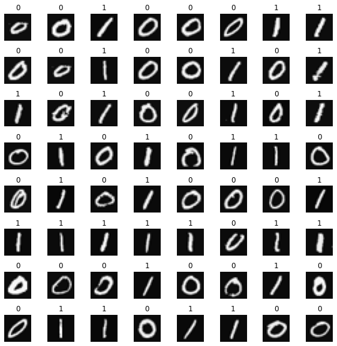

<a name="2.3"></a>
### 2.3 模型表示

本任务使用下图所示的三层神经网络。
- 三个 Dense 层均使用 sigmoid 激活。
    - 输入是数字图像的像素值。
    - 图像大小为 $20\times20$，因此输入层有 400 个特征。
    
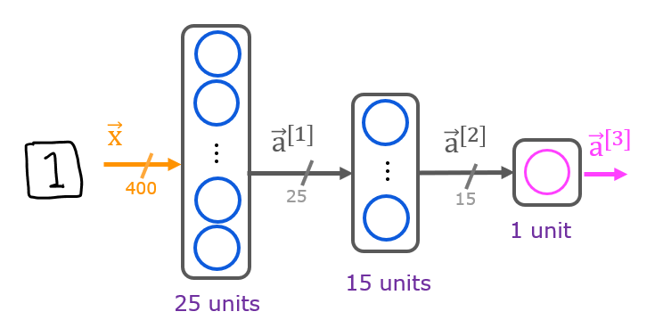

- 网络第 1 层有 25 个单元，第 2 层有 15 个单元，第 3 层有 1 个输出单元。

    - 回顾这些参数的维度确定如下：
        - 若当前层输入维度为 $s_{in}$、输出单元数为 $s_{out}$，则：
            - $W$ 的形状为 $(s_{in},s_{out})$；
            - $b$ 是包含 $s_{out}$ 个元素的向量。
  
    - 因此，各层参数的形状为：
        - 第 1 层：`W1.shape=(400,25)`，`b1.shape=(25,)`；
        - 第 2 层：`W2.shape=(25,15)`，`b2.shape=(15,)`；
        - 第 3 层：`W3.shape=(15,1)`，`b3.shape=(1,)`。
> **说明：**偏置（bias）向量 `b` 可以表示为一维数组 `(n,)` 或二维数组 `(1,n)`。TensorFlow 使用一维表示，本实验也沿用这一惯例。

<a name="2.4"></a>
### 2.4 TensorFlow 模型实现

TensorFlow 模型按层构建。指定每层的输出单元数后，TensorFlow 会据此推断下一层的输入维度；第一层的输入维度由输入数据形状决定。随后可调用 `model.fit` 训练模型。
>**说明：**还可以添加一个输入层，指定第一层的输入维度。例如：
`tf.keras.Input(shape=(400,)),    #specify input shape`  
本实验显式写出输入层，以便 `model.summary()` 在训练前显示各层参数形状。

<a name="ex01"></a>
### 练习 1

下面使用 Keras 的 [Sequential 模型](https://keras.io/guides/sequential_model/)和 [Dense 层](https://keras.io/api/layers/core_layers/dense/)，并采用 sigmoid 激活函数构建上述网络。

```python
# UNQ_C1
# GRADED CELL: Sequential model

model = Sequential(
    [               
        tf.keras.Input(shape=(400,)),    #specify input size
        ### START CODE HERE ### 
        Dense(25, activation='sigmoid'),
        Dense(15, activation='sigmoid'),
        Dense(1, activation='sigmoid')
        
        
        ### END CODE HERE ### 
    ], name = "my_model" 
)
```

```python
model.summary()
```

```text
Model: "my_model"
_________________________________________________________________
 Layer (type)                Output Shape              Param #   
=================================================================
 dense (Dense)               (None, 25)                10025     
                                                                 
 dense_1 (Dense)             (None, 15)                390       
                                                                 
 dense_2 (Dense)             (None, 1)                 16        
                                                                 
=================================================================
Total params: 10,431
Trainable params: 10,431
Non-trainable params: 0
_________________________________________________________________
```

<details>
  <summary><font size="3" color="darkgreen"><b>预期输出（点击展开）</b></font></summary>
`model.summary()` 显示模型摘要。由于已经指定输入维度，模型能够确定权重矩阵和偏置向量的形状，并列出每层的参数数量。注意，各层的名称可能因自动生成而异。
    
    
```
Model: "my_model"
_________________________________________________________________
Layer (type)                 Output Shape              Param #   
=================================================================
dense (Dense)                (None, 25)                10025     
_________________________________________________________________
dense_1 (Dense)              (None, 15)                390       
_________________________________________________________________
dense_2 (Dense)              (None, 1)                 16        
=================================================================
Total params: 10,431
Trainable params: 10,431
Non-trainable params: 0
_________________________________________________________________
```

<details>
  <summary><font size="3" color="darkgreen"><b>点击查看提示</b></font></summary>
如讲座所述：
    
```Python
model = Sequential(                      
    [                                   
        tf.keras.Input(shape=(400,)),    # specify input size (optional)
        Dense(25, activation='sigmoid'), 
        Dense(15, activation='sigmoid'), 
        Dense(1,  activation='sigmoid')  
    ], name = "my_model"                                    
)                                       
```

```python
# UNIT TESTS
from public_tests import *

test_c1(model)
```

```text
All tests passed!
```

摘要中显示的参数数与权重和偏差数组如下所示。

```python
L1_num_params = 400 * 25 + 25  # W1 parameters  + b1 parameters
L2_num_params = 25 * 15 + 15   # W2 parameters  + b2 parameters
L3_num_params = 15 * 1 + 1     # W3 parameters  + b3 parameters
print("L1 params = ", L1_num_params, ", L2 params = ", L2_num_params, ",  L3 params = ", L3_num_params )
```

```text
L1 params =  10025 , L2 params =  390 ,  L3 params =  16
```

可以先从 `model.layers` 取得各层，再调用 `layer.get_weights()` 读取参数。

```python
[layer1, layer2, layer3] = model.layers
```

```python
#### Examine Weights shapes
W1,b1 = layer1.get_weights()
W2,b2 = layer2.get_weights()
W3,b3 = layer3.get_weights()
print(f"W1 shape = {W1.shape}, b1 shape = {b1.shape}")
print(f"W2 shape = {W2.shape}, b2 shape = {b2.shape}")
print(f"W3 shape = {W3.shape}, b3 shape = {b3.shape}")
```

```text
W1 shape = (400, 25), b1 shape = (25,)
W2 shape = (25, 15), b2 shape = (15,)
W3 shape = (15, 1), b3 shape = (1,)
```

**预期输出**
```
W1 shape = (400, 25), b1 shape = (25,)  
W2 shape = (25, 15), b2 shape = (15,)  
W3 shape = (15, 1), b3 shape = (1,)
```

`layer.get_weights()` 返回 NumPy 数组。注意 TensorFlow 的权重矩阵形状与本课程采用的表示一致；尤其要检查最后一层的维度。

```python
print(model.layers[2].weights)
```

```text
[<tf.Variable 'dense_2/kernel:0' shape=(15, 1) dtype=float32, numpy=
array([[-0.5644558 ],
       [-0.27069062],
       [ 0.11375725],
       [ 0.53701717],
       [ 0.20241183],
       [-0.34064347],
       [-0.39028352],
       [-0.30435932],
       [-0.37333733],
       [ 0.24264717],
       [ 0.51471275],
       [ 0.09083158],
       [ 0.14792585],
       [ 0.4660167 ],
       [-0.36388654]], dtype=float32)>, <tf.Variable 'dense_2/bias:0' shape=(1,) dtype=float32, numpy=array([0.], dtype=float32)>]
```

下面定义损失函数并运行梯度下降，使模型权重拟合训练数据。下一周将更详细介绍训练过程。

```python
model.compile(
    loss=tf.keras.losses.BinaryCrossentropy(),
    optimizer=tf.keras.optimizers.Adam(0.001),
)

model.fit(
    X,y,
    epochs=20
)
```

```text
（训练日志已省略。运行上方代码单元格可查看每个 epoch 的完整输出。）
```

```text
<keras.callbacks.History at 0x765aa86eeb10>
```

使用 Keras 的 [`predict`] 方法让模型进行预测。(https://www.tensorflow.org/api_docs/python/tf/keras/Model)`predict` 接收批量二维数组，因此单个样本也要重塑为二维。

```python
prediction = model.predict(X[0].reshape(1,400))  # a zero
print(f" predicting a zero: {prediction}")
prediction = model.predict(X[500].reshape(1,400))  # a one
print(f" predicting a one:  {prediction}")
```

```text
 predicting a zero: [[0.01525223]]
 predicting a one:  [[0.98594093]]
```

模型输出可解释为样本属于数字 1 的概率。第一个样本是 0，模型给出的概率接近 0；
第二个样本是 1，模型给出的概率接近 1。
与逻辑回归相同，把概率与阈值比较即可得到最终类别。

```python
if prediction >= 0.5:
    yhat = 1
else:
    yhat = 0
print(f"prediction after threshold: {yhat}")
```

```text
prediction after threshold: 1
```

下面随机抽取 64 个数字，比较模型预测与真实标签。该单元格需要一点运行时间。

```python
import warnings
warnings.simplefilter(action='ignore', category=FutureWarning)
# You do not need to modify anything in this cell

m, n = X.shape

fig, axes = plt.subplots(8,8, figsize=(8,8))
fig.tight_layout(pad=0.1,rect=[0, 0.03, 1, 0.92]) #[left, bottom, right, top]

for i,ax in enumerate(axes.flat):
    # Select random indices
    random_index = np.random.randint(m)
    
    # Select rows corresponding to the random indices and
    # reshape the image
    X_random_reshaped = X[random_index].reshape((20,20)).T
    
    # Display the image
    ax.imshow(X_random_reshaped, cmap='gray')
    
    # Predict using the Neural Network
    prediction = model.predict(X[random_index].reshape(1,400))
    if prediction >= 0.5:
        yhat = 1
    else:
        yhat = 0
    
    # Display the label above the image
    ax.set_title(f"{y[random_index,0]},{yhat}")
    ax.set_axis_off()
fig.suptitle("Label, yhat", fontsize=16)
plt.show()
```

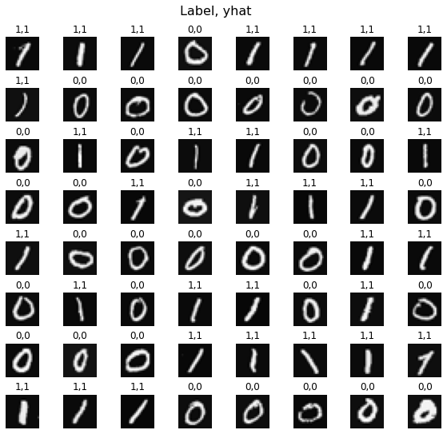

<a name="2.5"></a>
### 2.5 NumPy 模型实现（前向传播）
如讲座所示，也可以仅使用 NumPy 实现多层神经网络的前向传播。 

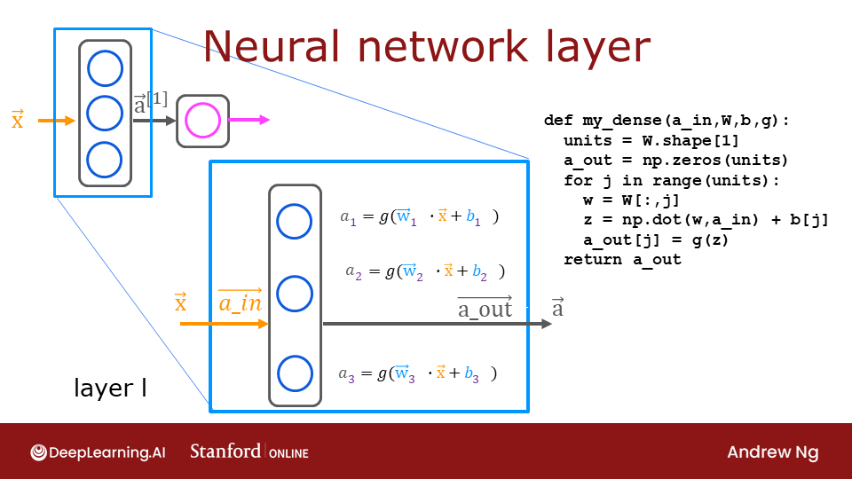

<a name="ex02"></a>
### 练习 2

下面实现一个 Dense 层。按照讲座中的非向量化形式，循环遍历每个单元 `j`，计算输入与该单元权重 `W[:,j]` 的点积，再加偏置 `b[j]` 得到 `z`，最后应用激活函数 `g(z)`。矩阵化实现将在后面的可选部分介绍。

```python
# UNQ_C2
# GRADED FUNCTION: my_dense

def my_dense(a_in, W, b, g):
    """
    Computes dense layer
    Args:
      a_in (ndarray (n, )) : Data, 1 example 
      W    (ndarray (n,j)) : Weight matrix, n features per unit, j units
      b    (ndarray (j, )) : bias vector, j units  
      g    activation function (e.g. sigmoid, relu..)
    Returns
      a_out (ndarray (j,))  : j units
    """
    units = W.shape[1]
    a_out = np.zeros(units)
### START CODE HERE ### 
    for j in range(units):
        z = np.dot(W[:,j], a_in) + b[j]
        a_out[j] = g(z)
        
        
### END CODE HERE ### 
    return(a_out)
```

```python
# Quick Check
x_tst = 0.1*np.arange(1,3,1).reshape(2,)  # (1 examples, 2 features)
W_tst = 0.1*np.arange(1,7,1).reshape(2,3) # (2 input features, 3 output features)
b_tst = 0.1*np.arange(1,4,1).reshape(3,)  # (3 features)
A_tst = my_dense(x_tst, W_tst, b_tst, sigmoid)
print(A_tst)
```

```text
[0.54735762 0.57932425 0.61063923]
```

**预期输出**
```
[0.54735762 0.57932425 0.61063923]
```

<details>
  <summary><font size="3" color="darkgreen"><b>点击查看提示</b></font></summary>
如讲座所述：
    
```Python
def my_dense(a_in, W, b, g):
    """
    Computes dense layer
    Args:
      a_in (ndarray (n, )) : Data, 1 example 
      W    (ndarray (n,j)) : Weight matrix, n features per unit, j units
      b    (ndarray (j, )) : bias vector, j units  
      g    activation function (e.g. sigmoid, relu..)
    Returns
      a_out (ndarray (j,))  : j units
    """
    units = W.shape[1]
    a_out = np.zeros(units)
    for j in range(units):             
        w =                            # Select weights for unit j. These are in column j of W
        z =                            # dot product of w and a_in + b
        a_out[j] =                     # apply activation to z
    return(a_out)
```
   
    
<details>
  <summary><font size="3" color="darkgreen"><b>点击查看更多提示</b></font></summary>

    
```Python
def my_dense(a_in, W, b, g):
    """
    Computes dense layer
    Args:
      a_in (ndarray (n, )) : Data, 1 example 
      W    (ndarray (n,j)) : Weight matrix, n features per unit, j units
      b    (ndarray (j, )) : bias vector, j units  
      g    activation function (e.g. sigmoid, relu..)
    Returns
      a_out (ndarray (j,))  : j units
    """
    units = W.shape[1]
    a_out = np.zeros(units)
    for j in range(units):             
        w = W[:,j]                     
        z = np.dot(w, a_in) + b[j]     
        a_out[j] = g(z)                
    return(a_out)
```

```python
# UNIT TESTS

test_c2(my_dense)
```

```text
All tests passed!
```

下面使用刚实现的 `my_dense` 构建三层神经网络。

```python
def my_sequential(x, W1, b1, W2, b2, W3, b3):
    a1 = my_dense(x,  W1, b1, sigmoid)
    a2 = my_dense(a1, W2, b2, sigmoid)
    a3 = my_dense(a2, W3, b3, sigmoid)
    return(a3)
```

可以从已训练的 TensorFlow 模型中复制权重和偏置。

```python
W1_tmp,b1_tmp = layer1.get_weights()
W2_tmp,b2_tmp = layer2.get_weights()
W3_tmp,b3_tmp = layer3.get_weights()
```

```python
# make predictions
prediction = my_sequential(X[0], W1_tmp, b1_tmp, W2_tmp, b2_tmp, W3_tmp, b3_tmp )
if prediction >= 0.5:
    yhat = 1
else:
    yhat = 0
print( "yhat = ", yhat, " label= ", y[0,0])
prediction = my_sequential(X[500], W1_tmp, b1_tmp, W2_tmp, b2_tmp, W3_tmp, b3_tmp )
if prediction >= 0.5:
    yhat = 1
else:
    yhat = 0
print( "yhat = ", yhat, " label= ", y[500,0])
```

```text
yhat =  0  label=  0
yhat =  1  label=  1
```

运行下面的单元格，比较 NumPy 模型与 TensorFlow 模型的预测结果。该单元格可能需要约一分钟。

```python
import warnings
warnings.simplefilter(action='ignore', category=FutureWarning)
# You do not need to modify anything in this cell

m, n = X.shape

fig, axes = plt.subplots(8,8, figsize=(8,8))
fig.tight_layout(pad=0.1,rect=[0, 0.03, 1, 0.92]) #[left, bottom, right, top]

for i,ax in enumerate(axes.flat):
    # Select random indices
    random_index = np.random.randint(m)
    
    # Select rows corresponding to the random indices and
    # reshape the image
    X_random_reshaped = X[random_index].reshape((20,20)).T
    
    # Display the image
    ax.imshow(X_random_reshaped, cmap='gray')

    # Predict using the Neural Network implemented in Numpy
    my_prediction = my_sequential(X[random_index], W1_tmp, b1_tmp, W2_tmp, b2_tmp, W3_tmp, b3_tmp )
    my_yhat = int(my_prediction >= 0.5)

    # Predict using the Neural Network implemented in Tensorflow
    tf_prediction = model.predict(X[random_index].reshape(1,400))
    tf_yhat = int(tf_prediction >= 0.5)
    
    # Display the label above the image
    ax.set_title(f"{y[random_index,0]},{tf_yhat},{my_yhat}")
    ax.set_axis_off() 
fig.suptitle("Label, yhat Tensorflow, yhat Numpy", fontsize=16)
plt.show()
```

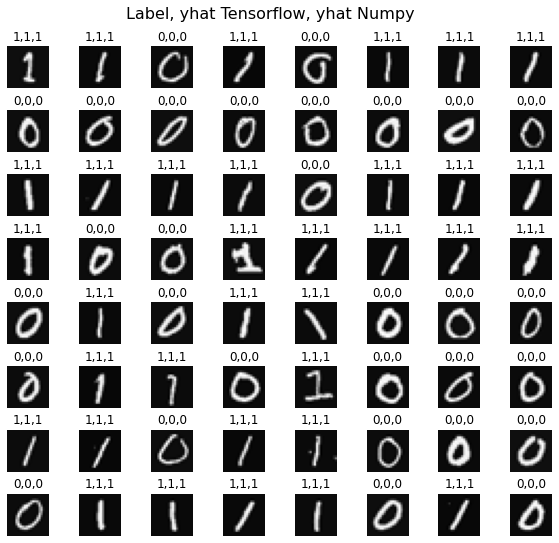

<a name="2.6"></a>
### 2.6 向量化 NumPy 模型实现（可选）
可选讲座介绍了利用向量和矩阵运算加速计算的方法。
下面用一次矩阵运算计算给定样本在某一层所有单元的输出：

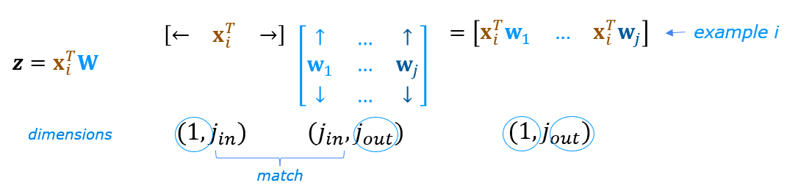

下面用 `X`、`W1` 和 `b1` 演示 `np.matmul`。注意，`X` 与 `W1` 的维度必须兼容，如上图所示。

```python
x = X[0].reshape(-1,1)         # column vector (400,1)
z1 = np.matmul(x.T,W1) + b1    # (1,400)(400,25) = (1,25)
a1 = sigmoid(z1)
print(a1.shape)
```

```text
(1, 25)
```

还可以进一步在一次矩阵运算中同时计算所有样本、所有单元的输出。

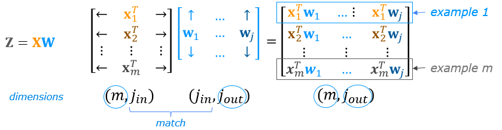
完整运算为 $\mathbf{Z}=\mathbf{XW}+\mathbf{b}$。NumPy 会通过广播把 $\mathbf{b}$ 扩展到 $m$ 行；Notebook 末尾提供了简短的广播教程。

<a name="ex03"></a>
### 练习 3

下面实现向量化函数 `my_dense_v`，使用 `np.matmul()` 一次处理整个样本矩阵。

_**说明：**该函数不计分，因为向量化（vectorization）在可选讲座中介绍。如果没有学习该讲座，可以展开提示查看参考代码。你也可以提交笔记本，即使此处留空也可以提交 Notebook。_

```python
# UNQ_C3
# UNGRADED FUNCTION: my_dense_v

def my_dense_v(A_in, W, b, g):
    """
    Computes dense layer
    Args:
      A_in (ndarray (m,n)) : Data, m examples, n features each
      W    (ndarray (n,j)) : Weight matrix, n features per unit, j units
      b    (ndarray (1,j)) : bias vector, j units  
      g    activation function (e.g. sigmoid, relu..)
    Returns
      A_out (tf.Tensor or ndarray (m,j)) : m examples, j units
    """
### START CODE HERE ### 
    z = np.matmul(A_in, W) + b
    A_out = g(z)
    
### END CODE HERE ### 
    return(A_out)
```

```python
X_tst = 0.1*np.arange(1,9,1).reshape(4,2) # (4 examples, 2 features)
W_tst = 0.1*np.arange(1,7,1).reshape(2,3) # (2 input features, 3 output features)
b_tst = 0.1*np.arange(1,4,1).reshape(1,3) # (1,3 features)
A_tst = my_dense_v(X_tst, W_tst, b_tst, sigmoid)
print(A_tst)
```

```text
[[0.54735762 0.57932425 0.61063923]
 [0.57199613 0.61301418 0.65248946]
 [0.5962827  0.64565631 0.6921095 ]
 [0.62010643 0.67699586 0.72908792]]
```

**预期输出**

```
[[0.54735762 0.57932425 0.61063923]
 [0.57199613 0.61301418 0.65248946]
 [0.5962827  0.64565631 0.6921095 ]
 [0.62010643 0.67699586 0.72908792]]
 ```

<details>
  <summary><font size="3" color="darkgreen"><b>点击查看提示</b></font></summary>
在矩阵形式中，这可以写成一行或两行。
    
`Z = np.matmul(A_in, W) + b`
`A_out = g(Z)`
<details>
  <summary><font size="3" color="darkgreen"><b>点击代码</b></font></summary>

```Python
def my_dense_v(A_in, W, b, g):
    """
    Computes dense layer
    Args:
      A_in (ndarray (m,n)) : Data, m examples, n features each
      W    (ndarray (n,j)) : Weight matrix, n features per unit, j units
      b    (ndarray (j,1)) : bias vector, j units  
      g    activation function (e.g. sigmoid, relu..)
    Returns
      A_out (ndarray (m,j)) : m examples, j units
    """
    Z = np.matmul(A_in,W) + b    
    A_out = g(Z)                 
    return(A_out)
```

```python
# UNIT TESTS

test_c3(my_dense_v)
```

```text
All tests passed!
```

下面使用刚实现的 `my_dense_v` 构建三层神经网络。

```python
def my_sequential_v(X, W1, b1, W2, b2, W3, b3):
    A1 = my_dense_v(X,  W1, b1, sigmoid)
    A2 = my_dense_v(A1, W2, b2, sigmoid)
    A3 = my_dense_v(A2, W3, b3, sigmoid)
    return(A3)
```

再次从已训练的 TensorFlow 模型复制权重和偏置。

```python
W1_tmp,b1_tmp = layer1.get_weights()
W2_tmp,b2_tmp = layer2.get_weights()
W3_tmp,b3_tmp = layer3.get_weights()
```

下面用新模型一次性预测所有样本，并检查输出数组的形状。

```python
Prediction = my_sequential_v(X, W1_tmp, b1_tmp, W2_tmp, b2_tmp, W3_tmp, b3_tmp )
Prediction.shape
```

```text
(1000, 1)
```

与前面相同，对所有预测统一应用 0.5 阈值。

```python
Yhat = (Prediction >= 0.5).astype(int)
print("predict a zero: ",Yhat[0], "predict a one: ", Yhat[500])
```

```text
predict a zero:  [0] predict a one:  [1]
```

运行下面的单元格，使用刚计算的预测结果；该单元格只需片刻即可完成。

```python
import warnings
warnings.simplefilter(action='ignore', category=FutureWarning)
# You do not need to modify anything in this cell

m, n = X.shape

fig, axes = plt.subplots(8, 8, figsize=(8, 8))
fig.tight_layout(pad=0.1, rect=[0, 0.03, 1, 0.92]) #[left, bottom, right, top]

for i, ax in enumerate(axes.flat):
    # Select random indices
    random_index = np.random.randint(m)
    
    # Select rows corresponding to the random indices and
    # reshape the image
    X_random_reshaped = X[random_index].reshape((20, 20)).T
    
    # Display the image
    ax.imshow(X_random_reshaped, cmap='gray')
   
    # Display the label above the image
    ax.set_title(f"{y[random_index,0]}, {Yhat[random_index, 0]}")
    ax.set_axis_off() 
fig.suptitle("Label, Yhat", fontsize=16)
plt.show()
```

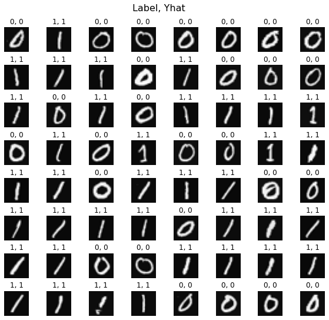

下面查看部分误分类图像。

```python
fig = plt.figure(figsize=(1, 1))
errors = np.where(y != Yhat)
random_index = errors[0][0]
X_random_reshaped = X[random_index].reshape((20, 20)).T
plt.imshow(X_random_reshaped, cmap='gray')
plt.title(f"{y[random_index,0]}, {Yhat[random_index, 0]}")
plt.axis('off')
plt.show()
```

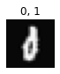

<a name="2.7"></a>
### 2.7 恭喜完成！
你已经成功构建并使用了一个神经网络。

<a name="2.8"></a>
### 2.8 NumPy 广播教程（可选）

在最后一个例子中，$\mathbf{Z}=\mathbf{XW}+\mathbf{b}$ 使用 NumPy 广播扩展向量 $\mathbf{b}$。如果不熟悉 NumPy 广播，下面给出一个简短教程。

$\mathbf{XW}$是带有维度的矩阵组合操作$(m,j_1)(j_1,j_2)$形成一个带有维度的矩阵$(m,j_2)$。为此，我们添加一个向量$\mathbf{b}$带有维度$(1,j_2)$.  $\mathbf{b}$必须扩大为$(m,j_2)$此元素操作的矩阵具有意义。 此扩展由NumPy广播。

广播适用于元素级操作。
它的基本操作是通过复制元素来匹配更大的维度来"拉伸"一个较小的维度。

更具体的规则见 [NumPy 广播文档](https://NumPy.org/doc/stable/user/basics.broadcasting.html)： 
对两个数组执行运算时，NumPy 从最右侧维度开始逐维比较形状；对应维度相等，或其中一个维度为 1 时，两个维度可以广播。
- 两个维度相等；或
- 其中一个维度为 1。

如果形状不满足广播规则，NumPy 会抛出 `ValueError`，提示数组无法一起广播。输出数组在每个轴上的大小取各输入对应轴中非 1 的大小。

以下是一些例子：

<figure>
    <center> 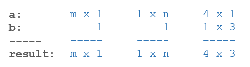<center/>
    <figcaption>计算广播后的结果形状</figcaption>
<figure/>

下面的图形描述了扩展的维度。

<figure>
    <center> 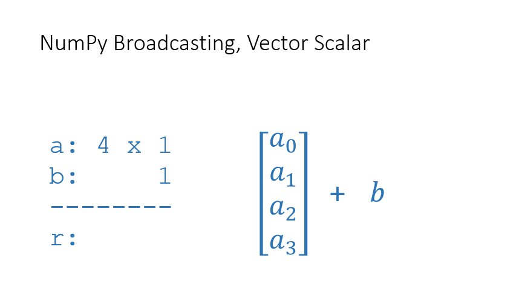<center/>
    <figcaption>概念上扩展数组，使形状满足逐元素运算要求</figcaption>
<figure/>

上图从概念上展示了 NumPy 如何扩展数组以匹配形状。实际实现会选择更高效的方式，并不会真的复制所有数据。

对于以下每个示例，在运行示例之前，尝试猜测结果的大小。

```python
a = np.array([1,2,3]).reshape(-1,1)  #(3,1)
b = 5
print(f"(a + b).shape: {(a + b).shape}, \na + b = \n{a + b}")
```

```text
(a + b).shape: (3, 1), 
a + b = 
[[6]
 [7]
 [8]]
```

注意这适用于所有元素操作：

```python
a = np.array([1,2,3]).reshape(-1,1)  #(3,1)
b = 5
print(f"(a * b).shape: {(a * b).shape}, \na * b = \n{a * b}")
```

```text
(a * b).shape: (3, 1), 
a * b = 
[[ 5]
 [10]
 [15]]
```

<figure>
    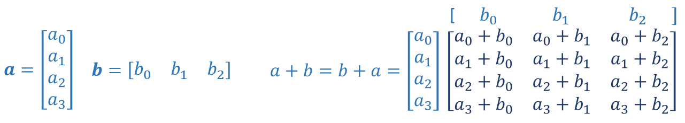
    <center><figcaption><b>行向量与列向量的逐元素运算</b></figcaption></center>
<figure/>

```python
a = np.array([1,2,3,4]).reshape(-1,1)
b = np.array([1,2,3]).reshape(1,-1)
print(a)
print(b)
print(f"(a + b).shape: {(a + b).shape}, \na + b = \n{a + b}")
```

```text
[[1]
 [2]
 [3]
 [4]]
[[1 2 3]]
(a + b).shape: (4, 3), 
a + b = 
[[2 3 4]
 [3 4 5]
 [4 5 6]
 [5 6 7]]
```

这正是前面 Dense 层使用的情形：把一维偏置向量 $b$ 加到形状为 $(m,j)$ 的矩阵上。
<figure>
    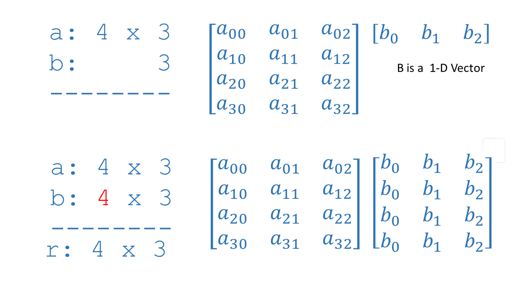
    <center><figcaption><b>矩阵+1-D向量</b></figcaption></center>
<figure/>

<details>
  <summary><font size="2" color="darkgreen"><b>如果已经通过作业并希望尝试额外代码，可展开这里的说明。</b></font></summary>
    <p><i><b>请仅在作业通过后修改单元格属性，以免影响自动评分。</b></i>
    <ol>
        <li>在 Notebook 菜单中选择 `View` > `Cell Toolbar` > `Edit Metadata`。</li>
        <li>在需要锁定或解锁的代码单元格上点击 `Edit Metadata`。</li>
        <li>将 `editable` 属性设为：
            <ul>
                <li>要解锁，设为 `true`；</li>
                <li>要锁定，设为 `false`。</li>
            </ul>
        </li>
        <li>完成后选择 `View` > `Cell Toolbar` > `None` 隐藏元数据工具栏。</li>
    </ol>
    <p>下面的演示展示了完整操作：
        <br>
        <span>按上述步骤即可解锁单元格。</span>
</details>
