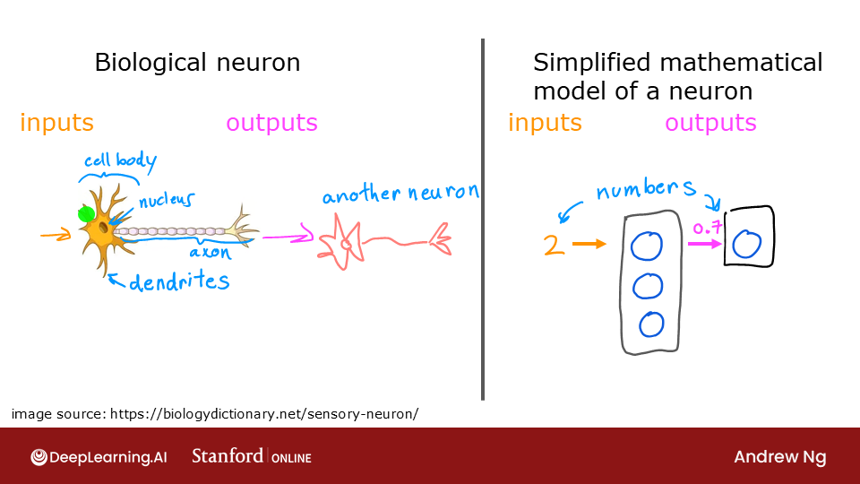
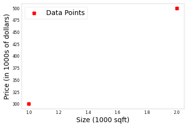
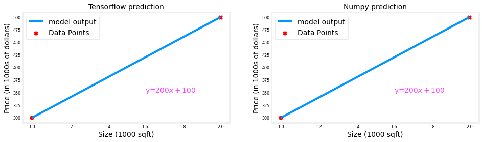
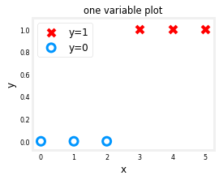
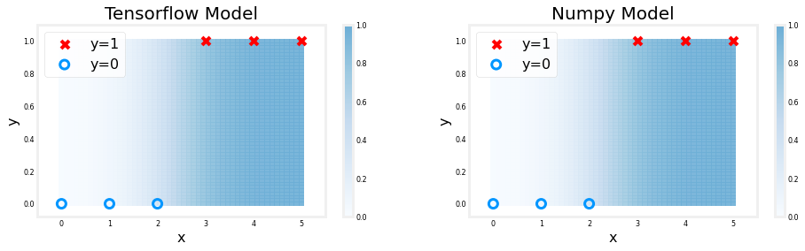

<!-- 本文件由课程原始 Notebook 转换并翻译。代码与公式保留原样。 -->
<!-- 原文件：2. Advanced Learning Algorithms/week 1/C2_W1_Lab01_Neurons_and_Layers.ipynb -->

# 可选实验 - Neurons and Layers（Optional Lab - Neurons and Layers）
本实验将探索神经元（单元）和网络层的内部工作方式，并把 TensorFlow 实现与课程 1 中的线性回归和逻辑回归模型对应起来。
<figure>
   
</figure>

## 软件包
* *TensorFlow和Keras**  
TensorFlow是一个机器学习（machine learning）由Google开发的软件包. 2019年，Google集成Keras输入TensorFlow释放TensorFlow 2.0. Keras是由 François Chollet 独立开发的框架，它创建了一个简单的、以层为中心的界面，用于TensorFlow。本课程将使用Keras接口。

```python
# Importing libraries
import numpy as np
import matplotlib.pyplot as plt
import tensorflow as tf
from tensorflow.keras.layers import Dense, Input
from tensorflow.keras import Sequential
from tensorflow.keras.losses import MeanSquaredError, BinaryCrossentropy
from tensorflow.keras.activations import sigmoid
from lab_utils_common import dlc
from lab_neurons_utils import plt_prob_1d, sigmoidnp, plt_linear, plt_logistic
plt.style.use('./deeplearning.mplstyle')
import logging
logging.getLogger("tensorflow").setLevel(logging.ERROR)
tf.autograph.set_verbosity(0)
```

## 无激活函数的神经元：回归/线性模型

### 数据集
我们用第一课的一个例子线性回归（linear regression）关于房价。

```python
X_train = np.array([[1.0], [2.0]], dtype=np.float32)           #(size in 1000 square feet)
Y_train = np.array([[300.0], [500.0]], dtype=np.float32)       #(price in 1000s of dollars)

fig, ax = plt.subplots(1,1)
ax.scatter(X_train, Y_train, marker='x', c='r', label="Data Points")
ax.legend( fontsize='xx-large')
ax.set_ylabel('Price (in 1000s of dollars)', fontsize='xx-large')
ax.set_xlabel('Size (1000 sqft)', fontsize='xx-large')
plt.show()
```



### 回归/线性模型
神经元执行的功能没有激活，与第1课相同.线性回归：
$$
f_{\mathbf{w},b}(x^{(i)}) = \mathbf{w}\cdot x^{(i)} + b \tag{1}
$$

先用单个神经元定义一层，并把它与熟悉的线性回归函数进行比较。

```python
linear_layer = tf.keras.layers.Dense(units=1, activation = 'linear', )
```

检其重。

```python
linear_layer.get_weights()
```

```text
[]
```

此时还没有权重，因为该层尚未构建。把 `X_train` 传入该层会触发权重初始化。层的输入必须是二维数组，因此需要先调整数据形状。

```python
a1 = linear_layer(X_train[0].reshape(1,1))
print(a1)
```

```text
tf.Tensor([[-0.09]], shape=(1, 1), dtype=float32)
```

结果是一个变位器(一个数组的另一个名称)，形状为(1,1)或一个条目。
下面查看权重和偏置（bias）。权重会随机初始化为较小的数，偏置默认初始化为 0。

```python
w, b= linear_layer.get_weights()
print(f"w = {w}, b={b}")
```

```text
w = [[-0.09]], b=[0.]
```

单输入特征的线性回归模型只有一个权重和一个偏置，这与上面 `linear_layer` 的维度一致。

权重已经随机初始化；下面把它们改为一组已知值。

```python
set_w = np.array([[200]])
set_b = np.array([100])

# set_weights takes a list of numpy arrays
linear_layer.set_weights([set_w, set_b])
print(linear_layer.get_weights())
```

```text
[array([[200.]], dtype=float32), array([100.], dtype=float32)]
```

比较等式(1)与层输出。

```python
a1 = linear_layer(X_train[0].reshape(1,1))
print(a1)
alin = np.dot(set_w,X_train[0].reshape(1,1)) + set_b
print(alin)
```

```text
tf.Tensor([[300.]], shape=(1, 1), dtype=float32)
[[300.]]
```

他们产生相同的价值!
现在可以用这个线性层对训练数据进行预测。

```python
prediction_tf = linear_layer(X_train)
prediction_np = np.dot( X_train, set_w) + set_b
```

```python
plt_linear(X_train, Y_train, prediction_tf, prediction_np)
```



## 使用 sigmoid 激活函数的神经元
带 sigmoid 激活函数的神经元（或单元）实现的功能，与课程 1 中的逻辑回归相同：
$$
f_{\mathbf{w},b}(x^{(i)}) = g(\mathbf{w}x^{(i)} + b) \tag{2}
$$
其中

$$
g(x) = sigmoid(x)
$$

开始吧$w$和$b$并检查模型。

### 数据集
我们用第一课的一个例子逻辑回归（logistic regression）.

```python
X_train = np.array([0., 1, 2, 3, 4, 5], dtype=np.float32).reshape(-1,1)  # 2-D Matrix
Y_train = np.array([0,  0, 0, 1, 1, 1], dtype=np.float32).reshape(-1,1)  # 2-D Matrix
```

```python
X_train
```

```text
array([[0.],
       [1.],
       [2.],
       [3.],
       [4.],
       [5.]], dtype=float32)
```

```python
pos = Y_train == 1
neg = Y_train == 0

fig,ax = plt.subplots(1,1,figsize=(4,3))
ax.scatter(X_train[pos], Y_train[pos], marker='x', s=80, c = 'red', label="y=1")
ax.scatter(X_train[neg], Y_train[neg], marker='o', s=100, label="y=0", facecolors='none', 
              edgecolors=dlc["dlblue"],lw=3)

ax.set_ylim(-0.08,1.1)
ax.set_ylabel('y', fontsize=12)
ax.set_xlabel('x', fontsize=12)
ax.set_title('one variable plot')
ax.legend(fontsize=12)
plt.show()
```



### 逻辑神经元
给神经元加入 sigmoid 激活即可实现“逻辑神经元”，其函数如上面的式 (2) 所示。
本节将创建一个TensorFlow包含我们逻辑回归层的模型 来展示另一种创建模型的方法TensorFlow用于创建多层模型。[Sequential](https://keras.io/guides/sequential_model/)模型是构建这些模型的方便手段。

```python
# Creating the sequential model
model = Sequential(
    [
        tf.keras.layers.Dense(1, input_dim=1,  activation = 'sigmoid', name='L1')
    ]
)
```

`model.summary()` 显示模型的层和参数数量。该模型只有一个含单个神经元的层，因此共有两个参数：$w$ 和 $b$。

```python
# Display layers and number parameters in the model
model.summary()
```

```text
Model: "sequential"
_________________________________________________________________
 Layer (type)                Output Shape              Param #   
=================================================================
 L1 (Dense)                  (None, 1)                 2         
                                                                 
=================================================================
Total params: 2
Trainable params: 2
Non-trainable params: 0
_________________________________________________________________
```

```python
logistic_layer = model.get_layer('L1')
w,b = logistic_layer.get_weights()
print(w,b)
print(w.shape,b.shape)
```

```text
[[-1.08]] [0.]
(1, 1) (1,)
```

下面把权重和偏置设置为一组已知值。

```python
set_w = np.array([[2]])
set_b = np.array([-4.5])
# set_weights takes a list of numpy arrays
logistic_layer.set_weights([set_w, set_b])
print(logistic_layer.get_weights())
```

```text
[array([[2.]], dtype=float32), array([-4.5], dtype=float32)]
```

比较等式(2)与层输出。

```python
a1 = model.predict(X_train[0].reshape(1,1))
print(a1)
alog = sigmoidnp(np.dot(set_w,X_train[0].reshape(1,1)) + set_b)
print(alog)
```

```text
[[0.01]]
[[0.01]]
```

他们产生相同的价值!
现在分别使用逻辑回归层和 NumPy 实现，对训练数据进行预测。

```python
plt_logistic(X_train, Y_train, model, set_w, set_b, pos, neg)
```



上面的阴影反映了sigmoid从0到1不等。

# 恭喜完成！
你已经构建了一个简单的神经网络，并比较了神经元与课程 1 中线性回归、逻辑回归模型之间的对应关系。

```python

```

```python

```
