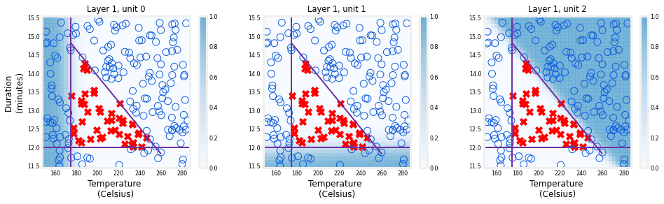
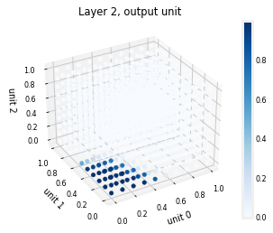
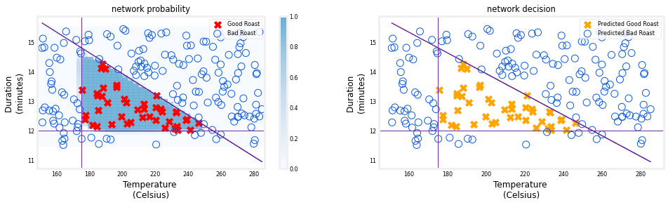

<!-- 本文件由课程原始 Notebook 转换并翻译。代码与公式保留原样。 -->
<!-- 原文件：2. Advanced Learning Algorithms/week 1/C2_W1_Lab02_CoffeeRoasting_TF.ipynb -->

# 可选实验 - Simple 神经网络（Optional Lab - Simple Neural Network）
本实验使用 TensorFlow 构建一个小型神经网络。
   <center>    <center/>

```python
# Importing libraries
import numpy as np
import matplotlib.pyplot as plt
plt.style.use('./deeplearning.mplstyle')
import tensorflow as tf
from tensorflow.keras.models import Sequential
from tensorflow.keras.layers import Dense
from lab_utils_common import dlc
from lab_coffee_utils import load_coffee_data, plt_roast, plt_prob, plt_layer, plt_network, plt_output_unit
import logging
logging.getLogger("tensorflow").setLevel(logging.ERROR)
tf.autograph.set_verbosity(0)
```

## 数据集

```python
# Loading dataset
X,Y = load_coffee_data();
print(X.shape, Y.shape)
```

```text
(200, 2) (200, 1)
```

下面绘制咖啡烘焙数据。输入特征（feature）是温度（摄氏度）和持续时间（分钟）。通常温度越高，合适的烘焙时间越短。可参考 [Coffee Roasting at Home](https://www.merchantsofgreencoffee.com/how-to-roast-green-coffee-in-your-oven/)。

```python
# Visualizing the data
plt_roast(X,Y)
```


### 数据归一化
如果数据实现归一化，将更快地将权重与数据相匹配(背向传播，下星期的讲座涵盖)。特征在数据中，每个数据都归一化，以达到类似的范围。
以下程序使用aKeras [normalization layer](https://keras.io/api/layers/preprocessing_layers/numerical/normalization/)它有以下步骤：
- 创建“ 规范层 ” 。 注意， 如在此应用， 这不是你模型中的层 。
- "适应"数据，这能学会刻薄和方差（variance），并内部保存值。
- 数据归一化。
重要的是，对今后利用学到的数据实行归一化。

```python
# Simple EDA
print(f"Temperature Max, Min pre normalization: {np.max(X[:,0]):0.2f}, {np.min(X[:,0]):0.2f}")
print(f"Duration    Max, Min pre normalization: {np.max(X[:,1]):0.2f}, {np.min(X[:,1]):0.2f}")
norm_l = tf.keras.layers.Normalization(axis=-1)
norm_l.adapt(X)  # learns mean, variance
Xn = norm_l(X)
print(f"Temperature Max, Min post normalization: {np.max(Xn[:,0]):0.2f}, {np.min(Xn[:,0]):0.2f}")
print(f"Duration    Max, Min post normalization: {np.max(Xn[:,1]):0.2f}, {np.min(Xn[:,1]):0.2f}")
```

```text
Temperature Max, Min pre normalization: 284.99, 151.32
Duration    Max, Min pre normalization: 15.45, 11.51
Temperature Max, Min post normalization: 1.66, -1.69
Duration    Max, Min post normalization: 1.79, -1.70
```

打印/复制我们的数据训练集（training set）大小并减少训练日期。

```python
# Tile to increase the training size & decrease the epoch training
Xt = np.tile(Xn,(1000,1))
Yt= np.tile(Y,(1000,1))   
print(Xt.shape, Yt.shape)
```

```text
(200000, 2) (200000, 1)
```

## TensorFlow 模型

### 模型
   <center>    <center/>  
下面构建讲座中的咖啡烘焙网络。该网络包含两个使用 sigmoid 激活函数的 Dense 层：

```python
# Model building 

tf.random.set_seed(1234)  # applied to achieve consistent results
model = Sequential(
    [
        tf.keras.Input(shape=(2,)), # Optional
        Dense(3, activation='sigmoid', name = 'layer1'), # 3 layers
        Dense(1, activation='sigmoid', name = 'layer2')
     ]
)
```

>**说明1:**`tf.keras.Input(shape=(2,))` 指定输入形状，使 TensorFlow 能立即确定权重和偏置（bias）的维度。实际应用中可省略该声明，TensorFlow 会在 `model.fit` 收到数据时推断输入形状。
>**说明2:**包括sigmoid最后一层的激活不被认为是最佳做法，而是在提高数值稳定性的损失中加以说明。实验。

`model.summary()` 显示网络结构：

```python
model.summary()
```

```text
Model: "sequential"
_________________________________________________________________
 Layer (type)                Output Shape              Param #   
=================================================================
 layer1 (Dense)              (None, 3)                 9         
                                                                 
 layer2 (Dense)              (None, 1)                 4         
                                                                 
=================================================================
Total params: 13
Trainable params: 13
Non-trainable params: 0
_________________________________________________________________
```

摘要中显示的参数数与权重和偏差数组如下所示。

```python
L1_num_params = 2 * 3 + 3   # W1 parameters  + b1 parameters
L2_num_params = 3 * 1 + 1   # W2 parameters  + b2 parameters
print("L1 params = ", L1_num_params, ", L2 params = ", L2_num_params  )
```

```text
L1 params =  9 , L2 params =  4
```

检查 TensorFlow 创建的权重和偏置。$W$ 的形状应为“输入特征数 × 本层单元数”，偏置 $b$ 的长度应等于本层单元数：
- 第一层有3个单元，我们期望W的尺寸为(2,3)和$b$应有3个要素。
- 第二层有1个单元，我们期望W的尺寸是(3,1)和$b$应有1个元素。

```python
W1, b1 = model.get_layer("layer1").get_weights()
W2, b2 = model.get_layer("layer2").get_weights()
print(f"W1{W1.shape}:\n", W1, f"\nb1{b1.shape}:", b1)
print(f"W2{W2.shape}:\n", W2, f"\nb2{b2.shape}:", b2)
```

```text
W1(2, 3):
 [[ 0.08 -0.3   0.18]
 [-0.56 -0.15  0.89]] 
b1(3,): [0. 0. 0.]
W2(3, 1):
 [[-0.43]
 [-0.88]
 [ 0.36]] 
b2(1,): [0.]
```

以下发言将在第2周详细介绍：
- `model.compile` 用于指定损失函数（loss function）和优化器。
- `model.fit` 运行梯度下降（gradient descent），学习能够拟合数据的权重。

```python
model.compile(
    loss = tf.keras.losses.BinaryCrossentropy(),
    optimizer = tf.keras.optimizers.Adam(learning_rate=0.01),
)

model.fit(
    Xt,Yt,            
    epochs=10,
)
```

```text
（训练日志已省略。运行上方代码单元格可查看每个 epoch 的完整输出。）
```

```text
<keras.callbacks.History at 0x7599d83a9750>
```

#### 训练轮次（epoch）与批次（batch）
`fit` 中的 `epochs=10` 表示训练期间完整遍历数据集 10 次。运行时会显示训练进度。
```
Epoch 1/10
6250/6250 [==============================] - 6s 910us/step - loss: 0.1782
```
第一行的 `Epoch 1/10` 表示当前是第 1 个训练轮次。为提高效率，训练集会划分为批次（batch）；进度条显示当前轮次已经处理的批次数。

#### 更新后的权重
拟合完成后，权重已经更新 :

```python
W1, b1 = model.get_layer("layer1").get_weights()
W2, b2 = model.get_layer("layer2").get_weights()
print("W1:\n", W1, "\nb1:", b1)
print("W2:\n", W2, "\nb2:", b2)
```

```text
W1:
 [[ -0.13  14.3  -11.1 ]
 [ -8.92  11.85  -0.25]] 
b1: [-11.16   1.76 -12.1 ]
W2:
 [[-45.71]
 [-42.95]
 [-50.19]] 
b2: [26.14]
```

这些值与训练前的随机参数不同；模型已经学会区分合适与不合适的咖啡烘焙条件。

为了便于后续讨论，我们先加载上一次训练保存的一组权重，而不直接使用本次刚得到的权重。这样即使 TensorFlow 每次训练产生的结果略有不同，下面的分析仍能保持一致。

稍后可取消下面单元格的注释，比较重新训练得到的权重。如果上面的训练损失已经很小（例如约 0.002），两组结果通常会非常接近。

```python
# After finishing the lab later, you can re-run all 
# cells except this one to see if your trained model
# gets the same results.

# Set weights from a previous run. 
W1 = np.array([
    [-8.94,  0.29, 12.89],
    [-0.17, -7.34, 10.79]] )
b1 = np.array([-9.87, -9.28,  1.01])
W2 = np.array([
    [-31.38],
    [-27.86],
    [-32.79]])
b2 = np.array([15.54])

# Replace the weights from your trained model with
# the values above.
model.get_layer("layer1").set_weights([W1,b1])
model.get_layer("layer2").set_weights([W2,b2])
```

```python
# Check if the weights are successfully replaced
W1, b1 = model.get_layer("layer1").get_weights()
W2, b2 = model.get_layer("layer2").get_weights()
print("W1:\n", W1, "\nb1:", b1)
print("W2:\n", W2, "\nb2:", b2)
```

```text
W1:
 [[-8.94  0.29 12.89]
 [-0.17 -7.34 10.79]] 
b1: [-9.87 -9.28  1.01]
W2:
 [[-31.38]
 [-27.86]
 [-32.79]] 
b2: [15.54]
```

### 预测


训练好模型后，就可以用它进行预测。模型输出的是咖啡豆烘焙良好的概率。为了得到类别判断，需要将该概率与阈值比较；这里使用的阈值为 0.5。

首先要创建输入数据。 模型正在等待一个或多个实例， 实例出现在矩阵的行中。 在这种情况下， 我们有两个特征因此，矩阵将是(m,2)，其中m是示例的数量。
记得，我们已经把输入归一化了特征因此，我们也必须使测试数据归一化。
为了预测，你应用`predict`方法。

```python
X_test = np.array([
    [200,13.9],  # positive example
    [200,17]])   # negative example
X_testn = norm_l(X_test)
predictions = model.predict(X_testn)
print("predictions = \n", predictions)
```

```text
predictions = 
 [[9.63e-01]
 [3.03e-08]]
```

为了将概率转化为决定，我们采用一个阈值：

```python
yhat = np.zeros_like(predictions)
for i in range(len(predictions)):
    if predictions[i] >= 0.5:
        yhat[i] = 1
    else:
        yhat[i] = 0
print(f"decisions = \n{yhat}")
```

```text
decisions = 
[[1.]
 [0.]]
```

这一点可以更简洁地实现：

```python
yhat = (predictions >= 0.5).astype(int)
print(f"decisions = \n{yhat}")
```

```text
decisions = 
[[1]
 [0]]
```

## 网络层函数
下面检查各神经元在咖啡烘焙判断中的作用。对不同温度和时间组合绘制每个神经元的输出；各神经元使用 sigmoid，输出范围为 0～1，背景阴影表示输出大小。
> 注：在实验中，通常从零开始计算，而讲座则从1开始。

```python
plt_layer(X,Y.reshape(-1,),W1,b1,norm_l)
```



阴影表明不同神经元分别识别不同的不合适烘焙区域：神经元 0 对温度过低响应较强，神经元 1 对时间过短响应较强，神经元 2 对不合适的时间—温度组合响应较强。这些功能由网络通过梯度下降自行学得，与人工判断规则相似。

最后一层较难直接可视化，因为它接收第一层三个神经元的输出。第一层使用 sigmoid，所以三个输入都位于 0～1。下面用三维图展示这些输入组合对应的输出：较高输出集中在表示合适烘焙条件的小区域。

```python
plt_output_unit(W2,b2)
```



最终的图表显示整个网络在行动中。
左图是蓝色阴影代表的最后一层的原始输出，它覆盖在X和O代表的训练数据上。
正确的图是决定阈值后的网络输出，这里的X's和O's对应网络作出的决定。
下面要花点时间跑

```python
netf= lambda x : model.predict(norm_l(x))
plt_network(X,Y,netf)
```



## 恭喜完成！
你造了一个小的神经网络（neural network）输入TensorFlow. 
该网络展示了神经网络的一项核心能力：多个神经元分工提取不同条件，再组合成较复杂的决策。
