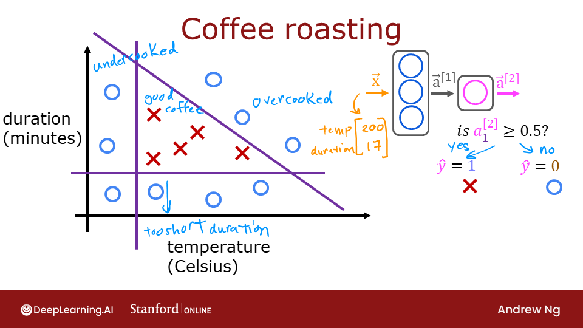
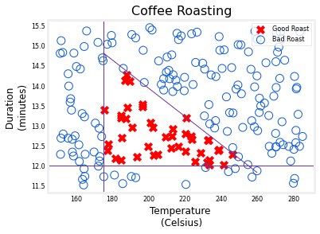
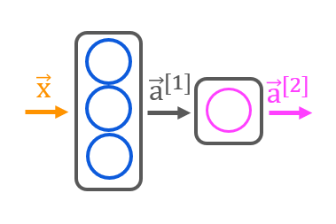
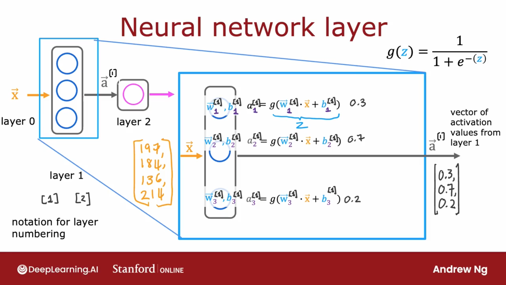
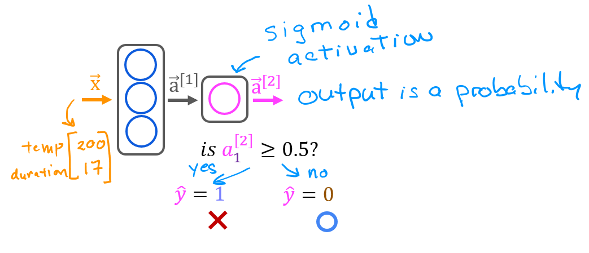
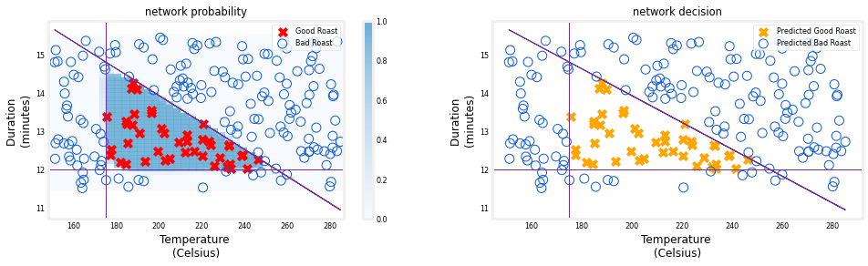

<!-- 本文件由课程原始 Notebook 转换并翻译。代码与公式保留原样。 -->
<!-- 原文件：2. Advanced Learning Algorithms/week 1/C2_W1_Lab03_CoffeeRoasting_Numpy.ipynb -->

# 可选实验 - Simple 神经网络（Optional Lab - Simple Neural Network）
本实验使用 NumPy 构建一个小型神经网络，与前一个 TensorFlow 实验中的“咖啡烘焙”网络相同。
   <center>    <center/>

```python
# Importing libraries
import numpy as np
import matplotlib.pyplot as plt
plt.style.use('./deeplearning.mplstyle')
import tensorflow as tf
from lab_utils_common import dlc, sigmoid
from lab_coffee_utils import load_coffee_data, plt_roast, plt_prob, plt_layer, plt_network, plt_output_unit
import logging
logging.getLogger("tensorflow").setLevel(logging.ERROR)
tf.autograph.set_verbosity(0)
```

## 数据集
此数据集与上一个数据集相同实验。

```python
X,Y = load_coffee_data();
print(X.shape, Y.shape)
```

```text
(200, 2) (200, 1)
```

下面绘制咖啡烘焙数据。输入特征（feature）是温度（摄氏度）和持续时间（分钟）。通常温度越高，合适的烘焙时间越短。可参考 [Coffee Roasting at Home](https://www.merchantsofgreencoffee.com/how-to-roast-green-coffee-in-your-oven/)。

```python
plt_roast(X,Y)
```



### 数据归一化
来配合前一个实验我们会把数据归一化 参考一下实验详情

```python
# Min and max values before and after normalization
print(f"Temperature Max, Min pre normalization: {np.max(X[:,0]):0.2f}, {np.min(X[:,0]):0.2f}")
print(f"Duration    Max, Min pre normalization: {np.max(X[:,1]):0.2f}, {np.min(X[:,1]):0.2f}")
norm_l = tf.keras.layers.Normalization(axis=-1)
norm_l.adapt(X)  # learns mean, variance
Xn = norm_l(X)
print(f"Temperature Max, Min post normalization: {np.max(Xn[:,0]):0.2f}, {np.min(Xn[:,0]):0.2f}")
print(f"Duration    Max, Min post normalization: {np.max(Xn[:,1]):0.2f}, {np.min(Xn[:,1]):0.2f}")
```

```text
Temperature Max, Min pre normalization: 284.99, 151.32
Duration    Max, Min pre normalization: 15.45, 11.51
Temperature Max, Min post normalization: 1.66, -1.69
Duration    Max, Min post normalization: 1.79, -1.70
```

## NumPy 模型（前向传播）
<center>    <center/>  
下面构建讲座中的咖啡烘焙网络。该网络包含两个使用 sigmoid 激活函数的 Dense 层。

如讲座所示，可以只使用 NumPy 实现多层神经网络（neural network）的前向传播。 



在前一个可选实验中，你使用 TensorFlow 构建了网络。这里用 NumPy 实现 Dense 层：循环遍历每个神经元 `j`，计算输入与权重 `W[:,j]` 的点积，加上偏置 `b[j]` 得到 `z`，再应用激活函数 `g(z)`。

首先确定激活函数 `g()`。本实验使用 `lab_utils_common.py` 中已经定义的 `sigmoid()`。

```python
# Define the activation function
g = sigmoid
```

接下来，你将定义`my_dense()`函数计算密集层的激活。

```python
# Defining my_dense() function that compute the activation of a dense layer
def my_dense(a_in, W, b):
    """
    Computes dense layer
    Args:
      a_in (ndarray (n, )) : Data, 1 example 
      W    (ndarray (n,j)) : Weight matrix, n features per unit, j units
      b    (ndarray (j, )) : bias vector, j units  
    Returns
      a_out (ndarray (j,))  : j units|
    """
    units = W.shape[1]
    a_out = np.zeros(units)
    for j in range(units):               
        w = W[:,j]                                    
        z = np.dot(w, a_in) + b[j]         
        a_out[j] = g(z)               
    return(a_out)
```

* 注：也可以执行上述函数来接受`g`作为额外参数（例如 `my_dense(a_in, W, b, g)`在此笔记本中，你将只使用一种类型的激活函数（activation function） （即 sigmoid) 因此，保持恒定并定义函数之外是好的。这就是你在上面的代码中所做的，它让函数在下一个代码单元格（code cell）简单一点，只要记住通过它作为参数也是可以接受的执行，在本周的任务中你会看到这一点。

下面使用刚实现的 `my_dense` 构建两层神经网络。

```python
# Defining sequential that will wrap up layers
def my_sequential(x, W1, b1, W2, b2):
    a1 = my_dense(x,  W1, b1)
    a2 = my_dense(a1, W2, b2)
    return(a2)
```

可以从前一个 TensorFlow 实验中复制训练后的权重和偏置。

```python
# Use the trained weights from previous notebook
W1_tmp = np.array( [[-8.93,  0.29, 12.9 ], [-0.1,  -7.32, 10.81]] )
b1_tmp = np.array( [-9.82, -9.28,  0.96] )
W2_tmp = np.array( [[-31.18], [-27.59], [-32.56]] )
b2_tmp = np.array( [15.41] )
```

### 预测


训练好模型后，就可以用它进行预测。模型输出的是咖啡豆烘焙良好的概率。为了得到类别判断，需要将该概率与阈值比较；这里使用的阈值为 0.5。

下面编写类似 TensorFlow `model.predict()` 的函数：它接收包含全部 $m$ 个样本的矩阵 $X$，逐个运行模型并返回预测。

```python
# Function to predict with new value
def my_predict(X, W1, b1, W2, b2):
    m = X.shape[0]
    p = np.zeros((m,1))
    for i in range(m):
        p[i,0] = my_sequential(X[i], W1, b1, W2, b2)
    return(p)
```

下面用两个样本测试该函数：

```python
X_tst = np.array([
    [200,13.9],  # postive example
    [200,17]])   # negative example
X_tstn = norm_l(X_tst)  # remember to normalize
predictions = my_predict(X_tstn, W1_tmp, b1_tmp, W2_tmp, b2_tmp)
```

为了将概率转化为决定，我们采用一个阈值：

```python
# Converting probabilities to decision
yhat = np.zeros_like(predictions)
for i in range(len(predictions)):
    if predictions[i] >= 0.5: # Check if meet the threshold requierements 
        yhat[i] = 1
    else:
        yhat[i] = 0
print(f"decisions = \n{yhat}")
```

```text
decisions = 
[[1.]
 [0.]]
```

这一点可以更简洁地实现：

```python
yhat = (predictions >= 0.5).astype(int)
print(f"decisions = \n{yhat}")
```

```text
decisions = 
[[1]
 [0]]
```

## 网络函数

此图显示了整个网络的运行情况，并与TensorFlow前一个实验。
左图是蓝色阴影代表的最后一层的原始输出，它覆盖在X和O代表的训练数据上。
正确的图是决定阈值后的网络输出，这里的X's和O's对应网络作出的决定。

```python
netf= lambda x : my_predict(norm_l(x),W1_tmp, b1_tmp, W2_tmp, b2_tmp)
plt_network(X,Y,netf)
```



## 恭喜完成！
你造了一个小的神经网络输入NumPy. 
希望这样实验揭示了一种相当简单和熟悉的功能，这种功能构成一个层次神经网络。
