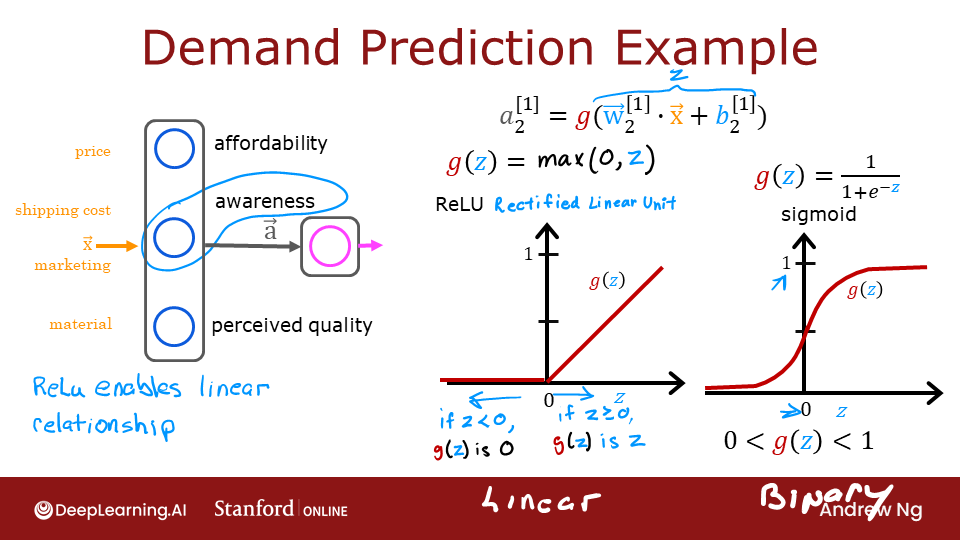
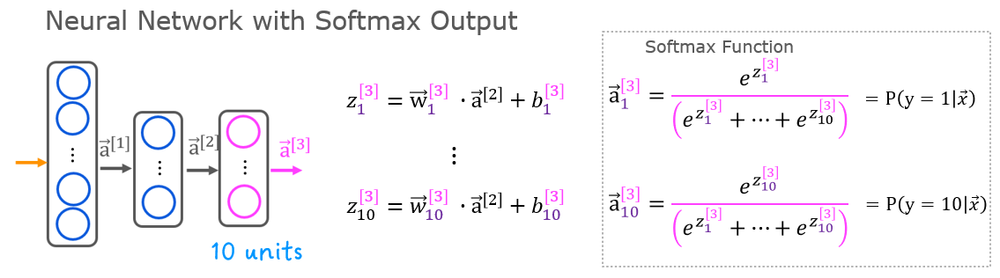
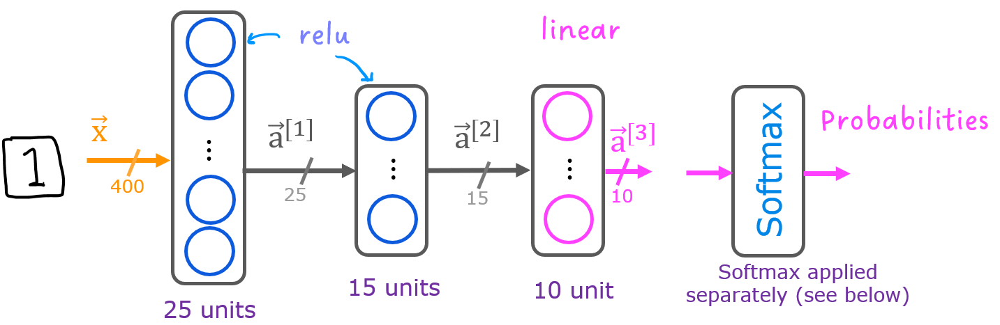

<!-- 本文件由课程原始 Notebook 转换并翻译。代码与公式保留原样。 -->
<!-- 原文件：2. Advanced Learning Algorithms/week 2/C2_W2_Assignment.ipynb -->

# 练习实验：使用神经网络识别手写数字（多分类）

在本练习中，你将使用神经网络识别手写数字 0～9。


# 内容提要
- [1 - 软件包](#1)
- [2 - ReLU 激活](#2)
- [3 - Softmax 函数](#3)
  - [练习 1](#ex01)
- [4 - 神经网络](#4)
  - [4.1 问题说明](#4.1)
  - [4.2 数据集](#4.2)
  - [4.3 模型表示](#4.3)
  - [4.4 TensorFlow 模型实现](#4.4)
  - [4.5 Softmax 的位置](#4.5)
    - [练习 2](#ex02)

_**注意：**为避免自动评分出错，请勿编辑或删除非评分单元格，也不要在 Notebook 中新增单元格。_ 
_通过作业后，如果想尝试额外代码，可按 Notebook 末尾的说明解锁非评分单元格。_

<a name="1"></a>
## 1 - 软件包

首先运行下面的单元格，导入本作业所需的全部软件包。
- [NumPy](https://numpy.org/) 是 Python 科学计算的基础库。
- [Matplotlib](http://matplotlib.org) 是 Python 中常用的绘图库。
- [TensorFlow](https://www.tensorflow.org/) 是常用的机器学习平台。

```python
import numpy as np
import tensorflow as tf
from tensorflow.keras.models import Sequential
from tensorflow.keras.layers import Dense
from tensorflow.keras.activations import linear, relu, sigmoid
%matplotlib widget
import matplotlib.pyplot as plt
plt.style.use('./deeplearning.mplstyle')

import logging
logging.getLogger("tensorflow").setLevel(logging.ERROR)
tf.autograph.set_verbosity(0)

from public_tests import * 

from autils import *
from lab_utils_softmax import plt_softmax
np.set_printoptions(precision=2)
```

<a name="2"></a>
## 2 - ReLU 激活
本周介绍新的激活函数：修正线性单元（Rectified Linear Unit，ReLU）。 
$$
a = max(0,z) \quad\quad\text{ReLU function}
$$

```python
plt_act_trio()
```

```text
Canvas(toolbar=Toolbar(toolitems=[('Home', 'Reset original view', 'home', 'home'), ('Back', 'Back to previous …
```


讲座示例说明，ReLU 学到的特征可以取连续值，而不只表示二元的“开/关”状态。$z>0$ 时输出与 $z$ 呈线性关系，$z\le0$ 时输出为 0。
这段输出为 0 的区域使 ReLU 成为非线性激活函数，也让不同单元能够在输入空间的不同区域发挥作用。配套可选实验会进一步说明。

<a name="3"></a>
## 3 - Softmax 函数
多分类神经网络生成 $N$ 个输出。输出层的线性函数先得到向量 $\mathbf{z}$，Softmax 再把它转换为概率分布：每个分量位于 0～1，所有分量之和为 1；较大的 $z_j$ 对应较大的类别概率。
<center>  

Softmax 函数可写为：
$$
a_j = \frac{e^{z_j}}{ \sum_{k=0}^{N-1}{e^{z_k} }} \tag{1}
$$

其中 $z_j=\mathbf{w}_j\cdot\mathbf{x}+b_j$，$N$ 是输出类别数。

<a name="ex01"></a>
### 练习 1
下面用 NumPy 实现 Softmax：

```python
# UNQ_C1
# GRADED CELL: my_softmax

def my_softmax(z):  
    """ Softmax converts a vector of values to a probability distribution.
    Args:
      z (ndarray (N,))  : input data, N features
    Returns:
      a (ndarray (N,))  : softmax of z
    """    
    ### START CODE HERE ### 
    N =  len(z)
    a = np.zeros(N)
    ez_sum = 0
    
    for i in range(N):
        ez_sum += np.exp(z[i])
    for j in range(N):
        a[j] = np.exp(z[j])/ez_sum
    
    ### END CODE HERE ### 
    return a
```

```python
z = np.array([1., 2., 3., 4.])
a = my_softmax(z)
atf = tf.nn.softmax(z)
print(f"my_softmax(z):         {a}")
print(f"tensorflow softmax(z): {atf}")

# BEGIN UNIT TEST  
test_my_softmax(my_softmax)
# END UNIT TEST
```

```text
my_softmax(z):         [0.03 0.09 0.24 0.64]
tensorflow softmax(z): [0.03 0.09 0.24 0.64]
 All tests passed.
```

<details>
  <summary><font size="3" color="darkgreen"><b>点击查看提示</b></font></summary>
一种实现方式是先循环计算分母，再用第二个循环计算每个输出分量。
    
```Python
def my_softmax(z):  
    N = len(z)
    a =                     # initialize a to zeros 
    ez_sum =                # initialize sum to zero
    for k in range(N):      # loop over number of outputs             
        ez_sum +=           # sum exp(z[k]) to build the shared denominator      
    for j in range(N):      # loop over number of outputs again                
        a[j] =              # divide each the exp of each output by the denominator   
    return(a)
```
<details>
  <summary><font size="3" color="darkgreen"><b>点击代码</b></font></summary>
   
```Python
def my_softmax(z):  
    N = len(z)
    a = np.zeros(N)
    ez_sum = 0
    for k in range(N):                
        ez_sum += np.exp(z[k])       
    for j in range(N):                
        a[j] = np.exp(z[j])/ez_sum   
    return(a)

Or, a vector implementation:

def my_softmax(z):  
    ez = np.exp(z)              
    a = ez/np.sum(ez)           
    return(a)

```

修改输入 `z` 并观察输出。指数运算会放大各输入之间的差异，而 Softmax 输出始终非负且总和为 1。

```python
plt.close("all")
plt_softmax(my_softmax)
```

```text
Canvas(toolbar=Toolbar(toolitems=[('Home', 'Reset original view', 'home', 'home'), ('Back', 'Back to previous …
```

<a name="4"></a>
## 4 - 神经网络

上周的作业使用神经网络完成二分类。本周把它扩展到多分类（multiclass classification），并使用 Softmax 解释输出。


<a name="4.1"></a>
### 4.1 问题说明

本练习使用神经网络识别 10 个手写数字。多分类任务需要从 $N$ 个候选类别中选择一个；手写数字识别可用于读取邮政编码和银行支票金额。


<a name="4.2"></a>
### 4.2 数据集

先加载本作业使用的数据集。
- 下面的 `load_data()` 函数把数据加载到 `X` 和 `y`。


- 数据集包含 5,000 个手写数字训练样本$^1$.  

    - 每个训练样本是一幅 $20\times20$ 像素的灰度数字图像。
        - 每个像素都由一个浮点数表示，表示该位置的灰度强度。
        - $20\times20$ 的像素网格被展开为 400 维向量。
        - 每个训练样本对应数据矩阵 `X` 的一行。 
        - 因此 `X` 的形状为 `(5000,400)`。

$$
X =
\left(\begin{array}{cc} 
--- (x^{(1)}) --- \\
--- (x^{(2)}) --- \\
\vdots \\ 
--- (x^{(m)}) --- 
\end{array}\right)
$$
- 训练集的另一部分是标签向量 `y`，包含 5,000 个标签。
    - 图像为数字 0 时 `y=0`，为数字 4 时 `y=4`，其余数字同理。

$^1$<sub>这是 MNIST 手写数字数据集的子集(http://yann.lecun.com/exdb/mnist/)</sub>

```python
# load dataset
X, y = load_data()
```

#### 4.2.1 查看变量
下面进一步了解数据集。
- 先打印各变量，查看其中的内容。

下面打印 `X` 和 `y` 的第一个元素。

```python
print ('The first element of X is: ', X[0])
```

```text
The first element of X is:  [ 0.00e+00  0.00e+00  0.00e+00  0.00e+00  0.00e+00  0.00e+00  0.00e+00
  0.00e+00  0.00e+00  0.00e+00  0.00e+00  0.00e+00  0.00e+00  0.00e+00
  0.00e+00  0.00e+00  0.00e+00  0.00e+00  0.00e+00  0.00e+00  0.00e+00
  0.00e+00  0.00e+00  0.00e+00  0.00e+00  0.00e+00  0.00e+00  0.00e+00
  0.00e+00  0.00e+00  0.00e+00  0.00e+00  0.00e+00  0.00e+00  0.00e+00
  0.00e+00  0.00e+00  0.00e+00  0.00e+00  0.00e+00  0.00e+00  0.00e+00
  0.00e+00  0.00e+00  0.00e+00  0.00e+00  0.00e+00  0.00e+00  0.00e+00
  0.00e+00  0.00e+00  0.00e+00  0.00e+00  0.00e+00  0.00e+00  0.00e+00
  0.00e+00  0.00e+00  0.00e+00  0.00e+00  0.00e+00  0.00e+00  0.00e+00
  0.00e+00  0.00e+00  0.00e+00  0.00e+00  8.56e-06  1.94e-06 -7.37e-04
 -8.13e-03 -1.86e-02 -1.87e-02 -1.88e-02 -1.91e-02 -1.64e-02 -3.78e-03
  3.30e-04  1.28e-05  0.00e+00  0.00e+00  0.00e+00  0.00e+00  0.00e+00
  0.00e+00  0.00e+00  1.16e-04  1.20e-04 -1.40e-02 -2.85e-02  8.04e-02
  2.67e-01  2.74e-01  2.79e-01  2.74e-01  2.25e-01  2.78e-02 -7.06e-03
  2.35e-04  0.00e+00  0.00e+00  0.00e+00  0.00e+00  0.00e+00  0.00e+00
  1.28e-17 -3.26e-04 -1.39e-02  8.16e-02  3.83e-01  8.58e-01  1.00e+00
  9.70e-01  9.31e-01  1.00e+00  9.64e-01  4.49e-01 -5.60e-03 -3.78e-03
  0.00e+00  0.00e+00  0.00e+00  0.00e+00  5.11e-06  4.36e-04 -3.96e-03
 -2.69e-02  1.01e-01  6.42e-01  1.03e+00  8.51e-01  5.43e-01  3.43e-01
  2.69e-01  6.68e-01  1.01e+00  9.04e-01  1.04e-01 -1.66e-02  0.00e+00
  0.00e+00  0.00e+00  0.00e+00  2.60e-05 -3.11e-03  7.52e-03  1.78e-01
  7.93e-01  9.66e-01  4.63e-01  6.92e-02 -3.64e-03 -4.12e-02 -5.02e-02
  1.56e-01  9.02e-01  1.05e+00  1.51e-01 -2.16e-02  0.00e+00  0.00e+00
  0.00e+00  5.87e-05 -6.41e-04 -3.23e-02  2.78e-01  9.37e-01  1.04e+00
  5.98e-01 -3.59e-03 -2.17e-02 -4.81e-03  6.17e-05 -1.24e-02  1.55e-01
  9.15e-01  9.20e-01  1.09e-01 -1.71e-02  0.00e+00  0.00e+00  1.56e-04
 -4.28e-04 -2.51e-02  1.31e-01  7.82e-01  1.03e+00  7.57e-01  2.85e-01
  4.87e-03 -3.19e-03  0.00e+00  8.36e-04 -3.71e-02  4.53e-01  1.03e+00
  5.39e-01 -2.44e-03 -4.80e-03  0.00e+00  0.00e+00 -7.04e-04 -1.27e-02
  1.62e-01  7.80e-01  1.04e+00  8.04e-01  1.61e-01 -1.38e-02  2.15e-03
 -2.13e-04  2.04e-04 -6.86e-03  4.32e-04  7.21e-01  8.48e-01  1.51e-01
 -2.28e-02  1.99e-04  0.00e+00  0.00e+00 -9.40e-03  3.75e-02  6.94e-01
  1.03e+00  1.02e+00  8.80e-01  3.92e-01 -1.74e-02 -1.20e-04  5.55e-05
 -2.24e-03 -2.76e-02  3.69e-01  9.36e-01  4.59e-01 -4.25e-02  1.17e-03
  1.89e-05  0.00e+00  0.00e+00 -1.94e-02  1.30e-01  9.80e-01  9.42e-01
  7.75e-01  8.74e-01  2.13e-01 -1.72e-02  0.00e+00  1.10e-03 -2.62e-02
  1.23e-01  8.31e-01  7.27e-01  5.24e-02 -6.19e-03  0.00e+00  0.00e+00
  0.00e+00  0.00e+00 -9.37e-03  3.68e-02  6.99e-01  1.00e+00  6.06e-01
  3.27e-01 -3.22e-02 -4.83e-02 -4.34e-02 -5.75e-02  9.56e-02  7.27e-01
  6.95e-01  1.47e-01 -1.20e-02 -3.03e-04  0.00e+00  0.00e+00  0.00e+00
  0.00e+00 -6.77e-04 -6.51e-03  1.17e-01  4.22e-01  9.93e-01  8.82e-01
  7.46e-01  7.24e-01  7.23e-01  7.20e-01  8.45e-01  8.32e-01  6.89e-02
 -2.78e-02  3.59e-04  7.15e-05  0.00e+00  0.00e+00  0.00e+00  0.00e+00
  1.53e-04  3.17e-04 -2.29e-02 -4.14e-03  3.87e-01  5.05e-01  7.75e-01
  9.90e-01  1.01e+00  1.01e+00  7.38e-01  2.15e-01 -2.70e-02  1.33e-03
  0.00e+00  0.00e+00  0.00e+00  0.00e+00  0.00e+00  0.00e+00  0.00e+00
  0.00e+00  2.36e-04 -2.26e-03 -2.52e-02 -3.74e-02  6.62e-02  2.91e-01
  3.23e-01  3.06e-01  8.76e-02 -2.51e-02  2.37e-04  0.00e+00  0.00e+00
  0.00e+00  0.00e+00  0.00e+00  0.00e+00  0.00e+00  0.00e+00  0.00e+00
  0.00e+00  0.00e+00  6.21e-18  6.73e-04 -1.13e-02 -3.55e-02 -3.88e-02
 -3.71e-02 -1.34e-02  9.91e-04  4.89e-05  0.00e+00  0.00e+00  0.00e+00
  0.00e+00  0.00e+00  0.00e+00  0.00e+00  0.00e+00  0.00e+00  0.00e+00
  0.00e+00  0.00e+00  0.00e+00  0.00e+00  0.00e+00  0.00e+00  0.00e+00
  0.00e+00  0.00e+00  0.00e+00  0.00e+00  0.00e+00  0.00e+00  0.00e+00
  0.00e+00  0.00e+00  0.00e+00  0.00e+00  0.00e+00  0.00e+00  0.00e+00
  0.00e+00  0.00e+00  0.00e+00  0.00e+00  0.00e+00  0.00e+00  0.00e+00
  0.00e+00  0.00e+00  0.00e+00  0.00e+00  0.00e+00  0.00e+00  0.00e+00
  0.00e+00]
```

```python
print ('The first element of y is: ', y[0,0])
print ('The last element of y is: ', y[-1,0])
```

```text
The first element of y is:  0
The last element of y is:  9
```

#### 4.2.2 检查变量维度

再查看 `X` 和 `y` 的形状，以确认训练样本数和特征维度。

```python
print ('The shape of X is: ' + str(X.shape))
print ('The shape of y is: ' + str(y.shape))
```

```text
The shape of X is: (5000, 400)
The shape of y is: (5000, 1)
```

#### 4.2.3 数据可视化

先查看训练集（training set）的一个子集。 
- 下面的代码从 `X` 中随机选择 64 行，把每个 400 维向量还原为 $20\times20$ 灰度图像并显示。
- 每幅图像上方显示其标签。

```python
import warnings
warnings.simplefilter(action='ignore', category=FutureWarning)
# You do not need to modify anything in this cell

m, n = X.shape

fig, axes = plt.subplots(8,8, figsize=(5,5))
fig.tight_layout(pad=0.13,rect=[0, 0.03, 1, 0.91]) #[left, bottom, right, top]

#fig.tight_layout(pad=0.5)
widgvis(fig)
for i,ax in enumerate(axes.flat):
    # Select random indices
    random_index = np.random.randint(m)
    
    # Select rows corresponding to the random indices and
    # reshape the image
    X_random_reshaped = X[random_index].reshape((20,20)).T
    
    # Display the image
    ax.imshow(X_random_reshaped, cmap='gray')
    
    # Display the label above the image
    ax.set_title(y[random_index,0])
    ax.set_axis_off()
    fig.suptitle("Label, image", fontsize=14)
```

```text
Canvas(toolbar=Toolbar(toolitems=[('Home', 'Reset original view', 'home', 'home'), ('Back', 'Back to previous …
```

<a name="4.3"></a>
### 4.3 模型表示

本任务使用下图所示的三层神经网络。
- 前两个 Dense 层使用 ReLU，输出层使用线性激活。
    - 输入是数字图像的像素值。
    - 图像大小为 $20\times20$，因此输入有 400 个特征。
    


- 网络第 1 层有 25 个单元，第 2 层有 15 个单元，输出层有 10 个单元，分别对应数字 0～9。

    - 回顾这些参数的维度确定如下：
        - 若当前层输入维度为 $s_{in}$、输出单元数为 $s_{out}$，则：
            - $W$ 的形状为 $(s_{in},s_{out})$；
            - $b$ 是包含 $s_{out}$ 个元素的向量。
  
    - 因此，各层参数的形状为：
        - 第 1 层：`W1.shape=(400,25)`，`b1.shape=(25,)`；
        - 第 2 层：`W2.shape=(25,15)`，`b2.shape=(15,)`；
        - 第 3 层：`W3.shape=(15,10)`，`b3.shape=(10,)`。
>**说明：**偏置（bias）向量 `b` 可表示为一维数组 `(n,)` 或二维数组 `(1,n)`。TensorFlow 使用一维表示，本实验也沿用这一惯例。

<a name="4.4"></a>
### 4.4 TensorFlow 模型实现

TensorFlow 模型按层构建。指定每层的输出单元数后，TensorFlow 会推断下一层的输入维度；第一层输入维度由输入数据形状决定。随后用 `model.fit` 训练模型。
>**说明：**还可以添加一个输入层，指定第一层的输入维度。例如：
`tf.keras.Input(shape=(400,)),    #specify input shape`  
本实验显式写出输入层，以便在训练前显示完整的模型结构。

<a name="4.5"></a>
### 4.5 Softmax 的位置
如讲座和 Softmax 可选实验所述，训练时把 Softmax 与损失函数结合计算，比直接把 Softmax 放在输出层更稳定。
构建模型时：
* 最后一个 Dense 层使用 `linear`，即不额外应用非线性激活；
* 在 `model.compile` 中设置 `from_logits=True`：
`loss=tf.keras.losses.SparseCategoricalCrossentropy(from_logits=True) `  
* 这不会改变目标标签的形式：`SparseCategoricalCrossentropy` 仍接收 0～9 的整数标签。

使用模型时：
* 模型原始输出是 logits，并非概率；需要概率时再应用 Softmax。

<a name="ex02"></a>
### 练习 2

下面使用 Keras 的 [Sequential 模型](https://keras.io/guides/sequential_model/)和 [Dense 层](https://keras.io/api/layers/core_layers/dense/)，以 ReLU 构建上述三层网络。

```python
# UNQ_C2
# GRADED CELL: Sequential model
tf.random.set_seed(1234) # for consistent results
model = Sequential(
    [               
        ### START CODE HERE ### 
        tf.keras.Input(shape=(400,)),   #Specify input shape
        Dense(25, activation='relu', name='Layer1'),
        Dense(15, activation='relu', name='Layer2'),
        Dense(10, activation='linear', name='Layer3')
        
        ### END CODE HERE ### 
    ], name = "my_model" 
)
```

```python
model.summary()
```

```text
Model: "my_model"
_________________________________________________________________
 Layer (type)                Output Shape              Param #   
=================================================================
 Layer1 (Dense)              (None, 25)                10025     
                                                                 
 Layer2 (Dense)              (None, 15)                390       
                                                                 
 Layer3 (Dense)              (None, 10)                160       
                                                                 
=================================================================
Total params: 10,575
Trainable params: 10,575
Non-trainable params: 0
_________________________________________________________________
```

<details>
  <summary><font size="3" color="darkgreen"><b>预期输出（点击展开）</b></font></summary>
`model.summary()` 显示模型摘要。除非显式指定名称，否则网络层名称会自动生成，因而可能有所不同。
    
```
Model: "my_model"
_________________________________________________________________
Layer (type)                 Output Shape              Param #   
=================================================================
L1 (Dense)                   (None, 25)                10025     
_________________________________________________________________
L2 (Dense)                   (None, 15)                390       
_________________________________________________________________
L3 (Dense)                   (None, 10)                160       
=================================================================
Total params: 10,575
Trainable params: 10,575
Non-trainable params: 0
_________________________________________________________________
```

<details>
  <summary><font size="3" color="darkgreen"><b>点击查看提示</b></font></summary>
    
```Python
tf.random.set_seed(1234)
model = Sequential(
    [               
        ### START CODE HERE ### 
        tf.keras.Input(shape=(400,)),     # @REPLACE 
        Dense(25, activation='relu', name = "L1"), # @REPLACE 
        Dense(15, activation='relu',  name = "L2"), # @REPLACE  
        Dense(10, activation='linear', name = "L3"),  # @REPLACE 
        ### END CODE HERE ### 
    ], name = "my_model" 
)
```

```python
# BEGIN UNIT TEST     
test_model(model, 10, 400)
# END UNIT TEST
```

```text
All tests passed!
```

摘要中显示的参数数与权重和偏差数组如下所示。

下面检查权重，确认 TensorFlow 生成的参数维度与上面的计算一致。

```python
[layer1, layer2, layer3] = model.layers
```

```python
#### Examine Weights shapes
W1,b1 = layer1.get_weights()
W2,b2 = layer2.get_weights()
W3,b3 = layer3.get_weights()
print(f"W1 shape = {W1.shape}, b1 shape = {b1.shape}")
print(f"W2 shape = {W2.shape}, b2 shape = {b2.shape}")
print(f"W3 shape = {W3.shape}, b3 shape = {b3.shape}")
```

```text
W1 shape = (400, 25), b1 shape = (25,)
W2 shape = (25, 15), b2 shape = (15,)
W3 shape = (15, 10), b3 shape = (10,)
```

**预期输出**
```
W1 shape = (400, 25), b1 shape = (25,)  
W2 shape = (25, 15), b2 shape = (15,)  
W3 shape = (15, 10), b3 shape = (10,)
```

下列代码：
* 定义损失函数 `SparseCategoricalCrossentropy`，并用 `from_logits=True` 指明输入为 logits；
* 定义优化器；这里使用讲座介绍的 Adam。

```python
model.compile(
    loss=tf.keras.losses.SparseCategoricalCrossentropy(from_logits=True),
    optimizer=tf.keras.optimizers.Adam(learning_rate=0.001),
)

history = model.fit(
    X,y,
    epochs=40
)
```

```text
（训练日志已省略。运行上方代码单元格可查看每个 epoch 的完整输出。）
```

#### 训练轮次（epoch）与批次（batch）
`fit` 的 `epochs=40` 表示完整训练集会被遍历 40 次。在训练期间，你可以看到描述训练进展情况的输出：
```
Epoch 1/40
157/157 [==============================] - 0s 1ms/step - loss: 2.2770
```
第一行 `Epoch 1/40` 表示当前是第 1 个训练轮次。为提高效率，训练集会划分为多个批次（batch）。本数据集有 5,000 个样本，默认批量大小下约有 157 个批次。`157/157 [====` 显示当前轮次已处理的批次数。

#### 损失与代价
课程 1 中介绍过，梯度下降正常工作时，代价通常会随迭代逐步下降。TensorFlow 用 `loss` 表示训练目标；`model.fit` 返回的 `history` 对象记录了每个 epoch 的损失，可据此绘制下图。

```python
plot_loss_tf(history)
```

```text
Canvas(toolbar=Toolbar(toolitems=[('Home', 'Reset original view', 'home', 'home'), ('Back', 'Back to previous …
```

#### 预测
下面使用 Keras 的 `predict` 进行预测；`X[1015]` 是数字 2 的图像。

```python
image_of_two = X[1015]
display_digit(image_of_two)

prediction = model.predict(image_of_two.reshape(1,400))  # prediction

print(f" predicting a Two: \n{prediction}")
print(f" Largest Prediction index: {np.argmax(prediction)}")
```

```text
Canvas(toolbar=Toolbar(toolitems=[('Home', 'Reset original view', 'home', 'home'), ('Back', 'Back to previous …
```

```text
 predicting a Two: 
[[ -7.99  -2.23   0.77  -2.41 -11.66 -11.15  -9.53  -3.36  -4.42  -7.17]]
 Largest Prediction index: 2
```

最大 logit 位于索引 2，因此预测类别为 2。只需类别时可直接使用 NumPy [`argmax`](https://numpy.org/doc/stable/reference/generated/numpy.argmax.html)；若需要类别概率，则再应用 Softmax。

```python
prediction_p = tf.nn.softmax(prediction)

print(f" predicting a Two. Probability vector: \n{prediction_p}")
print(f"Total of predictions: {np.sum(prediction_p):0.3f}")
```

```text
 predicting a Two. Probability vector: 
[[1.42e-04 4.49e-02 8.98e-01 3.76e-02 3.61e-06 5.97e-06 3.03e-05 1.44e-02
  5.03e-03 3.22e-04]]
Total of predictions: 1.000
```

若要得到整数类别，应使用 NumPy [`argmax`](https://numpy.org/doc/stable/reference/generated/numpy.argmax.html) 取得最大概率对应的索引。

```python
yhat = np.argmax(prediction_p)

print(f"np.argmax(prediction_p): {yhat}")
```

```text
np.argmax(prediction_p): 2
```

下面随机抽取 64 幅图像，比较模型预测与真实标签；运行需要一点时间。

```python
import warnings
warnings.simplefilter(action='ignore', category=FutureWarning)
# You do not need to modify anything in this cell

m, n = X.shape

fig, axes = plt.subplots(8,8, figsize=(5,5))
fig.tight_layout(pad=0.13,rect=[0, 0.03, 1, 0.91]) #[left, bottom, right, top]
widgvis(fig)
for i,ax in enumerate(axes.flat):
    # Select random indices
    random_index = np.random.randint(m)
    
    # Select rows corresponding to the random indices and
    # reshape the image
    X_random_reshaped = X[random_index].reshape((20,20)).T
    
    # Display the image
    ax.imshow(X_random_reshaped, cmap='gray')
    
    # Predict using the Neural Network
    prediction = model.predict(X[random_index].reshape(1,400))
    prediction_p = tf.nn.softmax(prediction)
    yhat = np.argmax(prediction_p)
    
    # Display the label above the image
    ax.set_title(f"{y[random_index,0]},{yhat}",fontsize=10)
    ax.set_axis_off()
fig.suptitle("Label, yhat", fontsize=14)
plt.show()
```

```text
Canvas(toolbar=Toolbar(toolitems=[('Home', 'Reset original view', 'home', 'home'), ('Back', 'Back to previous …
```

下面查看部分误分类样本。
>注：增加训练时间可以消除本数据集的错误。

```python
print( f"{display_errors(model,X,y)} errors out of {len(X)} images")
```

```text
Canvas(toolbar=Toolbar(toolitems=[('Home', 'Reset original view', 'home', 'home'), ('Back', 'Back to previous …
```

```text
15 errors out of 5000 images
```

### 恭喜完成！
你已经成功构建并使用神经网络完成多分类任务。

<details>
  <summary><font size="2" color="darkgreen"><b>如果已经通过作业并希望尝试额外代码，可展开这里的说明。</b></font></summary>
    <p><i><b>请仅在作业通过后修改单元格属性，以免影响自动评分。</b></i>
    <ol>
        <li>在 Notebook 菜单中选择 `View` > `Cell Toolbar` > `Edit Metadata`。</li>
        <li>在需要锁定或解锁的代码单元格上点击 `Edit Metadata`。</li>
        <li>将 `editable` 属性设为：
            <ul>
                <li>要解锁，设为 `true`；</li>
                <li>要锁定，设为 `false`。</li>
            </ul>
        </li>
        <li>完成后选择 `View` > `Cell Toolbar` > `None` 隐藏元数据工具栏。</li>
    </ol>
    <p>下面的演示展示了完整操作：
        <br>
        <span>按上述步骤即可解锁单元格。</span>
</details>
