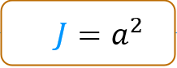
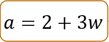
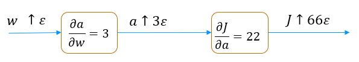
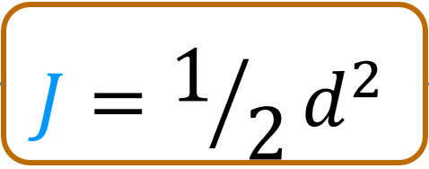
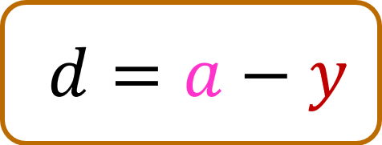
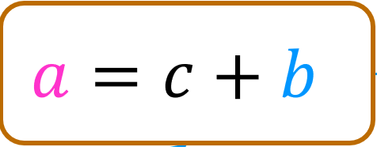
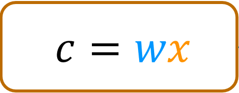

<!-- 本文件由课程原始 Notebook 转换并翻译。代码与公式保留原样。 -->
<!-- 原文件：2. Advanced Learning Algorithms/week 2/C2_W2_Backprop.ipynb -->

# 可选实验：使用计算图理解反向传播
本实验帮助你理解现代机器学习框架中的关键算法。梯度下降需要计算代价对网络中每个参数的导数，而神经网络可能包含数百万甚至数十亿个参数。反向传播（backpropagation）借助计算图高效组织这些导数的计算。

```python
from sympy import *
import numpy as np
import re
%matplotlib widget
import matplotlib.pyplot as plt
from matplotlib.widgets import TextBox
from matplotlib.widgets import Button
import ipywidgets as widgets
from lab_utils_backprop import *
```

## 计算图
计算图（computation graph）把复杂的导数拆成较小步骤，从而简化计算。下面观察其工作过程。

先计算表达式 $J=(2+3w)^2$ 对 $w$ 的导数，即 $\frac{\partial J}{\partial w}$.

```python
plt.close("all")
plt_network(config_nw0, "./images/C2_W2_BP_network0.PNG")
```

```text
Canvas(toolbar=Toolbar(toolitems=[('Home', 'Reset original view', 'home', 'home'), ('Back', 'Back to previous …
```

```text
<lab_utils_backprop.plt_network at 0x70ceb12e3f50>
```

上图把表达式拆成两个可以分别处理的节点。 如果你已经从讲座中很好地了解了过程， 你可以先填上图表中的框。 先从左到右填写蓝色的前向计算结果，再从右到左填写绿色的导数。
输入正确时，数值会显示为绿色或蓝色；输入错误时会显示为红色。交互式图形的稳定性有限，如果界面出现问题，请重新运行上方单元格以重置。

如果过程还不清楚，下面将逐步推导。

### 前向传播
先从左到右计算各节点的数值。

> **注意：**本节代码使用并重复修改全局变量。若中途重复运行过单元格，请从这里开始按顺序重新运行。

```python
w = 3
a = 2+3*w
J = a**2
print(f"a = {a}, J = {J}")
```

```text
a = 11, J = 121
```

你可以在上方的蓝色框中填充这些值 。

### 反向传播
反向传播用于计算导数。与讲座中的过程一致，它从计算图右端开始，逐节点向左传播。第一个节点为 $J=a^2$，第一步是求 $\frac{\partial J}{\partial a}$。

### $\frac{\partial J}{\partial a}$
#### 数值形式
$\frac{\partial J}{\partial a}$ 描述 $a$ 发生微小变化时 $J$ 的变化率。这在导数中详细描述可选实验。

```python
a_epsilon = a + 0.001       # a epsilon
J_epsilon = a_epsilon**2    # J_epsilon
k = (J_epsilon - J)/0.001   # difference divided by epsilon
print(f"J = {J}, J_epsilon = {J_epsilon}, dJ_da ~= k = {k} ")
```

```text
J = 121, J_epsilon = 121.02200099999999, dJ_da ~= k = 22.000999999988835
```

$\frac{\partial J}{\partial a}$ 的数值近似为 22，也就是 $2a$。由于 $\epsilon$ 并非无穷小，数值结果与精确值可能略有差异。
#### 符号形式
下面像导数可选实验中一样，用 SymPy 计算符号导数。变量名前加 `s`，表示它是符号变量（symbolic variable）。

```python
sw,sJ,sa = symbols('w,J,a')
sJ = sa**2
sJ
```

```text
a**2
```

```python
sJ.subs([(sa,a)])
```

```text
121
```

```python
dJ_da = diff(sJ, sa)
dJ_da
```

```text
2*a
```

因此 $\frac{\partial J}{\partial a}=2a$；当 $a=11$ 时，$\frac{\partial J}{\partial a}=22$。这符合上面的计算。
现在可以把该数值填入上方图表。$\frac{\partial J}{\partial a}$.

### $\frac{\partial J}{\partial w}$
继续从右向左，下一个要计算的是 $\frac{\partial J}{\partial w}$。为此先计算 $\frac{\partial a}{\partial w}$，它描述输入 $w$ 发生微小变化时，该节点输出 $a$ 的变化率。

#### 数值形式
$\frac{\partial a}{\partial w}$ 描述 $w$ 发生微小变化时 $a$ 的变化率。

```python
w_epsilon = w + 0.001       # a  plus a small value, epsilon
a_epsilon = 2 + 3*w_epsilon
k = (a_epsilon - a)/0.001   # difference divided by epsilon
print(f"a = {a}, a_epsilon = {a_epsilon}, da_dw ~= k = {k} ")
```

```text
a = 11, a_epsilon = 11.003, da_dw ~= k = 3.0000000000001137
```

数值计算得到 $\frac{\partial a}{\partial w}\approx3$，下面用 SymPy 验证。

```python
sa = 2 + 3*sw
sa
```

```text
3*w + 2
```

```python
da_dw = diff(sa,sw)
da_dw
```

```text
3
```

>下一步是有趣的部分：
> - $w$ 的微小变化会使 $a$ 产生约 3 倍的变化；
> - $a$ 的微小变化会使 $J$ 产生约 $2a$ 倍的变化； (本例中a=11)
因此，把这些组合在一起，
> - 因此 $w$ 的微小变化会使 $J$ 产生约 $3\times2a$ 倍的变化。
> 
> 这种把局部变化率相乘的关系称为**链式法则**。可以这样写：
 $$
 \frac{\partial J}{\partial w} = \frac{\partial a}{\partial w} \frac{\partial J}{\partial a}
 $$
 
如果还不清楚的话，值得花点时间思考一下。
 
我们来计算一下：

```python
dJ_dw = da_dw * dJ_da
dJ_dw
```

```text
6*a
```

本例中 $a=11$，因此 $\frac{\partial J}{\partial w}=66$。下面进行计算：

```python
w_epsilon = w + 0.001
a_epsilon = 2 + 3*w_epsilon
J_epsilon = a_epsilon**2
k = (J_epsilon - J)/0.001   # difference divided by epsilon
print(f"J = {J}, J_epsilon = {J_epsilon}, dJ_dw ~= k = {k} ")
```

```text
J = 121, J_epsilon = 121.06600900000001, dJ_dw ~= k = 66.0090000000082
```

现在可以把 $\frac{\partial a}{\partial w}$ 和 $\frac{\partial J}{\partial w}$ 填入图中。

* *另一种视图**  
也可以直观地理解这组连锁变化：
  
$w$ 的微小变化先经 $\frac{\partial a}{\partial w}=3$ 放大 3 倍，再经 $\frac{\partial J}{\partial a}=22$ 放大 22 倍，因此 $J$ 的变化率为 $3\times22=66$。

## 计算图（computation graph）简单神经网络
下面是该神经网络的计算图。请尝试填写方框中的数值。交互式图形的稳定性有限，如果界面出现问题，请重新运行上方单元格以重置。

```python
plt.close("all")
plt_network(config_nw1, "./images/C2_W2_BP_network1.PNG")
```

```text
Canvas(toolbar=Toolbar(toolitems=[('Home', 'Reset original view', 'home', 'home'), ('Back', 'Back to previous …
```

```text
<lab_utils_backprop.plt_network at 0x70ce668c7590>
```

下面通过计算填写这张计算图，先从前向传播开始。

### 前向传播
前向计算与刚学过的神经网络前向传播相同。你可以比较以下数值与你为上图计算出的数值。

```python
# Inputs and parameters
x = 2
w = -2
b = 8
y = 1
# calculate per step values   
c = w * x
a = c + b
d = a - y
J = d**2/2
print(f"J={J}, d={d}, a={a}, c={c}")
```

```text
J=4.5, d=3, a=4, c=-4
```

### 反向传播（Backpropagation）
如讲座中描述的，反向传播从右侧开始向左计算。$J=\frac{1}{2}d^2$，第一步是求 $\frac{\partial J}{\partial d}$。

### $\frac{\partial J}{\partial d}$

#### 数值形式
$\frac{\partial J}{\partial d}$ 表示 $d$ 发生微小变化时 $J$ 的变化率。

```python
d_epsilon = d + 0.001
J_epsilon = d_epsilon**2/2
k = (J_epsilon - J)/0.001   # difference divided by epsilon
print(f"J = {J}, J_epsilon = {J_epsilon}, dJ_dd ~= k = {k} ")
```

```text
J = 4.5, J_epsilon = 4.5030005, dJ_dd ~= k = 3.0004999999997395
```

$\frac{\partial J}{\partial d}$ 的数值近似为 3，也就是 $d$。由于 $\epsilon$ 并非无穷小，数值结果可能略有误差。
#### 符号形式
下面用 SymPy 计算符号导数，就像我们在导数中所做的那样可选实验。变量名前加 `s`，表示它是符号变量（symbolic variable）。

```python
sx,sw,sb,sy,sJ = symbols('x,w,b,y,J')
sa, sc, sd = symbols('a,c,d')
sJ = sd**2/2
sJ
```

```text
d**2/2
```

```python
sJ.subs([(sd,d)])
```

```text
9/2
```

```python
dJ_dd = diff(sJ, sd)
dJ_dd
```

```text
d
```

因此 $\frac{\partial J}{\partial d}=d$；当 $d=3$ 时，$\frac{\partial J}{\partial d}=3$。 这与上文的计算一致。
现在可以把该数值填入上方图表。$\frac{\partial J}{\partial d}$.

### $\frac{\partial J}{\partial a}$
继续从右向左，下一个要计算的是 $\frac{\partial J}{\partial a}$。为此先计算 $\frac{\partial d}{\partial a}$，它描述输入 $a$ 微小变化时节点输出 $d$ 的变化率。 (这里不计算对 $y$ 的导数，因为 $y$ 是目标值而不是模型参数。 )

#### 数值形式
$\frac{\partial d}{\partial a}$ 表示 $a$ 发生微小变化时 $d$ 的变化率。

```python
a_epsilon = a + 0.001         # a  plus a small value
d_epsilon = a_epsilon - y
k = (d_epsilon - d)/0.001   # difference divided by epsilon
print(f"d = {d}, d_epsilon = {d_epsilon}, dd_da ~= k = {k} ")
```

```text
d = 3, d_epsilon = 3.0010000000000003, dd_da ~= k = 1.000000000000334
```

数值计算得到 $\frac{\partial d}{\partial a}\approx1$，下面用 SymPy 验证。
#### 符号形式

```python
sd = sa - sy
sd
```

```text
a - y
```

```python
dd_da = diff(sd,sa)
dd_da
```

```text
1
```

符号计算同样得到 $\frac{\partial d}{\partial a}=1$。
>下一步是有趣的部分，在此例子中再次重复：
> - 我们知道$a$ 的微小变化会使 $d$ 发生等量变化。
> - 我们知道$d$ 的微小变化会使 $J$ 发生约 $d$ 倍的变化（本例中 $d=3$）。
因此，把这些组合在一起，
> - $a$ 的微小变化会使 $J$ 发生约 $1\times d$ 倍的变化。
> 
>这同样使用链式法则。可以这样写：
 $$
 \frac{\partial J}{\partial a} = \frac{\partial d}{\partial a} \frac{\partial J}{\partial d}
 $$
 
我们来计算一下：

```python
dJ_da = dd_da * dJ_dd
dJ_da
```

```text
d
```

本例中 $d=3$，所以 $\frac{\partial J}{\partial a}=3$。下面进行计算：

```python
a_epsilon = a + 0.001
d_epsilon = a_epsilon - y
J_epsilon = d_epsilon**2/2
k = (J_epsilon - J)/0.001   
print(f"J = {J}, J_epsilon = {J_epsilon}, dJ_da ~= k = {k} ")
```

```text
J = 4.5, J_epsilon = 4.503000500000001, dJ_da ~= k = 3.0005000000006277
```

结果吻合。现在可以把 $\frac{\partial d}{\partial a}$ 和 $\frac{\partial J}{\partial a}$ 填入图中。

> **反向传播的步骤**   
经过前面几个节点后，可以总结出基本方法：
> 每个节点右向左工作：
>- 计算当前节点的局部导数；
>- 利用链式法则，把局部导数与右侧传来的代价梯度相乘。

“局部导数”是当前节点输出中针对所有输入或参数的导数。

下面继续计算其余节点，并适当简化说明。

### $\frac{\partial J}{\partial c}$,  $\frac{\partial J}{\partial b}$
下一个节点有两个导数，需要计算$\frac{\partial J}{\partial c}$这样我们就可以向左传播，我们也想计算$\frac{\partial J}{\partial b}$. 为得到代价对参数 $w$ 和 $b$ 的导数，先计算局部导数 $\frac{\partial a}{\partial c}$和$\frac{\partial a}{\partial b}$首先把那些和来自右边的导数结合起来$\frac{\partial J}{\partial a}$.

```python
# calculate the local derivatives da_dc, da_db
sa = sc + sb
sa
```

```text
b + c
```

```python
da_dc = diff(sa,sc)
da_db = diff(sa,sb)
print(da_dc, da_db)
```

```text
1 1
```

```python
dJ_dc = da_dc * dJ_da
dJ_db = da_db * dJ_da
print(f"dJ_dc = {dJ_dc},  dJ_db = {dJ_db}")
```

```text
dJ_dc = d,  dJ_db = d
```

本例中 $d=3$。

### $\frac{\partial J}{\partial w}$
本例最后一个节点计算 `c`。我们关注代价 $J$ 随参数 $w$ 的变化；无需继续向输入 $x$ 传播，因此不计算 $\frac{\partial J}{\partial x}$。先求 $\frac{\partial c}{\partial w}$。

```python
# calculate the local derivative
sc = sw * sx

sc
```

```text
w*x
```

```python
dc_dw = diff(sc,sw)
dc_dw
```

```text
x
```

该导数取决于输入 $x$；本例中 $x=2$。

把这个和$\frac{\partial J}{\partial c}$要寻找$\frac{\partial J}{\partial w}$.

```python
dJ_dw = dc_dw * dJ_dc
dJ_dw
```

```text
d*x
```

```python
print(f"dJ_dw = {dJ_dw.subs([(sd,d),(sx,x)])}")
```

```text
dJ_dw = 2*d
```

$d=3$这样$\frac{\partial J}{\partial w} = 6$以我们为例。
来试试这个算术：

```python
J_epsilon = ((w+0.001)*x+b - y)**2/2
k = (J_epsilon - J)/0.001  
print(f"J = {J}, J_epsilon = {J_epsilon}, dJ_dw ~= k = {k} ")
```

```text
J = 4.5, J_epsilon = 4.506002, dJ_dw ~= k = 6.001999999999619
```

好极了，你可以补充$\frac{\partial J}{\partial w}$我们的分析已经完成。

## 恭喜完成！
你已经通过计算图完成了一个反向传播示例。相同的逐节点方法也可以扩展到更大的计算图。
