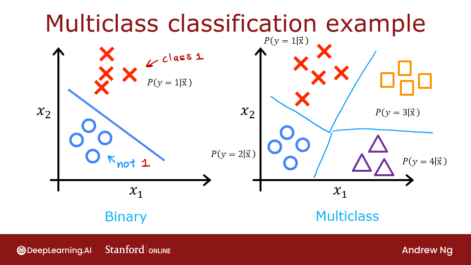
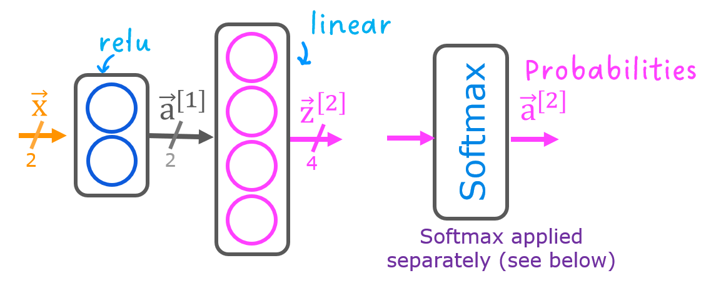
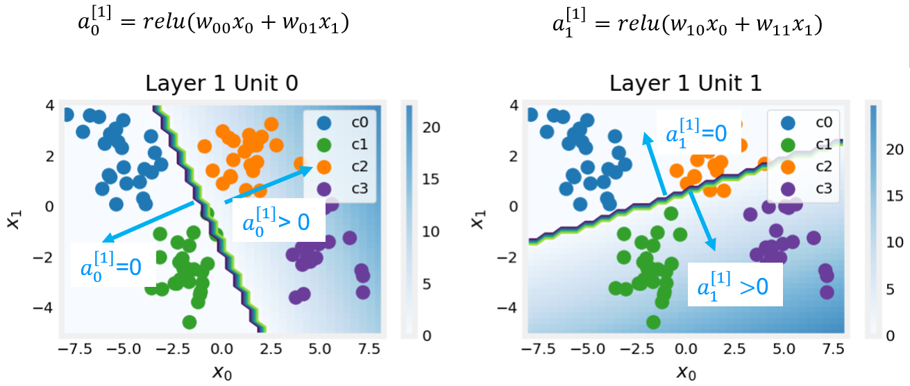
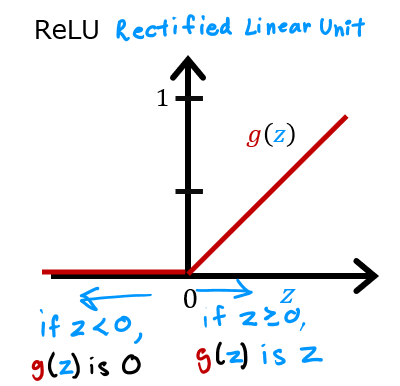
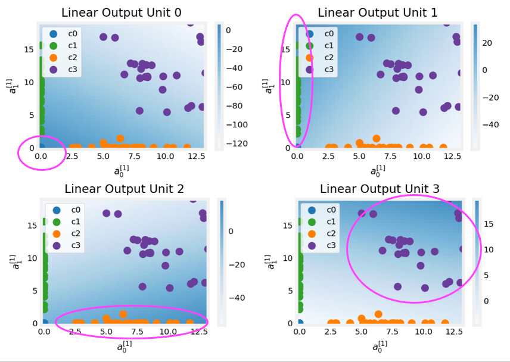

<!-- 本文件由课程原始 Notebook 转换并翻译。代码与公式保留原样。 -->
<!-- 原文件：2. Advanced Learning Algorithms/week 2/C2_W2_Multiclass_TF.ipynb -->

# 可选实验 - 多分类

## 1.1 目标
本实验使用神经网络完成一个多分类（multiclass classification）任务。
<figure>
 
</figure>

## 1.2 工具
本实验使用若干绘图辅助函数，它们位于当前目录的 `lab_utils_multiclass_TF.py`。

```python
import numpy as np
import matplotlib.pyplot as plt
%matplotlib widget
from sklearn.datasets import make_blobs
import tensorflow as tf
from tensorflow.keras.models import Sequential
from tensorflow.keras.layers import Dense
np.set_printoptions(precision=2)
from lab_utils_multiclass_TF import *
import logging
logging.getLogger("tensorflow").setLevel(logging.ERROR)
tf.autograph.set_verbosity(0)
```

# 2.0 多分类
神经网络（neural network）通常用于数据分类。神经网络：
- 接收一张照片，并把主体分类为 {狗、猫、马、其他}；
- 接收一个句子，并把其中每个词标注为 {名词、动词、形容词等}。

多分类网络的输出层包含多个单元，每个单元对应一个类别。给定输入样本后，输出值最大的单元代表预测类别；对 logits 应用 Softmax 后，可得到各类别的预测概率。

本实验先在 TensorFlow 中构建多分类模型，再观察神经网络如何生成预测。

先建立四类数据集。

## 2.1 准备数据并进行可视化
下面使用 scikit-learn 的 `make_blobs` 生成包含 4 个类别的训练数据。

```python
# make 4-class dataset for classification
classes = 4
m = 100
centers = [[-5, 2], [-2, -2], [1, 2], [5, -2]]
std = 1.0
X_train, y_train = make_blobs(n_samples=m, centers=centers, cluster_std=std,random_state=30)
```

```python
plt_mc(X_train,y_train,classes, centers, std=std)
```

```text
Canvas(toolbar=Toolbar(toolitems=[('Home', 'Reset original view', 'home', 'home'), ('Back', 'Back to previous …
```

每个点代表一个训练实例。坐标轴 $(x_0,x_1)$ 表示两个输入特征，颜色表示样本类别。训练后，模型接收新的样本 $(x_0,x_1)$ 并预测其类别。

此数据集在生成的同时，代表了许多现实世界分类（classification）问题。 这类问题具有多个输入特征 $(x_0,\ldots,x_n)$ 和多个输出类别，模型学习根据输入特征预测正确类别。

```python
# show classes in data set
print(f"unique classes {np.unique(y_train)}")
# show how classes are represented
print(f"class representation {y_train[:10]}")
# show shapes of our dataset
print(f"shape of X_train: {X_train.shape}, shape of y_train: {y_train.shape}")
```

```text
unique classes [0 1 2 3]
class representation [3 3 3 0 3 3 3 3 2 0]
shape of X_train: (100, 2), shape of y_train: (100,)
```

## 2.2 模型

这个实验将使用显示的2层网络。
不同于二进制分类网络，这个网络有四个输出，每个类一个输出。给定一个输入样本，输出值最大的单元对应预测类别。

下面用 TensorFlow 构建该网络。输出层使用 `linear`，而不是直接使用 `softmax`。训练时把线性输出（logits）交给损失函数处理；需要概率时再显式应用 Softmax。

```python
tf.random.set_seed(1234)  # applied to achieve consistent results
model = Sequential(
    [
        Dense(2, activation = 'relu',   name = "L1"),
        Dense(4, activation = 'linear', name = "L2")
    ]
)
```

下面编译并训练网络。损失函数参数 `from_logits=True` 表示模型输出是线性 logits，而非 Softmax 概率。

```python
model.compile(
    loss=tf.keras.losses.SparseCategoricalCrossentropy(from_logits=True),
    optimizer=tf.keras.optimizers.Adam(0.01),
)

model.fit(
    X_train,y_train,
    epochs=200
)
```

```text
（训练日志已省略。运行上方代码单元格可查看每个 epoch 的完整输出。）
```

```text
<keras.callbacks.History at 0x795f7c41d350>
```

随着模型的训练，我们可以看到模型是如何对训练数据进行分类的。

```python
plt_cat_mc(X_train, y_train, model, classes)
```

```text
Canvas(toolbar=Toolbar(toolitems=[('Home', 'Reset original view', 'home', 'home'), ('Back', 'Back to previous …
```

上图的决策边界展示了模型如何划分输入空间。这个结构简单的网络已经能正确分类训练数据。下面进一步分析它的工作方式。

下面从模型中提取训练后的权重，并据此绘制每个神经元的响应区域，随后解释结果。掌握这些细节并不是使用神经网络的前提，但它们有助于建立对各层如何协同完成分类的直觉。

```python
# gather the trained parameters from the first layer
l1 = model.get_layer("L1")
W1,b1 = l1.get_weights()
```

```python
# plot the function of the first layer
plt_layer_relu(X_train, y_train.reshape(-1,), W1, b1, classes)
```

```text
Canvas(toolbar=Toolbar(toolitems=[('Home', 'Reset original view', 'home', 'home'), ('Back', 'Back to previous …
```

```python
# gather the trained parameters from the output layer
l2 = model.get_layer("L2")
W2, b2 = l2.get_weights()
# create the 'new features', the training examples after L1 transformation
Xl2 = np.maximum(0, np.dot(X_train,W1) + b1)

plt_output_layer_linear(Xl2, y_train.reshape(-1,), W2, b2, classes,
                        x0_rng = (-0.25,np.amax(Xl2[:,0])), x1_rng = (-0.25,np.amax(Xl2[:,1])))
```

```text
Canvas(toolbar=Toolbar(toolitems=[('Home', 'Reset original view', 'home', 'home'), ('Back', 'Back to previous …
```

## 说明
#### 第1层
这些图显示第一层神经元 0 和 1 的响应。坐标轴是输入 $(x_0,x_1)$，背景颜色表示神经元输出，数值范围见右侧色条。由于使用 ReLU，输出不限于 0～1；本例峰值超过 20。
图中的轮廓线表示 $a^{[1]}_j$ 从 0 变为非零的边界，也就是 ReLU 的转折位置。

神经元 0 把类别 0、1 与类别 2、3 分开：边界左侧的类别 0、1 输出为 0，右侧样本输出大于 0。
神经元 1 把类别 0、2 与类别 1、3 分开：边界线上方的类别 0、2 输出为 0，下方样本输出大于 0。下面观察下一层如何利用这些特征。

#### 第2层，输出层

这些图中的点是经过第一层变换后的训练样本。可把第一层看作生成了一组新特征；两条坐标轴分别是上一层输出 $a^{[1]}_0$ 和 $a^{[1]}_1$。与前面的分析一致，类别 0、1（蓝色和绿色）的 $a^{[1]}_0=0$，类别 0、2（蓝色和橙色）的 $a^{[1]}_1=0$。  
背景颜色表示每个输出单元的值。
输出单元 0 在接近 $(0,0)$ 的区域取得最大值，该区域对应类别 0（蓝色）。
单元 1 在左上角（类别 1，绿色）取得最大值。
单元 2 在右下角（类别 2，橙色）取得最大值。
单元 3 在右上角（类别 3，紫色）取得最大值。

从图表中看不出的另一个方面是，各输出单元的数值需要共同比较。某个输出单元的值较大还不足以决定类别；它还必须高于其他所有输出单元。损失函数 `SparseCategoricalCrossentropy` 内部使用 Softmax，在所有输出之间进行归一化，因此它与逐单元独立计算的激活函数不同。

希望这个例子帮助你理解多分类神经网络内部各层的作用。

## 恭喜完成！
你已经学会构建并使用神经网络完成多分类任务。

```python

```
