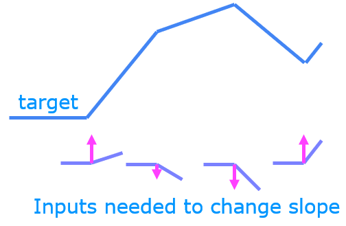
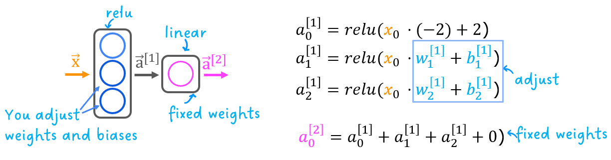
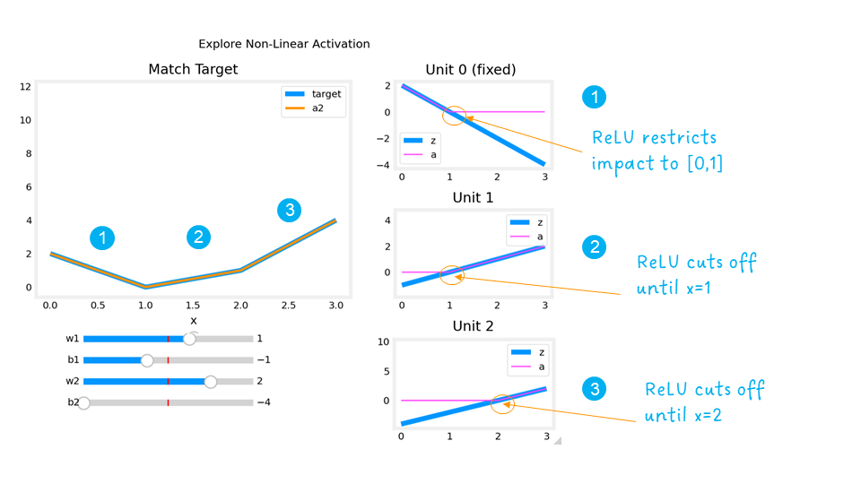

<!-- 本文件由课程原始 Notebook 转换并翻译。代码与公式保留原样。 -->
<!-- 原文件：2. Advanced Learning Algorithms/week 2/C2_W2_Relu.ipynb -->

# 可选实验 - ReLU激活

```python
# Importing libraries
import numpy as np
import matplotlib.pyplot as plt
from matplotlib.gridspec import GridSpec
plt.style.use('./deeplearning.mplstyle')
import tensorflow as tf
from tensorflow.keras.models import Sequential
from tensorflow.keras.layers import Dense, LeakyReLU
from tensorflow.keras.activations import linear, relu, sigmoid
%matplotlib widget
from matplotlib.widgets import Slider
from lab_utils_common import dlc
from autils import plt_act_trio
from lab_utils_relu import *
import warnings
warnings.simplefilter(action='ignore', category=UserWarning)
```

<a name="2"></a>
## 2 - ReLU Activation
本周引入了新的激活，即 " 校正线性单元 " (ReLU). 
$$
a = max(0,z) \quad\quad\text{ReLU function}
$$

```python
plt_act_trio()
```

```text
Canvas(toolbar=Toolbar(toolitems=[('Home', 'Reset original view', 'home', 'home'), ('Back', 'Back to previous …
```


右侧讲座的例子表明，ReLU。在这个例子中，产生的“认识”特征（feature）不是二进制，而是有连续的值范围。sigmoid用于打开/关闭或二进制状态。ReLU提供了连续的线性关系。此外，它有一个输出为零的“关闭”范围。
"关闭"特征制作ReLUa 非线性激活，为什么需要这个?

### 为什么需要非线性激活函数？
图中的函数由若干线性片段组成，即分段线性函数。每个片段内部斜率固定，在转折点处发生变化。可以把它理解为：在每个转折点加入一个新的线性分量，激活函数使该分量在转折点之前保持为 0。下面通过具体示例说明。

练习将使用下面的网络进行回归（regression）问题 :
  
第一层有3个单元，每个单元必须组成目标。第一层有预编程和固定的单元。你将修改单元1和单元2的权重和偏差，以建模第2和第3个单元。输出单元也是固定的，并简单地汇总第一层的输出。

使用下面的滑动器，修改权重和偏差（bias）以匹配目标。
提示： 以`w1`和`b1`离开`w2`和`b2`零直到匹配第二段。单击而不是滑动速度更快。如果有问题，请放心，下面的文字将更详细地描述这一点。

```python
_ = plt_relu_ex()
```

```text
Canvas(toolbar=Toolbar(toolitems=[('Home', 'Reset original view', 'home', 'home'), ('Back', 'Back to previous …
```

本练习旨在帮助你理解 ReLU 的非线性行为：它可以在某个线性分量尚不需要时将其关闭。下面结合示例观察这一过程。
 
右图展示了第一层各单元的输出。
从上到下看，单元 0 负责标记为 1 的第一段。图中同时显示了线性函数 $z$ 和经过 ReLU 后的输出 $a$。ReLU 在区间 $[0,1]$ 之后截断该单元的贡献，从而避免单元 0 干扰后续线段。

单元 1 负责第二段。ReLU 使该单元在 $x>1$ 之前保持关闭。由于单元 0 此时不再贡献，单元 1 的斜率 $w^{[1]}_1$ 就是目标线段的斜率。需要调整偏置，使线性输入在 $x=1$ 之前保持为负。单元 1 的贡献还会延伸到第三段。

单元 2 负责第三段。ReLU 在 $x$ 到达相应转折点之前将输出置为零。应设置单元 2 的斜率 $w^{[1]}_2$，使单元 1 与单元 2 的输出之和具有目标斜率；同时调整偏置，使其线性输入在 $x=2$ 之前保持为负。

ReLU 激活函数能够在不需要某个线性分量时将其“关闭”，从而使模型可以拼接多个线性片段，表示复杂的非线性函数。

## 恭喜完成！
你现在已经进一步理解了 ReLU 及其非线性行为的重要性。

```python

```
