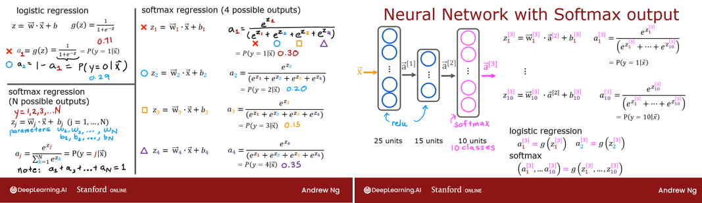
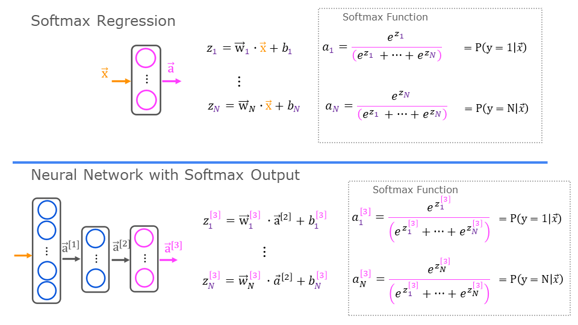
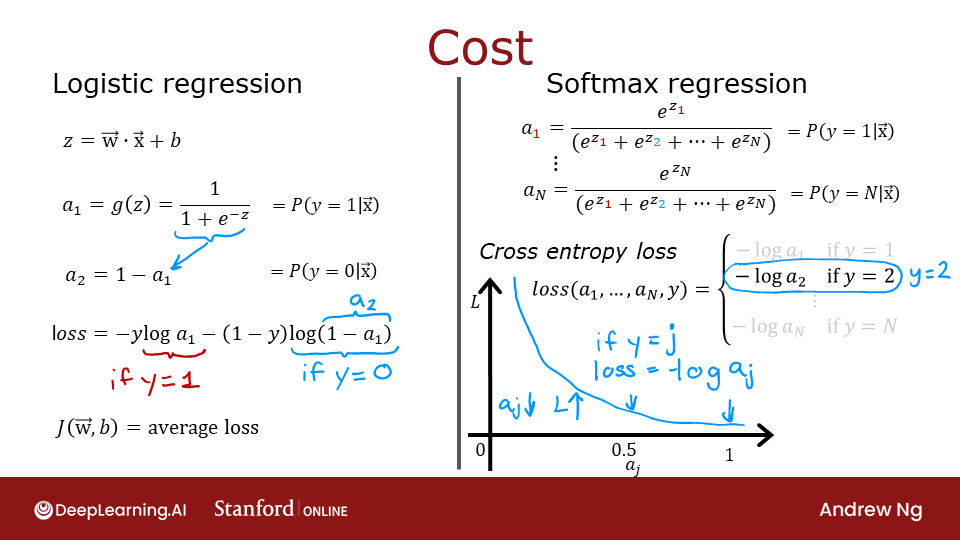
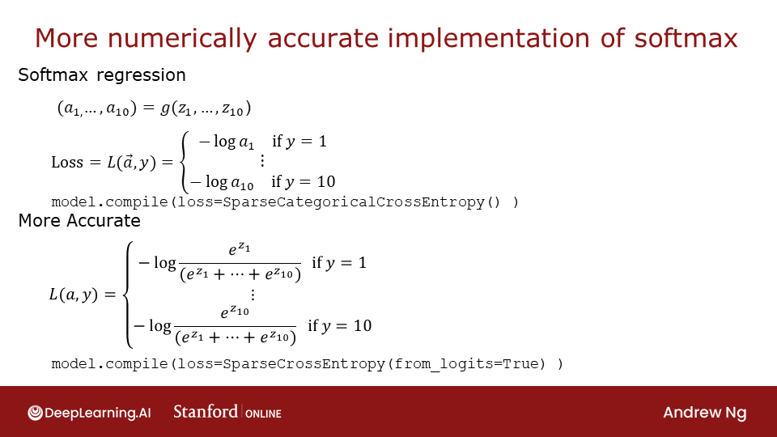

<!-- 本文件由课程原始 Notebook 转换并翻译。代码与公式保留原样。 -->
<!-- 原文件：2. Advanced Learning Algorithms/week 2/C2_W2_SoftMax.ipynb -->

# 可选实验：Softmax 函数
本实验介绍 Softmax 函数，以及它在神经网络中解决多分类（multiclass classification）问题的用法。

<center>    <center/>

```python
# Importing libraries
import numpy as np
import matplotlib.pyplot as plt
plt.style.use('./deeplearning.mplstyle')

# TensorFlow
import tensorflow as tf
from tensorflow.keras.models import Sequential
from tensorflow.keras.layers import Dense
from IPython.display import display, Markdown, Latex
from sklearn.datasets import make_blobs
%matplotlib widget
from matplotlib.widgets import Slider
from lab_utils_common import dlc
from lab_utils_softmax import plt_softmax
import logging
logging.getLogger("tensorflow").setLevel(logging.ERROR)
tf.autograph.set_verbosity(0)
```

> **说明：**本课程中的代码通常从 0 计数，因此常写作 $\sum_{i=0}^{N-1}$；讲座中的数学推导常从 1 计数，写作 $\sum_{i=1}^{N}$。本实验为了让公式更简洁，统一采用从 1 到 $N$ 的记法。

## Softmax 函数
Softmax 回归以及采用 Softmax 输出层的神经网络都会产生 $N$ 个输出，并选择其中一个作为预测类别。线性函数先生成向量 $\mathbf{z}$，Softmax 再将其转换为概率分布：每个分量位于 0～1，所有分量之和为 1；较大的输入对应较高的类别概率。
<center>  

Softmax 函数可写为：
$$
a_j = \frac{e^{z_j}}{ \sum_{k=1}^{N}{e^{z_k} }} \tag{1}
$$
输出$\mathbf{a}$是长度 N 的向量，所以Softmax 回归，也可以写：
$$
\begin{align}
\mathbf{a}(x) =
\begin{bmatrix}
P(y = 1 | \mathbf{x}; \mathbf{w},b) \\
\vdots \\
P(y = N | \mathbf{x}; \mathbf{w},b)
\end{bmatrix}
=
\frac{1}{ \sum_{k=1}^{N}{e^{z_k} }}
\begin{bmatrix}
e^{z_1} \\
\vdots \\
e^{z_{N}} \\
\end{bmatrix} \tag{2}
\end{align}
$$
显示输出是概率的向量。 第一个条目是输入的概率是输入的第一类$\mathbf{x}$参数$\mathbf{w}$和$\mathbf{b}$.  
下面用 NumPy 实现 Softmax：

```python
def my_softmax(z):
    ez = np.exp(z)              #element-wise exponenial
    sm = ez/np.sum(ez)
    return(sm)
```

下面把 `z` 改为幻灯片中的示例输入。

```python
plt.close("all")
plt_softmax(my_softmax)
```

```text
Canvas(toolbar=Toolbar(toolitems=[('Home', 'Reset original view', 'home', 'home'), ('Back', 'Back to previous …
```

由于你正在改变上面的z的值，有几件事需要注意：
* 数字中的指数Softmax放大值的小差异
* 输出值和1
* Softmax 会同时作用于所有输出。例如，改变 `z0` 会影响 `a0` 到 `a3`；ReLU 和 sigmoid 等激活函数通常分别作用于单个输入。

## 代价
<center>     <center/>

Softmax 使用的损失函数是交叉熵损失（cross-entropy loss）：
$$
\begin{equation}
  L(\mathbf{a},y)=\begin{cases}
    -log(a_1), & \text{if }y=1\text{}.\\
        &\vdots\\
     -log(a_N), & \text{if }y=N\text{}
  \end{cases} \tag{3}
\end{equation}
$$
对于目标类别 $y$，$\mathbf{a}$ 是 Softmax 输出的概率向量，所有分量之和为 1。
>**回顾：**在此过程中，损失就是一个例子，而代价涵盖所有的例子。
 
 
上面(3)中注意，只有与目标相对应的行导致损失，其他行为零。要写入代价方程，我们需要一个“指标函数”，即当索引与目标匹配时为1，否则为0。
    $$
    \mathbf{1}\{y=n\} = \begin{cases}
    1, & \text{if } y=n,\\
    0, & \text{otherwise}.
  \end{cases}
  $$
现在代价是：
$$
\begin{align}
J(\mathbf{w},b) = -\frac{1}{m} \left[ \sum_{i=1}^{m} \sum_{j=1}^{N}  1\left\{y^{(i)} == j\right\} \log \frac{e^{z^{(i)}_j}}{\sum_{k=1}^N e^{z^{(i)}_k} }\right] \tag{4}
\end{align}
$$
其中 $m$ 是样本数，$N$ 是输出类别数；代价是所有样本损失的平均值。

## Tensorflow
本实验比较 TensorFlow 中实现 Softmax 的两种方式：直接实现和推荐实现。前者较直观，后者的数值稳定性更好。

先创建一个用于训练多分类模型的数据集。

```python
# make  dataset for example
centers = [[-5, 2], [-2, -2], [1, 2], [5, -2]]
X_train, y_train = make_blobs(n_samples=2000, centers=centers, cluster_std=1.0,random_state=30)
```

### *明显*组织

下面的模型把 Softmax 作为最后一个 Dense 层的激活函数。
该损失函数会在 `compile` 中指定。

这里使用 `SparseCategoricalCrossentropy`，对应式 (3) 的交叉熵损失。若最后一层显式使用 Softmax，损失函数接收的输入就是概率向量。

```python
model = Sequential(
    [ 
        Dense(25, activation = 'relu'),
        Dense(15, activation = 'relu'),
        Dense(4, activation = 'softmax')    # < softmax activation here
    ]
)
model.compile(
    loss=tf.keras.losses.SparseCategoricalCrossentropy(),
    optimizer=tf.keras.optimizers.Adam(0.001),
)

model.fit(
    X_train,y_train,
    epochs=10
)
```

```text
（训练日志已省略。运行上方代码单元格可查看每个 epoch 的完整输出。）
```

```text
<keras.callbacks.History at 0x7518c3cea6d0>
```

由于输出层使用 Softmax，模型输出是概率向量。

```python
p_nonpreferred = model.predict(X_train)
print(p_nonpreferred [:2])
print("largest value", np.max(p_nonpreferred), "smallest value", np.min(p_nonpreferred))
```

```text
[[6.38e-03 2.76e-03 9.75e-01 1.63e-02]
 [9.94e-01 4.71e-03 8.14e-04 1.94e-04]]
largest value 0.9999964 smallest value 1.3198867e-08
```

### 推荐实现


回顾讲座内容：训练时把 Softmax 与损失函数合并计算，能提高数值稳定性；下面的“推荐实现”采用这种结构。

在推荐实现中，最后一层使用线性激活，其输出称为 *logits*。在损失函数中设置 `from_logits=True`，表示 Softmax 将与交叉熵一起计算，从而提高数值稳定性。

```python
preferred_model = Sequential(
    [ 
        Dense(25, activation = 'relu'),
        Dense(15, activation = 'relu'),
        Dense(4, activation = 'linear')   #<-- Note
    ]
)
preferred_model.compile(
    loss=tf.keras.losses.SparseCategoricalCrossentropy(from_logits=True),  #<-- Note
    optimizer=tf.keras.optimizers.Adam(0.001),
)

preferred_model.fit(
    X_train,y_train,
    epochs=10
)
```

```text
（训练日志已省略。运行上方代码单元格可查看每个 epoch 的完整输出。）
```

```text
<keras.callbacks.History at 0x7518a8381f90>
```

#### 输出处理
注意，在推荐的实现中，模型输出的是 logits，范围可以从很大的负数到很大的正数；需要概率时，再对输出应用 Softmax。
下面查看推荐实现的模型输出：

```python
p_preferred = preferred_model.predict(X_train)
print(f"two example output vectors:\n {p_preferred[:2]}")
print("largest value", np.max(p_preferred), "smallest value", np.min(p_preferred))
```

```text
two example output vectors:
 [[-2.03 -1.71  3.54 -1.24]
 [ 5.47 -0.22 -6.76 -4.36]]
largest value 16.055574 smallest value -11.157276
```

这些 logits 还不是概率。
如果需要概率，应再用 [Softmax](https://www.tensorflow.org/api_docs/python/tf/nn/softmax)。

```python
sm_preferred = tf.nn.softmax(p_preferred).numpy()
print(f"two example output vectors:\n {sm_preferred[:2]}")
print("largest value", np.max(sm_preferred), "smallest value", np.min(sm_preferred))
```

```text
two example output vectors:
 [[3.73e-03 5.12e-03 9.83e-01 8.25e-03]
 [9.97e-01 3.36e-03 4.83e-06 5.33e-05]]
largest value 0.99999857 smallest value 8.674334e-11
```

要选择最可能的类别，请Softmax。可以使用[np.argmax()](https://numpy.org/doc/stable/reference/generated/numpy.argmax.html).

```python
for i in range(5):
    print( f"{p_preferred[i]}, category: {np.argmax(p_preferred[i])}")
```

```text
[-2.03 -1.71  3.54 -1.24], category: 2
[ 5.47 -0.22 -6.76 -4.36], category: 0
[ 3.78  0.14 -5.08 -3.72], category: 0
[-2.53  3.16 -2.32 -2.28], category: 1
[-0.73 -3.59  3.89 -3.31], category: 2
```

## SparseCatorial Crossentropy 或分类杂交
TensorFlow对目标值有两种潜在格式，对损失的选择规定了预期的。
- `SparseCategoricalCrossentropy` 要求目标值是类别索引对应的整数。例如共有 10 个类别时，$y$ 取 0～9。
- 分类 CrossEntropy : 期望一个示例的目标值是一热编码，其中目标指数的值为 1，而其他 N-1 条目为 0。一个有10 潜在目标值的例子，其中目标值为 2 将是 [0, 0, 0, 0, 0] 。

## 恭喜完成！
本实验介绍了 Softmax 的基本计算、数值稳定性问题，以及 TensorFlow 中推荐的实现方式。
- 进一步理解了 Softmax 函数，以及它在 Softmax 回归和神经网络输出层中的作用。 
- 学会了在TensorFlow:
    - 最后一层没有激活(与线性激活相同)
    - SparseCatographical 杂交损失函数
    - 使用来自 logits= True
- 承认这一点与ReLU和sigmoid，则Softmax跨多个输出。

```python

```

```python

```
