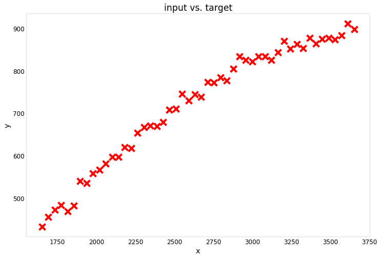
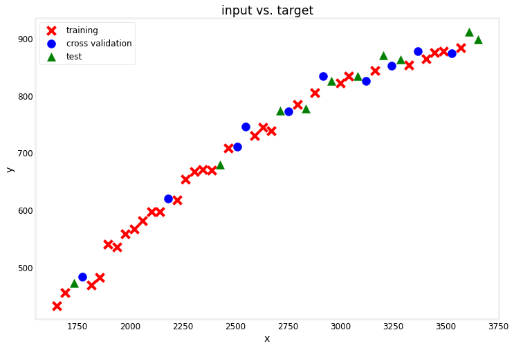
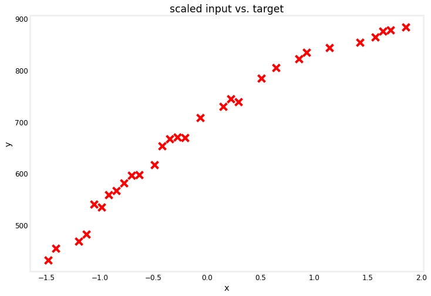
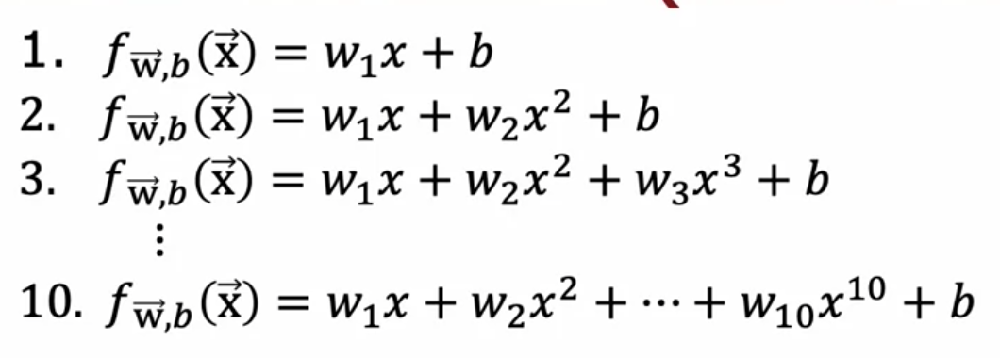
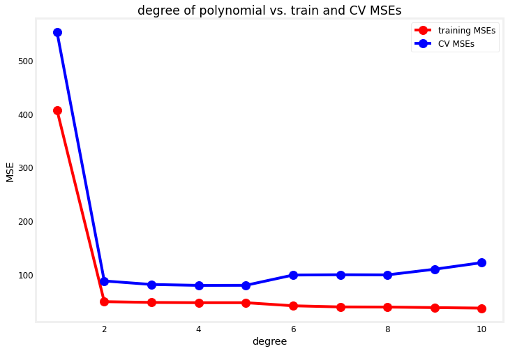
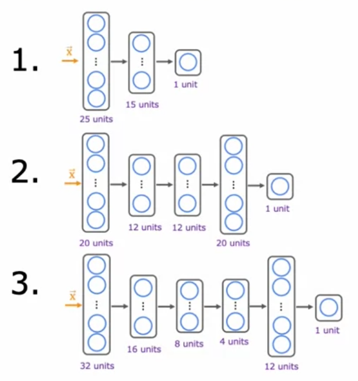
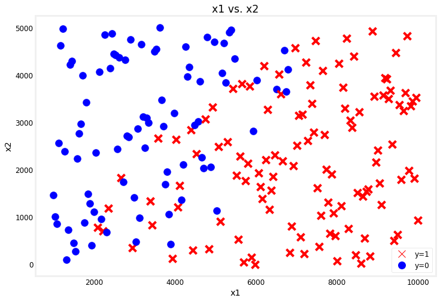

<!-- 本文件由课程原始 Notebook 转换并翻译。代码与公式保留原样。 -->
<!-- 原文件：2. Advanced Learning Algorithms/week 3/C2W3_Lab_01_Model_Evaluation_and_Selection.ipynb -->

# 可选实验： 模型评估与选择

在真实应用中，量化学习算法的性能并比较不同模型是机器学习的常见任务。本实验将依据课堂中介绍的方法练习这些步骤。具体来说，你将：

* 将数据集分为训练、交叉验证和测试集
* 评价回归（regression）和分类（classification）模型
* 添加多项式特征，以改善线性回归模型的性能
* 比较几个神经网络（neural network）结构

本实验还会帮助你熟悉本周编程作业中将要使用的代码。

## 导入依赖并设置实验环境

首先导入本实验所需的软件包。随后的一些设置用于减少冗余输出并隐藏非关键警告，使结果更易阅读。

```python
# Importing libraries
# for array computations and loading data
import numpy as np

# for building linear regression models and preparing data
from sklearn.linear_model import LinearRegression
from sklearn.preprocessing import StandardScaler, PolynomialFeatures
from sklearn.model_selection import train_test_split
from sklearn.metrics import mean_squared_error

# for building and training neural networks
import tensorflow as tf

# custom functions
import utils

# reduce display precision on numpy arrays
np.set_printoptions(precision=2)

# suppress warnings
tf.get_logger().setLevel('ERROR')
tf.autograph.set_verbosity(0)
```

## 回归

首先，你的任务是开发一个模型回归问题。下面的数据集包含50个输入实例特征 `x`及其相应目标`y`.

```python
# Load the dataset from the text file
data = np.loadtxt('./data/data_w3_ex1.csv', delimiter=',')

# Split the inputs and outputs into separate arrays
x = data[:,0]
y = data[:,1]

# Convert 1-D arrays into 2-D because the commands later will require it
x = np.expand_dims(x, axis=1)
y = np.expand_dims(y, axis=1)

print(f"the shape of the inputs x is: {x.shape}")
print(f"the shape of the targets y is: {y.shape}")
```

```text
the shape of the inputs x is: (50, 1)
the shape of the targets y is: (50, 1)
```

你可以绘制数据集以了解目标在输入方面的表现。 如果你想要检查代码， 你可以找到`plot_dataset()`函数`utils.py`这本笔记本外的文件。

```python
# Plot the entire dataset
utils.plot_dataset(x=x, y=y, title="input vs. target")
```



## 将数据集分为训练、交叉验证和测试集

在以前的实验中， 你可能已经使用整个数据集来训练你的模型。 然而， 在实际操作中， 你最好保留一部分数据来测量你的模型对新实例的概括程度 。 这将让你知道模型是否过于适合你的模型 。训练集（training set）.

如讲座所述，通常将数据分成三个部分：

* ***训练集*** - 用来训练模型
* ***交叉验证集（cross-validation set）(也称为验证、开发或dev set)*** - 用来评价你选择的不同模型配置。 例如， 你可以用它来决定什么是多项式特征添加到你的数据集中。
* ***测试集（test set）*** - 用来对照新实例对你所选择的模型的性能进行公平的估计。在你仍在开发模型时，这不应用于作出决定。

scikit-learn 提供 [`train_test_split`](https://scikit-learn.org/stable/modules/generated/sklearn.model_selection.train_test_split.html) 来完成上述划分。下面把完整数据集分为 60% 训练集、20% 交叉验证集和 20% 测试集。

```python
# Data splitting
# Get 60% of the dataset as the training set. Put the remaining 40% in temporary variables: x_ and y_.
x_train, x_, y_train, y_ = train_test_split(x, y, test_size=0.40, random_state=1)

# Split the 40% subset above into two: one half for cross validation and the other for the test set
x_cv, x_test, y_cv, y_test = train_test_split(x_, y_, test_size=0.50, random_state=1)

# Delete temporary variables
del x_, y_

print(f"the shape of the training set (input) is: {x_train.shape}")
print(f"the shape of the training set (target) is: {y_train.shape}\n")
print(f"the shape of the cross validation set (input) is: {x_cv.shape}")
print(f"the shape of the cross validation set (target) is: {y_cv.shape}\n")
print(f"the shape of the test set (input) is: {x_test.shape}")
print(f"the shape of the test set (target) is: {y_test.shape}")
```

```text
the shape of the training set (input) is: (30, 1)
the shape of the training set (target) is: (30, 1)

the shape of the cross validation set (input) is: (10, 1)
the shape of the cross validation set (target) is: (10, 1)

the shape of the test set (input) is: (10, 1)
the shape of the test set (target) is: (10, 1)
```

你可以在下面再次绘制数据集，以查看哪些点被用作训练、交叉验证或测试数据。

```python
utils.plot_train_cv_test(x_train, y_train, x_cv, y_cv, x_test, y_test, title="input vs. target")
```



## 拟合线性模型

数据拆分完成后，先拟合一个线性模型，作为后续比较的基线。

### 特征缩放

前面的课程已经说明，当不同特征的数值范围差异很大时，特征缩放通常能帮助模型更快收敛。本实验会加入多项式特征，例如 $x$ 大约在 1600～3600，而 $x^2$ 大约在 256 万～1296 万，因此缩放尤其必要。

第一个模型只使用 $x$，但仍先练习特征缩放，后续加入多项式特征时会复用该流程。这里使用 scikit-learn 的 [`StandardScaler`](https://scikit-learn.org/stable/modules/generated/sklearn.preprocessing.StandardScaler.html) 计算输入的 Z-score：

$$
z = \frac{x - \mu}{\sigma}
$$

其中，$\mu$ 是特征均值，$\sigma$ 是标准差。下面的代码使用训练集计算这两个统计量并完成标准化。

```python
# Scaling
# Initialize the class
scaler_linear = StandardScaler()

# Compute the mean and standard deviation of the training set then transform it
X_train_scaled = scaler_linear.fit_transform(x_train)

print(f"Computed mean of the training set: {scaler_linear.mean_.squeeze():.2f}")
print(f"Computed standard deviation of the training set: {scaler_linear.scale_.squeeze():.2f}")

# Plot the results
utils.plot_dataset(x=X_train_scaled, y=y_train, title="scaled input vs. target")
```

```text
Computed mean of the training set: 2504.06
Computed standard deviation of the training set: 574.85
```



### 训练模型

接下来，你将创建和训练一个回归模型。实验，你将使用[LinearRegression](https://scikit-learn.org/stable/modules/generated/sklearn.linear_model.LinearRegression.html)类，但注意还有其他[linear regressors](https://scikit-learn.org/stable/modules/classes.html#classical-linear-regressors)你也可以使用这些工具。

```python
# Defining model
# Initialize the class
linear_model = LinearRegression()

# Training
# Train the model
linear_model.fit(X_train_scaled, y_train )
```

```text
LinearRegression(copy_X=True, fit_intercept=True, n_jobs=None, normalize=False)
```

### 评估模型

为了评价模型性能，需要分别计算训练集和交叉验证集的误差。对于回归任务，使用均方误差（mean squared error, MSE）：

$$
J_{train}(\vec{w}, b) = \frac{1}{2m_{train}}\left[\sum_{i=1}^{m_{train}}(f_{\vec{w},b}(\vec{x}_{train}^{(i)}) - y_{train}^{(i)})^2\right]
$$

scikit-learn 提供内置的 [`mean_squared_error()`](https://scikit-learn.org/stable/modules/generated/sklearn.metrics.mean_squared_error.html) 函数。根据 [文档](https://scikit-learn.org/stable/modules/model_evaluation.html#mean-squared-error)，它只除以样本数 `m`，而本课程前面定义的代价函数除以 `2m`（代码中写作 `2*m`）。两种定义都可用于比较模型；为与上式一致，下面把 scikit-learn 的结果再除以 2，并用手工实现验证两者相等。

另外一点值得注意：因为你对模型进行了关于缩放值的训练（即使用 Z 分数，你还应在缩放中输入训练集而不是它的原始价值。

```python
# Feed the scaled training set and get the predictions
yhat = linear_model.predict(X_train_scaled)

# Use scikit-learn's utility function and divide by 2
print(f"training MSE (using sklearn function): {mean_squared_error(y_train, yhat) / 2}")

# for-loop implementation
total_squared_error = 0

for i in range(len(yhat)):
    squared_error_i  = (yhat[i] - y_train[i])**2
    total_squared_error += squared_error_i                                              

mse = total_squared_error / (2*len(yhat))

print(f"training MSE (for-loop implementation): {mse.squeeze()}")
```

```text
training MSE (using sklearn function): 406.19374192533155
training MSE (for-loop implementation): 406.19374192533155
```

然后，你可以计算 MSE 为：交叉验证集基本上相同的方程式：

$$
J_{cv}(\vec{w}, b) = \frac{1}{2m_{cv}}\left[\sum_{i=1}^{m_{cv}}(f_{\vec{w},b}(\vec{x}_{cv}^{(i)}) - y_{cv}^{(i)})^2\right]
$$

交叉验证集也需要缩放。使用 Z-score 时，必须沿用**训练集**的均值和标准差来缩放交叉验证集。这样可避免把验证集信息泄漏到预处理步骤。可用下面的直观例子理解：

* 说说你的训练集有输入特征等于`500`缩放到`0.5`使用Z分数。
* 训练后， 你的模型能够准确映射此缩放输入`x=0.5`切换到目标输出`y=300`. 
* 假设模型部署后，某位用户提供了取值为 `500` 的样本。 
* 如果使用平均偏差和标准偏差的任何其他值获得该输入样本的z分数，则可能不会缩放为`0.5`你的模型很可能作错误的预测。即不等于`y=300`). 

你会放大交叉验证集使用相同的方法`StandardScaler`你以前用过，但只叫它[`transform()`](https://scikit-learn.org/stable/modules/generated/sklearn.preprocessing.StandardScaler.html#sklearn.preprocessing.StandardScaler.transform)方法代替[`fit_transform()`](https://scikit-learn.org/stable/modules/generated/sklearn.preprocessing.StandardScaler.html#sklearn.preprocessing.StandardScaler.fit_transform).

```python
# Scale the cross validation set using the mean and standard deviation of the training set
X_cv_scaled = scaler_linear.transform(x_cv)

print(f"Mean used to scale the CV set: {scaler_linear.mean_.squeeze():.2f}")
print(f"Standard deviation used to scale the CV set: {scaler_linear.scale_.squeeze():.2f}")

# Feed the scaled cross validation set
yhat = linear_model.predict(X_cv_scaled)

# Use scikit-learn's utility function and divide by 2
print(f"Cross validation MSE: {mean_squared_error(y_cv, yhat) / 2}")
```

```text
Mean used to scale the CV set: 2504.06
Standard deviation used to scale the CV set: 574.85
Cross validation MSE: 551.7789026952216
```

## 添加多项式特征

从前面的图可以看出，随着 $x$ 增大，目标 $y$ 的增长逐渐趋缓，因此直线可能不是最佳选择。已经得到线性模型在训练集和交叉验证集上的 MSE 后，可以加入多项式特征，检查模型性能是否改善。整体流程不变，只需增加相应的预处理步骤。

### 构造额外特征

首先从训练集生成多项式特征。下面使用 scikit-learn 的 [`PolynomialFeatures`](https://scikit-learn.org/stable/modules/generated/sklearn.preprocessing.PolynomialFeatures.html) 类，以 2 次多项式为例，将输入 $x$ 扩展为 $x$ 和 $x^2$。

```python
# Adding polynomial features
# Instantiate the class to make polynomial features
poly = PolynomialFeatures(degree=2, include_bias=False)

# Compute the number of features and transform the training set
X_train_mapped = poly.fit_transform(x_train)

# Preview the first 5 elements of the new training set. Left column is `x` and right column is `x^2`
# Note: The `e+<number>` in the output denotes how many places the decimal point should 
# be moved. For example, `3.24e+03` is equal to `3240`
print(X_train_mapped[:5])
```

```text
[[3.32e+03 1.11e+07]
 [2.34e+03 5.50e+06]
 [3.49e+03 1.22e+07]
 [2.63e+03 6.92e+06]
 [2.59e+03 6.71e+06]]
```

然后，你将像以前那样扩大输入，缩小数值范围。

```python
# Scaling polynomial features
# Instantiate the class
scaler_poly = StandardScaler()

# Compute the mean and standard deviation of the training set then transform it
X_train_mapped_scaled = scaler_poly.fit_transform(X_train_mapped)

# Preview the first 5 elements of the scaled training set.
print(X_train_mapped_scaled[:5])
```

```text
[[ 1.43  1.47]
 [-0.28 -0.36]
 [ 1.71  1.84]
 [ 0.22  0.11]
 [ 0.15  0.04]]
```

完成多项式特征映射和缩放后即可训练模型。评估交叉验证集时，必须复用训练集上拟合的变换：添加相同次数的多项式特征，再用同一个缩放器变换数值。

```python
# Model evaluation

# Initialize the class
model = LinearRegression()

# Train the model
model.fit(X_train_mapped_scaled, y_train )

# Compute the training MSE
yhat = model.predict(X_train_mapped_scaled)
print(f"Training MSE: {mean_squared_error(y_train, yhat) / 2}")

# Add the polynomial features to the cross validation set
X_cv_mapped = poly.transform(x_cv)

# Scale the cross validation set using the mean and standard deviation of the training set
X_cv_mapped_scaled = scaler_poly.transform(X_cv_mapped)

# Compute the cross validation MSE
yhat = model.predict(X_cv_mapped_scaled)
print(f"Cross validation MSE: {mean_squared_error(y_cv, yhat) / 2}")
```

```text
Training MSE: 49.11160933402521
Cross validation MSE: 87.69841211111924
```

加入二次项后，训练集和交叉验证集的 MSE 都会发生明显变化。下面继续尝试更多多项式次数，并在 10 个候选模型中选择表现最好的一个。



你可以创建包含上一个步骤的循环代码单元格（code cell）。这里有一个执行增加了多项式特征最多为10度。我们将在结尾绘制，以便于比较每个模型的结果。

```python
# Plotting

# Initialize lists to save the errors, models, and feature transforms
train_mses = []
cv_mses = []
models = []
polys = []
scalers = []

# Loop over 10 times. Each adding one more degree of polynomial higher than the last.
for degree in range(1,11):
    
    # Add polynomial features to the training set
    poly = PolynomialFeatures(degree, include_bias=False)
    X_train_mapped = poly.fit_transform(x_train)
    polys.append(poly)
    
    # Scale the training set
    scaler_poly = StandardScaler()
    X_train_mapped_scaled = scaler_poly.fit_transform(X_train_mapped)
    scalers.append(scaler_poly)
    
    # Create and train the model
    model = LinearRegression()
    model.fit(X_train_mapped_scaled, y_train )
    models.append(model)
    
    # Compute the training MSE
    yhat = model.predict(X_train_mapped_scaled)
    train_mse = mean_squared_error(y_train, yhat) / 2
    train_mses.append(train_mse)
    
    # Add polynomial features and scale the cross validation set
    X_cv_mapped = poly.transform(x_cv)
    X_cv_mapped_scaled = scaler_poly.transform(X_cv_mapped)
    
    # Compute the cross validation MSE
    yhat = model.predict(X_cv_mapped_scaled)
    cv_mse = mean_squared_error(y_cv, yhat) / 2
    cv_mses.append(cv_mse)
    
# Plot the results
degrees=range(1,11)
utils.plot_train_cv_mses(degrees, train_mses, cv_mses, title="degree of polynomial vs. train and CV MSEs")
```



### 选择最佳模型

选择模型时，应同时关注训练集和交叉验证集上的表现：模型既要学习训练数据中的规律，也不能过拟合。图中从 1 次到 2 次多项式时交叉验证误差显著下降，2～5 次变化较小，之后随着次数继续增加，误差总体上升。因此，应选择 `cv_mse` 最小的模型。

```python
# Selecting the best model # Lowest error

# Get the model with the lowest CV MSE (add 1 because list indices start at 0)
# This also corresponds to the degree of the polynomial added
degree = np.argmin(cv_mses) + 1
print(f"Lowest CV MSE is found in the model with degree={degree}")
```

```text
Lowest CV MSE is found in the model with degree=4
```

通过在测试集上计算 MSE，可以估计模型的泛化误差。和训练集、交叉验证集一样，测试数据必须使用相同的预处理变换。

```python
# Overall result

# Add polynomial features to the test set
X_test_mapped = polys[degree-1].transform(x_test)

# Scale the test set
X_test_mapped_scaled = scalers[degree-1].transform(X_test_mapped)

# Compute the test MSE
yhat = models[degree-1].predict(X_test_mapped_scaled)
test_mse = mean_squared_error(y_test, yhat) / 2

print(f"Training MSE: {train_mses[degree-1]:.2f}")
print(f"Cross Validation MSE: {cv_mses[degree-1]:.2f}")
print(f"Test MSE: {test_mse:.2f}")
```

```text
Training MSE: 47.15
Cross Validation MSE: 79.43
Test MSE: 104.63
```

## 神经网络

同样的模型选择流程也适用于神经网络架构。下面构建多个神经网络，并将其用于相同的回归任务。



### 准备数据

继续使用上一节生成的训练集、交叉验证集和测试集。神经网络能够学习非线性关系，因此可以不显式添加高次多项式特征；下面保留相关代码供实验，参数 `degree` 默认为 `1`，即直接使用 `x_train`、`x_cv` 和 `x_test`。

```python
# Data Preparation

# Add polynomial features
degree = 1
poly = PolynomialFeatures(degree, include_bias=False)
X_train_mapped = poly.fit_transform(x_train)
X_cv_mapped = poly.transform(x_cv)
X_test_mapped = poly.transform(x_test)
```

接下来缩放输入特征以帮助梯度下降更快收敛。缩放器只能在训练集上调用 `fit_transform()`；对交叉验证集和测试集必须调用同一缩放器的 `transform()`。

```python
# Scale the features using the z-score
scaler = StandardScaler()
X_train_mapped_scaled = scaler.fit_transform(X_train_mapped)
X_cv_mapped_scaled = scaler.transform(X_cv_mapped)
X_test_mapped_scaled = scaler.transform(X_test_mapped)
```

### 构建并训练模型

接下来创建神经网络架构。模型定义位于 `utils.py` 的 `build_models()` 函数中；如需检查或修改可以打开该文件。循环会依次训练各模型，并记录训练误差和交叉验证误差。

```python
# Initialize lists that will contain the errors for each model
nn_train_mses = []
nn_cv_mses = []

# Build the models
nn_models = utils.build_models()

# Loop over the the models
for model in nn_models:
    
    # Setup the loss and optimizer
    model.compile(
    loss='mse',
    optimizer=tf.keras.optimizers.Adam(learning_rate=0.1),
    )

    print(f"Training {model.name}...")
    
    # Train the model
    model.fit(
        X_train_mapped_scaled, y_train,
        epochs=300,
        verbose=0
    )
    
    print("Done!\n")

    
    # Record the training MSEs
    yhat = model.predict(X_train_mapped_scaled)
    train_mse = mean_squared_error(y_train, yhat) / 2
    nn_train_mses.append(train_mse)
    
    # Record the cross validation MSEs 
    yhat = model.predict(X_cv_mapped_scaled)
    cv_mse = mean_squared_error(y_cv, yhat) / 2
    nn_cv_mses.append(cv_mse)

    
# print results
print("RESULTS:")
for model_num in range(len(nn_train_mses)):
    print(
        f"Model {model_num+1}: Training MSE: {nn_train_mses[model_num]:.2f}, " +
        f"CV MSE: {nn_cv_mses[model_num]:.2f}"
        )
```

```text
Training model_1...
Done!

Training model_2...
Done!

Training model_3...
Done!

RESULTS:
Model 1: Training MSE: 73.44, CV MSE: 113.87
Model 2: Training MSE: 73.40, CV MSE: 112.28
Model 3: Training MSE: 44.56, CV MSE: 88.51
```

从记录的错误中， 你可以决定哪一个是你应用程序的最佳模型 。 查看上面的结果， 看看你是否同意选中的 。`model_num`最后，你将计算测试误差，以估计它在多大程度上概括到新实例中。

```python
# Select the model with the lowest CV MSE
model_num = 3

# Compute the test MSE
yhat = nn_models[model_num-1].predict(X_test_mapped_scaled)
test_mse = mean_squared_error(y_test, yhat) / 2

print(f"Selected Model: {model_num}")
print(f"Training MSE: {nn_train_mses[model_num-1]:.2f}")
print(f"Cross Validation MSE: {nn_cv_mses[model_num-1]:.2f}")
print(f"Test MSE: {test_mse:.2f}")
```

```text
Selected Model: 3
Training MSE: 44.56
Cross Validation MSE: 88.51
Test MSE: 87.77
```

## 分类

在最后一部分实验，你将在一个分类任务。进程将相似，主要区别在于计算错误。你将在以下各节中看到。

### 加载数据集

首先，你要加载二进制的数据集分类任务。它有两个输入的200个实例特征 (`x1`和`x2`目标`y`两者之一`0`或`1`.

```python
# Load the dataset from a text file
data = np.loadtxt('./data/data_w3_ex2.csv', delimiter=',')

# Split the inputs and outputs into separate arrays
x_bc = data[:,:-1]
y_bc = data[:,-1]

# Convert y into 2-D because the commands later will require it (x is already 2-D)
y_bc = np.expand_dims(y_bc, axis=1)

print(f"the shape of the inputs x is: {x_bc.shape}")
print(f"the shape of the targets y is: {y_bc.shape}")
```

```text
the shape of the inputs x is: (200, 2)
the shape of the targets y is: (200, 1)
```

你可以绘制数据集以检查实例的分离方式。

```python
# Plotting
utils.plot_bc_dataset(x=x_bc, y=y_bc, title="x1 vs. x2")
```



### 拆分并准备数据集

接下来生成训练集、交叉验证集和测试集，比例与前面相同，为 60%/20%/20%，并按相同流程缩放特征。

```python
# Data splitting
from sklearn.model_selection import train_test_split

# Get 60% of the dataset as the training set. Put the remaining 40% in temporary variables.
x_bc_train, x_, y_bc_train, y_ = train_test_split(x_bc, y_bc, test_size=0.40, random_state=1)

# Split the 40% subset above into two: one half for cross validation and the other for the test set
x_bc_cv, x_bc_test, y_bc_cv, y_bc_test = train_test_split(x_, y_, test_size=0.50, random_state=1)

# Delete temporary variables
del x_, y_

print(f"the shape of the training set (input) is: {x_bc_train.shape}")
print(f"the shape of the training set (target) is: {y_bc_train.shape}\n")
print(f"the shape of the cross validation set (input) is: {x_bc_cv.shape}")
print(f"the shape of the cross validation set (target) is: {y_bc_cv.shape}\n")
print(f"the shape of the test set (input) is: {x_bc_test.shape}")
print(f"the shape of the test set (target) is: {y_bc_test.shape}")
```

```text
the shape of the training set (input) is: (120, 2)
the shape of the training set (target) is: (120, 1)

the shape of the cross validation set (input) is: (40, 2)
the shape of the cross validation set (target) is: (40, 1)

the shape of the test set (input) is: (40, 2)
the shape of the test set (target) is: (40, 1)
```

```python
# Scale the features

# Initialize the class
scaler_linear = StandardScaler()

# Compute the mean and standard deviation of the training set then transform it
x_bc_train_scaled = scaler_linear.fit_transform(x_bc_train)
x_bc_cv_scaled = scaler_linear.transform(x_bc_cv)
x_bc_test_scaled = scaler_linear.transform(x_bc_test)
```

### 评估分类模型的误差

前面的回归任务使用均方误差（mean squared error, MSE）衡量模型表现。分类任务可使用误分类比例：若 5 个样本中有 2 个预测错误，则分类误差为 `40%`，即 `0.4`。下面分别用循环和 NumPy 的 [`mean()`](https://numpy.org/doc/stable/reference/generated/numpy.mean.html) 计算该指标。

```python
# Evaluating errors

# Sample model output
probabilities = np.array([0.2, 0.6, 0.7, 0.3, 0.8])

# Apply a threshold to the model output. If greater than 0.5, set to 1. Else 0.
predictions = np.where(probabilities >= 0.5, 1, 0)

# Ground truth labels
ground_truth = np.array([1, 1, 1, 1, 1])

# Initialize counter for misclassified data
misclassified = 0

# Get number of predictions
num_predictions = len(predictions)

# Loop over each prediction
for i in range(num_predictions):
    
    # Check if it matches the ground truth
    if predictions[i] != ground_truth[i]:
        
        # Add one to the counter if the prediction is wrong
        misclassified += 1

# Compute the fraction of the data that the model misclassified
fraction_error = misclassified/num_predictions

print(f"probabilities: {probabilities}")
print(f"predictions with threshold=0.5: {predictions}")
print(f"targets: {ground_truth}")
print(f"fraction of misclassified data (for-loop): {fraction_error}")
print(f"fraction of misclassified data (with np.mean()): {np.mean(predictions != ground_truth)}")
```

```text
probabilities: [0.2 0.6 0.7 0.3 0.8]
predictions with threshold=0.5: [0 1 1 0 1]
targets: [1 1 1 1 1]
fraction of misclassified data (for-loop): 0.4
fraction of misclassified data (with np.mean()): 0.4
```

### 构建并训练模型

你会用同样的神经网络上一节中的架构，可以调用`build_models()`函数再次创建这些模型的新实例。

按照上周介绍的做法，输出层使用 `linear` 激活而非 `sigmoid`，并在声明损失函数时设置 `from_logits=True`。由于这是二分类问题，使用 [binary crossentropy loss](https://www.tensorflow.org/api_docs/python/tf/keras/losses/BinaryCrossentropy)。

训练结束后，你将使用[sigmoid function](https://www.tensorflow.org/api_docs/python/tf/math/sigmoid)将模型输出转换为概率。从那里可以设定一个阈值并从训练和交叉验证集中获取错误分类的实例。

下面的代码单元格实现了完整过程。

```python
# Model training

# Initialize lists that will contain the errors for each model
nn_train_error = []
nn_cv_error = []

# Build the models
models_bc = utils.build_models()

# Loop over each model
for model in models_bc:
    
    # Setup the loss and optimizer
    model.compile(
    loss=tf.keras.losses.BinaryCrossentropy(from_logits=True),
    optimizer=tf.keras.optimizers.Adam(learning_rate=0.01),
    )

    print(f"Training {model.name}...")

    # Train the model
    model.fit(
        x_bc_train_scaled, y_bc_train,
        epochs=200,
        verbose=0
    )
    
    print("Done!\n")
    
    # Set the threshold for classification
    threshold = 0.5
    
    # Record the fraction of misclassified examples for the training set
    yhat = model.predict(x_bc_train_scaled)
    yhat = tf.math.sigmoid(yhat)
    yhat = np.where(yhat >= threshold, 1, 0)
    train_error = np.mean(yhat != y_bc_train)
    nn_train_error.append(train_error)

    # Record the fraction of misclassified examples for the cross validation set
    yhat = model.predict(x_bc_cv_scaled)
    yhat = tf.math.sigmoid(yhat)
    yhat = np.where(yhat >= threshold, 1, 0)
    cv_error = np.mean(yhat != y_bc_cv)
    nn_cv_error.append(cv_error)

# Print the result
for model_num in range(len(nn_train_error)):
    print(
        f"Model {model_num+1}: Training Set Classification Error: {nn_train_error[model_num]:.5f}, " +
        f"CV Set Classification Error: {nn_cv_error[model_num]:.5f}"
        )
```

```text
Training model_1...
Done!

Training model_2...
Done!

Training model_3...
Done!

Model 1: Training Set Classification Error: 0.05833, CV Set Classification Error: 0.17500
Model 2: Training Set Classification Error: 0.06667, CV Set Classification Error: 0.15000
Model 3: Training Set Classification Error: 0.05000, CV Set Classification Error: 0.15000
```

从上面的输出中， 你可以选择哪个表现最好。 如果有平局 。交叉验证集错误，然后你可以添加另一个标准来打破它。例如，你可以选择一个训练误差较低的标准。一个更常见的方法是选择较小的模型，因为它节省了计算资源。在我们的例子中，模型1是最小的，模型3是最大的。

最后，可以计算测试误差来报告模型的概括性错误。

```python
# Model evaluation

# Select the model with the lowest error
model_num = 3

# Compute the test error
yhat = models_bc[model_num-1].predict(x_bc_test_scaled)
yhat = tf.math.sigmoid(yhat)
yhat = np.where(yhat >= threshold, 1, 0)
nn_test_error = np.mean(yhat != y_bc_test)

print(f"Selected Model: {model_num}")
print(f"Training Set Classification Error: {nn_train_error[model_num-1]:.4f}")
print(f"CV Set Classification Error: {nn_cv_error[model_num-1]:.4f}")
print(f"Test Set Classification Error: {nn_test_error:.4f}")
```

```text
Selected Model: 3
Training Set Classification Error: 0.0500
CV Set Classification Error: 0.1500
Test Set Classification Error: 0.1750
```

## 小结

在本实验中，你练习了如何评估模型性能，并在不同的模型配置之间进行选择。你把数据划分为训练集、交叉验证集和测试集，并了解了它们在机器学习项目中的不同作用。下一节将介绍如何通过诊断偏差（bias）和方差（variance）来改进模型。
