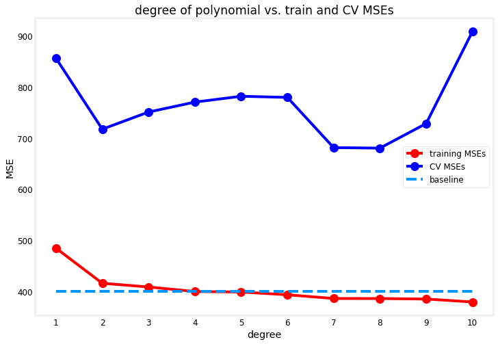
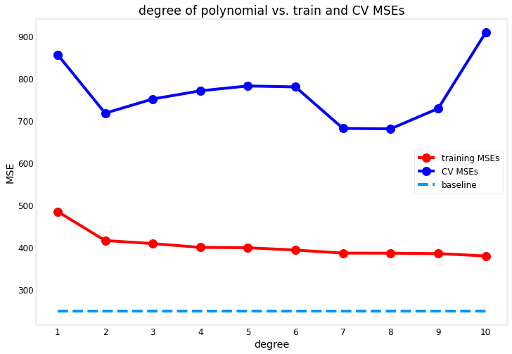
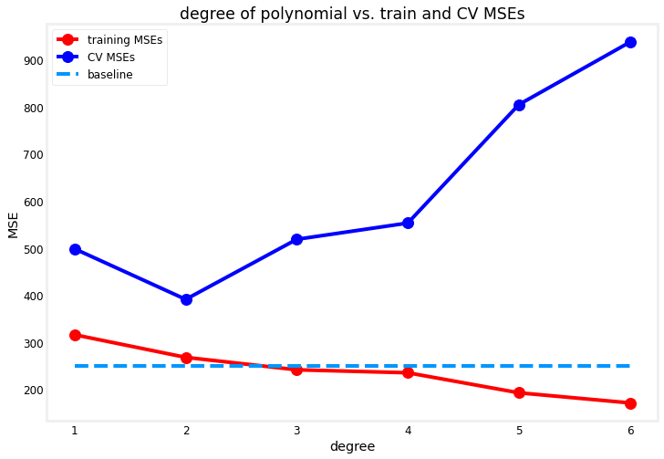
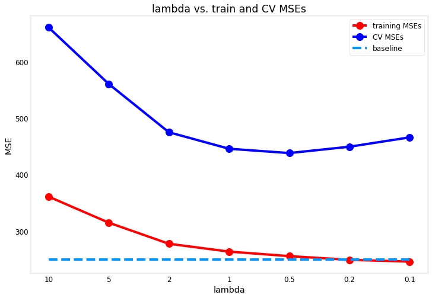
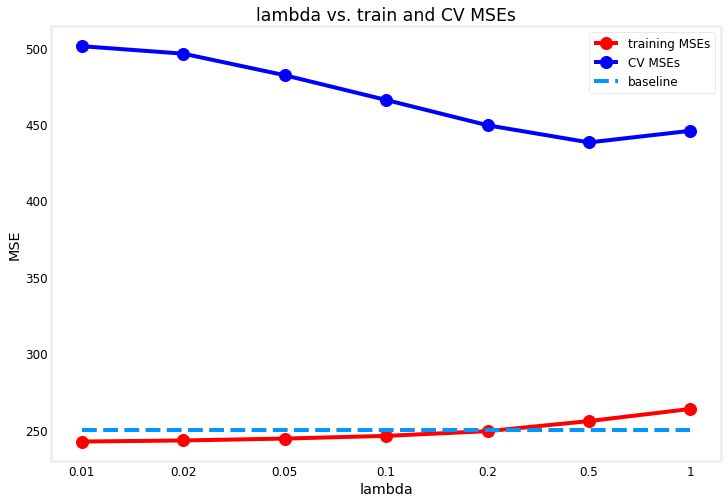
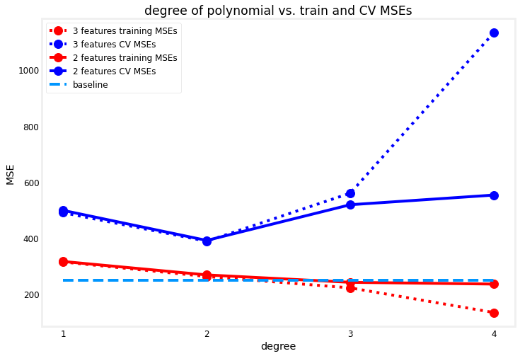
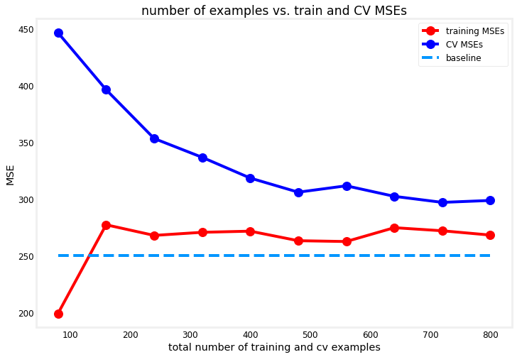

<!-- 本文件由课程原始 Notebook 转换并翻译。代码与公式保留原样。 -->
<!-- 原文件：2. Advanced Learning Algorithms/week 3/C2W3_Lab_02_Diagnosing_Bias_and_Variance.ipynb -->

# 可选实验： 诊断偏差（bias）和方差（variance）

在上一个可选实验中，你学习了如何用训练误差和交叉验证误差评价算法。本实验在此基础上判断模型是高偏差（欠拟合）还是高方差（过拟合），并据此选择改进方法。下图给出一个示例：


最左图表示高偏差：模型没有学到训练数据中的规律，因此训练误差和交叉验证误差都很高。最右图表示高方差：模型过度拟合训练集，训练误差很低，但在新样本上的交叉验证误差很高。中间的模型较为理想，既学到了数据规律，也能较好地泛化。

缓解高偏差问题，可以：
* 尝试增加多项式特征。
* 尝试增加有信息量的特征；
* 尝试减小正则化（regularization）参数

缓解高方差问题，可以：
* 尝试增加正则化参数
* 减少或筛选特征；
* 获得更多训练样本

本实验将逐一尝试这些方法。

## 建立性能基线

在诊断模型是高偏差还是高方差之前，通常应该首先了解你可以合理达到的误差水平。如课程中所述，你可以使用以下任何一种来设定一个基线性能水平。

* 人类专家的表现；
* 同类算法的已知表现；
* 基于领域知识的合理估计。

真实数据通常含有噪声，误差很难降到 0。例如，若训练误差为 10%、交叉验证误差为 15%，看似存在高偏差；但如果人类专家的误差也约为 10%，则模型相对基线的偏差并不高，主要问题是交叉验证误差比训练误差高出的 5%，即方差问题。

有鉴于此，我们开始探索解决这些问题的方法。

## 导入依赖并设置实验环境

除 scikit-learn 的若干 [linear regressors](https://scikit-learn.org/stable/modules/classes.html#classical-linear-regressors) 外，本实验使用的辅助函数都位于 `utils.py`。这些函数负责拆分数据、遍历候选参数（如多项式次数和正则化参数），并绘制各候选值对应的训练误差和交叉验证误差。

```python
# Importing libraries
# for building linear regression models
from sklearn.linear_model import LinearRegression, Ridge

# import lab utility functions in utils.py
import utils
```

## 处理高偏差

首先检查模型是否欠拟合（underfitting）：如果训练误差远高于基线性能，就说明模型存在高偏差。

### 尝试增加多项式特征

你已经看到，增加多项式特征可以让模型学习更复杂的规律。下图再次展示随着多项式次数增加，训练误差和交叉验证误差如何变化；这里使用一个合成回归数据集，并给出可比较的基线性能。

```python
# Fixing high bias
# By adding more polynomial features

# Data Splitting
# Split the dataset into train, cv, and test
x_train, y_train, x_cv, y_cv, x_test, y_test = utils.prepare_dataset('data/c2w3_lab2_data1.csv')

print(f"the shape of the training set (input) is: {x_train.shape}")
print(f"the shape of the training set (target) is: {y_train.shape}\n")
print(f"the shape of the cross validation set (input) is: {x_cv.shape}")
print(f"the shape of the cross validation set (target) is: {y_cv.shape}\n")

# Preview the first 5 rows
print(f"first 5 rows of the training inputs (1 feature):\n {x_train[:5]}\n")

# Defining models
# Instantiate the regression model class
model = LinearRegression()

# Adding polynomial degree
# Train and plot polynomial regression models
utils.train_plot_poly(model, x_train, y_train, x_cv, y_cv, max_degree=10, baseline=400)
```

```text
the shape of the training set (input) is: (60, 1)
the shape of the training set (target) is: (60,)

the shape of the cross validation set (input) is: (20, 1)
the shape of the cross validation set (target) is: (20,)

first 5 rows of the training inputs (1 feature):
 [[3757.57575758]
 [2878.78787879]
 [3545.45454545]
 [1575.75757576]
 [1666.66666667]]
```



如你所见， 随着多项式次数提高，模型对训练数据的拟合能力增强。在这个例子中，它的表现甚至比基线更好。此时，你可以说，次数大于 4 的模型可视为低偏差，因为它们的性能接近或优于基线。

如果基线误差更低，例如专家认为可接受误差远小于当前训练误差，那么该模型仍属于高偏差，应尝试相应的改进方法。

```python
# Train and plot polynomial regression models. Bias is defined lower.
utils.train_plot_poly(model, x_train, y_train, x_cv, y_cv, max_degree=10, baseline=250)
```



### 尝试获取更多特征

还可以收集新的有效特征。假设重新采集数据后增加了一个输入特征，数据集现在包含两列特征：

```python
x_train, y_train, x_cv, y_cv, x_test, y_test = utils.prepare_dataset('data/c2w3_lab2_data2.csv')

print(f"the shape of the training set (input) is: {x_train.shape}")
print(f"the shape of the training set (target) is: {y_train.shape}\n")
print(f"the shape of the cross validation set (input) is: {x_cv.shape}")
print(f"the shape of the cross validation set (target) is: {y_cv.shape}\n")

# Preview the first 5 rows
print(f"first 5 rows of the training inputs (2 features):\n {x_train[:5]}\n")
```

```text
the shape of the training set (input) is: (60, 2)
the shape of the training set (target) is: (60,)

the shape of the cross validation set (input) is: (20, 2)
the shape of the cross validation set (target) is: (20,)

first 5 rows of the training inputs (2 features):
 [[3.75757576e+03 5.49494949e+00]
 [2.87878788e+03 6.70707071e+00]
 [3.54545455e+03 3.71717172e+00]
 [1.57575758e+03 5.97979798e+00]
 [1.66666667e+03 1.61616162e+00]]
```

现在看看这对相同的训练过程有何影响。你会发现，训练误差现在更接近(甚至比基线更好).

```python
# Instantiate the model class
model = LinearRegression()

# Train and plot polynomial regression models. Dataset used has two features.
utils.train_plot_poly(model, x_train, y_train, x_cv, y_cv, max_degree=6, baseline=250)
```



### 尝试减小正则化参数

此时可以引入正则化来缓解过拟合。需要注意，正则化参数不应设置得过大。下面使用 [Ridge](https://scikit-learn.org/stable/modules/generated/sklearn.linear_model.Ridge.html#sklearn.linear_model.Ridge) 设置正则化参数 $\lambda$，尝试多个候选值并比较结果。

```python
# Decreasing the regularization parameters

# Define lambdas to plot
reg_params = [10, 5, 2, 1, 0.5, 0.2, 0.1]

# Define degree of polynomial and train for each value of lambda
utils.train_plot_reg_params(reg_params, x_train, y_train, x_cv, y_cv, degree= 4, baseline=250)
```



图中初始值 $\lambda=$ `10` 使训练误差高于基线，说明对参数 `w` 的惩罚过强，限制了模型学习复杂规律。减小 $\lambda$ 后，约束放宽，训练误差逐渐接近基线。

## 处理高方差

下面观察模型过拟合训练集时的表现。我们的目标是选择能够泛化到新样本、并使交叉验证误差尽可能小的模型。

### 尝试增大正则化参数

与上一种情况相反，正则化参数过小会使模型保持低偏差，却难以改善高方差。如下图所示，适当增大 $\lambda$ 可以降低交叉验证误差。

```python
# Fixing high variance
# By increasing regularization parameter

# Define lambdas to plot
reg_params = [0.01, 0.02, 0.05, 0.1, 0.2, 0.5, 1]

# Define degree of polynomial and train for each value of lambda
utils.train_plot_reg_params(reg_params, x_train, y_train, x_cv, y_cv, degree= 4, baseline=250)
```



### 尝试使用更小的特征集合

前面的实验已经说明，过多的多项式项会导致过拟合。减少无关特征有助于在训练误差与交叉验证误差之间取得更好平衡。例如，患者编号与肿瘤诊断无关，应从训练数据中删除。

为说明删除无关特征如何改善性能，下面比较两个多项式回归数据集：一个只含前面使用的 2 个有效特征，另一个额外加入随机 ID，共 3 个特征。两个数据集的前两列相同。

```python
# Fixing high variance
# By trying smaller sets of features

# Prepare dataset with randomID feature
x_train, y_train, x_cv, y_cv, x_test, y_test = utils.prepare_dataset('data/c2w3_lab2_data2.csv')

# Preview the first 5 rows
print(f"first 5 rows of the training set with 2 features:\n {x_train[:5]}\n")

# Prepare dataset with randomID feature
x_train, y_train, x_cv, y_cv, x_test, y_test = utils.prepare_dataset('data/c2w3_lab2_data3.csv')

# Preview the first 5 rows
print(f"first 5 rows of the training set with 3 features (1st column is a random ID):\n {x_train[:5]}\n")
```

```text
first 5 rows of the training set with 2 features:
 [[3.75757576e+03 5.49494949e+00]
 [2.87878788e+03 6.70707071e+00]
 [3.54545455e+03 3.71717172e+00]
 [1.57575758e+03 5.97979798e+00]
 [1.66666667e+03 1.61616162e+00]]

first 5 rows of the training set with 3 features (1st column is a random ID):
 [[1.41929130e+07 3.75757576e+03 5.49494949e+00]
 [1.51868310e+07 2.87878788e+03 6.70707071e+00]
 [1.92662630e+07 3.54545455e+03 3.71717172e+00]
 [1.25222490e+07 1.57575758e+03 5.97979798e+00]
 [1.76537960e+07 1.66666667e+03 1.61616162e+00]]
```

下面训练模型并绘制结果。实线表示 2 特征数据集的误差，虚线表示加入随机 ID 后的 3 特征数据集误差。随着多项式次数增加，含随机 ID 的模型交叉验证误差更高，因为模型试图从与目标无关的特征中学习。

也可以观察四次多项式对应的结果：，你会发现，虽然三特征模型的训练误差更低， 但训练误差与交叉验证误差之间的差距明显大于两特征模型，这也应当提醒你，模型是过拟合（overfitting）.

```python
# Define the model
model = LinearRegression()

# Define properties of the 2 datasets
file1 = {'filename':'data/c2w3_lab2_data3.csv', 'label': '3 features', 'linestyle': 'dotted'}
file2 = {'filename':'data/c2w3_lab2_data2.csv', 'label': '2 features', 'linestyle': 'solid'}
files = [file1, file2]

# Train and plot for each dataset
utils.train_plot_diff_datasets(model, files, max_degree=4, baseline=250)
```



### 获取更多训练样本

最后，你可以通过获得更多实例来尽量减少交叉验证误差。下面训练一个四次多项式模型，并绘制学习曲线，观察训练样本增加时误差如何变化。

```python
# Prepare the dataset
x_train, y_train, x_cv, y_cv, x_test, y_test = utils.prepare_dataset('data/c2w3_lab2_data4.csv')
print(f"the shape of the entire training set (input) is: {x_train.shape}")
print(f"the shape of the entire training set (target) is: {y_train.shape}\n")
print(f"the shape of the entire cross validation set (input) is: {x_cv.shape}")
print(f"the shape of the entire cross validation set (target) is: {y_cv.shape}\n")

# Instantiate the model class
model = LinearRegression()

# Define the degree of polynomial and train the model using subsets of the dataset.
utils.train_plot_learning_curve(model, x_train, y_train, x_cv, y_cv, degree= 4, baseline=250)
```

```text
the shape of the entire training set (input) is: (600, 2)
the shape of the entire training set (target) is: (600,)

the shape of the entire cross validation set (input) is: (200, 2)
the shape of the entire cross validation set (target) is: (200,)
```



结果显示，随着训练集增大，交叉验证误差逐渐接近训练误差。训练误差仍保持在较高水平，因此增加更多样本通常不能解决高偏差问题。

## 小结

本实验练习了如何识别并处理学习算法中的高偏差和高方差问题。这些判断能帮助你选择下一步改进模型的方法；后续讲座将进一步讨论机器学习项目的开发流程。
