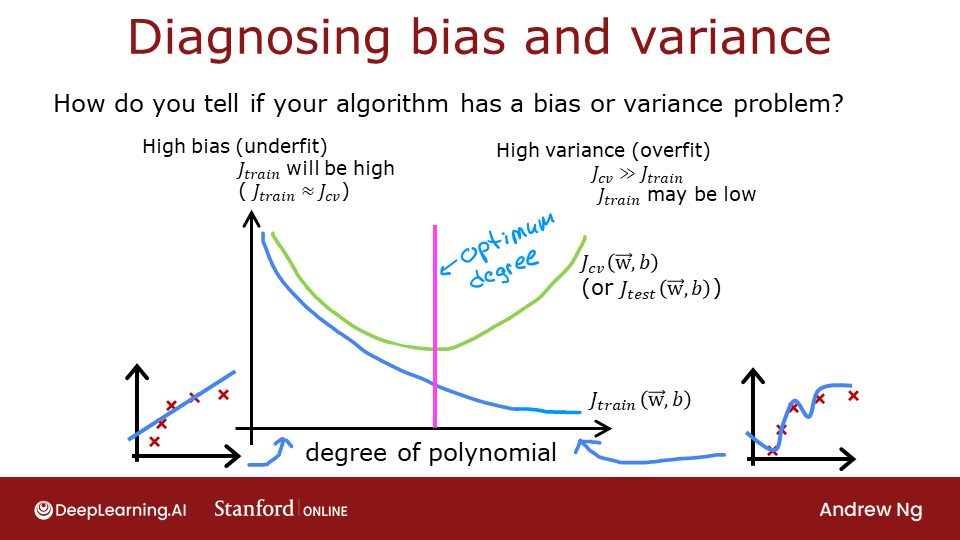
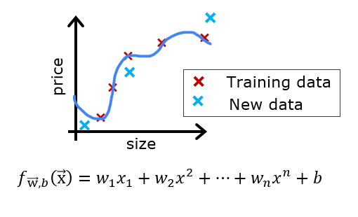

<!-- 本文件由课程原始 Notebook 转换并翻译。代码与公式保留原样。 -->
<!-- 原文件：2. Advanced Learning Algorithms/week 3/C2_W3_Assignment.ipynb -->

# 练习实验：应用机器学习的建议
本实验将探索评价并改进机器学习（machine learning）模型的多种方法。

# 内容提要
- [1 - 软件包](#1)
- [2 - 评估学习算法（多项式回归）](#2)
  - [ 2.1 Splitting your data set](#2.1)
  - [ 2.2 Error calculation for model evaluation, linear regression](#2.2)
    - [ Exercise 1](#ex01)
  - [ 2.3 Compare performance on training and test data](#2.3)
- [ 3 - Bias and Variance ](#3)
  - [ 3.1 Plot Train, Cross-Validation, Test](#3.1)
  - [ 3.2 Finding the optimal degree](#3.2)
  - [ 3.3 Tuning Regularization.](#3.3)
  - [ 3.4 Getting more data: Increasing Training Set Size (m)](#3.4)
- [4 - 评估学习算法（神经网络）](#4)
  - [ 4.1 Data Set](#4.1)
  - [ 4.2 Evaluating categorical model by calculating classification error](#4.2)
    - [ Exercise 2](#ex02)
- [5 - 模型复杂度](#5)
  - [ Exercise 3](#ex03)
  - [ 5.1 Simple model](#5.1)
    - [ Exercise 4](#ex04)
- [6 - 正则化](#6)
  - [ Exercise 5](#ex05)
- [ 7 - Iterate to find optimal regularization value](#7)
  - [ 7.1 Test](#7.1)

_**注意：**为避免自动评分出错，请勿编辑或删除非评分单元格，也不要在 Notebook 中新增单元格。_ 
_通过作业后，如果想尝试额外代码，可按 Notebook 末尾的说明解锁非评分单元格。_

<a name="1"></a>
## 1 - 软件包

首先运行下面的单元格，导入本作业所需的全部软件包。
- [numpy](https://numpy.org/)是科学计算的基本软件包Python.
- [matplotlib](http://matplotlib.org)是一个用于绘制图形的流行库Python.
- [scikitlearn](https://scikit-learn.org/stable/)是数据挖掘的基本库
- [tensorflow](https://www.tensorflow.org/)一个流行的平台机器学习（machine learning）.

```python
import numpy as np
%matplotlib widget
import matplotlib.pyplot as plt
from sklearn.linear_model import LinearRegression, Ridge
from sklearn.preprocessing import StandardScaler, PolynomialFeatures
from sklearn.model_selection import train_test_split
from sklearn.metrics import mean_squared_error
import tensorflow as tf
from tensorflow.keras.models import Sequential
from tensorflow.keras.layers import Dense
from tensorflow.keras.activations import relu,linear
from tensorflow.keras.losses import SparseCategoricalCrossentropy
from tensorflow.keras.optimizers import Adam

import logging
logging.getLogger("tensorflow").setLevel(logging.ERROR)

from public_tests_a1 import * 

tf.keras.backend.set_floatx('float64')
from assigment_utils import *

tf.autograph.set_verbosity(0)
```

<a name="2"></a>
## 2. 评估学习算法多项式回归（polynomial regression）)

假设你创造了一个机器学习（machine learning）模型，你发现它“适合”你的训练数据。你完成了吗?不完全。创建模型的目的是能够预测数值。<span style="color:blue">*新设*</span>实例。

在应用新数据之前，如何测试模型的性能?
答案有两个部分：
* 将原数据集分为"训练"和"试验"两组。
    * 使用训练数据来适应模型的参数
    * 使用测试数据来评价*新*数据上的模型
* 开发一个错误函数来评价你的模型 。

<a name="2.1"></a>
### 2.1 分割数据集
讲座建议将数据集的20%-40%保留用于测试。`sklearn`函数[train_test_split](https://scikit-learn.org/stable/modules/generated/sklearn.model_selection.train_test_split.html)。运行后双检查形状单元格。

```python
# Generate some data
X,y,x_ideal,y_ideal = gen_data(18, 2, 0.7)
print("X.shape", X.shape, "y.shape", y.shape)

#split the data using sklearn routine 
X_train, X_test, y_train, y_test = train_test_split(X,y,test_size=0.33, random_state=1)
print("X_train.shape", X_train.shape, "y_train.shape", y_train.shape)
print("X_test.shape", X_test.shape, "y_test.shape", y_test.shape)
```

```text
X.shape (18,) y.shape (18,)
X_train.shape (12,) y_train.shape (12,)
X_test.shape (6,) y_test.shape (6,)
```

#### 2.1.1 绘图列车、试验装置
下图同时显示训练数据（红色）和模型未见过的测试数据。该数据集由带噪声的四次函数生成，并绘制了无噪声的“理想”曲线作为参考。

```python
fig, ax = plt.subplots(1,1,figsize=(4,4))
ax.plot(x_ideal, y_ideal, "--", color = "orangered", label="y_ideal", lw=1)
ax.set_title("Training, Test",fontsize = 14)
ax.set_xlabel("x")
ax.set_ylabel("y")

ax.scatter(X_train, y_train, color = "red",           label="train")
ax.scatter(X_test, y_test,   color = dlc["dlblue"],   label="test")
ax.legend(loc='upper left')
plt.show()
```

```text
Canvas(toolbar=Toolbar(toolitems=[('Home', 'Reset original view', 'home', 'home'), ('Back', 'Back to previous …
```

<a name="2.2"></a>
### 2.2 模型评价的错误计算，线性回归（linear regression）
评估线性回归模型时，计算预测值与目标值之间平方误差的平均值：

$$
J_\text{test}(\mathbf{w},b) =
            \frac{1}{2m_\text{test}}\sum_{i=0}^{m_\text{test}-1} ( f_{\mathbf{w},b}(\mathbf{x}^{(i)}_\text{test}) - y^{(i)}_\text{test} )^2 
            \tag{1}
$$

<a name="ex01"></a>
### 练习 1

下面实现一个函数，用平方误差评估线性回归模型在给定数据集上的表现。

```python
# UNQ_C1
# GRADED CELL: eval_mse
def eval_mse(y, yhat):
    """ 
    Calculate the mean squared error on a data set.
    Args:
      y    : (ndarray  Shape (m,) or (m,1))  target value of each example
      yhat : (ndarray  Shape (m,) or (m,1))  predicted value of each example
    Returns:
      err: (scalar)             
    """
    m = len(y)
    err = 0.0
    for i in range(m):
    ### START CODE HERE ### 
        err+=(y[i]-yhat[i])**2
    
    ### END CODE HERE ### 
    err/= 2*m
    return(err)
```

```python
y_hat = np.array([2.4, 4.2])
y_tmp = np.array([2.3, 4.1])
eval_mse(y_hat, y_tmp)

# BEGIN UNIT TEST
test_eval_mse(eval_mse)   
# END UNIT TEST
```

```text
 All tests passed.
```

<details>
  <summary><font size="3" color="darkgreen"><b>点击查看提示</b></font></summary>

    
```Python
def eval_mse(y, yhat):
    """ 
    Calculate the mean squared error on a data set.
    Args:
      y    : (ndarray  Shape (m,) or (m,1))  target value of each example
      yhat : (ndarray  Shape (m,) or (m,1))  predicted value of each example
    Returns:
      err: (scalar)             
    """
    m = len(y)
    err = 0.0
    for i in range(m):
        err_i  = ( (yhat[i] - y[i])**2 ) 
        err   += err_i                                                                
    err = err / (2*m)                    
    return(err)
```

<a name="2.3"></a>
### 2.3 比较训练和测试数据的业绩
先构建一个高次多项式模型，使训练误差尽可能小。这里使用 scikit-learn 的线性回归；具体实现位于已导入的工具文件中。步骤如下：
* 创建并拟合模型（`fit` 表示用训练数据估计模型参数）；
* 计算训练集误差；
* 计算测试集误差。

```python
# create a model in sklearn, train on training data
degree = 10
lmodel = lin_model(degree)
lmodel.fit(X_train, y_train)

# predict on training data, find training error
yhat = lmodel.predict(X_train)
err_train = lmodel.mse(y_train, yhat)

# predict on test data, find error
yhat = lmodel.predict(X_test)
err_test = lmodel.mse(y_test, yhat)
```

训练集误差远低于测试集误差。

```python
print(f"training err {err_train:0.2f}, test err {err_test:0.2f}")
```

```text
training err 58.01, test err 171215.01
```

下面的图显示了这是为什么。 模型非常适合训练数据。 要做到这一点， 它创造了一个复杂的函数。 测试数据不是训练的一部分， 而模型在预测这些数据方面做得很差。
该模型可描述为：1）过拟合；2）高方差；3）泛化能力差。

```python
# plot predictions over data range 
x = np.linspace(0,int(X.max()),100)  # predict values for plot
y_pred = lmodel.predict(x).reshape(-1,1)

plt_train_test(X_train, y_train, X_test, y_test, x, y_pred, x_ideal, y_ideal, degree)
```

```text
Canvas(toolbar=Toolbar(toolitems=[('Home', 'Reset original view', 'home', 'home'), ('Back', 'Back to previous …
```

较高的测试误差说明模型在新数据上表现不佳。 如果你使用测试误差来引导模型的改进， 那么该模型将在测试数据上表现良好... 但测试数据原意是代表 * new* 数据 。
因此还需要独立的数据来客观估计最终模型在新数据上的表现。

讲座中提出的建议是将数据分为三组，训练集、交叉验证集和测试集常按下表比例划分，但可以根据现有数据的数量而变化。

|数据|占总数的百分比|说明|
|------------------|:----------:|:---------|
|训练| 60 |用于拟合模型参数 $w$ 和 $b$。|
|交叉验证| 20 |用于选择多项式次数、正则化强度或神经网络结构等超参数。|
|测试| 20         |模型选择完成后，仅用于估计最终泛化性能。|


如下生成三组数据，我们将再次使用`train_test_split`从`sklearn`，调用两次以得到三组数据：

```python
# Generate  data
X,y, x_ideal,y_ideal = gen_data(40, 5, 0.7)
print("X.shape", X.shape, "y.shape", y.shape)

#split the data using sklearn routine 
X_train, X_, y_train, y_ = train_test_split(X,y,test_size=0.40, random_state=1)
X_cv, X_test, y_cv, y_test = train_test_split(X_,y_,test_size=0.50, random_state=1)
print("X_train.shape", X_train.shape, "y_train.shape", y_train.shape)
print("X_cv.shape", X_cv.shape, "y_cv.shape", y_cv.shape)
print("X_test.shape", X_test.shape, "y_test.shape", y_test.shape)
```

```text
X.shape (40,) y.shape (40,)
X_train.shape (24,) y_train.shape (24,)
X_cv.shape (8,) y_cv.shape (8,)
X_test.shape (8,) y_test.shape (8,)
```

<a name="3"></a>
## 3 - 偏差与方差 
上图清楚地表明多项式次数过高。可以比较一系列次数下的训练集与交叉验证集表现来选择合适的值：次数过大时，交叉验证性能会开始下降，而训练性能仍可能继续改善。下面进行这一比较。

<a name="3.1"></a>
### 3.1 绘制训练集、交叉验证集和测试集
下图用不同标记展示训练数据（红色）以及未参与参数拟合的交叉验证和测试数据。

```python
fig, ax = plt.subplots(1,1,figsize=(4,4))
ax.plot(x_ideal, y_ideal, "--", color = "orangered", label="y_ideal", lw=1)
ax.set_title("Training, CV, Test",fontsize = 14)
ax.set_xlabel("x")
ax.set_ylabel("y")

ax.scatter(X_train, y_train, color = "red",           label="train")
ax.scatter(X_cv, y_cv,       color = dlc["dlorange"], label="cv")
ax.scatter(X_test, y_test,   color = dlc["dlblue"],   label="test")
ax.legend(loc='upper left')
plt.show()
```

```text
Canvas(toolbar=Toolbar(toolitems=[('Home', 'Reset original view', 'home', 'home'), ('Back', 'Back to previous …
```

<a name="3.2"></a>
### 3.2 选择最佳多项式次数
在前面的实验中，你已经看到多项式特征可以让模型拟合更复杂的曲线（参见课程 1 第 2 周的特征工程与多项式回归实验），也看到多项式次数过高会导致过拟合。下面利用这些知识判断模型是欠拟合还是过拟合。

下面重复训练模型，并在每次迭代中提高多项式次数。这里使用 [scikit-learn](https://scikit-learn.org/stable/modules/generated/sklearn.linear_model.LinearRegression.html#sklearn.linear_model.LinearRegression) 的线性回归模型，以兼顾速度和代码简洁性。

```python
max_degree = 9
err_train = np.zeros(max_degree)    
err_cv = np.zeros(max_degree)      
x = np.linspace(0,int(X.max()),100)  
y_pred = np.zeros((100,max_degree))  #columns are lines to plot

for degree in range(max_degree):
    lmodel = lin_model(degree+1)
    lmodel.fit(X_train, y_train)
    yhat = lmodel.predict(X_train)
    err_train[degree] = lmodel.mse(y_train, yhat)
    yhat = lmodel.predict(X_cv)
    err_cv[degree] = lmodel.mse(y_cv, yhat)
    y_pred[:,degree] = lmodel.predict(x)
    
optimal_degree = np.argmin(err_cv)+1
```

<font size="4">下面绘制比较结果。</font>

```python
plt.close("all")
plt_optimal_degree(X_train, y_train, X_cv, y_cv, x, y_pred, x_ideal, y_ideal, 
                   err_train, err_cv, optimal_degree, max_degree)
```

```text
Canvas(toolbar=Toolbar(toolitems=[('Home', 'Reset original view', 'home', 'home'), ('Back', 'Back to previous …
```

上图说明，可以通过比较模型在训练集与未参与训练的数据上的表现来判断欠拟合和过拟合。随着多项式次数增加，模型会从欠拟合逐渐过渡到过拟合。
- 左图中的实线表示各模型的预测。1 次多项式只能得到直线，难以贴合数据；最高次数的模型几乎穿过每个数据点，表现出明显的过拟合。
- 右边：
    - 随着模型复杂度增加，训练误差（蓝色）持续下降；
    - 交叉验证误差起初随拟合改善而下降，随后因模型逐渐过拟合训练数据而上升。(未能*泛化*).
    
值得注意的是，这些例子中的曲线没有为讲座绘制的那么光滑。很明显，分配给每个组的具体数据点可以显著改变你的结果。因此应关注总体趋势，而非某个随机划分下的细小波动。

<a name="3.3"></a>
### 3.3 调试正则化（regularization）.
在前面的实验中，你已经使用正则化缓解过拟合。与选择多项式次数类似，也可以用交叉验证集选择正则化参数 $\lambda$。

先从高次多项式模型开始，观察正则化参数的影响。

```python
lambda_range = np.array([0.0, 1e-6, 1e-5, 1e-4,1e-3,1e-2, 1e-1,1,10,100])
num_steps = len(lambda_range)
degree = 10
err_train = np.zeros(num_steps)    
err_cv = np.zeros(num_steps)       
x = np.linspace(0,int(X.max()),100) 
y_pred = np.zeros((100,num_steps))  #columns are lines to plot

for i in range(num_steps):
    lambda_= lambda_range[i]
    lmodel = lin_model(degree, regularization=True, lambda_=lambda_)
    lmodel.fit(X_train, y_train)
    yhat = lmodel.predict(X_train)
    err_train[i] = lmodel.mse(y_train, yhat)
    yhat = lmodel.predict(X_cv)
    err_cv[i] = lmodel.mse(y_cv, yhat)
    y_pred[:,i] = lmodel.predict(x)
    
optimal_reg_idx = np.argmin(err_cv)
```

```python
plt.close("all")
plt_tune_regularization(X_train, y_train, X_cv, y_cv, x, y_pred, err_train, err_cv, optimal_reg_idx, lambda_range)
```

```text
Canvas(toolbar=Toolbar(toolitems=[('Home', 'Reset original view', 'home', 'home'), ('Back', 'Back to previous …
```

上图显示，随着正则化强度增大，模型会从高方差（过拟合）逐渐转为高偏差（欠拟合）。右图中的竖线表示最佳 $\lambda$ 值。本例将多项式次数固定为 10。

<a name="3.4"></a>
### 3.4 获得更多数据：增加训练集大小(m)
当模型过拟合（高方差）时，增加训练数据通常可以改善泛化性能。

```python
X_train, y_train, X_cv, y_cv, x, y_pred, err_train, err_cv, m_range,degree = tune_m()
plt_tune_m(X_train, y_train, X_cv, y_cv, x, y_pred, err_train, err_cv, m_range, degree)
```

```text
Canvas(toolbar=Toolbar(toolitems=[('Home', 'Reset original view', 'home', 'home'), ('Back', 'Back to previous …
```

上图表明，当模型因高方差而过拟合（overfitting）时，增加训练样本可以改善性能。左图中，样本数 $m$ 越大，拟合曲线越平滑并更接近数据的整体趋势；右图中，随着样本数增加，训练误差和交叉验证误差逐渐接近。受随机采样影响，曲线没有讲座中的示意图那么平滑，但趋势仍然清楚：更多数据有助于改善泛化能力。

> 注意：模型处于高偏差（欠拟合）状态时，单纯增加训练样本通常不会明显改善性能。

<a name="4"></a>
## 4 - 评估神经网络学习算法
前面调整了多项式回归模型；下面将对同一分类数据集比较不同的神经网络模型。

<a name="4.1"></a>
### 4.1 数据集
运行下面的单元格生成一个数据集，然后将其分为训练，交叉验证(CV)和测试集。本例适当提高交叉验证样本比例，以便更清楚地展示模型差异。

```python
# Generate and split data set
X, y, centers, classes, std = gen_blobs()

# split the data. Large CV population for demonstration
X_train, X_, y_train, y_ = train_test_split(X,y,test_size=0.50, random_state=1)
X_cv, X_test, y_cv, y_test = train_test_split(X_,y_,test_size=0.20, random_state=1)
print("X_train.shape:", X_train.shape, "X_cv.shape:", X_cv.shape, "X_test.shape:", X_test.shape)
```

```text
X_train.shape: (400, 2) X_cv.shape: (320, 2) X_test.shape: (80, 2)
```

```python
plt_train_eq_dist(X_train, y_train,classes, X_cv, y_cv, centers, std)
```

```text
Canvas(toolbar=Toolbar(toolitems=[('Home', 'Reset original view', 'home', 'home'), ('Back', 'Back to previous …
```

左图显示按颜色区分的 6 个类别：圆点为训练样本，三角形为交叉验证样本。一些点位于类别边界附近，归属并不明确。思考神经网络在这种数据上更可能过拟合还是欠拟合。
右图给出一个了解数据生成机制的“理想”模型。边界由相邻类别中心的等距线构成。值得注意的是，这个模型将“错分类”大约占到总数据集的8%。

<a name="4.2"></a>
### 4.2 用分类错误率评估模型
这里用错误分类样本所占比例评估模型：
$$
J_{cv} =\frac{1}{m}\sum_{i=0}^{m-1}
\begin{cases}
    1, & \text{if } \hat{y}^{(i)} \neq y^{(i)}\\
    0, & \text{otherwise}
\end{cases}
$$

<a name="ex02"></a>
### 练习 2

完成下面的函数以计算分类错误率。注意，本实验的目标值是类别索引，并非 [one-hot encoded](https://en.wikipedia.org/wiki/One-hot).

```python
# UNQ_C2
# GRADED CELL: eval_cat_err
def eval_cat_err(y, yhat):
    """ 
    Calculate the categorization error
    Args:
      y    : (ndarray  Shape (m,) or (m,1))  target value of each example
      yhat : (ndarray  Shape (m,) or (m,1))  predicted value of each example
    Returns:|
      cerr: (scalar)             
    """
    m = len(y)
    incorrect = 0
    for i in range(m):
    ### START CODE HERE ### 
       if(yhat[i]!=y[i]):
            incorrect+=1
            
    ### END CODE HERE ### 
    cerr=incorrect/m
    return(cerr)
```

```python
y_hat = np.array([1, 2, 0])
y_tmp = np.array([1, 2, 3])
print(f"categorization error {np.squeeze(eval_cat_err(y_hat, y_tmp)):0.3f}, expected:0.333" )
y_hat = np.array([[1], [2], [0], [3]])
y_tmp = np.array([[1], [2], [1], [3]])
print(f"categorization error {np.squeeze(eval_cat_err(y_hat, y_tmp)):0.3f}, expected:0.250" )

# BEGIN UNIT TEST  
test_eval_cat_err(eval_cat_err)
# END UNIT TEST
```

```text
categorization error 0.333, expected:0.333
categorization error 0.250, expected:0.250
 All tests passed.
```

<details>
  <summary><font size="3" color="darkgreen"><b>点击查看提示</b></font></summary>
    
```Python
def eval_cat_err(y, yhat):
    """ 
    Calculate the categorization error
    Args:
      y    : (ndarray  Shape (m,) or (m,1))  target value of each example
      yhat : (ndarray  Shape (m,) or (m,1))  predicted value of each example
    Returns:|
      cerr: (scalar)             
    """
    m = len(y)
    incorrect = 0
    for i in range(m):
        if yhat[i] != y[i]:    # @REPLACE
            incorrect += 1     # @REPLACE
    cerr = incorrect/m         # @REPLACE
    return(cerr)                                    
```

<a name="5"></a>
## 5 - 模型复杂度
下面构建一个复杂模型和一个简单模型，并通过评估判断它们是否过拟合或欠拟合。

### 5.1 复杂模型

<a name="ex03"></a>
### 练习 3
下面构建一个三层模型：
* 第 1 层含 120 个单元，使用 ReLU 激活；
* 第 2 层含 40 个单元，使用 ReLU 激活；
* 输出层含 6 个单元，使用线性激活（不直接使用 Softmax）。  
使用
* 使用 `SparseCategoricalCrossentropy` 损失，记住使用`from_logits=True`
* 使用 Adam 优化器，学习率（learning rate）为 0.01。

```python
# UNQ_C3
# GRADED CELL: model
import logging
logging.getLogger("tensorflow").setLevel(logging.ERROR)

tf.random.set_seed(1234)
model = Sequential(
    [
        ### START CODE HERE ### 
        tf.keras.layers.Dense(120, activation='relu'),
        tf.keras.layers.Dense(40, activation='relu'),
        tf.keras.layers.Dense(6, activation='linear')
        ### END CODE HERE ### 

    ], name="Complex"
)
model.compile(
    ### START CODE HERE ### 
    loss=SparseCategoricalCrossentropy(from_logits=True),
    optimizer=tf.keras.optimizers.Adam(lr=0.01),
    ### END CODE HERE ### 
)
```

```python
# BEGIN UNIT TEST
model.fit(
    X_train, y_train,
    epochs=1000
)
# END UNIT TEST
```

```text
（训练日志已省略。运行上方代码单元格可查看每个 epoch 的完整输出。）
```

```text
（训练日志已省略。运行上方代码单元格可查看每个 epoch 的完整输出。）
```

```text
（训练日志已省略。运行上方代码单元格可查看每个 epoch 的完整输出。）
```

```text
（训练日志已省略。运行上方代码单元格可查看每个 epoch 的完整输出。）
```

```text
（训练日志已省略。运行上方代码单元格可查看每个 epoch 的完整输出。）
```

```text
（训练日志已省略。运行上方代码单元格可查看每个 epoch 的完整输出。）
```

```text
<keras.callbacks.History at 0x79d108066290>
```

```python
# BEGIN UNIT TEST
model.summary()

model_test(model, classes, X_train.shape[1]) 
# END UNIT TEST
```

```text
Model: "Complex"
_________________________________________________________________
 Layer (type)                Output Shape              Param #   
=================================================================
 dense (Dense)               (None, 120)               360       
                                                                 
 dense_1 (Dense)             (None, 40)                4840      
                                                                 
 dense_2 (Dense)             (None, 6)                 246       
                                                                 
=================================================================
Total params: 5,446
Trainable params: 5,446
Non-trainable params: 0
_________________________________________________________________
All tests passed!
```

<details>
  <summary><font size="3" color="darkgreen"><b>点击查看提示</b></font></summary>
    
摘要应与之相匹配(层实例名称可能会递增)
```
Model: "Complex"
_________________________________________________________________
Layer (type)                 Output Shape              Param #   
=================================================================
L1 (Dense)                   (None, 120)               360       
_________________________________________________________________
L2 (Dense)                   (None, 40)                4840      
_________________________________________________________________
L3 (Dense)                   (None, 6)                 246       
=================================================================
Total params: 5,446
Trainable params: 5,446
Non-trainable params: 0
_________________________________________________________________
```
  <details>
  <summary><font size="3" color="darkgreen"><b>点击查看更多提示</b></font></summary>
  
```Python
tf.random.set_seed(1234)
model = Sequential(
    [
        Dense(120, activation = 'relu', name = "L1"),      
        Dense(40, activation = 'relu', name = "L2"),         
        Dense(classes, activation = 'linear', name = "L3")  
    ], name="Complex"
)
model.compile(
    loss=tf.keras.losses.SparseCategoricalCrossentropy(from_logits=True),          
    optimizer=tf.keras.optimizers.Adam(0.01),   
)

model.fit(
    X_train,y_train,
    epochs=1000
)                                  
```

```python
#make a model for plotting routines to call
model_predict = lambda Xl: np.argmax(tf.nn.softmax(model.predict(Xl)).numpy(),axis=1)
plt_nn(model_predict,X_train,y_train, classes, X_cv, y_cv, suptitle="Complex Model")
```

```text
Canvas(toolbar=Toolbar(toolitems=[('Home', 'Reset original view', 'home', 'home'), ('Back', 'Back to previous …
```

该复杂模型试图贴合各类别中的离群样本，因此误分类了部分交叉验证样本。下面计算分类错误率。

```python
training_cerr_complex = eval_cat_err(y_train, model_predict(X_train))
cv_cerr_complex = eval_cat_err(y_cv, model_predict(X_cv))
print(f"categorization error, training, complex model: {training_cerr_complex:0.3f}")
print(f"categorization error, cv,       complex model: {cv_cerr_complex:0.3f}")
```

```text
categorization error, training, complex model: 0.003
categorization error, cv,       complex model: 0.122
```

<a name="5.1"></a>
### 5.1 简单模型
下面尝试结构更简单的模型。

<a name="ex04"></a>
### 练习 4

下面构建一个两层模型：
* 隐藏层含 6 个单元，使用 ReLU 激活；
* 输出层含 6 个单元，使用线性激活。
使用
* 使用 `SparseCategoricalCrossentropy` 损失，记住使用`from_logits=True`
* 使用 Adam 优化器，学习率为 0.01。

```python
# UNQ_C4
# GRADED CELL: model_s

tf.random.set_seed(1234)
model_s = Sequential(
    [
        ### START CODE HERE ### 
        tf.keras.layers.Dense(6, activation='relu'),
        tf.keras.layers.Dense(6, activation='linear')
        ### END CODE HERE ### 
    ], name = "Simple"
)
model_s.compile(
    ### START CODE HERE ### 
    loss=SparseCategoricalCrossentropy(from_logits=True),
    optimizer=tf.keras.optimizers.Adam(lr=0.01),
    ### START CODE HERE ### 
)
```

```python
import logging
logging.getLogger("tensorflow").setLevel(logging.ERROR)

# BEGIN UNIT TEST
model_s.fit(
    X_train,y_train,
    epochs=1000
)
# END UNIT TEST
```

```text
（训练日志已省略。运行上方代码单元格可查看每个 epoch 的完整输出。）
```

```text
（训练日志已省略。运行上方代码单元格可查看每个 epoch 的完整输出。）
```

```text
（训练日志已省略。运行上方代码单元格可查看每个 epoch 的完整输出。）
```

```text
（训练日志已省略。运行上方代码单元格可查看每个 epoch 的完整输出。）
```

```text
（训练日志已省略。运行上方代码单元格可查看每个 epoch 的完整输出。）
```

```text
（训练日志已省略。运行上方代码单元格可查看每个 epoch 的完整输出。）
```

```text
（训练日志已省略。运行上方代码单元格可查看每个 epoch 的完整输出。）
```

```text
<keras.callbacks.History at 0x79d100429850>
```

```python
# BEGIN UNIT TEST
model_s.summary()

model_s_test(model_s, classes, X_train.shape[1])
# END UNIT TEST
```

```text
Model: "Simple"
_________________________________________________________________
 Layer (type)                Output Shape              Param #   
=================================================================
 dense_3 (Dense)             (None, 6)                 18        
                                                                 
 dense_4 (Dense)             (None, 6)                 42        
                                                                 
=================================================================
Total params: 60
Trainable params: 60
Non-trainable params: 0
_________________________________________________________________
All tests passed!
```

<details>
  <summary><font size="3" color="darkgreen"><b>点击查看提示</b></font></summary>
    
摘要应与之相匹配(层实例名称可能会递增)
```
Model: "Simple"
_________________________________________________________________
Layer (type)                 Output Shape              Param #   
=================================================================
L1 (Dense)                   (None, 6)                 18        
_________________________________________________________________
L2 (Dense)                   (None, 6)                 42        
=================================================================
Total params: 60
Trainable params: 60
Non-trainable params: 0
_________________________________________________________________
```
  <details>
  <summary><font size="3" color="darkgreen"><b>点击查看更多提示</b></font></summary>
  
```Python
tf.random.set_seed(1234)
model_s = Sequential(
    [
        Dense(6, activation = 'relu', name="L1"),            # @REPLACE
        Dense(classes, activation = 'linear', name="L2")     # @REPLACE
    ], name = "Simple"
)
model_s.compile(
    loss=tf.keras.losses.SparseCategoricalCrossentropy(from_logits=True),     # @REPLACE
    optimizer=tf.keras.optimizers.Adam(0.01),     # @REPLACE
)

model_s.fit(
    X_train,y_train,
    epochs=1000
)                                   
```

```python
#make a model for plotting routines to call
model_predict_s = lambda Xl: np.argmax(tf.nn.softmax(model_s.predict(Xl)).numpy(),axis=1)
plt_nn(model_predict_s,X_train,y_train, classes, X_cv, y_cv, suptitle="Simple Model")
```

```text
Canvas(toolbar=Toolbar(toolitems=[('Home', 'Reset original view', 'home', 'home'), ('Back', 'Back to previous …
```

这个简单模型的边界较平滑。下面计算其分类错误率。

```python
training_cerr_simple = eval_cat_err(y_train, model_predict_s(X_train))
cv_cerr_simple = eval_cat_err(y_cv, model_predict_s(X_cv))
print(f"categorization error, training, simple model, {training_cerr_simple:0.3f}, complex model: {training_cerr_complex:0.3f}" )
print(f"categorization error, cv,       simple model, {cv_cerr_simple:0.3f}, complex model: {cv_cerr_complex:0.3f}" )
```

```text
categorization error, training, simple model, 0.062, complex model: 0.003
categorization error, cv,       simple model, 0.087, complex model: 0.122
```

简单模型的训练错误率略高，但交叉验证表现优于复杂模型，说明它的泛化能力更好。

<a name="6"></a>
## 6 - 正则化
与多项式回归相同，可以使用正则化限制复杂神经网络，减轻过拟合。

<a name="ex05"></a>
### 练习 5

重建你的复杂模型，但这次包括正则化。
下面构建一个三层模型：
* 第 1 层含 120 个单元，使用 ReLU 激活，并设置 `kernel_regularizer=tf.keras.regularizers.l2(0.1)`
* 第 2 层含 40 个单元，使用 ReLU 激活，并设置 `kernel_regularizer=tf.keras.regularizers.l2(0.1)`
* 输出层含 6 个单元，使用线性激活。
使用
* 使用 `SparseCategoricalCrossentropy` 损失，记住使用`from_logits=True`
* 使用 Adam 优化器，学习率为 0.01。

```python
# UNQ_C5
# GRADED CELL: model_r

tf.random.set_seed(1234)
model_r = Sequential(
    [
        ### START CODE HERE ### 
        tf.keras.layers.Dense(120, activation='relu', kernel_regularizer=tf.keras.regularizers.l2(0.1)),
        tf.keras.layers.Dense(40, activation='relu', kernel_regularizer=tf.keras.regularizers.l2(0.1)),
        tf.keras.layers.Dense(6, activation="linear")
        ### START CODE HERE ### 
    ], name= None
)
model_r.compile(
    ### START CODE HERE ### 
    loss=SparseCategoricalCrossentropy(from_logits=True),
    optimizer=tf.keras.optimizers.Adam(lr=0.01),
    ### START CODE HERE ### 
)
```

```python
# BEGIN UNIT TEST
model_r.fit(
    X_train, y_train,
    epochs=1000
)
# END UNIT TEST
```

```text
（训练日志已省略。运行上方代码单元格可查看每个 epoch 的完整输出。）
```

```text
（训练日志已省略。运行上方代码单元格可查看每个 epoch 的完整输出。）
```

```text
（训练日志已省略。运行上方代码单元格可查看每个 epoch 的完整输出。）
```

```text
（训练日志已省略。运行上方代码单元格可查看每个 epoch 的完整输出。）
```

```text
（训练日志已省略。运行上方代码单元格可查看每个 epoch 的完整输出。）
```

```text
（训练日志已省略。运行上方代码单元格可查看每个 epoch 的完整输出。）
```

```text
<keras.callbacks.History at 0x79d10054b490>
```

```python
# BEGIN UNIT TEST
model_r.summary()

model_r_test(model_r, classes, X_train.shape[1]) 
# END UNIT TEST
```

```text
Model: "sequential"
_________________________________________________________________
 Layer (type)                Output Shape              Param #   
=================================================================
 dense_5 (Dense)             (None, 120)               360       
                                                                 
 dense_6 (Dense)             (None, 40)                4840      
                                                                 
 dense_7 (Dense)             (None, 6)                 246       
                                                                 
=================================================================
Total params: 5,446
Trainable params: 5,446
Non-trainable params: 0
_________________________________________________________________
ddd
All tests passed!
```

<details>
  <summary><font size="3" color="darkgreen"><b>点击查看提示</b></font></summary>
    
摘要应与之相匹配(层实例名称可能会递增)
```
Model: "ComplexRegularized"
_________________________________________________________________
Layer (type)                 Output Shape              Param #   
=================================================================
L1 (Dense)                   (None, 120)               360       
_________________________________________________________________
L2 (Dense)                   (None, 40)                4840      
_________________________________________________________________
L3 (Dense)                   (None, 6)                 246       
=================================================================
Total params: 5,446
Trainable params: 5,446
Non-trainable params: 0
_________________________________________________________________
```
  <details>
  <summary><font size="3" color="darkgreen"><b>点击查看更多提示</b></font></summary>
  
```Python
tf.random.set_seed(1234)
model_r = Sequential(
    [
        Dense(120, activation = 'relu', kernel_regularizer=tf.keras.regularizers.l2(0.1), name="L1"), 
        Dense(40, activation = 'relu', kernel_regularizer=tf.keras.regularizers.l2(0.1), name="L2"),  
        Dense(classes, activation = 'linear', name="L3")  
    ], name="ComplexRegularized"
)
model_r.compile(
    loss=tf.keras.losses.SparseCategoricalCrossentropy(from_logits=True), 
    optimizer=tf.keras.optimizers.Adam(0.01),                             
)

model_r.fit(
    X_train,y_train,
    epochs=1000
)                                   
```

```python
#make a model for plotting routines to call
model_predict_r = lambda Xl: np.argmax(tf.nn.softmax(model_r.predict(Xl)).numpy(),axis=1)
 
plt_nn(model_predict_r, X_train,y_train, classes, X_cv, y_cv, suptitle="Regularized")
```

```text
Canvas(toolbar=Toolbar(toolitems=[('Home', 'Reset original view', 'home', 'home'), ('Back', 'Back to previous …
```

检查结果，分类误差应与“理想”模型非常接近。

```python
training_cerr_reg = eval_cat_err(y_train, model_predict_r(X_train))
cv_cerr_reg = eval_cat_err(y_cv, model_predict_r(X_cv))
test_cerr_reg = eval_cat_err(y_test, model_predict_r(X_test))
print(f"categorization error, training, regularized: {training_cerr_reg:0.3f}, simple model, {training_cerr_simple:0.3f}, complex model: {training_cerr_complex:0.3f}" )
print(f"categorization error, cv,       regularized: {cv_cerr_reg:0.3f}, simple model, {cv_cerr_simple:0.3f}, complex model: {cv_cerr_complex:0.3f}" )
```

```text
categorization error, training, regularized: 0.072, simple model, 0.062, complex model: 0.003
categorization error, cv,       regularized: 0.066, simple model, 0.087, complex model: 0.122
```

简单模型在训练集上的表现较好，但在交叉验证集上不如正则化模型。

<a name="7"></a>
## 7 - 选择合适的正则化强度
与线性回归一样，可以比较多个正则化参数值。此代码运行需要几分钟。 如有时间，可以运行并检查结果；这部分不影响已完成的评分任务。

```python
tf.random.set_seed(1234)
lambdas = [0.0, 0.001, 0.01, 0.05, 0.1, 0.2, 0.3]
models=[None] * len(lambdas)

for i in range(len(lambdas)):
    lambda_ = lambdas[i]
    models[i] =  Sequential(
        [
            Dense(120, activation = 'relu', kernel_regularizer=tf.keras.regularizers.l2(lambda_)),
            Dense(40, activation = 'relu', kernel_regularizer=tf.keras.regularizers.l2(lambda_)),
            Dense(classes, activation = 'linear')
        ]
    )
    models[i].compile(
        loss=tf.keras.losses.SparseCategoricalCrossentropy(from_logits=True),
        optimizer=tf.keras.optimizers.Adam(0.01),
    )

    models[i].fit(
        X_train,y_train,
        epochs=1000
    )
    print(f"Finished lambda = {lambda_}")
```

```text
（训练日志已省略。运行上方代码单元格可查看每个 epoch 的完整输出。）
```

```text
（训练日志已省略。运行上方代码单元格可查看每个 epoch 的完整输出。）
```

```text
（训练日志已省略。运行上方代码单元格可查看每个 epoch 的完整输出。）
```

```text
（训练日志已省略。运行上方代码单元格可查看每个 epoch 的完整输出。）
```

```text
（训练日志已省略。运行上方代码单元格可查看每个 epoch 的完整输出。）
```

```text
（训练日志已省略。运行上方代码单元格可查看每个 epoch 的完整输出。）
```

```text
（训练日志已省略。运行上方代码单元格可查看每个 epoch 的完整输出。）
```

```text
（训练日志已省略。运行上方代码单元格可查看每个 epoch 的完整输出。）
```

```text
（训练日志已省略。运行上方代码单元格可查看每个 epoch 的完整输出。）
```

```text
（训练日志已省略。运行上方代码单元格可查看每个 epoch 的完整输出。）
```

```text
（训练日志已省略。运行上方代码单元格可查看每个 epoch 的完整输出。）
```

```text
（训练日志已省略。运行上方代码单元格可查看每个 epoch 的完整输出。）
```

```text
（训练日志已省略。运行上方代码单元格可查看每个 epoch 的完整输出。）
```

```text
（训练日志已省略。运行上方代码单元格可查看每个 epoch 的完整输出。）
```

```text
（训练日志已省略。运行上方代码单元格可查看每个 epoch 的完整输出。）
```

```text
（训练日志已省略。运行上方代码单元格可查看每个 epoch 的完整输出。）
```

```text
（训练日志已省略。运行上方代码单元格可查看每个 epoch 的完整输出。）
```

```text
（训练日志已省略。运行上方代码单元格可查看每个 epoch 的完整输出。）
```

```text
（训练日志已省略。运行上方代码单元格可查看每个 epoch 的完整输出。）
```

```text
（训练日志已省略。运行上方代码单元格可查看每个 epoch 的完整输出。）
```

```text
（训练日志已省略。运行上方代码单元格可查看每个 epoch 的完整输出。）
```

```text
（训练日志已省略。运行上方代码单元格可查看每个 epoch 的完整输出。）
```

```text
（训练日志已省略。运行上方代码单元格可查看每个 epoch 的完整输出。）
```

```text
（训练日志已省略。运行上方代码单元格可查看每个 epoch 的完整输出。）
```

```text
（训练日志已省略。运行上方代码单元格可查看每个 epoch 的完整输出。）
```

```text
（训练日志已省略。运行上方代码单元格可查看每个 epoch 的完整输出。）
```

```text
（训练日志已省略。运行上方代码单元格可查看每个 epoch 的完整输出。）
```

```text
（训练日志已省略。运行上方代码单元格可查看每个 epoch 的完整输出。）
```

```text
（训练日志已省略。运行上方代码单元格可查看每个 epoch 的完整输出。）
```

```text
（训练日志已省略。运行上方代码单元格可查看每个 epoch 的完整输出。）
```

```text
（训练日志已省略。运行上方代码单元格可查看每个 epoch 的完整输出。）
```

```text
（训练日志已省略。运行上方代码单元格可查看每个 epoch 的完整输出。）
```

```text
（训练日志已省略。运行上方代码单元格可查看每个 epoch 的完整输出。）
```

```text
（训练日志已省略。运行上方代码单元格可查看每个 epoch 的完整输出。）
```

```text
（训练日志已省略。运行上方代码单元格可查看每个 epoch 的完整输出。）
```

```text
（训练日志已省略。运行上方代码单元格可查看每个 epoch 的完整输出。）
```

```text
（训练日志已省略。运行上方代码单元格可查看每个 epoch 的完整输出。）
```

```text
（训练日志已省略。运行上方代码单元格可查看每个 epoch 的完整输出。）
```

```text
（训练日志已省略。运行上方代码单元格可查看每个 epoch 的完整输出。）
```

```python
plot_iterate(lambdas, models, X_train, y_train, X_cv, y_cv)
```

```text
Canvas(toolbar=Toolbar(toolitems=[('Home', 'Reset original view', 'home', 'home'), ('Back', 'Back to previous …
```

对于当前数据集和模型，$\lambda>0.01$ 看起来是较合理的选择。

<a name="7.1"></a>
### 7.1 在测试集上评估
在测试集上评估选定模型，并与“理想”模型比较。

```python
plt_compare(X_test,y_test, classes, model_predict_s, model_predict_r, centers)
```

```text
Canvas(toolbar=Toolbar(toolitems=[('Home', 'Reset original view', 'home', 'home'), ('Back', 'Back to previous …
```

测试集较小且包含若干离群点，因此估计会有波动；不过，选定模型的表现与“理想”模型接近。

## 恭喜完成！
你已经熟悉了在评估你的机器学习（machine learning）模型，即：
* 将数据划分为参与训练和不参与训练的集合，以区分欠拟合与过拟合；
* 创建训练集、交叉验证集和测试集，以便分别拟合模型、选择模型并估计泛化误差。
    * 用训练集拟合参数 $W,b$；
    * 用交叉验证集选择模型复杂度、正则化强度等超参数；
    * 用测试集估计最终模型的泛化性能；
* 比较训练误差与交叉验证误差，判断模型更偏向高方差（过拟合）还是高偏差（欠拟合）。

<details>
  <summary><font size="2" color="darkgreen"><b>如果已经通过作业并希望尝试额外代码，可展开这里的说明。</b></font></summary>
    <p><i><b>请仅在作业通过后修改单元格属性，以免影响自动评分。</b></i>
    <ol>
        <li>在 Notebook 菜单中选择 `View` > `Cell Toolbar` > `Edit Metadata`。</li>
        <li>在需要锁定或解锁的代码单元格上点击 `Edit Metadata`。</li>
        <li>将 `editable` 属性设为：
            <ul>
                <li>要解锁，设为 `true`；</li>
                <li>要锁定，设为 `false`。</li>
            </ul>
        </li>
        <li>完成后选择 `View` > `Cell Toolbar` > `None` 隐藏元数据工具栏。</li>
    </ol>
    <p>下面的演示展示了完整操作：
        <br>
        <span>按上述步骤即可解锁单元格。</span>
</details>
