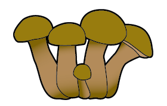
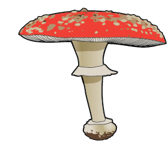
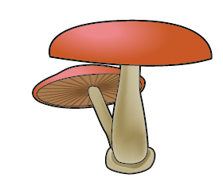
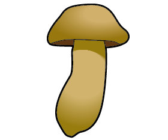
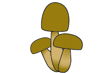
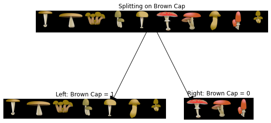
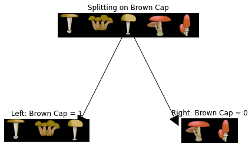
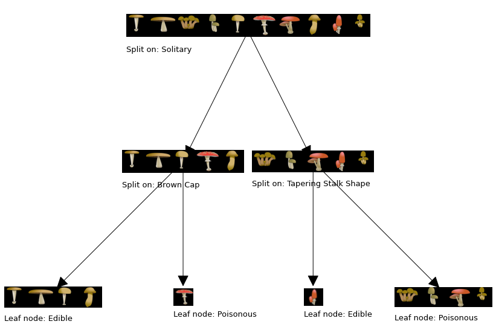

<!-- 本文件由课程原始 Notebook 转换并翻译。代码与公式保留原样。 -->
<!-- 原文件：2. Advanced Learning Algorithms/week 4/Assignment/C2_W4_Decision_Tree_with_Markdown.ipynb -->

# 练习实验： 决策树

本练习将从零实现决策树（decision tree），并用它判断蘑菇可食用还是有毒。

# 内容提要
- [ 1 - Packages ](#1)
- [ 2 -  Problem Statement](#2)
- [ 3 - Dataset](#3)
  - [ 3.1 One hot encoded dataset](#3.1)
- [ 4 - Decision Tree Refresher](#4)
  - [ 4.1  Calculate entropy](#4.1)
    - [ Exercise 1](#ex01)
  - [ 4.2  Split dataset](#4.2)
    - [ Exercise 2](#ex02)
  - [ 4.3  Calculate information gain](#4.3)
    - [ Exercise 3](#ex03)
  - [ 4.4  Get best split](#4.4)
    - [ Exercise 4](#ex04)
- [ 5 - Building the tree](#5)

_**注意：**为避免自动评分出错，请勿编辑或删除非评分单元格，也不要在 Notebook 中新增单元格。_ 
_通过作业后，如果想尝试额外代码，可按 Notebook 末尾的说明解锁非评分单元格。_

<a name="1"></a>
## 1 - 软件包

首先运行下面的单元格，导入本作业所需的全部软件包。
- [numpy](https://www.numpy.org)是用于在下列领域与矩阵合作的基本一揽子方案：Python.
- [matplotlib](https://matplotlib.org)是一个用于绘制图表的著名库Python.
- ``utils.py`` 包含此任务的助手函数。 你不需要修改此文件中的代码 。

```python
import numpy as np
import matplotlib.pyplot as plt
from public_tests import *
from utils import *

%matplotlib inline
```

<a name="2"></a>
## 2 - 问题说明

假设你创办了一家 种植和销售野生蘑菇的公司
- 由于并非所有的蘑菇都是可食用的，所以你希望能够根据某种蘑菇的物理属性来判断其是否可食用或有毒。
- 你拥有一些可用于此任务的现有数据 。

你能用数据帮助你识别哪些蘑菇可以安全销售吗?

注：所用数据集仅用于说明性目的，无意成为识别可食用蘑菇的指南。


<a name="3"></a>
## 3 - 数据集

你将从加载此任务的数据集开始。 你收集的数据集如下 :

|                                                     |顶盖颜色|跟踪形状|独立|易食性|
|:---------------------------------------------------:|:---------:|:-----------:|:--------:|:------:|
|  |褐色|磁带|对|    1   |
|  |褐色|笼罩|对|    1   |
|  |褐色|笼罩|没有|    0   |
|  |褐色|笼罩|没有|    0   |
|  |褐色|磁带|对|    1   |
|  |红色|磁带|对|    0   |
|  |红色|笼罩|没有|    0   |
|  |褐色|笼罩|对|    1   |
|  |红色|磁带|没有|    1   |
|  |褐色|笼罩|没有|    0   |


-  你有10个蘑菇的例子 每个例子都有
    - 三个特征（feature）
        - 菌盖颜色（Cap Color）：`Brown` 或 `Red`；
        - 菌柄形状（Stalk Shape）：`Tapering`（逐渐变细）或 `Enlarging`（逐渐变粗）；
        - 单独`Yes`或`No`)
    - 标签（label）
        - 标签：`1` 表示可食用，`0` 表示有毒。

<a name="3.1"></a>
### 3.1 一个热编码数据集
为了便于执行，我们用单热编码特征(把它们变为0或1价值)特征)

|                                                    |棕色顶盖|磁带跟踪形状|独立|易食性|
|:--------------------------------------------------:|:---------:|:--------------------:|:--------:|:------:|
|  |     1     |           1          |     1    |    1   |
|  |     1     |           0          |     1    |    1   |
|  |     1     |           0          |     0    |    0   |
|  |     1     |           0          |     0    |    0   |
|  |     1     |           1          |     1    |    1   |
|  |     0     |           1          |     1    |    0   |
|  |     0     |           0          |     0    |    0   |
|  |     1     |           0          |     1    |    1   |
|  |     0     |           1          |     0    |    1   |
|  |     1     |           0          |     0    |    0   |


因此，
- `X_train` 中的每个样本包含三个特征：
    - 菌盖颜色：`1` 表示棕色，`0` 表示红色；
    - 菌柄形状：`1` 表示逐渐变细，`0` 表示逐渐变粗；
    - 是否单生：`1` 表示是，`0` 表示否。

- `y_train` 表示蘑菇是否可食用：
    - `y = 1`表示可食用
    - `y = 0` 表示有毒。

```python
X_train = np.array([[1,1,1],[1,0,1],[1,0,0],[1,0,0],[1,1,1],[0,1,1],[0,0,0],[1,0,1],[0,1,0],[1,0,0]])
y_train = np.array([1,1,0,0,1,0,0,1,1,0])
```

#### 查看变量
下面进一步了解数据集。
- 一个简单的起点是打印各个变量，查看其中包含的内容。

下面的代码打印出`X_train`和变量的类型。

```python
print("First few elements of X_train:\n", X_train[:5])
print("Type of X_train:",type(X_train))
```

```text
First few elements of X_train:
 [[1 1 1]
 [1 0 1]
 [1 0 0]
 [1 0 0]
 [1 1 1]]
Type of X_train: <class 'numpy.ndarray'>
```

下面以相同方式查看 `y_train`。

```python
print("First few elements of y_train:", y_train[:5])
print("Type of y_train:",type(y_train))
```

```text
First few elements of y_train: [1 1 0 0 1]
Type of y_train: <class 'numpy.ndarray'>
```

#### 检查变量的维度

了解你数据的另一个有用方法是查看其维度。

请打印形状`X_train`和`y_train`并查看数据集中有多少训练样本。

```python
print ('The shape of X_train is:', X_train.shape)
print ('The shape of y_train is: ', y_train.shape)
print ('Number of training examples (m):', len(X_train))
```

```text
The shape of X_train is: (10, 3)
The shape of y_train is:  (10,)
Number of training examples (m): 10
```

<a name="4"></a>
## 4 - 决策树（decision tree）回顾

在这练习实验（practice lab），你会建立一个决策树（decision tree）根据所提供的数据集。

- 回顾为建立一个民主、决策树（decision tree）内容如下：
    - 从根节点的所有示例开始
    - 计算所有可能分割的信息收益特征，选择信息收益最高的
    - 根据选定的数据集进行分割特征，并创建树的左右分支
    - 继续重复拆分进程直至达到停止标准
  
  
- 在本实验中中，你将执行以下功能，这样就可以使用特征信息收益最高
    - 在节点计算 en
    - 根据给定的将节点上的数据集分为左右分支特征
    - 计算从给定的分割中获取的信息特征
    - 选择特征最大限度地增加信息收益
    
- 然后我们用你执行的辅助器功能来构建一个决策树（decision tree）重复拆分过程，直到达到停止标准
    - 为了这个实验我们所选择的停止标准 是设定最大深度为2

<a name="4.1"></a>
### 4.1 计算熵

首先，你会写一个名为“帮助者”的函数`compute_entropy`用来计算节点上的 en(杂质的量度).
- `y` 是一个 NumPy 数组，表示当前节点中的样本可食用（`1`）还是有毒（`0`） 

填写`compute_entropy()`函数如下：
* 计算 $p_1$，即当前节点中可食用样本（`y` 中取值为 `1`）所占的比例。
* 然后计算为：

$$
H(p_1) = -p_1 \text{log}_2(p_1) - (1- p_1) \text{log}_2(1- p_1)
$$
* 说明
    * 以基数计算日志$2$
    * 实现时约定 $0\log_2(0)=0$。因此，当 `p_1=0` 或 `p_1=1` 时，熵直接设为 `0`。
    * 先检查节点是否为空，即 `len(y) != 0`；若为空则返回 `0`。
    
<a name="ex01"></a>
### 练习 1

请完成`compute_entropy()`函数使用上一个指令。
    
如果遇到困难，可以查看代码单元格后面的提示。

```python
# UNQ_C1
# GRADED FUNCTION: compute_entropy

def compute_entropy(y):
    """
    Computes the entropy for 
    
    Args:
       y (ndarray): Numpy array indicating whether each example at a node is
           edible (`1`) or poisonous (`0`)
       
    Returns:
        entropy (float): Entropy at that node
        
    """
    # You need to return the following variables correctly
    entropy = 0.
    
    ### START CODE HERE ###
    if len(y) != 0:
        p1 = p1 = len(y[y == 1]) / len(y) 
     # For p1 = 0 and 1, set the entropy to 0 (to handle 0log0)
        if p1 != 0 and p1 != 1:
             entropy = -p1 * np.log2(p1) - (1 - p1) * np.log2(1 - p1)
        else:
             entropy = 0
    ### END CODE HERE ###        
    
    return entropy
```

<details>
  <summary><font size="3" color="darkgreen"><b>点击查看提示</b></font></summary>
    
    
   * 要计算`p1`
       * 你可以在`y`具有价值`1`作为`y[y == 1]`
       * 你可以用来`len(y)`以获取实例`y`
   * 要计算`entropy`
       * <a href="https://numpy.org/doc/stable/reference/generated/numpy.log2.html">np.log2</a>计算对数到2基数NumPy数组
       * 如果值为：`p1`是 0 或 1, 请确定设置为`0` 
     
    <details>
          <summary><font size="2" color="darkblue"><b>点击查看更多提示</b></font></summary>
        
    * 下面给出了该函数的整体结构：
    ```Python 
    def compute_entropy(y):
        
        # You need to return the following variables correctly
        entropy = 0.

        ### START CODE HERE ###
        if len(y) != 0:
            # Your code here to calculate the fraction of edible examples (i.e with value = 1 in y)
            p1 =

            # For p1 = 0 and 1, set the entropy to 0 (to handle 0log0)
            if p1 != 0 and p1 != 1:
                # Your code here to calculate the entropy using the formula provided above
                entropy = 
            else:
                entropy = 0. 
        ### END CODE HERE ###        

        return entropy
    ```
    
如果你仍然被卡住， 你可以检查下面的提示来计算`p1`和`entropy`.
    
    <details>
          <summary><font size="2" color="darkblue"><b>用于计算 p1 的提示</b></font></summary>
&emsp; &emsp; 你可以将 p1 计算为<code>p1 = len(y[y == 1]) / len(y) </code>
    </details>

     <details>
          <summary><font size="2" color="darkblue"><b>计算 Entropy 的提示</b></font></summary>
&emsp; &emsp; 你可以计算为<code>entropy = -p1 * np.log2(p1) - (1 - p1) * np.log2(1 - p1)</code>
    </details>
        
    </details>

</details>

运行下面的测试代码，检查实现是否正确：

```python
# Compute entropy at the root node (i.e. with all examples)
# Since we have 5 edible and 5 non-edible mushrooms, the entropy should be 1"

print("Entropy at root node: ", compute_entropy(y_train)) 

# UNIT TESTS
compute_entropy_test(compute_entropy)
```

```text
Entropy at root node:  1.0
 All tests passed.
```

**预期输出**:
<table>
  <tr>
    <td> <b>根节点的圆 :<b> 1.0 </td> 
  </tr>
</table>

<a name="4.2"></a>
### 4.2 拆分数据集

接下来，你会写一个名为“帮助者”的函数`split_dataset`数据在一个节点和一个特征将它分成左右两部分。实验，你会执行代码 计算分拆有多好。

- 该函数接收训练数据、当前节点中的样本索引列表以及用于划分的特征，并把样本索引分到左、右两个分支。
- 它将数据分割，返回左边和右边分支的指数子集。
- 例如，说我们从根节点开始(所以)`node_indices = [0,1,2,3,4,5,6,7,8,9]`我们选择分开特征 `0`，也就是这个例子是否有棕色的盖。
    - 函数的输出是，`left_indices = [0,1,2,3,4,7,9]`(数据点为褐盖)和`right_indices = [5,6,8]`(数据点没有棕色盖)
    
    
|       |                                                    |棕色顶盖|磁带跟踪形状|独立|易食性|
|-------|:--------------------------------------------------:|:---------:|:--------------------:|:--------:|:------:|
| 0     |  |     1     |           1          |     1    |    1   |
| 1     |  |     1     |           0          |     1    |    1   |
| 2     |  |     1     |           0          |     0    |    0   |
| 3     |  |     1     |           0          |     0    |    0   |
| 4     |  |     1     |           1          |     1    |    1   |
| 5     |  |     0     |           1          |     1    |    0   |
| 6     |  |     0     |           0          |     0    |    0   |
| 7     |  |     1     |           0          |     1    |    1   |
| 8     |  |     0     |           1          |     0    |    1   |
| 9     |  |     1     |           0          |     0    |    0   |
    
<a name="ex02"></a>
### 练习 2

请完成`split_dataset()`下列函数

- 每个索引`node_indices`
    - 如果 `X` 中该样本的特征值为 `1`，把样本索引加入 `left_indices`；
    - 如果该特征值为 `0`，把样本索引加入 `right_indices`。

如果遇到困难，可以查看代码单元格后面的提示。

```python
# UNQ_C2
# GRADED FUNCTION: split_dataset

def split_dataset(X, node_indices, feature):
    """
    Splits the data at the given node into
    left and right branches
    
    Args:
        X (ndarray):             Data matrix of shape(n_samples, n_features)
        node_indices (list):     List containing the active indices. I.e, the samples being considered at this step.
        feature (int):           Index of feature to split on
    
    Returns:
        left_indices (list):     Indices with feature value == 1
        right_indices (list):    Indices with feature value == 0
    """
    
    # You need to return the following variables correctly
    left_indices = []
    right_indices = []
    
    ### START CODE HERE ###
    for i in node_indices:
        if X[i][feature] == 1:
            left_indices.append(i)
        else:
            right_indices.append(i)
    ### END CODE HERE ###
        
    return left_indices, right_indices
```

<details>
  <summary><font size="3" color="darkgreen"><b>点击查看提示</b></font></summary>
    
    
   * 下面给出了该函数的整体结构：
    ```Python 
    def split_dataset(X, node_indices, feature):
    
        # You need to return the following variables correctly
        left_indices = []
        right_indices = []

        ### START CODE HERE ###
        # Go through the indices of examples at that node
        for i in node_indices:   
            if # Your code here to check if the value of X at that index for the feature is 1
                left_indices.append(i)
            else:
                right_indices.append(i)
        ### END CODE HERE ###
        
    return left_indices, right_indices
    ```
    <details>
          <summary><font size="2" color="darkblue"><b>点击查看更多提示</b></font></summary>
        
条件是<code> if X[i][feature] == 1:</code>.
        
    </details>

</details>

下面检查实现：在包含全部样本的根节点上，使用特征 0（Brown Cap）划分数据集。辅助函数会直观显示划分结果。

```python
# Case 1

root_indices = [0, 1, 2, 3, 4, 5, 6, 7, 8, 9]

# Feel free to play around with these variables
# The dataset only has three features, so this value can be 0 (Brown Cap), 1 (Tapering Stalk Shape) or 2 (Solitary)
feature = 0

left_indices, right_indices = split_dataset(X_train, root_indices, feature)

print("CASE 1:")
print("Left indices: ", left_indices)
print("Right indices: ", right_indices)

# Visualize the split 
generate_split_viz(root_indices, left_indices, right_indices, feature)

print()

# Case 2

root_indices_subset = [0, 2, 4, 6, 8]
left_indices, right_indices = split_dataset(X_train, root_indices_subset, feature)

print("CASE 2:")
print("Left indices: ", left_indices)
print("Right indices: ", right_indices)

# Visualize the split 
generate_split_viz(root_indices_subset, left_indices, right_indices, feature)

# UNIT TESTS    
split_dataset_test(split_dataset)
```

```text
CASE 1:
Left indices:  [0, 1, 2, 3, 4, 7, 9]
Right indices:  [5, 6, 8]
```



```text

CASE 2:
Left indices:  [0, 2, 4]
Right indices:  [6, 8]
```



```text
 All tests passed.
```

**预期输出**:
```
CASE 1:
Left indices:  [0, 1, 2, 3, 4, 7, 9]
Right indices:  [5, 6, 8]

CASE 2:
Left indices:  [0, 2, 4]
Right indices:  [6, 8]
```

<a name="4.3"></a>
### 4.3 计算信息增益

接下来，你会写一个名为`information_gain`在训练数据、节点指数和特征以拆分并返回拆分中的信息收益。

<a name="ex03"></a>
### 练习 3

请完成`compute_information_gain()`以下显示用于计算函数

$$
\text{Information Gain} = H(p_1^\text{node})- (w^{\text{left}}H(p_1^\text{left}) + w^{\text{right}}H(p_1^\text{right}))
$$

其中
- $H(p_1^\text{node})$在节点是 en
- $H(p_1^\text{left})$和$H(p_1^\text{right})$是因分裂而产生的左右枝条;
- $w^{\text{left}}$和$w^{\text{right}}$左分支和右分支的示例比例

说明：
- 你可以用这个`compute_entropy()`函数，用于计算 Entropy
- 我们提供了一些启动码 使用`split_dataset()`将数据集分割开来

如果遇到困难，可以查看代码单元格后面的提示。

```python
# UNQ_C3
# GRADED FUNCTION: compute_information_gain

def compute_information_gain(X, y, node_indices, feature):
    
    """
    Compute the information of splitting the node on a given feature
    
    Args:
        X (ndarray):            Data matrix of shape(n_samples, n_features)
        y (array like):         list or ndarray with n_samples containing the target variable
        node_indices (ndarray): List containing the active indices. I.e, the samples being considered in this step.
        feature (int):           Index of feature to split on
   
    Returns:
        cost (float):        Cost computed
    
    """    
    # Split dataset
    left_indices, right_indices = split_dataset(X, node_indices, feature)
    
    # Some useful variables
    X_node, y_node = X[node_indices], y[node_indices]
    X_left, y_left = X[left_indices], y[left_indices]
    X_right, y_right = X[right_indices], y[right_indices]
    
    # You need to return the following variables correctly
    information_gain = 0
    
    ### START CODE HERE ###
    node_entropy = compute_entropy(y_node)
    left_entropy = compute_entropy(y_left)
    right_entropy = compute_entropy(y_right)
    
    # Weights 
    w_left = len(X_left) / len(X_node)
    w_right = len(X_right) / len(X_node)
    
    #Weighted entropy
    weighted_entropy = w_left * left_entropy + w_right * right_entropy
    
    #Information gain 
    information_gain = node_entropy - weighted_entropy

    
    ### END CODE HERE ###  
    
    return information_gain
```

<details>
  <summary><font size="3" color="darkgreen"><b>点击查看提示</b></font></summary>
    
    
   * 下面给出了该函数的整体结构：
    ```Python 
    def compute_information_gain(X, y, node_indices, feature):
        # Split dataset
        left_indices, right_indices = split_dataset(X, node_indices, feature)

        # Some useful variables
        X_node, y_node = X[node_indices], y[node_indices]
        X_left, y_left = X[left_indices], y[left_indices]
        X_right, y_right = X[right_indices], y[right_indices]

        # You need to return the following variables correctly
        information_gain = 0

        ### START CODE HERE ###
        # Your code here to compute the entropy at the node using compute_entropy()
        node_entropy = 
        # Your code here to compute the entropy at the left branch
        left_entropy = 
        # Your code here to compute the entropy at the right branch
        right_entropy = 

        # Your code here to compute the proportion of examples at the left branch
        w_left = 
        
        # Your code here to compute the proportion of examples at the right branch
        w_right = 

        # Your code here to compute weighted entropy from the split using 
        # w_left, w_right, left_entropy and right_entropy
        weighted_entropy = 

        # Your code here to compute the information gain as the entropy at the node
        # minus the weighted entropy
        information_gain = 
        ### END CODE HERE ###  

        return information_gain
    ```
如果仍然无法完成，请查看下面的提示。
    
    <details>
          <summary><font size="2" color="darkblue"><b>用于计算线粒体的提示</b></font></summary>
        
    <code>node_entropy = compute_entropy(y_node)</code><br>
    <code>left_entropy = compute_entropy(y_left)</code><br>
    <code>right_entropy = compute_entropy(y_right)</code>
        
    </details>
    
    <details>
          <summary><font size="2" color="darkblue"><b>用于计算w 左和右的提示</b></font></summary>
           <code>w_left = len(X_left) / len(X_node)</code><br>
           <code>w_right = len(X_right) / len(X_node)</code>
    </details>
    
    <details>
          <summary><font size="2" color="darkblue"><b>计算加权值的提示</b></font></summary>
           <code>weighted_entropy = w_left * left_entropy + w_right * right_entropy</code>
    </details>
    
    <details>
          <summary><font size="2" color="darkblue"><b>用于计算信息的提示  ince</b></font></summary>
           <code> information_gain = node_entropy - weighted_entropy</code>
    </details>


</details>

你现在可以使用单元格并计算从每个元件上拆分的信息收益

```python
info_gain0 = compute_information_gain(X_train, y_train, root_indices, feature=0)
print("Information Gain from splitting the root on brown cap: ", info_gain0)

info_gain1 = compute_information_gain(X_train, y_train, root_indices, feature=1)
print("Information Gain from splitting the root on tapering stalk shape: ", info_gain1)

info_gain2 = compute_information_gain(X_train, y_train, root_indices, feature=2)
print("Information Gain from splitting the root on solitary: ", info_gain2)

# UNIT TESTS
compute_information_gain_test(compute_information_gain)
```

```text
Information Gain from splitting the root on brown cap:  0.034851554559677034
Information Gain from splitting the root on tapering stalk shape:  0.12451124978365313
Information Gain from splitting the root on solitary:  0.2780719051126377
 All tests passed.
```

**预期输出**:
```
Information Gain from splitting the root on brown cap:  0.034851554559677034
Information Gain from splitting the root on tapering stalk shape:  0.12451124978365313
Information Gain from splitting the root on solitary:  0.2780719051126377
```

分离于"Solitary"(特征=2)在根节点给予最大信息增益。特征在根节点进行分割。

<a name="4.4"></a>
### 4.4 选择最佳划分
下面实现函数：计算每个候选特征带来的信息增益，并返回信息增益最大的划分特征。

<a name="ex04"></a>
### 练习 4
请完成`get_best_split()`函数如下。
- 该函数接收训练数据、当前节点中的样本索引列表以及用于划分的特征，并把样本索引分到左、右两个分支。
- 函数的输出是特征能带来最大信息收益的
    - 你可以用这个`compute_information_gain()`函数通过特征并计算每个数据的信息特征
如果遇到困难，可以查看代码单元格后面的提示。

```python
# UNQ_C4
# GRADED FUNCTION: get_best_split

def get_best_split(X, y, node_indices):   
    """
    Returns the optimal feature and threshold value
    to split the node data 
    
    Args:
        X (ndarray):            Data matrix of shape(n_samples, n_features)
        y (array like):         list or ndarray with n_samples containing the target variable
        node_indices (ndarray): List containing the active indices. I.e, the samples being considered in this step.

    Returns:
        best_feature (int):     The index of the best feature to split
    """    
    
    # Some useful variables
    num_features = X.shape[1]
    
    # You need to return the following variables correctly
    best_feature = -1
    
    ### START CODE HERE ###
    
    max_info_gain=0
    for feature in range(num_features):
        info_gain = compute_information_gain(X, y, node_indices, feature)
        if info_gain > max_info_gain:
            max_info_gain = info_gain
            best_feature = feature
            
    ### END CODE HERE ##    
   
    return best_feature
```

<details>
  <summary><font size="3" color="darkgreen"><b>点击查看提示</b></font></summary>
    
    
   * 下面给出了该函数的整体结构：
    
    ```Python 
    def get_best_split(X, y, node_indices):   

        # Some useful variables
        num_features = X.shape[1]

        # You need to return the following variables correctly
        best_feature = -1

        ### START CODE HERE ###
        max_info_gain = 0

        # Iterate through all features
        for feature in range(num_features): 
            
            # Your code here to compute the information gain from splitting on this feature
            info_gain = 
            
            # If the information gain is larger than the max seen so far
            if info_gain > max_info_gain:  
                # Your code here to set the max_info_gain and best_feature
                max_info_gain = 
                best_feature = 
        ### END CODE HERE ##    
   
    return best_feature
    ```
如果仍然无法完成，请查看下面的提示。
    
    <details>
          <summary><font size="2" color="darkblue"><b>用于计算信息重置的提示</b></font></summary>
        
    <code>info_gain = compute_information_gain(X, y, node_indices, feature)</code>
    </details>
    
    <details>
          <summary><font size="2" color="darkblue"><b>提示：更新最大信息增益和最佳特征</b></font></summary>
           <code>max_info_gain = info_gain</code><br>
           <code>best_feature = feature</code>
    </details>
</details>

现在运行下面的单元格，检查你的函数。

```python
best_feature = get_best_split(X_train, y_train, root_indices)
print("Best feature to split on: %d" % best_feature)

# UNIT TESTS
get_best_split_test(get_best_split)
```

```text
Best feature to split on: 2
 All tests passed.
```

如上所述，函数返回的最好特征在根节点分裂为特征2 ("单独").

<a name="5"></a>
## 5 - 构建决策树

在本节中，我们利用你在上面执行的功能生成一个决策树（decision tree）接连挑选最好的特征直至达到停止标准(最大深度为2)为止。

你不需要为此执行任何东西。

```python
# Not graded
tree = []

def build_tree_recursive(X, y, node_indices, branch_name, max_depth, current_depth):
    """
    Build a tree using the recursive algorithm that split the dataset into 2 subgroups at each node.
    This function just prints the tree.
    
    Args:
        X (ndarray):            Data matrix of shape(n_samples, n_features)
        y (array like):         list or ndarray with n_samples containing the target variable
        node_indices (ndarray): List containing the active indices. I.e, the samples being considered in this step.
        branch_name (string):   Name of the branch. ['Root', 'Left', 'Right']
        max_depth (int):        Max depth of the resulting tree. 
        current_depth (int):    Current depth. Parameter used during recursive call.
   
    """ 

    # Maximum depth reached - stop splitting
    if current_depth == max_depth:
        formatting = " "*current_depth + "-"*current_depth
        print(formatting, "%s leaf node with indices" % branch_name, node_indices)
        return
   
    # Otherwise, get best split and split the data
    # Get the best feature and threshold at this node
    best_feature = get_best_split(X, y, node_indices) 
    
    formatting = "-"*current_depth
    print("%s Depth %d, %s: Split on feature: %d" % (formatting, current_depth, branch_name, best_feature))
    
    # Split the dataset at the best feature
    left_indices, right_indices = split_dataset(X, node_indices, best_feature)
    tree.append((left_indices, right_indices, best_feature))
    
    # continue splitting the left and the right child. Increment current depth
    build_tree_recursive(X, y, left_indices, "Left", max_depth, current_depth+1)
    build_tree_recursive(X, y, right_indices, "Right", max_depth, current_depth+1)
```

```python
build_tree_recursive(X_train, y_train, root_indices, "Root", max_depth=2, current_depth=0)
generate_tree_viz(root_indices, y_train, tree)
```

```text
 Depth 0, Root: Split on feature: 2
- Depth 1, Left: Split on feature: 0
  -- Left leaf node with indices [0, 1, 4, 7]
  -- Right leaf node with indices [5]
- Depth 1, Right: Split on feature: 1
  -- Left leaf node with indices [8]
  -- Right leaf node with indices [2, 3, 6, 9]
```



<details>
  <summary><font size="2" color="darkgreen"><b>如果已经通过作业并希望尝试额外代码，可展开这里的说明。</b></font></summary>
    <p><i><b>请仅在作业通过后修改单元格属性，以免影响自动评分。</b></i>
    <ol>
        <li>在 Notebook 菜单中选择 `View` > `Cell Toolbar` > `Edit Metadata`。</li>
        <li>在需要锁定或解锁的代码单元格上点击 `Edit Metadata`。</li>
        <li>将 `editable` 属性设为：
            <ul>
                <li>要解锁，设为 `true`；</li>
                <li>要锁定，设为 `false`。</li>
            </ul>
        </li>
        <li>完成后选择 `View` > `Cell Toolbar` > `None` 隐藏元数据工具栏。</li>
    </ol>
    <p>下面的演示展示了完整操作：
        <br>
        <span>按上述步骤即可解锁单元格。</span>
</details>
