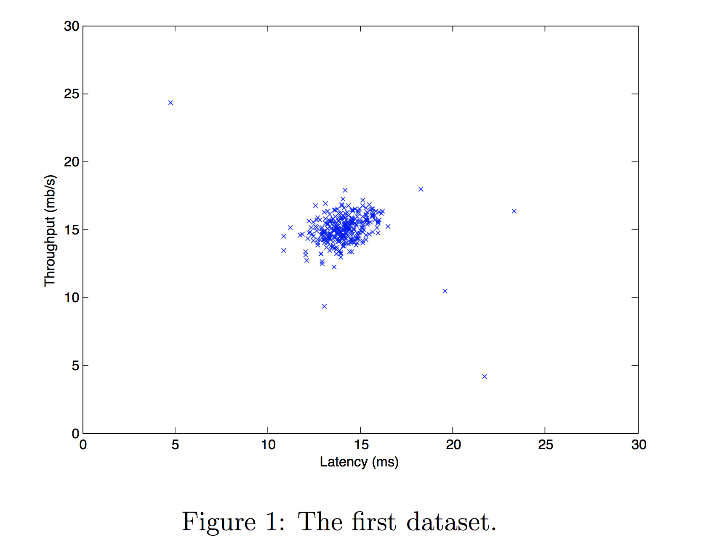
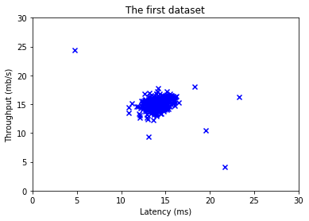
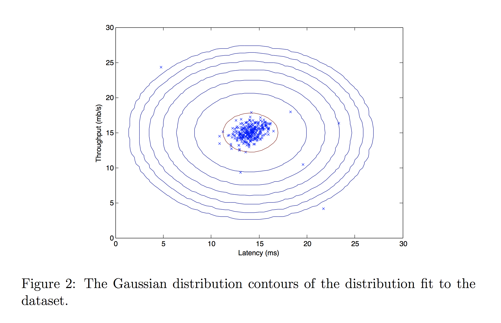
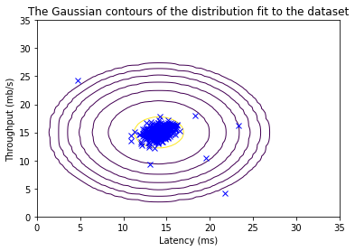
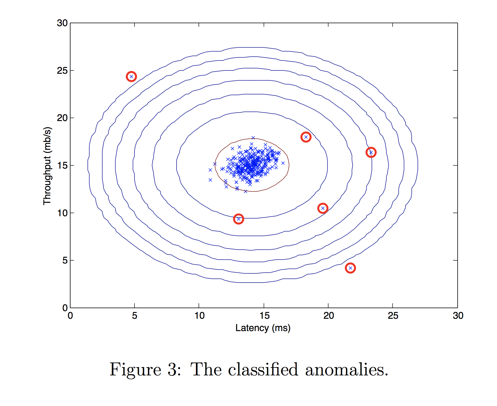
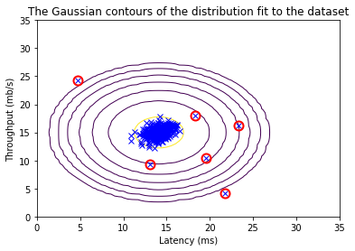

<!-- 本文件由课程原始 Notebook 转换并翻译。代码与公式保留原样。 -->
<!-- 原文件：3. Unsupervised Learning, Recommenders, Reinforcement Learning/Week 1/anomaly detection/C3_W1_Anomaly_Detection.ipynb -->

# 异常检测

在此过程中，你将执行异常检测（anomaly detection）算法并应用它来检测网络上的失败服务器。


# 内容提要
- [ 1 - Packages ](#1)
- [ 2 - Anomaly detection](#2)
  - [ 2.1 Problem Statement](#2.1)
  - [ 2.2  Dataset](#2.2)
  - [ 2.3 Gaussian distribution](#2.3)
    - [ Exercise 1](#ex01)
    - [ Exercise 2](#ex02)
  - [ 2.4 High dimensional dataset](#2.4)

_**注意：**为避免自动评分出错，请勿编辑或删除非评分单元格，也不要在 Notebook 中新增单元格。_ 
_通过作业后，如果想尝试额外代码，可按 Notebook 末尾的说明解锁非评分单元格。_

<a name="1"></a>
## 1 - 软件包

首先运行下面的单元格，导入本作业所需的全部软件包。
- [numpy](https://www.numpy.org)是用于在下列领域与矩阵合作的基本一揽子方案：Python.
- [matplotlib](http://matplotlib.org)是一个用于绘制图表的著名库Python.
- ``utils.py`` 包含此任务的助手函数。 你不需要修改此文件中的代码 。

```python
import numpy as np
import matplotlib.pyplot as plt
from utils import *

%matplotlib inline
```

<a name="2"></a>
## 2 - 异常检测（anomaly detection）

<a name="2.1"></a>
### 2.1 问题说明

在此过程中，你将执行异常检测（anomaly detection）算法为
检测服务器计算机中的异常行为。

数据集包含两个特征（feature） - 
   * 吞吐量(立方米/秒)和
   * 每台服务器的响应延迟（ms）；

当你的服务器运行时， 你收集$m=307$以实例说明它们是如何行事的，因此有一个没有标签的数据集$\{x^{(1)}, \ldots, x^{(m)}\}$. 
* 你怀疑，这些例子中绝大多数是正常运行的服务器的“正常”(非异常)例子，但也可能有一些服务器在这个数据集内异常运行的例子。

你将使用高斯模型来检测你的异常实例
数据集。
* 先从二维数据集开始，以便直观观察算法的行为。
* 在该数据集上，你将匹配一个高斯分布，然后找到概率非常低，因此可被视为异常的值。
* 之后，你将申请异常检测（anomaly detection）算法到一个具有许多维度的更大的数据集。

<a name="2.2"></a>
### 2.2 数据集

你将从加载此任务的数据集开始 。
- 下面的 `load_data()` 把数据加载到 `X_train`、`X_val` 和 `y_val`。 
    - 你会用`X_train`以适应高斯分布
    - 你会用`X_val`和`y_val`作为交叉验证集（cross-validation set）来选择一个阈值， 并确定异常对正常示例

```python
# Load the dataset
X_train, X_val, y_val = load_data()
```

#### 查看变量
下面进一步了解数据集。
- 一个简单的起点是打印各个变量，查看其中包含的内容。

下面的代码打印每个变量的前五个元素

```python
# Display the first five elements of X_train
print("The first 5 elements of X_train are:\n", X_train[:5])
```

```text
The first 5 elements of X_train are:
 [[13.04681517 14.74115241]
 [13.40852019 13.7632696 ]
 [14.19591481 15.85318113]
 [14.91470077 16.17425987]
 [13.57669961 14.04284944]]
```

```python
# Display the first five elements of X_val
print("The first 5 elements of X_val are\n", X_val[:5])
```

```text
The first 5 elements of X_val are
 [[15.79025979 14.9210243 ]
 [13.63961877 15.32995521]
 [14.86589943 16.47386514]
 [13.58467605 13.98930611]
 [13.46404167 15.63533011]]
```

```python
# Display the first five elements of y_val
print("The first 5 elements of y_val are\n", y_val[:5])
```

```text
The first 5 elements of y_val are
 [0 0 0 0 0]
```

#### 检查变量的维度

了解你数据的另一个有用方法是查看其维度。

下面的代码打印`X_train`, `X_val`和`y_val`.

```python
print ('The shape of X_train is:', X_train.shape)
print ('The shape of X_val is:', X_val.shape)
print ('The shape of y_val is: ', y_val.shape)
```

```text
The shape of X_train is: (307, 2)
The shape of X_val is: (307, 2)
The shape of y_val is:  (307,)
```

#### 数据可视化

在开始任何任务之前，通过可视化来理解数据往往是有用的。
- 对于此数据集，你可以使用散射图可视化数据(`X_train`)，因为它只有两个属性可供绘图(通量和延迟).

- 绘制的结果应与下图相似。


```python
# Create a scatter plot of the data. To change the markers to blue "x",
# we used the 'marker' and 'c' parameters
plt.scatter(X_train[:, 0], X_train[:, 1], marker='x', c='b') 

# Set the title
plt.title("The first dataset")
# Set the y-axis label
plt.ylabel('Throughput (mb/s)')
# Set the x-axis label
plt.xlabel('Latency (ms)')
# Set axis range
plt.axis([0, 30, 0, 30])
plt.show()
```



<a name="2.3"></a>
### 2.3 高斯分布

执行异常检测（anomaly detection），你首先需要将模型与数据分布相匹配。

* 给定训练集 $\{x^{(1)},\ldots,x^{(m)}\}$，需要为每个特征 $x_i$ 估计其高斯分布。 

* 回顾高斯的分布是由

   $$
   p(x ; \mu,\sigma ^2) = \frac{1}{\sqrt{2 \pi \sigma ^2}}\exp^{ - \frac{(x - \mu)^2}{2 \sigma ^2} }
   $$

其中，$\mu$ 是均值，$\sigma^2$ 是方差（variance）。
   
对于每个特征 $i = 1\ldots n$，参数 $\mu_i$ 和 $\sigma_i^2$ 分别由该特征在所有样本中的取值 $\{x_i^{(1)}, ..., x_i^{(m)}\}$ 估计。

### 2.3.1 高斯分布的估计参数

**实现要求：** 

你的任务是完成下面的 `estimate_gaussian` 函数。

<a name="ex01"></a>
### 练习 1

请完成`estimate_gaussian`函数下方用于计算`mu`(每个平均数)特征输入`X`和(或)`var` (方差每人特征输入`X`). 

可以分别为每个特征 $i$ 估计参数 ($\mu_i$, $\sigma_i^2$)。
特征使用下列公式来估计平均值。
使用 :

$$
\mu_i = \frac{1}{m} \sum_{j=1}^m x_i^{(j)}
$$

方差你将使用：
$$
\sigma_i^2 = \frac{1}{m} \sum_{j=1}^m (x_i^{(j)} - \mu_i)^2
$$

如果遇到困难，可以查看代码单元格后面的提示。

```python
# UNQ_C1
# GRADED FUNCTION: estimate_gaussian

def estimate_gaussian(X): 
    """
    Calculates mean and variance of all features 
    in the dataset
    
    Args:
        X (ndarray): (m, n) Data matrix
    
    Returns:
        mu (ndarray): (n,) Mean of all features
        var (ndarray): (n,) Variance of all features
    """

    m, n = X.shape
    
    ### START CODE HERE ### 
    mu = 1 / m * np.sum(X, axis=0)
    var = 1 / m * np.sum((X - mu) **2, axis = 0)
    ### END CODE HERE ### 
        
    return mu, var
```

<details>
  <summary><font size="3" color="darkgreen"><b>点击查看提示</b></font></summary>
  
   * 该函数可以用以下两种方式实现：
      * 一种写法是使用两层嵌套循环：外层遍历 `X` 的各列（特征），内层遍历每个样本。
      * 2 - 通过使用`np.sum()`与`axis = 0`参数(因为我们想要每个列的总和)

    
   * 可按下面的结构实现该函数的向量化版本：
     ```Python  
    def estimate_gaussian(X): 
        m, n = X.shape
    
        ### START CODE HERE ### 
        mu = # Your code here to calculate the mean of every feature
        var = # Your code here to calculate the variance of every feature 
        ### END CODE HERE ### 
        
        return mu, var
    ```

如果你仍然被卡住， 你可以检查下面的提示来计算`mu`和`var`.
    
    <details>
          <summary><font size="2" color="darkblue"><b>用于计算 m 的提示</b></font></summary>
&emsp; &emsp; 你可以使用<a href="https://numpy.org/doc/stable/reference/generated/numpy.sum.html">np.sum</a>改为：`axis = 0`参数以获取数组中每个列的总和
          <details>
              <summary><font size="2" color="blue"><b>&emsp; 更多计算 m 的提示</b></font></summary>
&emsp; &emsp; 你可以将 mu 计算为<code>mu = 1 / m * np.sum(X, axis = 0)</code>
           </details>
    </details>
    
    <details>
          <summary><font size="2" color="darkblue"><b>计算 var 的提示</b></font></summary>
&emsp; &emsp; 你可以使用<a href="https://numpy.org/doc/stable/reference/generated/numpy.sum.html">np.sum</a>改为：`axis = 0`参数以获取数组中每个列的总和，<code>**2</code>为了得到广场。
          <details>
              <summary><font size="2" color="blue"><b>&emsp; &emsp; 更多计算 var 的提示</b></font></summary>
&emsp; &emsp; 你可以计算 var<code> var = 1 / m * np.sum((X - mu) ** 2, axis = 0)</code>
           </details>
    </details>
    
</details>

运行下面的测试代码，检查实现是否正确：

```python
# Estimate mean and variance of each feature
mu, var = estimate_gaussian(X_train)              

print("Mean of each feature:", mu)
print("Variance of each feature:", var)
    
# UNIT TEST
from public_tests import *
estimate_gaussian_test(estimate_gaussian)
```

```text
Mean of each feature: [14.11222578 14.99771051]
Variance of each feature: [1.83263141 1.70974533]
All tests passed!
```

**预期输出**:
<table>
  <tr>
    <td> <b>各项的平均值特征： <b>  </td> 
    <td> [14.11222578 14.99771051]</td> 
   </tr>    
   <tr>
    <td> <b>方差数字特征： <b>  </td>
     <td> [1.83263141 1.70974533] </td> 
  </tr>
</table>

既然你完成了密码`estimate_gaussian`我们将直观地呈现 高斯分布的轮廓。

结果应与下图相似。



从你的图中可以看出，大多数例子都发生在概率最高的区域，而异常的例子发生在概率较低的区域。

```python
# Returns the density of the multivariate normal
# at each data point (row) of X_train
p = multivariate_gaussian(X_train, mu, var)

#Plotting code 
visualize_fit(X_train, mu, var)
```



### 2.3.2 选择门槛值$\epsilon$

既然你已经估算了高斯参数， 你可以调查哪些例子的概率非常高， 哪些例子的概率非常低。

* 低概率的例子更可能是我们数据集中的异常。
* 确定哪些实例是异常的一个方法就是根据交叉验证集。 

在此部分中，你将填写编码 。`select_threshold`选择阈值$\varepsilon$使用$F_1$计分交叉验证集。

* 为此，我们将使用交叉验证集
$\{(x_{\rm cv}^{(1)}, y_{\rm cv}^{(1)}),\ldots, (x_{\rm cv}^{(m_{\rm cv})}, y_{\rm cv}^{(m_{\rm cv})})\}$。其中标签（label）$y=1$ 表示异常样本，$y=0$ 表示正常样本。
* 对每个交叉验证样本计算 $p(x_{\rm cv}^{(i)})$，并将结果向量 $p(x_{\rm cv}^{(1)}), \ldots, p(x_{\rm cv}^{(m_{\rm cv})})$ 作为 `p_val` 传给 `select_threshold`。
* 将对应标签 $y_{\rm cv}^{(1)}, \ldots, y_{\rm cv}^{(m_{\rm cv})}$ 作为向量 `y_val` 传给同一函数。

<a name="ex02"></a>
### 练习 2
请完成`select_threshold`函数，以找到最佳阈值，用于根据验证集（validation set） (`p_val`和地面真相(`y_val`). 

* 在提供的代码中`select_threshold`，已经有一个循环，将尝试许多不同的值$\varepsilon$选择最好的$\varepsilon$基于$F_1$分数。

* 你需要执行代码从选择中计算 F1 分数`epsilon`作为阈值，并将值置于`F1`. 

  * 回顾，如果一个实例$x$概率较低$p(x) < \varepsilon$，然后被归类为异常。
        
  * 然后，你可以计算精度 和回忆：
   $$
   \begin{aligned}
   prec&=&\frac{tp}{tp+fp}\\
   rec&=&\frac{tp}{tp+fn},
   \end{aligned}
   $$
其中：
    * $tp$是真实阳性的数量：地面真理标签我们的算法正确地把它归类为异常。
    * $fp$是假阳性的数量： 地面真理标签我们的算法将其错误地归类为异常。
    * $fn$是假负数： 地面真相标签我们的算法错误地将其归类为非正常。

  * 该$F_1$分数用精度计算($prec$)和召回($rec$如下：
    $$
    F_1 = \frac{2\cdot prec \cdot rec}{prec + rec}
    $$

**实现提示：** 
计算 $tp$、$fp$ 和 $fn$ 时，可以使用向量化运算，无需逐个遍历样本。


如果遇到困难，可以查看代码单元格后面的提示。

```python
# UNQ_C2
# GRADED FUNCTION: select_threshold

def select_threshold(y_val, p_val): 
    """
    Finds the best threshold to use for selecting outliers 
    based on the results from a validation set (p_val) 
    and the ground truth (y_val)
    
    Args:
        y_val (ndarray): Ground truth on validation set
        p_val (ndarray): Results on validation set
        
    Returns:
        epsilon (float): Threshold chosen 
        F1 (float):      F1 score by choosing epsilon as threshold
    """ 

    best_epsilon = 0
    best_F1 = 0
    F1 = 0
    
    step_size = (max(p_val) - min(p_val)) / 1000
    
    for epsilon in np.arange(min(p_val), max(p_val), step_size):
    
        ### START CODE HERE ### 
        
        # Calculate prediction
        predictions = (p_val < epsilon)

        # Calculate tp, fp, fn
        tp = np.sum((predictions == 1) & (y_val == 1))
        fp = sum((predictions == 1) & (y_val == 0))
        fn = np.sum((predictions == 0) & (y_val == 1))

        # Calculate precision and recall
        prec = tp / (tp + fp)
        rec = tp / (tp + fn)

        # Calculate F1
        F1 = 2*prec*rec / (prec + rec)
        ### END CODE HERE ### 
        
        if F1 > best_F1:
            best_F1 = F1
            best_epsilon = epsilon
        
    return best_epsilon, best_F1
```

<details>
  <summary><font size="3" color="darkgreen"><b>点击查看提示</b></font></summary>

   * 可按下面的结构实现该函数的向量化版本：
     ```Python  
    def select_threshold(y_val, p_val): 
        best_epsilon = 0
        best_F1 = 0
        F1 = 0
    
        step_size = (max(p_val) - min(p_val)) / 1000
    
        for epsilon in np.arange(min(p_val), max(p_val), step_size):
    
            ### START CODE HERE ### 
            predictions = # Your code here to calculate predictions for each example using epsilon as threshold
        
            tp = # Your code here to calculate number of true positives
            fp = # Your code here to calculate number of false positives
            fn = # Your code here to calculate number of false negatives
        
            prec = # Your code here to calculate precision
            rec = # Your code here to calculate recall
        
            F1 = # Your code here to calculate F1
            ### END CODE HERE ### 
        
            if F1 > best_F1:
                best_F1 = F1
                best_epsilon = epsilon
        
        return best_epsilon, best_F1
    ```

如果你仍然被卡住，可以检查下面给出的提示，以了解如何计算每个变量。
    
    <details>
          <summary><font size="2" color="darkblue"><b>用于计算预测的提示</b></font></summary>
&emsp; &emsp; 如果示例 x 的概率较低$p(x) < \epsilon$，然后将其归类为异常。要获得每个实例的预测值(正常为0，异常为1/True)，可以使用<code>predictions = (p_val < epsilon)</code>
    </details>
    
    <details>
          <summary><font size="2" color="darkblue"><b>用于计算 tp, fp, fn 的提示</b></font></summary>

        <ul>
          <li>如果你在其中拥有多个二进制值$n$-维度
二进制向量， 你可以使用 :`np.sum(v == 0)`</li>
          <li>也可以对二元向量应用逻辑与运算。例如，若 `predictions` 是交叉验证集上的预测向量，则当算法把 $x_{\rm cv}^{(i)}$ 判为异常时，第 $i$ 个元素为 1，否则为 0。</li>
          <li>然后，例如，可以使用：
<code>fp = sum((predictions == 1) & (y_val == 0))</code>.</li>
        </ul>
         <details>
              <summary><font size="2" color="blue"><b>&emsp; &emsp; 更多计算 tp, fn 的提示</b></font></summary>

             <ul>
              <li>你可以计算 tp 为<code> tp = np.sum((predictions == 1) & (y_val == 1))</code></li>
              <li>你可以计算为：<code> fn = np.sum((predictions == 0) & (y_val == 1))</code></li>  
              </ul>
          </details>
    </details>
        
    <details>
          <summary><font size="2" color="darkblue"><b>用于计算精度的提示</b></font></summary>
&emsp; &emsp; 你可以计算精度为<code>prec = tp / (tp + fp)</code>
    </details>
        
    <details>
          <summary><font size="2" color="darkblue"><b>用于计算召回的提示</b></font></summary>
&emsp; &emsp; 你可以计算为<code>rec = tp / (tp + fn)</code>
    </details>
        
    <details>
          <summary><font size="2" color="darkblue"><b>用于计算 F1 的提示</b></font></summary>
&emsp; &emsp; 你可以将 F1 计算为<code>F1 = 2 * prec * rec / (prec + rec)</code>
    </details>
    
</details>

使用下面的代码检查实现

```python
p_val = multivariate_gaussian(X_val, mu, var)
epsilon, F1 = select_threshold(y_val, p_val)

print('Best epsilon found using cross-validation: %e' % epsilon)
print('Best F1 on Cross Validation Set: %f' % F1)
    
# UNIT TEST
select_threshold_test(select_threshold)
```

```text
Best epsilon found using cross-validation: 8.990853e-05
Best F1 on Cross Validation Set: 0.875000
All tests passed!
```

**预期输出**:
<table>
  <tr>
    <td> <b>使用交叉验证找到的最佳 epsilon :<b>  </td> 
    <td>第8.99e-05号</td> 
   </tr>    
   <tr>
    <td> <b>最佳F1开机交叉验证集： <b>  </td>
     <td> 0.875 </td> 
  </tr>
</table>

现在，我们将运行你异常检测（anomaly detection）代码和环绕图中的异常(下面图3)。



```python
# Find the outliers in the training set 
outliers = p < epsilon

# Visualize the fit
visualize_fit(X_train, mu, var)

# Draw a red circle around those outliers
plt.plot(X_train[outliers, 0], X_train[outliers, 1], 'ro',
         markersize= 10,markerfacecolor='none', markeredgewidth=2)
```

```text
[<matplotlib.lines.Line2D at 0x7e3a15c11690>]
```



<a name="2.4"></a>
### 2.4 高维数据集

现在，我们将运行异常检测（anomaly detection）在更现实、更困难的数据集上执行的算法。

在这个数据集中，每个例子由 11 描述特征，可以捕捉你计算服务器的更多属性。

先加载数据集

- 下面的 `load_data()` 把数据加载到 `X_train_high`、`X_val_high` 和 `y_val_high`。
    -  `_high`意在将这些变量与上一部分所使用的变量区分开来。
    - 我们用`X_train_high`以适应高斯分布
    - 我们用`X_val_high`和`y_val_high`作为交叉验证集来选择一个阈值， 并确定异常对正常示例

```python
# load the dataset
X_train_high, X_val_high, y_val_high = load_data_multi()
```

#### 检查变量的维度

下面检查这些新变量的形状，以了解数据规模。

```python
print ('The shape of X_train_high is:', X_train_high.shape)
print ('The shape of X_val_high is:', X_val_high.shape)
print ('The shape of y_val_high is: ', y_val_high.shape)
```

```text
The shape of X_train_high is: (1000, 11)
The shape of X_val_high is: (100, 11)
The shape of y_val_high is:  (100,)
```

#### 异常检测

现在在新数据集上运行异常检测（anomaly detection）算法。

下面的代码将使用你的代码
* 估计高斯的参数($\mu_i$和$\sigma_i^2$)
* 评估两种训练数据的概率`X_train_high`你估计了高斯的参数，以及交叉验证集 `X_val_high`. 
* 最后，它将使用`select_threshold`寻找最佳门槛$\varepsilon$.

```python
# Apply the same steps to the larger dataset

# Estimate the Gaussian parameters
mu_high, var_high = estimate_gaussian(X_train_high)

# Evaluate the probabilites for the training set
p_high = multivariate_gaussian(X_train_high, mu_high, var_high)

# Evaluate the probabilites for the cross validation set
p_val_high = multivariate_gaussian(X_val_high, mu_high, var_high)

# Find the best threshold
epsilon_high, F1_high = select_threshold(y_val_high, p_val_high)

print('Best epsilon found using cross-validation: %e'% epsilon_high)
print('Best F1 on Cross Validation Set:  %f'% F1_high)
print('# Anomalies found: %d'% sum(p_high < epsilon_high))
```

```text
Best epsilon found using cross-validation: 1.377229e-18
Best F1 on Cross Validation Set:  0.615385
# Anomalies found: 117
```

**预期输出**:
<table>
  <tr>
    <td> <b>使用交叉验证找到的最佳 epsilon :<b>  </td> 
    <td>1.38e-18</td> 
   </tr>    
   <tr>
    <td> <b>最佳F1开机交叉验证集： <b>  </td>
     <td> 0.615385 </td> 
  </tr>
    <tr>
    <td> <b># 发现异常：<b>  </td>
     <td>  117 </td> 
  </tr>
</table>

<details>
  <summary><font size="2" color="darkgreen"><b>如果已经通过作业并希望尝试额外代码，可展开这里的说明。</b></font></summary>
    <p><i><b>请仅在作业通过后修改单元格属性，以免影响自动评分。</b></i>
    <ol>
        <li>在 Notebook 菜单中选择 `View` > `Cell Toolbar` > `Edit Metadata`。</li>
        <li>在需要锁定或解锁的代码单元格上点击 `Edit Metadata`。</li>
        <li>将 `editable` 属性设为：
            <ul>
                <li>要解锁，设为 `true`；</li>
                <li>要锁定，设为 `false`。</li>
            </ul>
        </li>
        <li>完成后选择 `View` > `Cell Toolbar` > `None` 隐藏元数据工具栏。</li>
    </ol>
    <p>下面的演示展示了完整操作：
        <br>
        <span>按上述步骤即可解锁单元格。</span>
</details>
