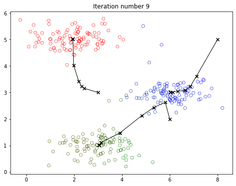
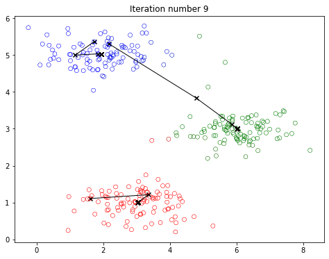
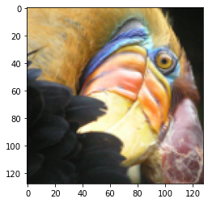
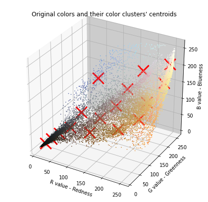
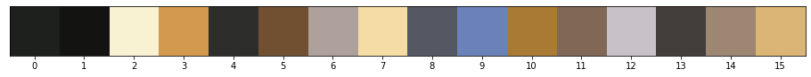
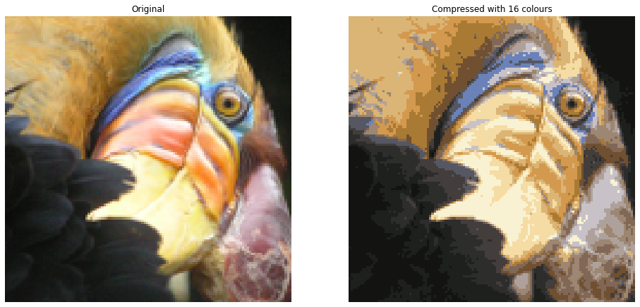

<!-- 本文件由课程原始 Notebook 转换并翻译。代码与公式保留原样。 -->
<!-- 原文件：3. Unsupervised Learning, Recommenders, Reinforcement Learning/Week 1/k-means/C3_W1_KMeans_Assignment.ipynb -->

# K-means 聚类

在此过程中，你将执行K-means算法并用于图像压缩。

* 你将首先用一个样本数据集来帮助你直觉地了解K-means算法有效。
* 之后，你会使用K-means图像压缩的算法是通过将图像中发生的颜色数量减少到只有该图像中最常见的颜色。


# 内容提要
- [ 1 - Implementing K-means](#1)
  - [ 1.1 Finding closest centroids](#1.1)
    - [ Exercise 1](#ex01)
  - [ 1.2 Computing centroid means](#1.2)
    - [ Exercise 2](#ex02)
- [ 2 - K-means on a sample dataset ](#2)
- [ 3 - Random initialization](#3)
- [ 4 - Image compression with K-means](#4)
  - [ 4.1 Dataset](#4.1)
  - [ 4.2 K-Means on image pixels](#4.2)
  - [ 4.3 Compress the image](#4.3)

_**注意：**为避免自动评分出错，请勿编辑或删除非评分单元格，也不要在 Notebook 中新增单元格。_ 
_通过作业后，如果想尝试额外代码，可按 Notebook 末尾的说明解锁非评分单元格。_

首先，运行单元格用于导入此任务所需的软件包：

- [numpy](https://numpy.org/)是科学计算的基本软件包Python.
- [matplotlib](http://matplotlib.org)是一个用于绘制图形的流行库Python.
- `utils.py`包含此任务的辅助函数。 你不需要在此文件中修改代码 。

```python
import numpy as np
import matplotlib.pyplot as plt
from utils import *

%matplotlib inline
```

<a name="1"></a>
## 1 - 执行K-means

该K-means算法是自动簇相似的方法
数据点在一起。

* 具体来说，你被赋予训练集（training set） $\{x^{(1)}, ..., x^{(m)}\}$，则你想
将数据分组为几个具有凝聚力的“簇”。


* K-means是一个迭代程序，
     * 开始猜测最初的质心，然后
     * 细化此猜测
         * 重复给最近的质心分配实例，然后
         * 根据当前分配重新计算质心。
         

* 在伪码中，K-means算法如下：

    ``` Python
    # Initialize centroids
    # K is the number of clusters
    centroids = kMeans_init_centroids(X, K)
    
    for iter in range(iterations):
        # Cluster assignment step: 
        # Assign each data point to the closest centroid. 
        # idx[i] corresponds to the index of the centroid 
        # assigned to example i
        idx = find_closest_centroids(X, centroids)

        # Move centroid step: 
        # Compute means based on centroid assignments
        centroids = compute_centroids(X, idx, K)
    ```


* 算法的内向跳动反复执行两个步骤：
    1. 分配每个训练样本$x^{(i)}$离它最近的质心还有
    2. 利用分配给它的点数来计算每颗质心的平均值。
    
    
* K-means 算法最终会收敛到某一组质心，但结果可能取决于初始质心。

* 收敛结果不一定是全局最优解，因此通常需要尝试多组不同的初始质心。
    * 因此，在实践中，K-means算法通常以不同的随机初始化运行几次。
    * 从不同的随机初始化中选择这些不同解决方案的一种方法是选择最小的代价函数（cost function）值(扭曲)。

接下来将分别实现 K-means 算法的两个步骤。
* 先完成 `find_closest_centroid`，再完成 `compute_centroids`。

<a name="1.1"></a>
### 1.1 寻找最近的质心

在 K-means 的“分配簇”步骤中，算法根据当前各质心的位置，把每个训练样本 $x^{(i)}$ 分配给距离最近的质心（centroid）。

<a name="ex01"></a>
### 练习 1

你的任务是完成 `find_closest_centroids`。 
* 此函数接收数据矩阵 `X` 以及包含全部质心的数组 `centroids`。 
* 函数应返回一维数组 `idx`，长度与 `X` 的样本数相同；每个元素是最近质心的索引，取值范围为 $\{0,...,K-1\}$。这里使用 0～$K-1$，而讲座写作 1～$K$，因为 Python 索引从 0 开始。
* 具体而言，每个例子$x^{(i)}$我们准备好了
$$
c^{(i)} := j \quad \mathrm{that \; minimizes} \quad ||x^{(i)} - \mu_j||^2,
$$
其中
 * $c^{(i)}$是最接近$x^{(i)}$(对应：`idx[i]`))，和
 * $\mu_j$是该$j$双子行星。`centroids`在启动码中)
 * $||x^{(i)} - \mu_j||$是 L2 规范
 
如果遇到困难，可以查看代码单元格后面的提示。

```python
# UNQ_C1
# GRADED FUNCTION: find_closest_centroids

def find_closest_centroids(X, centroids):
    """
    Computes the centroid memberships for every example
    
    Args:
        X (ndarray): (m, n) Input values      
        centroids (ndarray): (K, n) centroids
    
    Returns:
        idx (array_like): (m,) closest centroids
    
    """

    # Set K
    K = centroids.shape[0]

    # You need to return the following variables correctly
    idx = np.zeros(X.shape[0], dtype=int)

    ### START CODE HERE ###
    for i in range(X.shape[0]):
        # Array to hold distance between X[i] and each centroids[j]
        distance = [] 
        for j in range(centroids.shape[0]):
            # calculate the norm between (X[i] - centroids[j])
            norm_ij = np.linalg.norm(X[i] - centroids[j])
            distance.append(norm_ij)
            
        # calculate index of minimum value in distance
        idx[i] = np.argmin(distance)   
        
     ### END CODE HERE ###
    
    return idx
```

<details>
  <summary><font size="3" color="darkgreen"><b>点击查看提示</b></font></summary>
    
    
* 下面给出了该函数的整体结构：

```Python 
def find_closest_centroids(X, centroids):

    # Set K
    K = centroids.shape[0]

    # You need to return the following variables correctly
    idx = np.zeros(X.shape[0], dtype=int)

    ### START CODE HERE ###
    for i in range(X.shape[0]):
        # Array to hold distance between X[i] and each centroids[j]
        distance = [] 
        for j in range(centroids.shape[0]):
            norm_ij = # Your code to calculate the norm between (X[i] - centroids[j])
            distance.append(norm_ij)

        idx[i] = # Your code here to calculate index of minimum value in distance
    ### END CODE HERE ###
    return idx
```

* 如果你仍然被卡住， 你可以检查下面的提示来计算`norm_ij`和`idx[i]`.
    
    <details>
          <summary><font size="2" color="darkblue"><b>用于计算规范的提示  ij</b></font></summary>
&emsp; &emsp; 你可以使用<a href="https://numpy.org/doc/stable/reference/generated/numpy.linalg.norm.html">np.linalg.norm</a>以计算规范
          <details>
              <summary><font size="2" color="blue"><b>&emsp; &emsp; 更多计算规范的提示  ij</b></font></summary>
&emsp; &emsp; 你可以计算规范  ij<code>norm_ij = np.linalg.norm(X[i] - centroids[j]) </code>
           </details>
    </details>

    <details>
          <summary><font size="2" color="darkblue"><b>用于计算 idx[i] 的提示</b></font></summary>
&emsp; &emsp; 你可以使用<a href="https://numpy.org/doc/stable/reference/generated/numpy.argmin.html">np.argmin</a>查找最小值的索引
          <details>
              <summary><font size="2" color="blue"><b>&emsp; &emsp; 更多用于计算 idx 的提示[i]</b></font></summary>
&emsp; &emsp; 你可以计算 idx[i] 为<code>idx[i] = np.argmin(distance)</code>
          </details>
    </details>
        
    </details>

</details>

下面用示例数据集检查实现。

```python
# Load an example dataset that we will be using
X = load_data()
```

下面的代码打印变量中的前五个元素`X`和变量的尺寸

```python
print("First five elements of X are:\n", X[:5]) 
print('The shape of X is:', X.shape)
```

```text
First five elements of X are:
 [[1.84207953 4.6075716 ]
 [5.65858312 4.79996405]
 [6.35257892 3.2908545 ]
 [2.90401653 4.61220411]
 [3.23197916 4.93989405]]
The shape of X is: (300, 2)
```

```python
# Select an initial set of centroids (3 Centroids)
initial_centroids = np.array([[3,3], [6,2], [8,5]])

# Find closest centroids using initial_centroids
idx = find_closest_centroids(X, initial_centroids)

# Print closest centroids for the first three elements
print("First three elements in idx are:", idx[:3])

# UNIT TEST
from public_tests import *

find_closest_centroids_test(find_closest_centroids)
```

```text
First three elements in idx are: [0 2 1]
All tests passed!
```

**预期输出**:
<table>
  <tr>
    <td> <b>idx的前三个元素是：<b></td>
    <td> [0 2 1] </td> 
  </tr>
</table>

<a name="1.2"></a>
### 1.2 重新计算质心均值

鉴于每个点都分配到一个质心 第二阶段
算法重算每个质心的点的平均值
被分配到这里。


<a name="ex02"></a>
### 练习 2

请完成`compute_centroids`下方用于重算每个质心的值

* 具体来说，每个质心$\mu_k$我们准备好了
$$
\mu_k = \frac{1}{|C_k|} \sum_{i \in C_k} x^{(i)}
$$

其中
    * $C_k$是指定给质心的一组示例$k$
    * $|C_k|$是集合中示例的数量$C_k$


* 例如，如果样本 $x^{(3)}$ 和 $x^{(5)}$ 被分配给质心 $k=2$，则应更新 $\mu_2 = \frac{1}{2}(x^{(3)}+x^{(5)})$。

如果遇到困难，可以查看代码单元格后面的提示。

```python
# UNQ_C2
# GRADED FUNCTION: compute_centroids

def compute_centroids(X, idx, K):
    """
    Returns the new centroids by computing the means of the 
    data points assigned to each centroid.
    
    Args:
        X (ndarray):   (m, n) Data points
        idx (ndarray): (m,) Array containing index of closest centroid for each 
                       example in X. Concretely, idx[i] contains the index of 
                       the centroid closest to example i
        K (int):       number of centroids
    
    Returns:
        centroids (ndarray): (K, n) New centroids computed
    """
    
    # Useful variables
    m, n = X.shape
    
    # You need to return the following variables correctly
    centroids = np.zeros((K, n))
    
    ### START CODE HERE ###
    for k in range(K):   
          points = X[idx == k] # get a list of all data points in X assigned to centroid k  
          centroids[k] = np.mean(points, axis = 0) # compute the mean of the points assigned
        

    ### END CODE HERE ## 
    
    return centroids
```

<details>
  <summary><font size="3" color="darkgreen"><b>点击查看提示</b></font></summary>
    
    
* 下面给出了该函数的整体结构：
    ```Python 
    def compute_centroids(X, idx, K):
        # Useful variables
        m, n = X.shape
    
        # You need to return the following variables correctly
        centroids = np.zeros((K, n))
    
        ### START CODE HERE ###
        for k in range(K):   
            points = # Your code here to get a list of all data points in X assigned to centroid k  
            centroids[k] = # Your code here to compute the mean of the points assigned
    ### END CODE HERE ## 
    
    return centroids
    ```
  
如果你仍然被卡住， 你可以检查下面的提示来计算`points`和`centroids[k]`.
    
    <details>
          <summary><font size="2" color="darkblue"><b>用于计算点的提示</b></font></summary>
&emsp; &emsp; 若要取得 `X` 中分配给簇 `k=0` 的全部样本，可写 <code>X[idx == 0]</code>；类似地，分配给簇 `k=1` 的样本为 <code>X[idx == 1]</code>。
          <details>
              <summary><font size="2" color="blue"><b>&emsp; 更多计算点的提示</b></font></summary>
&emsp; &emsp; 你可以计算点为<code>points = X[idx == k] </code>
           </details>
    </details>

     <details>
          <summary><font size="2" color="darkblue"><b>用于计算质心的提示 [k]</b></font></summary>
&emsp; &emsp; 你可以使用<a href="https://numpy.org/doc/stable/reference/generated/numpy.mean.html">np.mean</a>参数<code>axis=0</code> 
          <details>
              <summary><font size="2" color="blue"><b>&emsp; &emsp; 更多用于计算质心的提示[k]</b></font></summary>
&emsp; &emsp; 你可以计算质心 [k] 为<code>centroids[k] = np.mean(points, axis = 0)</code>
          </details>
    </details>
        
    </details>

</details>

现在通过运行单元格下级

```python
K = 3
centroids = compute_centroids(X, idx, K)

print("The centroids are:", centroids)

# UNIT TEST
compute_centroids_test(compute_centroids)
```

```text
The centroids are: [[2.42830111 3.15792418]
 [5.81350331 2.63365645]
 [7.11938687 3.6166844 ]]
All tests passed!
```

**预期输出**:

2. 42830111 3.15792418

5. 81350331 2.63365645

7. 11938687 3.6166844

<a name="2"></a>
## 2 - K-means在样本数据集上

完成两项功能后(`find_closest_centroids`
和`compute_centroids`以上，下一步是运行
K-means在玩具 2D 数据集上的算法帮助你了解
K-means工作时
* 我们鼓励大家检查一下这一功能。`run_kMeans`)以下以了解其运作方式。
* 注意代码将你执行的两个功能循环使用 。

当你运行下面的代码， 它会生成一个
通过算法进度的可视化
每个迭代。
* 最后，你的数字应该像图1所示的一样。
* 最终质心是位于各彩色簇中心的黑色 X 标记。
* 通过观察各质心移动轨迹以及与其相连的样本点，可以看到质心如何到达最终位置。


* *说明**: 此部分不需要执行任何内容。 只需运行下面提供的代码

```python
# You do not need to implement anything for this part

def run_kMeans(X, initial_centroids, max_iters=10, plot_progress=False):
    """
    Runs the K-Means algorithm on data matrix X, where each row of X
    is a single example
    """
    
    # Initialize values
    m, n = X.shape
    K = initial_centroids.shape[0]
    centroids = initial_centroids
    previous_centroids = centroids    
    idx = np.zeros(m)
    plt.figure(figsize=(8, 6))

    # Run K-Means
    for i in range(max_iters):
        
        #Output progress
        print("K-Means iteration %d/%d" % (i, max_iters-1))
        
        # For each example in X, assign it to the closest centroid
        idx = find_closest_centroids(X, centroids)
        
        # Optionally plot progress
        if plot_progress:
            plot_progress_kMeans(X, centroids, previous_centroids, idx, K, i)
            previous_centroids = centroids
            
        # Given the memberships, compute new centroids
        centroids = compute_centroids(X, idx, K)
    plt.show() 
    return centroids, idx
```

```python
# Load an example dataset
X = load_data()

# Set initial centroids
initial_centroids = np.array([[3,3],[6,2],[8,5]])

# Number of iterations
max_iters = 10

# Run K-Means
centroids, idx = run_kMeans(X, initial_centroids, max_iters, plot_progress=True)
```

```text
K-Means iteration 0/9
K-Means iteration 1/9
K-Means iteration 2/9
K-Means iteration 3/9
K-Means iteration 4/9
K-Means iteration 5/9
K-Means iteration 6/9
K-Means iteration 7/9
K-Means iteration 8/9
K-Means iteration 9/9
```



<a name="3"></a>
## 3 - 随机初始化

最初为示例数据集分配的质心是为了让你看到与图1相同的数字，在实践中，初始化质心的好策略是从中选择随机示例。
训练集。

在这部分练习中，你应该理解 功能如何`kMeans_init_centroids`已执行。
* 代码首先随机洗涤示例的索引(使用`np.random.permutation()`). 
* 然后，它选择第一个$K$基于指数随机排列的示例。
* 这样可以随机选择示例，而不会有两次选择相同示例的风险。

* *说明**:你不需要为这部分练习执行任何内容。

```python
# You do not need to modify this part

def kMeans_init_centroids(X, K):
    """
    This function initializes K centroids that are to be 
    used in K-Means on the dataset X
    
    Args:
        X (ndarray): Data points 
        K (int):     number of centroids/clusters
    
    Returns:
        centroids (ndarray): Initialized centroids
    """
    
    # Randomly reorder the indices of examples
    randidx = np.random.permutation(X.shape[0])
    
    # Take the first K examples as centroids
    centroids = X[randidx[:K]]
    
    return centroids
```

你可以跑K-means但这次是随机的初始质心。运行单元格并观察如何根据所选择的初始点创建不同的组。

```python
# Run this cell repeatedly to see different outcomes.

# Set number of centroids and max number of iterations
K = 3
max_iters = 10

# Set initial centroids by picking random examples from the dataset
initial_centroids = kMeans_init_centroids(X, K)

# Run K-Means
centroids, idx = run_kMeans(X, initial_centroids, max_iters, plot_progress=True)
```

```text
K-Means iteration 0/9
K-Means iteration 1/9
K-Means iteration 2/9
K-Means iteration 3/9
K-Means iteration 4/9
K-Means iteration 5/9
K-Means iteration 6/9
K-Means iteration 7/9
K-Means iteration 8/9
K-Means iteration 9/9
```



<a name="4"></a>
## 4 - 图像压缩用K-means

在此过程中，你将申请K-means到图像压缩。

* 在图像的直截了当的24位颜色表示中$^{2}$，每个像素被表示为三个8位无符号整数(从0到255)，指定了红，绿和蓝的强度值。这个编码常被称作RGB编码。
* 我们的图像包含数千种颜色， 在这部分练习中，你会减少数量
颜色为16色。
* 通过这种减少，可以高效地表示(压缩)照片。
* 具体地说，你只需要存储16个选定颜色的RGB值，对于图像中的每个像素，你现在只需要存储该位置的颜色索引(在那里只需要4位来表示16种可能性).

这部分，你会使用K-means用于选择将用来代表压缩图像的16种颜色的算法。
* 具体来说，你将把原始图像中的每个像素作为数据示例，并使用K-means算法可以找到3维RGB空间中最佳组合(组)像素的16种颜色。
* 一旦你在图像上计算出簇的中间体，你将使用16种颜色来替换原始图像中的像素。


$^{2}$<sub>本次练习中提供的照片属于弗兰克·武特斯(Frank Wouters)，经他许可后使用.</sub>

<a name="4.1"></a>
### 4.1 数据集

* *加载图像**

首先，你会使用`matplotlib`以原始图像读取，如下所示。

```python
# Load an image of a bird
original_img = plt.imread('bird_small.png')
```

* *可视化图像**

你可以用下面的代码来想象刚刚加载的图像。

```python
# Visualizing the image
plt.imshow(original_img)
```

```text
<matplotlib.image.AxesImage at 0x7d363118a990>
```



* *检查变量的尺寸**

和往常一样，你会打印出变量的形状，以便更熟悉数据。

```python
print("Shape of original_img is:", original_img.shape)
```

```text
Shape of original_img is: (128, 128, 3)
```

可以看到，`original_img` 是一个三维矩阵，其中
* 前两个指数显示一个像素位置，
* 第三个指数代表红色、绿色或蓝色。

举例来说，`original_img[50, 33, 2]`给出第50行和第33栏像素的蓝色强度。

#### 处理数据

打电话给`run_kMeans`，需要先转换矩阵`original_img`变成二维矩阵。

* 下面把 `original_img` 重塑为 $m\times3$ 的像素颜色矩阵，其中每一行对应一个像素的 RGB 值。
$m=16384 = 128\times128$)

* 注意：如果改用 JPG 图像，需要把像素值除以 255，使其落在 0～1。PNG 图像（例如 `bird_small.png`）由 `plt.imread()` 读取时已经位于该范围，无需再次缩放；详情见 [plt.imread() 文档](https://matplotlib.org/stable/api/_as_gen/matplotlib.pyplot.imread.html)。代码中保留了一行注释，便于改用其他文件时启用。*

```python
# Divide by 255 so that all values are in the range 0 - 1 (not needed for PNG files)
# original_img = original_img / 255

# Reshape the image into an m x 3 matrix where m = number of pixels
# (in this case m = 128 x 128 = 16384)
# Each row will contain the Red, Green and Blue pixel values
# This gives us our dataset matrix X_img that we will use K-Means on.

X_img = np.reshape(original_img, (original_img.shape[0] * original_img.shape[1], 3))
```

<a name="4.2"></a>
### 4.2 K-means图像像素

现在，运行单元格下至运行K-means在预处理的图像上。

```python
# Run your K-Means algorithm on this data
# You should try different values of K and max_iters here
K = 16
max_iters = 10

# Using the function you have implemented above. 
initial_centroids = kMeans_init_centroids(X_img, K)

# Run K-Means - this can take a couple of minutes depending on K and max_iters
centroids, idx = run_kMeans(X_img, initial_centroids, max_iters)
```

```text
K-Means iteration 0/9
K-Means iteration 1/9
K-Means iteration 2/9
K-Means iteration 3/9
K-Means iteration 4/9
K-Means iteration 5/9
K-Means iteration 6/9
K-Means iteration 7/9
K-Means iteration 8/9
K-Means iteration 9/9
```

```text
<Figure size 576x432 with 0 Axes>
```

```python
print("Shape of idx:", idx.shape)
print("Closest centroid for the first five elements:", idx[:5])
```

```text
Shape of idx: (16384,)
Closest centroid for the first five elements: [15 15 15 15 15]
```

下面的图展示原图中出现的颜色。每个像素由 R、G、B 三个值表示，因此散点图有三个坐标轴。图中的大量点对应原图中的各种颜色，红色标记表示运行 K-means 后得到的 16 个质心，也就是用于压缩图像的 16 种代表色。

```python
# Plot the colors of the image and mark the centroids
plot_kMeans_RGB(X_img, centroids, idx, K)
```



下面把每个红色质心对应的颜色直接显示出来。每种颜色下方的数字是它在 `idx` 数组中使用的索引，下一节重建图像时会用到。

```python
# Visualize the 16 colors selected
show_centroid_colors(centroids)
```



<a name="4.3"></a>
### 4.3 压缩图像

找到顶部后$K=16$表示图像的颜色， 你可以现在
使用
`find_closest_centroids`函数。
* 这使得你可以使用每个像素的中间体任务来代表原始图像。
* 注意你已大幅削减描述图像所需的位数 。
    * 原图的每个像素使用 24 位表示，即 R、G、B 三个通道各 8 位。因此 $128\times128$ 图像共需 $128 \times 128 \times 24 = 393,216$ 位。
    * 新表示法需要以16种颜色的字典形式进行一些间接存储，每个颜色需要24位，但图像本身则只需要每个像素位置4位。
    * 因此使用的最后位数$16 \times 24 + 128 \times 128 \times 4 = 65,920$位数，相当于将原始图像压缩大约6倍。

```python
# Find the closest centroid of each pixel
idx = find_closest_centroids(X_img, centroids)

# Replace each pixel with the color of the closest centroid
X_recovered = centroids[idx, :] 

# Reshape image into proper dimensions
X_recovered = np.reshape(X_recovered, original_img.shape)
```

最后，你可以通过重建来查看压缩的效果
图像只基于离心器任务。
* 具体来说，你将每个像素替换为指定给
这个
* 图3 显示一个样板重建。 尽管生成的图像保留了原版的大部分特征， 你也会看到一些压缩文物， 因为使用的颜色较少 。


* 运行下面的代码以查看图像如何使用之前选择的16种颜色进行重建。

```python
# Display original image
fig, ax = plt.subplots(1,2, figsize=(16,16))
plt.axis('off')

ax[0].imshow(original_img)
ax[0].set_title('Original')
ax[0].set_axis_off()


# Display compressed image
ax[1].imshow(X_recovered)
ax[1].set_title('Compressed with %d colours'%K)
ax[1].set_axis_off()
```



* *恭喜你完成了这个实验打开K-means 聚类（clustering）在下一节课中，你会知道另一个使用案例无监督学习（unsupervised learning）: 异常检测（anomaly detection）再见**

<details>
  <summary><font size="2" color="darkgreen"><b>如果已经通过作业并希望尝试额外代码，可展开这里的说明。</b></font></summary>
    <p><i><b>请仅在作业通过后修改单元格属性，以免影响自动评分。</b></i>
    <ol>
        <li>在 Notebook 菜单中选择 `View` > `Cell Toolbar` > `Edit Metadata`。</li>
        <li>在需要锁定或解锁的代码单元格上点击 `Edit Metadata`。</li>
        <li>将 `editable` 属性设为：
            <ul>
                <li>要解锁，设为 `true`；</li>
                <li>要锁定，设为 `false`。</li>
            </ul>
        </li>
        <li>完成后选择 `View` > `Cell Toolbar` > `None` 隐藏元数据工具栏。</li>
    </ol>
    <p>下面的演示展示了完整操作：
        <br>
        <span>按上述步骤即可解锁单元格。</span>
</details>
