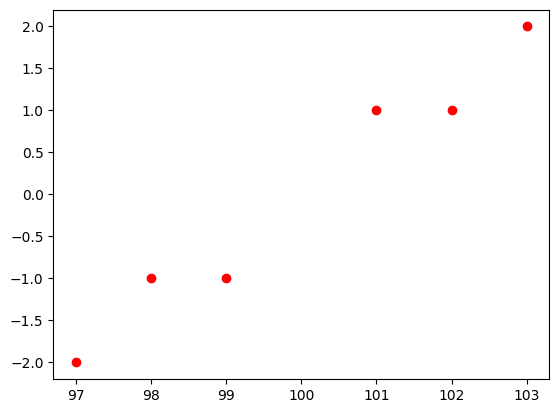
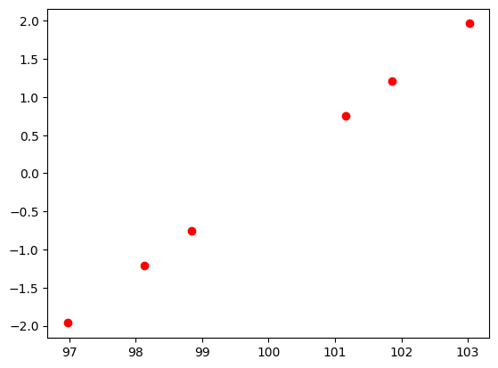
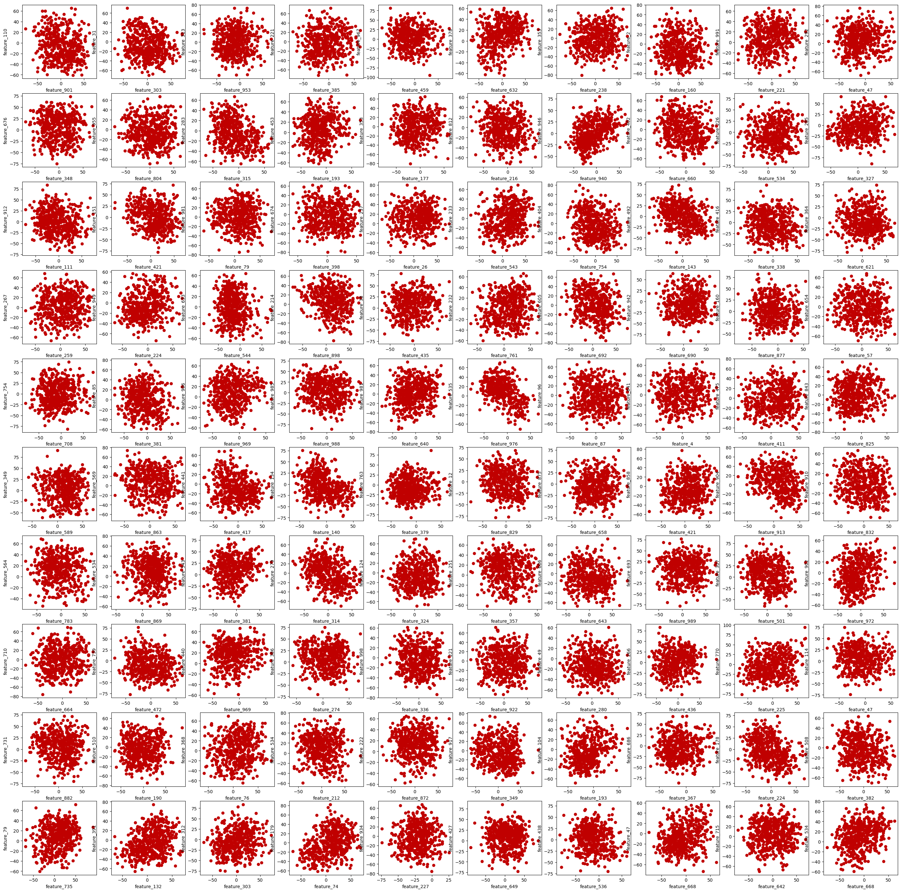
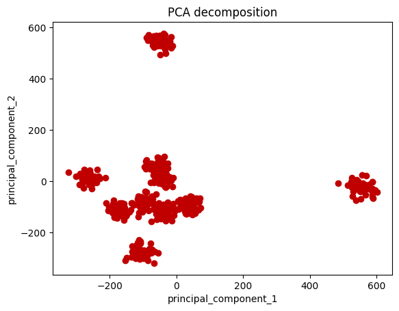

<!-- 本文件由课程原始 Notebook 转换并翻译。代码与公式保留原样。 -->
<!-- 原文件：3. Unsupervised Learning, Recommenders, Reinforcement Learning/week 2/PCA/C3_W2_Lab01_PCA_Visualization_Examples.ipynb -->

# PCA- 关于探索性数据分析的例子

在这个笔记本中，你会：

- 重现 Andrew 的例子 。PCA
- 设想如何PCA在二维小数据集上工作 不是每个投影都是"好的"
- 可视化如何将三维数据也包含在二维子空间中
- 使用PCA在高维数据集中找到隐藏模式

## 导入库

```python
import pandas as pd
import numpy as np
from sklearn.decomposition import PCA
from pca_utils import plot_widget
from bokeh.io import show, output_notebook
from bokeh.plotting import figure
import matplotlib.pyplot as plt
import plotly.offline as py
```

```python
py.init_notebook_mode()
```

```python
output_notebook()
```

## 课程示例

我们正在研究安德鲁在讲座中展示的同样例子。

```python
X = np.array([[ 99,  -1],
       [ 98,  -1],
       [ 97,  -2],
       [101,   1],
       [102,   1],
       [103,   2]])
```

```python
plt.plot(X[:,0], X[:,1], 'ro')
```

```text
[<matplotlib.lines.Line2D at 0x77cddb7d9210>]
```



```python
# Loading the PCA algorithm
pca_2 = PCA(n_components=2)
pca_2
```

```text
PCA(n_components=2)
```

```python
# Let's fit the data. We do not need to scale it, since sklearn's implementation already handles it.
pca_2.fit(X)
```

```text
PCA(n_components=2)
```

```python
pca_2.explained_variance_ratio_
```

```text
array([0.99244289, 0.00755711])
```

第一个主成分（第一条新坐标轴）解释了 99.24% 的方差；第二个主成分又解释了其余 0.76% 的方差。

```python
X_trans_2 = pca_2.transform(X)
X_trans_2
```

```text
array([[ 1.38340578,  0.2935787 ],
       [ 2.22189802, -0.25133484],
       [ 3.6053038 ,  0.04224385],
       [-1.38340578, -0.2935787 ],
       [-2.22189802,  0.25133484],
       [-3.6053038 , -0.04224385]])
```

第一列给出样本在第一主成分轴上的坐标，第二列给出样本在第二主成分轴上的坐标。

由于第一主成分已经解释了约 99% 的方差，因此可以只保留这一主成分。

```python
pca_1 = PCA(n_components=1)
pca_1
```

```text
PCA(n_components=1)
```

```python
pca_1.fit(X)
pca_1.explained_variance_ratio_
```

```text
array([0.99244289])
```

```python
X_trans_1 = pca_1.transform(X)
X_trans_1
```

```text
array([[ 1.38340578],
       [ 2.22189802],
       [ 3.6053038 ],
       [-1.38340578],
       [-2.22189802],
       [-3.6053038 ]])
```

注意，结果中的这一列正是 `X_trans_2` 的第一列。

如果数据有两个特征，并且保留两个主成分，就不会降低维度，逆变换后可以完整恢复原始数据。

```python
X_reduced_2 = pca_2.inverse_transform(X_trans_2)
X_reduced_2
```

```text
array([[ 99.,  -1.],
       [ 98.,  -1.],
       [ 97.,  -2.],
       [101.,   1.],
       [102.,   1.],
       [103.,   2.]])
```

```python
plt.plot(X_reduced_2[:,0], X_reduced_2[:,1], 'ro')
```

```text
[<matplotlib.lines.Line2D at 0x77cdda374f90>]
```


减至1维而非2维

```python
X_reduced_1 = pca_1.inverse_transform(X_trans_1)
X_reduced_1
```

```text
array([[ 98.84002499,  -0.75383654],
       [ 98.13695576,  -1.21074232],
       [ 96.97698075,  -1.96457886],
       [101.15997501,   0.75383654],
       [101.86304424,   1.21074232],
       [103.02301925,   1.96457886]])
```

```python
plt.plot(X_reduced_1[:,0], X_reduced_1[:,1], 'ro')
```

```text
[<matplotlib.lines.Line2D at 0x77cdda305150>]
```



注意，降到一维后，重建的数据点都位于同一条直线上。这条直线就是第一主成分轴，每个样本只需一个沿该轴的坐标即可表示。

## PCA 算法可视化

下面在平面中定义 $10$ 个点，用它们直观展示如何把二维数据压缩到一维。不同的投影方向会产生不同的压缩效果。

```python
X = np.array([[-0.83934975, -0.21160323],
       [ 0.67508491,  0.25113527],
       [-0.05495253,  0.36339613],
       [-0.57524042,  0.24450324],
       [ 0.58468572,  0.95337657],
       [ 0.5663363 ,  0.07555096],
       [-0.50228538, -0.65749982],
       [-0.14075593,  0.02713815],
       [ 0.2587186 , -0.26890678],
       [ 0.02775847, -0.77709049]])
```

```python
p = figure(title = '10-point scatterplot', x_axis_label = 'x-axis', y_axis_label = 'y-axis') ## Creates the figure object
p.scatter(X[:,0],X[:,1],marker = 'o', color = '#C00000', size = 5) ## Add the scatter plot

## Some visual adjustments
p.grid.visible = False
p.grid.visible = False
p.outline_line_color = None 
p.toolbar.logo = None
p.toolbar_location = None
p.xaxis.axis_line_color = "#f0f0f0"
p.xaxis.axis_line_width = 5
p.yaxis.axis_line_color = "#f0f0f0"
p.yaxis.axis_line_width = 5

## Shows the figure
show(p)
```

下一个代码将生成一个部件， 你可以在其中看到将数据压缩成一维数据点的不同方式将如何导致在新空间中各点分布的不同方式。 由此线条生成PCA是使积分尽可能远离彼此的线条。

你可以使用滑动器旋转黑色线条穿过其中心，并看到当我们旋转线条时，线条上各点的投影会如何改变。

可以看到，有些投影把原本不同的点压到几乎相同的位置，而另一些投影能较好地保留点之间的间隔。

```python
plot_widget()
```

```text
HBox(children=(FigureWidget({
    'data': [{'hovertemplate': 'x=%{x}<br>y=%{y}<extra></extra>',
              …
```

## 三维数据集的可视化

在这一节中，我们将看到一些三维数据如何被压缩成二维空间。

```python
from pca_utils import random_point_circle, plot_3d_2d_graphs
```

```python
X = random_point_circle(n = 150)
```

```python
deb = plot_3d_2d_graphs(X)
```

```python
deb.update_layout(yaxis2 = dict(title_text = 'test', visible=True))
```

## 在探索性数据分析中使用 PCA

下面加载一个包含 500 个样本、1,000 个特征（feature）的示例数据集。

```python
df = pd.read_csv("toy_dataset.csv")
```

```python
df.head()
```

```text
   feature_0  feature_1  feature_2  feature_3  feature_4  feature_5  \
0  27.422157 -29.662712 -23.297163 -15.161935   0.345581   3.706750   
1   3.489482 -19.153551 -14.636424  14.688258  20.114204  13.532852   
2   4.293509  22.691579  -1.045155  -8.740350  12.401082  31.362987   
3  -2.139348  23.158754 -26.241206  19.426465   9.472049   8.453948   
4 -35.251034  27.281816 -29.470282 -21.786865  11.806822  58.655133   

   feature_6  feature_7  feature_8  feature_9  ...  feature_990  feature_991  \
0  -5.507209 -46.992476   5.175469 -47.768145  ...     7.815960    24.320965   
1  34.298084  22.982509  37.938670 -35.648144  ...    11.145527   -38.886603   
2 -18.831206 -35.384557   8.161430 -16.421762  ...    48.190331    -0.503157   
3   0.637211 -26.675984 -43.823329  11.840874  ...   -51.613076    13.278858   
4   5.375230  59.740676 -49.007717 -21.801155  ...     0.010857    20.975655   

   feature_992  feature_993  feature_994  feature_995  feature_996  \
0   -33.987522    22.306088    31.173511    31.264830     8.380699   
1    44.579337    37.308519    29.560535   -10.643331    -6.499263   
2   -21.740678    15.972237     1.122335   -45.473538    10.518065   
3   -44.179281    32.912282     4.805774     3.960836   -15.888356   
4   -21.358371    18.709369    22.362477    41.214565    -7.217724   

   feature_997  feature_998  feature_999  
0   -25.843189    36.706408   -43.480792  
1    19.921666    -3.528982    31.068739  
2    -5.818320   -29.466301   -13.676685  
3    61.384773    33.112334     5.088320  
4    31.173870    37.097532   -27.509420  

[5 rows x 1000 columns]
```

这是一个数据集与$1000$ 特征。

下面检查数据中是否存在可见规律。函数会随机选择 100 对特征 $(x,y)$ 并绘制散点图。

```python
def get_pairs(n = 100):
    from random import randint
    i = 0
    tuples = []
    while i < 100:
        x = df.columns[randint(0,999)]
        y = df.columns[randint(0,999)]
        while x == y or (x,y) in tuples or (y,x) in tuples:
            y = df.columns[randint(0,999)]
        tuples.append((x,y))
        i+=1
    return tuples
```

```python
pairs = get_pairs()
```

下面绘制这些特征。

```python
fig, axs = plt.subplots(10,10, figsize = (35,35))
i = 0
for rows in axs:
    for ax in rows:
        ax.scatter(df[pairs[i][0]],df[pairs[i][1]], color = "#C00000")
        ax.set_xlabel(pairs[i][0])
        ax.set_ylabel(pairs[i][1])
        i+=1
```



任意两个特征的散点图中似乎没有明显结构，而且特征数量很大，无法检查所有组合。下面观察特征之间的线性相关性。

```python
# This may take 1 minute to run
corr = df.corr()
```

```python
## This will show all the features that have correlation > 0.5 in absolute value. We remove the features 
## with correlation == 1 to remove the correlation of a feature with itself

mask = (abs(corr) > 0.5) & (abs(corr) != 1)
corr.where(mask).stack().sort_values()
```

```text
feature_81   feature_657   -0.631294
feature_657  feature_81    -0.631294
feature_313  feature_4     -0.615317
feature_4    feature_313   -0.615317
feature_716  feature_1     -0.609056
                              ...   
feature_792  feature_547    0.620864
feature_35   feature_965    0.631424
feature_965  feature_35     0.631424
feature_395  feature_985    0.632593
feature_985  feature_395    0.632593
Length: 1870, dtype: float64
```

最大和最小的关联 围绕$0.631$ - $0.632$。这并没有显示太多。

下面用 PCA 把数据投影到二维子空间，以便绘制散点图。

```python
# Loading the PCA object
pca = PCA(n_components = 2) # Here we choose the number of components that we will keep.
X_pca = pca.fit_transform(df)
df_pca = pd.DataFrame(X_pca, columns = ['principal_component_1','principal_component_2'])
```

```python
df_pca.head()
```

```text
   principal_component_1  principal_component_2
0             -46.235641              -1.672797
1            -210.208758             -84.068249
2             -26.352795            -127.895751
3            -116.106804            -269.368256
4            -110.183605            -279.657306
```

```python
plt.scatter(df_pca['principal_component_1'],df_pca['principal_component_2'], color = "#C00000")
plt.xlabel('principal_component_1')
plt.ylabel('principal_component_2')
plt.title('PCA decomposition')
```

```text
Text(0.5, 1.0, 'PCA decomposition')
```



现在可以看到清晰的簇结构。

```python
# pca.explained_variance_ration_ returns a list where it shows the amount of variance explained by each principal component.
sum(pca.explained_variance_ratio_)
```

```text
0.14572843555106285
```

我们只保留了大约14.6%方差（variance）!

令人印象深刻! 我们的数据中可以清楚地看到集群，这是我们以前所看不到的。你能发现多少集群? 8, 10?

如果我们运行一个PCA我们将从数据中获得更多信息。

```python
pca_3 = PCA(n_components = 3).fit(df)
X_t = pca_3.transform(df)
df_pca_3 = pd.DataFrame(X_t,columns = ['principal_component_1','principal_component_2','principal_component_3'])
```

```python
import plotly.express as px
```

```python
fig = px.scatter_3d(df_pca_3, x = 'principal_component_1', y = 'principal_component_2', z = 'principal_component_3').update_traces(marker = dict(color = "#C00000"))
fig.show()
```

```python
sum(pca_3.explained_variance_ratio_)
```

```text
0.20806257816093268
```

此时两个主成分保留了约 19% 的方差，并显示出十个簇。

恭喜完成这本笔记本!
