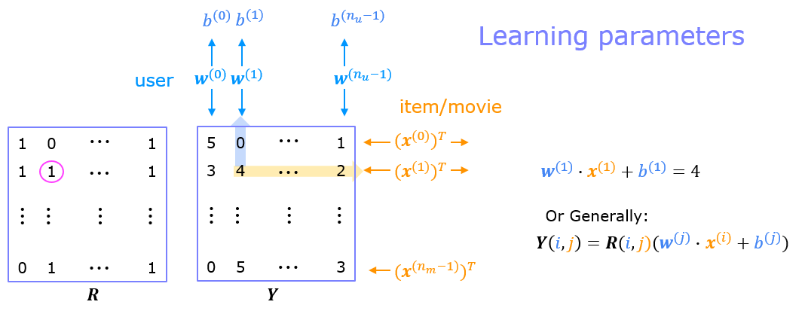
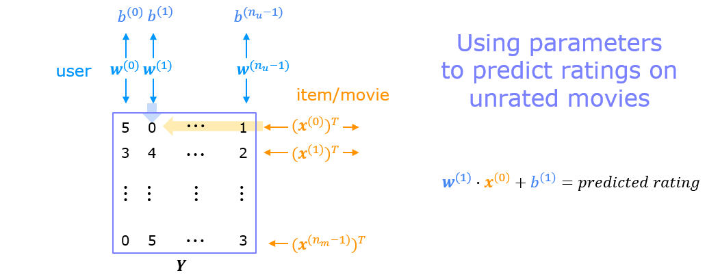
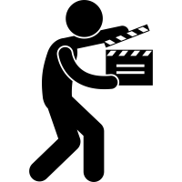

<!-- 本文件由课程原始 Notebook 转换并翻译。代码与公式保留原样。 -->
<!-- 原文件：3. Unsupervised Learning, Recommenders, Reinforcement Learning/week 2/collaborative filtering rec sys/C3_W2_Collaborative_RecSys_Assignment.ipynb -->

# 练习实验： 协同过滤 推荐系统 

在此过程中，你将执行协同过滤（collaborative filtering）建立一个推荐系统（recommender system）电影。

# 大纲 
- [ 1 - Notation](#1)
- [ 2 - Recommender Systems](#2)
- [ 3 - Movie ratings dataset](#3)
- [ 4 - Collaborative filtering learning algorithm](#4)
  - [ 4.1 Collaborative filtering cost function](#4.1)
    - [ Exercise 1](#ex01)
- [ 5 - Learning movie recommendations](#5)
- [ 6 - Recommendations](#6)
- [ 7 - Congratulations!](#7)

_**注意：**为避免自动评分出错，请勿编辑或删除非评分单元格，也不要在 Notebook 中新增单元格。_ 
_通过作业后，如果想尝试额外代码，可按 Notebook 末尾的说明解锁非评分单元格。_

## 软件包 
我们用现在熟悉的NumPy和TensorFlow软件包

```python
import numpy as np
import tensorflow as tf
from tensorflow import keras
from recsys_utils import *
```

<a name="1"></a>
## 1. 标注

| 通用<br />记号 | 含义 | Python 名称（如有） |
|:--|:--|:--|
| $r(i,j)$ | 标量；用户 $j$ 评价过电影 $i$ 时为 1，否则为 0 | |
| $y(i,j)$ | 标量；用户 $j$ 给电影 $i$ 的评分（仅当 $r(i,j)=1$ 时定义） | |
| $\mathbf{w}^{(j)}$ | 向量；用户 $j$ 的参数 | |
| $b^{(j)}$ | 标量；用户 $j$ 的偏置参数 | |
| $\mathbf{x}^{(i)}$ | 向量；电影 $i$ 的特征 | |
| $n_u$ | 用户数量 | `num_users` |
| $n_m$ | 电影数量 | `num_movies` |
| $n$ | 特征数量 | `num_features` |
| $\mathbf{X}$ | 由向量 $\mathbf{x}^{(i)}$ 组成的矩阵 | `X` |
| $\mathbf{W}$ | 由向量 $\mathbf{w}^{(j)}$ 组成的矩阵 | `W` |
| $\mathbf{b}$ | 由偏置参数 $b^{(j)}$ 组成的向量 | `b` |
| $\mathbf{R}$ | 由元素 $r(i,j)$ 组成的矩阵 | `R` |

<a name="2"></a>
## 2 - 推荐系统 
在本实验中，你将执行协同过滤（collaborative filtering）学习算法并将其应用于电影评分的数据集。
目标协同过滤（collaborative filtering） 推荐系统（recommender system）生成两个向量：对于每个用户来说，一个“参数向量”体现了用户的电影味道。对于每个电影，一个“参数向量 ”特征（feature）大小相同的向量，它体现了对电影的一些描述。两个向量的点积加偏差（bias）术语应产生用户对该电影可能给予的评级的估计。

以下图表详细介绍了这些向量是如何学习的。

<figure>
   
</figure>

如所示，现有的评级以矩阵形式提供。$Y$包含评分; 0.5至5包含在0.5步. 0 如果电影没有被评分.$R$拥有1个电影的评分。电影分为行，用户分为列。每个用户都有参数向量。$w^{user}$和偏差每部电影都有一部特征向量$x^{movie}$。这些向量同时通过使用现有的用户/电影评级作为训练数据来学习。$\mathbf{w}^{(1)} \cdot \mathbf{x}^{(1)} + b^{(1)} = 4$值得注意的是，特征向量$x^{movie}$用户向量时必须满足所有用户$w^{user}$必须满足所有电影。这是此方法名称的来源 - 所有用户合作生成评分集。

<figure>
   
</figure>

一旦特征向量和参数被学习，可以用来预测一个用户如何对未评级的电影进行评分。这在上图中显示。该方程是预测电影零上用户一的评分的一个例子。

本练习将实现 `cofiCostFunc`，计算协同过滤（collaborative filtering）的代价。
目标函数。在执行目标函数之后，你将使用TensorFlow自定义训练循环以学习参数协同过滤（collaborative filtering）。第一步是详细列出将用于实验。

<a name="3"></a>
## 3 - 电影评分数据集
数据集来自[MovieLens "ml-latest-small"](https://grouplens.org/datasets/movielens/latest/)数据集。
[F. Maxwell Harper and Joseph A. Konstan. 2015. The MovieLens Datas: History and Contexts. ACM Interactive Intelligent Systems (TiiS) 5, 4: 19:1–19:19.<https://doi.org/10.1145/2827872>]

原始数据集包含约 9,000 部电影和 600 名用户的评分。这里使用的是缩减后的数据集，包含 $n_u = 443$ 名用户、$n_m= 4778$ 部电影；评分范围为 0.5～5.0，步长为 0.5。

下面把电影评分数据加载到变量 $Y$ 和 $R$ 中。

矩阵 $Y$ 的形状为 $n_m \times n_u$，其中 $y^{(i,j)}$ 表示用户 $j$ 对电影 $i$ 的评分。矩阵 $R$ 是二值指示矩阵：如果用户 $j$ 评价过电影 $i$，则 $R(i,j)=1$；否则 $R(i,j)=0$。

在本部分中，还会使用矩阵 $\mathbf{X}$、$\mathbf{W}$ 和 $\mathbf{b}$： 

$$
\mathbf{X} =
\begin{bmatrix}
--- (\mathbf{x}^{(0)})^T --- \\
--- (\mathbf{x}^{(1)})^T --- \\
\vdots \\
--- (\mathbf{x}^{(n_m-1)})^T --- \\
\end{bmatrix} , \quad
\mathbf{W} = 
\begin{bmatrix}
--- (\mathbf{w}^{(0)})^T --- \\
--- (\mathbf{w}^{(1)})^T --- \\
\vdots \\
--- (\mathbf{w}^{(n_u-1)})^T --- \\
\end{bmatrix},\quad
\mathbf{ b} = 
\begin{bmatrix}
 b^{(0)}  \\
 b^{(1)} \\
\vdots \\
b^{(n_u-1)} \\
\end{bmatrix}\quad
$$
该第 $i$ 组$\mathbf{X}$对应
特征向量$x^{(i)}$第 $i$ 部电影，还有第 $j$ 组
$\mathbf{W}$对应于一个参数向量$\mathbf{w}^{(j)}$，用于
第 $j$ 位用户，都是$x^{(i)}$和$\mathbf{w}^{(j)}$已经$n$-维度
向量。为本练习的目的，你将使用$n=10$，以及
因此，$\mathbf{x}^{(i)}$和$\mathbf{w}^{(j)}$有10个元素。
因此，$\mathbf{X}$是一个
$n_m \times 10$矩阵和$\mathbf{W}$是一个$n_u \times 10$矩阵。

我们将首先加载电影评分数据集，以了解数据的结构。
我们上船吧$Y$和$R$与电影数据集。
我们还要装子弹$\mathbf{X}$, $\mathbf{W}$，以及$\mathbf{b}$。这些值将在后面的实验，但我们会使用预计算值来开发代价模型。

```python
#Load data
X, W, b, num_movies, num_features, num_users = load_precalc_params_small()
Y, R = load_ratings_small()

print("Y", Y.shape, "R", R.shape)
print("X", X.shape)
print("W", W.shape)
print("b", b.shape)
print("num_features", num_features)
print("num_movies",   num_movies)
print("num_users",    num_users)
```

```text
Y (4778, 443) R (4778, 443)
X (4778, 10)
W (443, 10)
b (1, 443)
num_features 10
num_movies 4778
num_users 443
```

```python
#  From the matrix, we can compute statistics like average rating.
tsmean =  np.mean(Y[0, R[0, :].astype(bool)])
print(f"Average rating for movie 1 : {tsmean:0.3f} / 5" )
```

```text
Average rating for movie 1 : 3.400 / 5
```

<a name="4"></a>
## 4 - 协同过滤（collaborative filtering）学习算法

现在，你将开始执行协同过滤（collaborative filtering）学习
算法。你将从执行目标函数开始。

该协同过滤（collaborative filtering）电影设置中的算法
建议$n$- 维参数向量
$\mathbf{x}^{(0)},...,\mathbf{x}^{(n_m-1)}$, $\mathbf{w}^{(0)},...,\mathbf{w}^{(n_u-1)}$和$b^{(0)},...,b^{(n_u-1)}$时，
模型预测电影的评分$i$按用户$j$作为
$y^{(i,j)} = \mathbf{w}^{(j)}\cdot \mathbf{x}^{(i)} + b^{(j)}$。鉴于一个数据集包含
由一些用户在一些电影上制作的一套评分，你希望
学习参数向量 $\mathbf{x}^{(0)},\ldots,\mathbf{x}^{(n_m-1)}$、$\mathbf{w}^{(0)},\ldots,\mathbf{w}^{(n_u-1)}$ 和 $b^{(0)},\ldots,b^{(n_u-1)}$，使模型达到最佳拟合，即使平方误差最小。

在 CofiCostFunc 中完成代码以计算代价
函数用于协同过滤（collaborative filtering）.

<a name="4.1"></a>
### 4.1 协同过滤 代价函数

该协同过滤（collaborative filtering） 代价函数（cost function）由
$$
J({\mathbf{x}^{(0)},...,\mathbf{x}^{(n_m-1)},\mathbf{w}^{(0)},b^{(0)},...,\mathbf{w}^{(n_u-1)},b^{(n_u-1)}})= \left[ \frac{1}{2}\sum_{(i,j):r(i,j)=1}(\mathbf{w}^{(j)} \cdot \mathbf{x}^{(i)} + b^{(j)} - y^{(i,j)})^2 \right]
+ \underbrace{\left[
\frac{\lambda}{2}
\sum_{j=0}^{n_u-1}\sum_{k=0}^{n-1}(\mathbf{w}^{(j)}_k)^2
+ \frac{\lambda}{2}\sum_{i=0}^{n_m-1}\sum_{k=0}^{n-1}(\mathbf{x}_k^{(i)})^2
\right]}_{regularization}
\tag{1}
$$
式 (1) 中的第一项求和只遍历满足 $r(i,j)=1$（即值为 $1$）的 $(i,j)$ 组合，可写为：

$$
= \left[ \frac{1}{2}\sum_{j=0}^{n_u-1} \sum_{i=0}^{n_m-1}r(i,j)*(\mathbf{w}^{(j)} \cdot \mathbf{x}^{(i)} + b^{(j)} - y^{(i,j)})^2 \right]
+\text{regularization}
$$

你现在应该写CofiCostFunc(协同过滤（collaborative filtering） 代价函数改为返回这个代价。

<a name="ex01"></a>
### 练习 1

* *循环执行 :**   
从执行代价函数用于循环。
考虑制定代价函数分两步走。代价函数无正则化（regularization）。不包括以下内容的测试案例：正则化测试你的执行。一旦操作，请添加正则化并进行包括以下内容的测试：正则化。请注意，你应当积累用户的代价$j$电影$i$只有在$R(i,j) = 1$.

```python
# GRADED FUNCTION: cofi_cost_func
# UNQ_C1

def cofi_cost_func(X, W, b, Y, R, lambda_):
    """
    Returns the cost for the content-based filtering
    Args:
      X (ndarray (num_movies,num_features)): matrix of item features
      W (ndarray (num_users,num_features)) : matrix of user parameters
      b (ndarray (1, num_users)            : vector of user parameters
      Y (ndarray (num_movies,num_users)    : matrix of user ratings of movies
      R (ndarray (num_movies,num_users)    : matrix, where R(i, j) = 1 if the i-th movies was rated by the j-th user
      lambda_ (float): regularization parameter
    Returns:
      J (float) : Cost
    """
    nm, nu = Y.shape
    J = 0
    ### START CODE HERE ###  
    for j in range(nu):
        w = W[j,:]
        b_j = b[0,j]
        for i in range(nm):
            x = X[i,:]
            y = Y[i,j]
            r = R[i,j]
            J += np.square(r * (np.dot(w,x) + b_j - y ) )
    J += lambda_* (np.sum(np.square(W)) + np.sum(np.square(X)))            
    J = J/2
        
    ### END CODE HERE ### 

    return J
```

<details>
  <summary><font size="3" color="darkgreen"><b>点击查看提示</b></font></summary>
可以将代码结构为2，用于类似于(1)中总和的循环。
不执行代码正则化先说
注意 (1) 中的一些元素是向量。 使用np.dot()你也可以使用np.square().
注意哪些元素由i索引，哪些由j索引，不要忘记除以2.
    
```Python     
    ### START CODE HERE ###  
    for j in range(nu):
        
        
        for i in range(nm):
            
            
    ### END CODE HERE ### 
```    
<details>
    <summary><font size="2" color="darkblue"><b>点击查看更多提示</b></font></summary>
        
下面是更多细节。 下面的代码从矩阵中抽出每个元素然后使用它 。
人们还可以直接参考汇总表。
此代码不包含正则化。
    
```Python 
    nm,nu = Y.shape
    J = 0
    ### START CODE HERE ###  
    for j in range(nu):
        w = W[j,:]
        b_j = b[0,j]
        for i in range(nm):
            x = 
            y = 
            r =
            J += 
    J = J/2
    ### END CODE HERE ### 

```
    
<details>
    <summary><font size="2" color="darkblue"><b>最后办法(全面实施)</b></font></summary>
    
```Python 
    nm,nu = Y.shape
    J = 0
    ### START CODE HERE ###  
    for j in range(nu):
        w = W[j,:]
        b_j = b[0,j]
        for i in range(nm):
            x = X[i,:]
            y = Y[i,j]
            r = R[i,j]
            J += np.square(r * (np.dot(w,x) + b_j - y ) )
    J = J/2
    ### END CODE HERE ### 
```
    
<details>
    <summary><font size="2" color="darkblue"><b>正则化</b></font></summary>
     正则化仅分别对 W 数组和 X 数组中的每个元素求平方，然后将所有元素的平方组合起来。
你可以利用np.square和(或)np.sum().

<details>
    <summary><font size="2" color="darkblue"><b>正则化细节</b></font></summary>
    
```Python 
    J += (lambda_/2) * (np.sum(np.square(W)) + np.sum(np.square(X)))
```
    
</details>
</details>
</details>
</details>

```python
# Reduce the data set size so that this runs faster
num_users_r = 4
num_movies_r = 5 
num_features_r = 3

X_r = X[:num_movies_r, :num_features_r]
W_r = W[:num_users_r,  :num_features_r]
b_r = b[0, :num_users_r].reshape(1,-1)
Y_r = Y[:num_movies_r, :num_users_r]
R_r = R[:num_movies_r, :num_users_r]

# Evaluate cost function
J = cofi_cost_func(X_r, W_r, b_r, Y_r, R_r, 0);
print(f"Cost: {J:0.2f}")
```

```text
Cost: 13.67
```

* *预期输出(lambda=0)**:  
$13.67$.

```python
# Evaluate cost function with regularization 
J = cofi_cost_func(X_r, W_r, b_r, Y_r, R_r, 1.5);
print(f"Cost (with regularization): {J:0.2f}")
```

```text
Cost (with regularization): 28.09
```

**预期输出**:

28. 09

```python
# Public tests
from public_tests import *
test_cofi_cost_func(cofi_cost_func)
```

```text
All tests passed!
```

* *向量执行**

重要的是创建一个向量执行来计算$J$，因为它会在优化期间被多次调用。所使用的线性代数不是本系列的重点，所以提供了执行。如果你是线性代数专家，请无需引用下面的代码即可创建你的版本。

运行下面的代码，并验证它所产生的结果与非认证版本相同。

```python
def cofi_cost_func_v(X, W, b, Y, R, lambda_):
    """
    Returns the cost for the content-based filtering
    Vectorized for speed. Uses tensorflow operations to be compatible with custom training loop.
    Args:
      X (ndarray (num_movies,num_features)): matrix of item features
      W (ndarray (num_users,num_features)) : matrix of user parameters
      b (ndarray (1, num_users)            : vector of user parameters
      Y (ndarray (num_movies,num_users)    : matrix of user ratings of movies
      R (ndarray (num_movies,num_users)    : matrix, where R(i, j) = 1 if the i-th movies was rated by the j-th user
      lambda_ (float): regularization parameter
    Returns:
      J (float) : Cost
    """
    j = (tf.linalg.matmul(X, tf.transpose(W)) + b - Y)*R
    J = 0.5 * tf.reduce_sum(j**2) + (lambda_/2) * (tf.reduce_sum(X**2) + tf.reduce_sum(W**2))
    return J
```

```python
# Evaluate cost function
J = cofi_cost_func_v(X_r, W_r, b_r, Y_r, R_r, 0);
print(f"Cost: {J:0.2f}")

# Evaluate cost function with regularization 
J = cofi_cost_func_v(X_r, W_r, b_r, Y_r, R_r, 1.5);
print(f"Cost (with regularization): {J:0.2f}")
```

```text
Cost: 13.67
Cost (with regularization): 28.09
```

**预期输出**:  
代价：13.67
代价(与正则化): 28.09

<a name="5"></a>
## 5 - 学习电影推荐 
- -----------------------------

执行完毕后协同过滤（collaborative filtering）代价
函数，你可以开始训练你的算法
电影推荐给自己。

在该单元格下方，你可以Enter 键算法会为你提供建议! 我们已经根据我们的喜好填了一些值， 但是在你有我们的选择后， 你应该修改这个， 以符合你的口味 。
数据集中所有电影的列表在文件中[movie list](data/small_movie_list.csv).

```python
movieList, movieList_df = load_Movie_List_pd()

my_ratings = np.zeros(num_movies)          #  Initialize my ratings

# Check the file small_movie_list.csv for id of each movie in our dataset
# For example, Toy Story 3 (2010) has ID 2700, so to rate it "5", you can set
my_ratings[2700] = 5 

#Or suppose you did not enjoy Persuasion (2007), you can set
my_ratings[2609] = 2;

# We have selected a few movies we liked / did not like and the ratings we
# gave are as follows:
my_ratings[929]  = 5   # Lord of the Rings: The Return of the King, The
my_ratings[246]  = 5   # Shrek (2001)
my_ratings[2716] = 3   # Inception
my_ratings[1150] = 5   # Incredibles, The (2004)
my_ratings[382]  = 2   # Amelie (Fabuleux destin d'Amélie Poulain, Le)
my_ratings[366]  = 5   # Harry Potter and the Sorcerer's Stone (a.k.a. Harry Potter and the Philosopher's Stone) (2001)
my_ratings[622]  = 5   # Harry Potter and the Chamber of Secrets (2002)
my_ratings[988]  = 3   # Eternal Sunshine of the Spotless Mind (2004)
my_ratings[2925] = 1   # Louis Theroux: Law & Disorder (2008)
my_ratings[2937] = 1   # Nothing to Declare (Rien à déclarer)
my_ratings[793]  = 5   # Pirates of the Caribbean: The Curse of the Black Pearl (2003)
my_rated = [i for i in range(len(my_ratings)) if my_ratings[i] > 0]

print('\nNew user ratings:\n')
for i in range(len(my_ratings)):
    if my_ratings[i] > 0 :
        print(f'Rated {my_ratings[i]} for  {movieList_df.loc[i,"title"]}');
```

```text

New user ratings:

Rated 5.0 for  Shrek (2001)
Rated 5.0 for  Harry Potter and the Sorcerer's Stone (a.k.a. Harry Potter and the Philosopher's Stone) (2001)
Rated 2.0 for  Amelie (Fabuleux destin d'Amélie Poulain, Le) (2001)
Rated 5.0 for  Harry Potter and the Chamber of Secrets (2002)
Rated 5.0 for  Pirates of the Caribbean: The Curse of the Black Pearl (2003)
Rated 5.0 for  Lord of the Rings: The Return of the King, The (2003)
Rated 3.0 for  Eternal Sunshine of the Spotless Mind (2004)
Rated 5.0 for  Incredibles, The (2004)
Rated 2.0 for  Persuasion (2007)
Rated 5.0 for  Toy Story 3 (2010)
Rated 3.0 for  Inception (2010)
Rated 1.0 for  Louis Theroux: Law & Disorder (2008)
Rated 1.0 for  Nothing to Declare (Rien à déclarer) (2010)
```

现在把这些评分加入 $Y$ 和 $R$，再对评分进行均值归一化。

```python
# Reload ratings
Y, R = load_ratings_small()

# Add new user ratings to Y 
Y = np.c_[my_ratings, Y]

# Add new user indicator matrix to R
R = np.c_[(my_ratings != 0).astype(int), R]

# Normalize the Dataset
Ynorm, Ymean = normalizeRatings(Y, R)
```

准备训练模型，初始化参数并选择亚当优化器。

```python
#  Useful Values
num_movies, num_users = Y.shape
num_features = 100

# Set Initial Parameters (W, X), use tf.Variable to track these variables
tf.random.set_seed(1234) # for consistent results
W = tf.Variable(tf.random.normal((num_users,  num_features),dtype=tf.float64),  name='W')
X = tf.Variable(tf.random.normal((num_movies, num_features),dtype=tf.float64),  name='X')
b = tf.Variable(tf.random.normal((1,          num_users),   dtype=tf.float64),  name='b')

# Instantiate an optimizer.
optimizer = keras.optimizers.Adam(learning_rate=1e-1)
```

下面训练协同过滤（collaborative filtering）模型，学习参数 $\mathbf{X}$、$\mathbf{W}$ 和 $\mathbf{b}$。

这里需要直接学习 $w$、$b$ 和 $x$，这些参数并不位于 TensorFlow 常见的神经网络层中。因此，第 2 门课程中使用的 `Model`、`compile()`、`fit()`、`predict()` 流程不能直接套用，需要使用自定义训练循环。

回顾前面的梯度下降流程：
- 重复到汇合 :
    - 计算前传
    - 相对于参数计算损失的导数
    - 使用学习率（learning rate）和计算出的梯度更新参数。
    
TensorFlow 可以自动计算导数。在 `tf.GradientTape()` 作用域内，TensorFlow 会跟踪变量上的运算；随后调用 `tape.gradient()` 计算梯度，再由优化器更新参数。
这里只简要介绍这一功能。若想深入了解，可查阅 TensorFlow 文档中关于“自定义训练循环”的内容。

```python
iterations = 200
lambda_ = 1
for iter in range(iterations):
    # Use TensorFlow’s GradientTape
    # to record the operations used to compute the cost 
    with tf.GradientTape() as tape:

        # Compute the cost (forward pass included in cost)
        cost_value = cofi_cost_func_v(X, W, b, Ynorm, R, lambda_)

    # Use the gradient tape to automatically retrieve
    # the gradients of the trainable variables with respect to the loss
    grads = tape.gradient( cost_value, [X,W,b] )

    # Run one step of gradient descent by updating
    # the value of the variables to minimize the loss.
    optimizer.apply_gradients( zip(grads, [X,W,b]) )

    # Log periodically.
    if iter % 20 == 0:
        print(f"Training loss at iteration {iter}: {cost_value:0.1f}")
```

```text
Training loss at iteration 0: 2321191.3
Training loss at iteration 20: 136168.7
Training loss at iteration 40: 51863.3
Training loss at iteration 60: 24598.8
Training loss at iteration 80: 13630.4
Training loss at iteration 100: 8487.6
Training loss at iteration 120: 5807.7
Training loss at iteration 140: 4311.6
Training loss at iteration 160: 3435.2
Training loss at iteration 180: 2902.1
```

<a name="6"></a>
## 6 - 生成推荐
下面我们计算所有电影和使用者的评分，并展示推荐的电影。`my_ratings[]`预测电影的评级$i$用户$j$计算$\mathbf{w}^{(j)} \cdot \mathbf{x}^{(i)} + b^{(j)}$。可以使用矩阵乘法计算所有评级。

```python
# Make a prediction using trained weights and biases
p = np.matmul(X.numpy(), np.transpose(W.numpy())) + b.numpy()

#restore the mean
pm = p + Ymean

my_predictions = pm[:,0]

# sort predictions
ix = tf.argsort(my_predictions, direction='DESCENDING')

for i in range(17):
    j = ix[i]
    if j not in my_rated:
        print(f'Predicting rating {my_predictions[j]:0.2f} for movie {movieList[j]}')

print('\n\nOriginal vs Predicted ratings:\n')
for i in range(len(my_ratings)):
    if my_ratings[i] > 0:
        print(f'Original {my_ratings[i]}, Predicted {my_predictions[i]:0.2f} for {movieList[i]}')
```

```text
Predicting rating 4.49 for movie My Sassy Girl (Yeopgijeogin geunyeo) (2001)
Predicting rating 4.48 for movie Martin Lawrence Live: Runteldat (2002)
Predicting rating 4.48 for movie Memento (2000)
Predicting rating 4.47 for movie Delirium (2014)
Predicting rating 4.47 for movie Laggies (2014)
Predicting rating 4.47 for movie One I Love, The (2014)
Predicting rating 4.46 for movie Particle Fever (2013)
Predicting rating 4.45 for movie Eichmann (2007)
Predicting rating 4.45 for movie Battle Royale 2: Requiem (Batoru rowaiaru II: Chinkonka) (2003)
Predicting rating 4.45 for movie Into the Abyss (2011)


Original vs Predicted ratings:

Original 5.0, Predicted 4.90 for Shrek (2001)
Original 5.0, Predicted 4.84 for Harry Potter and the Sorcerer's Stone (a.k.a. Harry Potter and the Philosopher's Stone) (2001)
Original 2.0, Predicted 2.13 for Amelie (Fabuleux destin d'Amélie Poulain, Le) (2001)
Original 5.0, Predicted 4.88 for Harry Potter and the Chamber of Secrets (2002)
Original 5.0, Predicted 4.87 for Pirates of the Caribbean: The Curse of the Black Pearl (2003)
Original 5.0, Predicted 4.89 for Lord of the Rings: The Return of the King, The (2003)
Original 3.0, Predicted 3.00 for Eternal Sunshine of the Spotless Mind (2004)
Original 5.0, Predicted 4.90 for Incredibles, The (2004)
Original 2.0, Predicted 2.11 for Persuasion (2007)
Original 5.0, Predicted 4.80 for Toy Story 3 (2010)
Original 3.0, Predicted 3.00 for Inception (2010)
Original 1.0, Predicted 1.41 for Louis Theroux: Law & Disorder (2008)
Original 1.0, Predicted 1.26 for Nothing to Declare (Rien à déclarer) (2010)
```

实际系统还可利用更多信息改进预测。当前输出中前几百部电影的预测评分范围较窄，可以优先查看评价次数较多且平均分较高的电影。[pandas](https://pandas.pydata.org/) 提供了便捷的数据表排序功能。

```python
filter=(movieList_df["number of ratings"] > 20)
movieList_df["pred"] = my_predictions
movieList_df = movieList_df.reindex(columns=["pred", "mean rating", "number of ratings", "title"])
movieList_df.loc[ix[:300]].loc[filter].sort_values("mean rating", ascending=False)
```

```text
          pred  mean rating  number of ratings  \
1743  4.030965     4.252336                107   
2112  3.985287     4.238255                149   
211   4.477792     4.122642                159   
929   4.887053     4.118919                185   
2700  4.796530     4.109091                 55   
653   4.357304     4.021277                188   
1122  4.004469     4.006494                 77   
1841  3.980647     4.000000                 61   
3083  4.084633     3.993421                 76   
2804  4.434171     3.989362                 47   
773   4.289679     3.960993                141   
1771  4.344993     3.944444                 81   
2649  4.133482     3.943396                 53   
2455  4.175746     3.887931                 58   
361   4.135291     3.871212                132   
3014  3.967901     3.869565                 69   
246   4.897137     3.867647                170   
151   3.971888     3.836364                110   
1150  4.898892     3.836000                125   
793   4.874935     3.778523                149   
366   4.843375     3.761682                107   
754   4.021774     3.723684                 76   
79    4.242984     3.699248                133   
622   4.878342     3.598039                102   

                                                  title  
1743                               Departed, The (2006)  
2112                            Dark Knight, The (2008)  
211                                      Memento (2000)  
929   Lord of the Rings: The Return of the King, The...  
2700                                 Toy Story 3 (2010)  
653       Lord of the Rings: The Two Towers, The (2002)  
1122                           Shaun of the Dead (2004)  
1841                                    Hot Fuzz (2007)  
3083                      Dark Knight Rises, The (2012)  
2804  Harry Potter and the Deathly Hallows: Part 1 (...  
773                                 Finding Nemo (2003)  
1771                               Casino Royale (2006)  
2649                    How to Train Your Dragon (2010)  
2455      Harry Potter and the Half-Blood Prince (2009)  
361                               Monsters, Inc. (2001)  
3014                               Avengers, The (2012)  
246                                        Shrek (2001)  
151   Crouching Tiger, Hidden Dragon (Wo hu cang lon...  
1150                            Incredibles, The (2004)  
793   Pirates of the Caribbean: The Curse of the Bla...  
366   Harry Potter and the Sorcerer's Stone (a.k.a. ...  
754                             X2: X-Men United (2003)  
79                                         X-Men (2000)  
622      Harry Potter and the Chamber of Secrets (2002)
```

<a name="7"></a>
## 7 - 恭喜完成！ 
你已经实现了一个可用的推荐系统（recommender system）！

<details>
  <summary><font size="2" color="darkgreen"><b>如果已经通过作业并希望尝试额外代码，可展开这里的说明。</b></font></summary>
    <p><i><b>请仅在作业通过后修改单元格属性，以免影响自动评分。</b></i>
    <ol>
        <li>在 Notebook 菜单中选择 `View` > `Cell Toolbar` > `Edit Metadata`。</li>
        <li>在需要锁定或解锁的代码单元格上点击 `Edit Metadata`。</li>
        <li>将 `editable` 属性设为：
            <ul>
                <li>要解锁，设为 `true`；</li>
                <li>要锁定，设为 `false`。</li>
            </ul>
        </li>
        <li>完成后选择 `View` > `Cell Toolbar` > `None` 隐藏元数据工具栏。</li>
    </ol>
    <p>下面的演示展示了完整操作：
        <br>
        <span>按上述步骤即可解锁单元格。</span>
</details>
