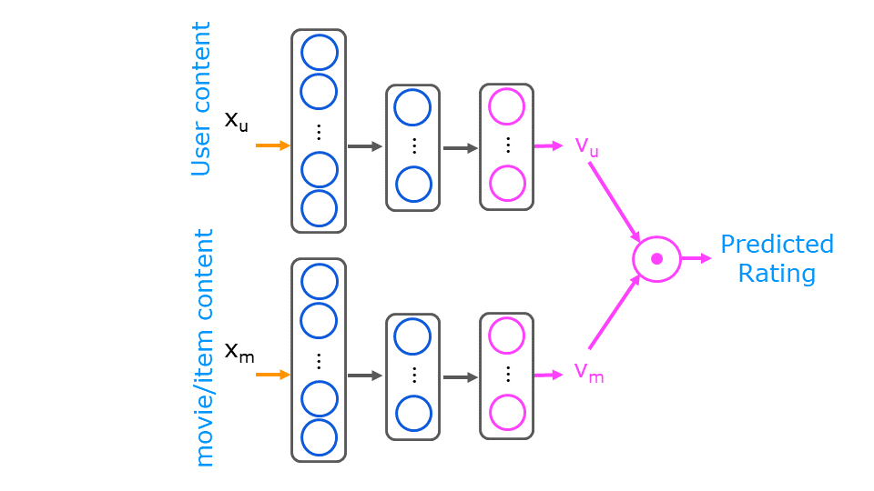
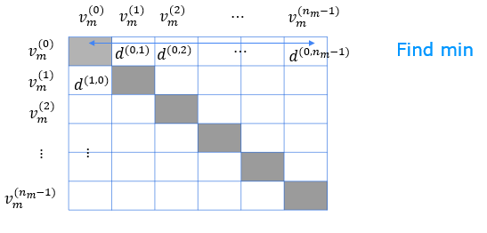

<!-- 本文件由课程原始 Notebook 转换并翻译。代码与公式保留原样。 -->
<!-- 原文件：3. Unsupervised Learning, Recommenders, Reinforcement Learning/week 2/content based rec sys/C3_W2_RecSysNN_Assignment.ipynb -->

#  练习实验（practice lab）:深入学习基于内容的过滤（content-based filtering） 

本练习使用神经网络实现基于内容的过滤（content-based filtering），构建电影推荐系统。


# 内容提要
- [1 - 软件包](#1)
- [2 - 电影评分数据集](#2)
- [3 - 使用神经网络进行基于内容的过滤](#3)
  - [3.1 训练数据](#3.1)
  - [3.2 准备训练数据](#3.2)
- [4 - 基于内容过滤的神经网络](#4)
  - [练习 1](#ex01)
- [5 - 预测](#5)
  - [5.1 为新用户预测](#5.1)
  - [5.2 为现有用户预测](#5.2)
  - [5.3 查找相似项目](#5.3)
    - [练习 2](#ex02)
- [6 - 恭喜完成](#6)

_**注意：**为避免自动评分出错，请勿编辑或删除非评分单元格，也不要在 Notebook 中新增单元格。_ 
_通过作业后，如果想尝试额外代码，可按 Notebook 末尾的说明解锁非评分单元格。_

<a name="1"></a>
## 1 - 软件包 
本练习使用 NumPy、TensorFlow 和 [scikit-learn](https://scikit-learn.org/stable/)，并使用 [tabulate](https://pypi.org/project/tabulate/) 格式化表格、[pandas](https://pandas.pydata.org/) 组织表格数据。

```python
import numpy as np
import numpy.ma as ma
import pandas as pd
import tensorflow as tf
from tensorflow import keras
from sklearn.preprocessing import StandardScaler, MinMaxScaler
from sklearn.model_selection import train_test_split
import tabulate
from recsysNN_utils import *
pd.set_option("display.precision", 1)
```

<a name="2"></a>
## 2 - 电影评分数据集
数据来自 [MovieLens ml-latest-small](https://grouplens.org/datasets/movielens/latest/)。

[F. Maxwell Harper and Joseph A. Konstan. 2015. The MovieLens Datasets: History and Context. ACM Transactions on Interactive Intelligent Systems (TiiS) 5, 4: 19:1–19:19. <https://doi.org/10.1145/2827872>]

原始数据集包含约 9,000 部电影和 600 名用户，评分范围为 0.5～5.0，步长为 0.5。课程使用了缩减后的数据集，只保留 2000 年以后较热门类型的电影；其中有 $n_u = 397$ 名用户、$n_m= 847$ 部电影和 25,521 条评分。每部电影包含标题、发行日期和一个或多个类型标签。例如，《玩具总动员 3》发行于 2010 年，类型包括冒险、动画、儿童、喜剧和奇幻。除评分外，用户信息较少；这些数据将用于构造神经网络的训练向量。
下面进一步查看数据集。表格列出了评分次数最多的 10 部电影，它们的平均评分也较高；你看过其中多少部？

```python
top10_df = pd.read_csv("./data/content_top10_df.csv")
bygenre_df = pd.read_csv("./data/content_bygenre_df.csv")
top10_df
```

```text
   movie id  num ratings  ave rating  \
0      4993          198         4.1   
1      5952          188         4.0   
2      7153          185         4.1   
3      4306          170         3.9   
4     58559          149         4.2   
5      6539          149         3.8   
6     79132          143         4.1   
7      6377          141         4.0   
8      4886          132         3.9   
9      7361          131         4.2   

                                               title  \
0  Lord of the Rings: The Fellowship of the Ring,...   
1             Lord of the Rings: The Two Towers, The   
2     Lord of the Rings: The Return of the King, The   
3                                              Shrek   
4                                   Dark Knight, The   
5  Pirates of the Caribbean: The Curse of the Bla...   
6                                          Inception   
7                                       Finding Nemo   
8                                     Monsters, Inc.   
9              Eternal Sunshine of the Spotless Mind   

                                              genres  
0                                  Adventure|Fantasy  
1                                  Adventure|Fantasy  
2                     Action|Adventure|Drama|Fantasy  
3  Adventure|Animation|Children|Comedy|Fantasy|Ro...  
4                                 Action|Crime|Drama  
5                    Action|Adventure|Comedy|Fantasy  
6         Action|Crime|Drama|Mystery|Sci-Fi|Thriller  
7                Adventure|Animation|Children|Comedy  
8        Adventure|Animation|Children|Comedy|Fantasy  
9                               Drama|Romance|Sci-Fi
```

下表按电影类型汇总评分信息。由于一部电影可以属于多个类型，各类型的评分数之和会大于数据集中的总评分数。

```python
bygenre_df
```

```text
          genre  num movies  ave rating/genre  ratings per genre
0        Action         321               3.4              10377
1     Adventure         234               3.4               8785
2     Animation          76               3.6               2588
3      Children          69               3.4               2472
4        Comedy         326               3.4               8911
5         Crime         139               3.5               4671
6   Documentary          13               3.8                280
7         Drama         342               3.6              10201
8       Fantasy         124               3.4               4468
9        Horror          56               3.2               1345
10      Mystery          68               3.6               2497
11      Romance         151               3.4               4468
12       Sci-Fi         174               3.4               5894
13     Thriller         245               3.4               7659
```

<a name="3"></a>
## 3 - 使用神经网络进行基于内容的过滤

在协同过滤实验中，你为用户和电影分别学习了一个向量，并用两个向量的点积预测评分；这些向量完全从评分数据中学习。

基于内容的过滤同样为用户和电影生成向量，但还能利用用户或电影的附加信息来改善预测。下图中的两个神经网络分别把用户特征和电影特征映射到同一向量空间。
<figure>
    <center> </center>
</figure>

<a name="3.1"></a>
### 3.1 训练数据
输入电影网络的内容由原始特征和工程特征组成。原始特征包括发行年份，以及 14 个电影类型的独热编码；工程特征包括由用户评分统计得到的电影平均评分。可回顾课程 1 第 2 周关于特征工程的实验。

用户内容主要由工程特征组成，例如该用户对各电影类型的平均评分。数据表还保留用户 ID、评分次数和总体平均分以便解释，但这些列不作为模型输入。

训练集包含用户给出的电影评分。为了增加样本较少类型的代表性，部分评分被重复采样。每条评分对应用户数组中的一行、电影数组中的一行和目标评分 `y`。

下面加载并查看部分数据。

```python
# Load Data, set configuration variables
item_train, user_train, y_train, item_features, user_features, item_vecs, movie_dict, user_to_genre = load_data()

num_user_features = user_train.shape[1] - 3  # remove userid, rating count and ave rating during training
num_item_features = item_train.shape[1] - 1  # remove movie id at train time
uvs = 3  # user genre vector start
ivs = 3  # item genre vector start
u_s = 3  # start of columns to use in training, user
i_s = 1  # start of columns to use in training, items
print(f"Number of training vectors: {len(item_train)}")
```

```text
Number of training vectors: 50884
```

先查看用户训练数组的前几行。

```python
pprint_train(user_train, user_features, uvs,  u_s, maxcount=5)
```

```text
'<table>\n<thead>\n<tr><th style="text-align: center;"> [user id] </th><th style="text-align: center;"> [rating count] </th><th style="text-align: center;"> [rating ave] </th><th style="text-align: center;"> Act ion </th><th style="text-align: center;"> Adve nture </th><th style="text-align: center;"> Anim ation </th><th style="text-align: center;"> Chil dren </th><th style="text-align: center;"> Com edy </th><th style="text-align: center;"> Crime </th><th style="text-align: center;"> Docum entary </th><th style="text-align: center;"> Drama </th><th style="text-align: center;"> Fan tasy </th><th style="text-align: center;"> Hor ror </th><th style="text-align: center;"> Mys tery </th><th style="text-align: center;"> Rom ance </th><th style="text-align: center;"> Sci -Fi </th><th style="text-align: center;"> Thri ller </th></tr>\n</thead>\n<tbody>\n<tr><td style="text-align: center;">     2     </td><td style="text-align: center;">       22       </td><td style="text-align: center;">     4.0      </td><td style="text-align: center;">   4.0   </td><td style="text-align: center;">    4.2     </td><td style="text-align: center;">    0.0     </td><td style="text-align: center;">    0.0    </td><td style="text-align: center;">   4.0   </td><td style="text-align: center;">  4.1  </td><td style="text-align: center;">     4.0      </td><td style="text-align: center;">  4.0  </td><td style="text-align: center;">   0.0    </td><td style="text-align: center;">   3.0   </td><td style="text-align: center;">   4.0    </td><td style="text-align: center;">   0.0    </td><td style="text-align: center;">   3.9   </td><td style="text-align: center;">    3.9    </td></tr>\n<tr><td style="text-align: center;">     2     </td><td style="text-align: center;">       22       </td><td style="text-align: center;">     4.0      </td><td style="text-align: center;">   4.0   </td><td style="text-align: center;">    4.2     </td><td style="text-align: center;">    0.0     </td><td style="text-align: center;">    0.0    </td><td style="text-align: center;">   4.0   </td><td style="text-align: center;">  4.1  </td><td style="text-align: center;">     4.0      </td><td style="text-align: center;">  4.0  </td><td style="text-align: center;">   0.0    </td><td style="text-align: center;">   3.0   </td><td style="text-align: center;">   4.0    </td><td style="text-align: center;">   0.0    </td><td style="text-align: center;">   3.9   </td><td style="text-align: center;">    3.9    </td></tr>\n<tr><td style="text-align: center;">     2     </td><td style="text-align: center;">       22       </td><td style="text-align: center;">     4.0      </td><td style="text-align: center;">   4.0   </td><td style="text-align: center;">    4.2     </td><td style="text-align: center;">    0.0     </td><td style="text-align: center;">    0.0    </td><td style="text-align: center;">   4.0   </td><td style="text-align: center;">  4.1  </td><td style="text-align: center;">     4.0      </td><td style="text-align: center;">  4.0  </td><td style="text-align: center;">   0.0    </td><td style="text-align: center;">   3.0   </td><td style="text-align: center;">   4.0    </td><td style="text-align: center;">   0.0    </td><td style="text-align: center;">   3.9   </td><td style="text-align: center;">    3.9    </td></tr>\n<tr><td style="text-align: center;">     2     </td><td style="text-align: center;">       22       </td><td style="text-align: center;">     4.0      </td><td style="text-align: center;">   4.0   </td><td style="text-align: center;">    4.2     </td><td style="text-align: center;">    0.0     </td><td style="text-align: center;">    0.0    </td><td style="text-align: center;">   4.0   </td><td style="text-align: center;">  4.1  </td><td style="text-align: center;">     4.0      </td><td style="text-align: center;">  4.0  </td><td style="text-align: center;">   0.0    </td><td style="text-align: center;">   3.0   </td><td style="text-align: center;">   4.0    </td><td style="text-align: center;">   0.0    </td><td style="text-align: center;">   3.9   </td><td style="text-align: center;">    3.9    </td></tr>\n<tr><td style="text-align: center;">     2     </td><td style="text-align: center;">       22       </td><td style="text-align: center;">     4.0      </td><td style="text-align: center;">   4.0   </td><td style="text-align: center;">    4.2     </td><td style="text-align: center;">    0.0     </td><td style="text-align: center;">    0.0    </td><td style="text-align: center;">   4.0   </td><td style="text-align: center;">  4.1  </td><td style="text-align: center;">     4.0      </td><td style="text-align: center;">  4.0  </td><td style="text-align: center;">   0.0    </td><td style="text-align: center;">   3.0   </td><td style="text-align: center;">   4.0    </td><td style="text-align: center;">   0.0    </td><td style="text-align: center;">   3.9   </td><td style="text-align: center;">    3.9    </td></tr>\n</tbody>\n</table>'
```

只有部分用户和电影特征用于训练。列名中带方括号的列（如用户 ID、评分次数和平均评分）仅用于说明，不会输入模型。
上表显示用户 2 对各类型电影的平均评分；值为 0 表示该用户没有评价过该类型。对于同一用户评价的不同电影，用户特征向量相同。
再查看电影（项目）数组的前几行。

```python
pprint_train(item_train, item_features, ivs, i_s, maxcount=5, user=False)
```

```text
'<table>\n<thead>\n<tr><th style="text-align: center;"> [movie id] </th><th style="text-align: center;"> year </th><th style="text-align: center;"> ave rating </th><th style="text-align: center;"> Act ion </th><th style="text-align: center;"> Adve nture </th><th style="text-align: center;"> Anim ation </th><th style="text-align: center;"> Chil dren </th><th style="text-align: center;"> Com edy </th><th style="text-align: center;"> Crime </th><th style="text-align: center;"> Docum entary </th><th style="text-align: center;"> Drama </th><th style="text-align: center;"> Fan tasy </th><th style="text-align: center;"> Hor ror </th><th style="text-align: center;"> Mys tery </th><th style="text-align: center;"> Rom ance </th><th style="text-align: center;"> Sci -Fi </th><th style="text-align: center;"> Thri ller </th></tr>\n</thead>\n<tbody>\n<tr><td style="text-align: center;">    6874    </td><td style="text-align: center;"> 2003 </td><td style="text-align: center;">    4.0     </td><td style="text-align: center;">    1    </td><td style="text-align: center;">     0      </td><td style="text-align: center;">     0      </td><td style="text-align: center;">     0     </td><td style="text-align: center;">    0    </td><td style="text-align: center;">   1   </td><td style="text-align: center;">      0       </td><td style="text-align: center;">   0   </td><td style="text-align: center;">    0     </td><td style="text-align: center;">    0    </td><td style="text-align: center;">    0     </td><td style="text-align: center;">    0     </td><td style="text-align: center;">    0    </td><td style="text-align: center;">     1     </td></tr>\n<tr><td style="text-align: center;">    8798    </td><td style="text-align: center;"> 2004 </td><td style="text-align: center;">    3.8     </td><td style="text-align: center;">    1    </td><td style="text-align: center;">     0      </td><td style="text-align: center;">     0      </td><td style="text-align: center;">     0     </td><td style="text-align: center;">    0    </td><td style="text-align: center;">   1   </td><td style="text-align: center;">      0       </td><td style="text-align: center;">   1   </td><td style="text-align: center;">    0     </td><td style="text-align: center;">    0    </td><td style="text-align: center;">    0     </td><td style="text-align: center;">    0     </td><td style="text-align: center;">    0    </td><td style="text-align: center;">     1     </td></tr>\n<tr><td style="text-align: center;">   46970    </td><td style="text-align: center;"> 2006 </td><td style="text-align: center;">    3.2     </td><td style="text-align: center;">    1    </td><td style="text-align: center;">     0      </td><td style="text-align: center;">     0      </td><td style="text-align: center;">     0     </td><td style="text-align: center;">    1    </td><td style="text-align: center;">   0   </td><td style="text-align: center;">      0       </td><td style="text-align: center;">   0   </td><td style="text-align: center;">    0     </td><td style="text-align: center;">    0    </td><td style="text-align: center;">    0     </td><td style="text-align: center;">    0     </td><td style="text-align: center;">    0    </td><td style="text-align: center;">     0     </td></tr>\n<tr><td style="text-align: center;">   48516    </td><td style="text-align: center;"> 2006 </td><td style="text-align: center;">    4.3     </td><td style="text-align: center;">    0    </td><td style="text-align: center;">     0      </td><td style="text-align: center;">     0      </td><td style="text-align: center;">     0     </td><td style="text-align: center;">    0    </td><td style="text-align: center;">   1   </td><td style="text-align: center;">      0       </td><td style="text-align: center;">   1   </td><td style="text-align: center;">    0     </td><td style="text-align: center;">    0    </td><td style="text-align: center;">    0     </td><td style="text-align: center;">    0     </td><td style="text-align: center;">    0    </td><td style="text-align: center;">     1     </td></tr>\n<tr><td style="text-align: center;">   58559    </td><td style="text-align: center;"> 2008 </td><td style="text-align: center;">    4.2     </td><td style="text-align: center;">    1    </td><td style="text-align: center;">     0      </td><td style="text-align: center;">     0      </td><td style="text-align: center;">     0     </td><td style="text-align: center;">    0    </td><td style="text-align: center;">   1   </td><td style="text-align: center;">      0       </td><td style="text-align: center;">   1   </td><td style="text-align: center;">    0     </td><td style="text-align: center;">    0    </td><td style="text-align: center;">    0     </td><td style="text-align: center;">    0     </td><td style="text-align: center;">    0    </td><td style="text-align: center;">     0     </td></tr>\n</tbody>\n</table>'
```

电影数组包含发行年份、平均评分和各类型的二元指示变量。电影 ID 不参与训练，但便于查找和解释结果。

```python
print(f"y_train[:5]: {y_train[:5]}")
```

```text
y_train[:5]: [4.  3.5 4.  4.  4.5]
```

目标 `y` 是用户对电影给出的评分。

例如，电影 6874 是一部 2003 年上映的动作/犯罪/惊悚片；用户 2 对动作片的平均评分为 3.9，该电影在 MovieLens 中的平均分为 4，而目标 `y=4` 表示用户 2 给这部电影打了 4 分。一条训练样本由用户数组的一行、电影数组的一行和对应评分组成。

<a name="3.2"></a>
### 3.2 准备训练数据
课程 1 第 2 周介绍过，特征缩放可以改善优化过程。本实验用 [scikit-learn `StandardScaler`](https://scikit-learn.org/stable/modules/generated/sklearn.preprocessing.StandardScaler.html) 标准化输入特征，并保留逆变换以便恢复原始尺度；目标评分使用 [`MinMaxScaler`](https://scikit-learn.org/stable/modules/generated/sklearn.preprocessing.MinMaxScaler.html) 缩放到 $[-1,1]$。

```python
# scale training data
item_train_unscaled = item_train
user_train_unscaled = user_train
y_train_unscaled    = y_train

scalerItem = StandardScaler()
scalerItem.fit(item_train)
item_train = scalerItem.transform(item_train)

scalerUser = StandardScaler()
scalerUser.fit(user_train)
user_train = scalerUser.transform(user_train)

scalerTarget = MinMaxScaler((-1, 1))
scalerTarget.fit(y_train.reshape(-1, 1))
y_train = scalerTarget.transform(y_train.reshape(-1, 1))
#ynorm_test = scalerTarget.transform(y_test.reshape(-1, 1))

print(np.allclose(item_train_unscaled, scalerItem.inverse_transform(item_train)))
print(np.allclose(user_train_unscaled, scalerUser.inverse_transform(user_train)))
```

```text
True
True
```

按照课程 2 第 3 周的方法，把数据划分为训练集和测试集。这里使用 [scikit-learn `train_test_split`](https://scikit-learn.org/stable/modules/generated/sklearn.model_selection.train_test_split.html) 拆分并打乱数据；对用户、电影和目标数组使用相同的随机状态，确保三者保持逐行对应。

```python
item_train, item_test = train_test_split(item_train, train_size=0.80, shuffle=True, random_state=1)
user_train, user_test = train_test_split(user_train, train_size=0.80, shuffle=True, random_state=1)
y_train, y_test       = train_test_split(y_train,    train_size=0.80, shuffle=True, random_state=1)
print(f"movie/item training data shape: {item_train.shape}")
print(f"movie/item test data shape: {item_test.shape}")
```

```text
movie/item training data shape: (40707, 17)
movie/item test data shape: (10177, 17)
```

标准化并打乱后的输入特征均值接近 0。

```python
pprint_train(user_train, user_features, uvs, u_s, maxcount=5)
```

```text
'<table>\n<thead>\n<tr><th style="text-align: center;"> [user id] </th><th style="text-align: center;"> [rating count] </th><th style="text-align: center;"> [rating ave] </th><th style="text-align: center;"> Act ion </th><th style="text-align: center;"> Adve nture </th><th style="text-align: center;"> Anim ation </th><th style="text-align: center;"> Chil dren </th><th style="text-align: center;"> Com edy </th><th style="text-align: center;"> Crime </th><th style="text-align: center;"> Docum entary </th><th style="text-align: center;"> Drama </th><th style="text-align: center;"> Fan tasy </th><th style="text-align: center;"> Hor ror </th><th style="text-align: center;"> Mys tery </th><th style="text-align: center;"> Rom ance </th><th style="text-align: center;"> Sci -Fi </th><th style="text-align: center;"> Thri ller </th></tr>\n</thead>\n<tbody>\n<tr><td style="text-align: center;">     1     </td><td style="text-align: center;">       0        </td><td style="text-align: center;">     -1.0     </td><td style="text-align: center;">  -0.8   </td><td style="text-align: center;">    -0.7    </td><td style="text-align: center;">    0.1     </td><td style="text-align: center;">   -0.0    </td><td style="text-align: center;">  -1.2   </td><td style="text-align: center;"> -0.4  </td><td style="text-align: center;">     0.6      </td><td style="text-align: center;"> -0.5  </td><td style="text-align: center;">   -0.5   </td><td style="text-align: center;">  -0.1   </td><td style="text-align: center;">   -0.6   </td><td style="text-align: center;">   -0.6   </td><td style="text-align: center;">  -0.7   </td><td style="text-align: center;">   -0.7    </td></tr>\n<tr><td style="text-align: center;">     0     </td><td style="text-align: center;">       1        </td><td style="text-align: center;">     -0.7     </td><td style="text-align: center;">  -0.5   </td><td style="text-align: center;">    -0.7    </td><td style="text-align: center;">    -0.1    </td><td style="text-align: center;">   -0.2    </td><td style="text-align: center;">  -0.6   </td><td style="text-align: center;"> -0.2  </td><td style="text-align: center;">     0.7      </td><td style="text-align: center;"> -0.5  </td><td style="text-align: center;">   -0.8   </td><td style="text-align: center;">   0.1   </td><td style="text-align: center;">   -0.0   </td><td style="text-align: center;">   -0.6   </td><td style="text-align: center;">  -0.5   </td><td style="text-align: center;">   -0.4    </td></tr>\n<tr><td style="text-align: center;">    -1     </td><td style="text-align: center;">       -1       </td><td style="text-align: center;">     -0.2     </td><td style="text-align: center;">   0.3   </td><td style="text-align: center;">    -0.4    </td><td style="text-align: center;">    0.4     </td><td style="text-align: center;">    0.5    </td><td style="text-align: center;">   1.0   </td><td style="text-align: center;">  0.6  </td><td style="text-align: center;">     -1.2     </td><td style="text-align: center;"> -0.3  </td><td style="text-align: center;">   -0.6   </td><td style="text-align: center;">  -2.3   </td><td style="text-align: center;">   -0.1   </td><td style="text-align: center;">   0.0    </td><td style="text-align: center;">   0.4   </td><td style="text-align: center;">   -0.0    </td></tr>\n<tr><td style="text-align: center;">     0     </td><td style="text-align: center;">       -1       </td><td style="text-align: center;">     0.6      </td><td style="text-align: center;">   0.5   </td><td style="text-align: center;">    0.5     </td><td style="text-align: center;">    0.2     </td><td style="text-align: center;">    0.6    </td><td style="text-align: center;">  -0.1   </td><td style="text-align: center;">  0.5  </td><td style="text-align: center;">     -1.2     </td><td style="text-align: center;">  0.9  </td><td style="text-align: center;">   1.2    </td><td style="text-align: center;">  -2.3   </td><td style="text-align: center;">   -0.1   </td><td style="text-align: center;">   0.0    </td><td style="text-align: center;">   0.2   </td><td style="text-align: center;">    0.3    </td></tr>\n<tr><td style="text-align: center;">    -1     </td><td style="text-align: center;">       0        </td><td style="text-align: center;">     0.7      </td><td style="text-align: center;">   0.6   </td><td style="text-align: center;">    0.5     </td><td style="text-align: center;">    0.3     </td><td style="text-align: center;">    0.5    </td><td style="text-align: center;">   0.4   </td><td style="text-align: center;">  0.6  </td><td style="text-align: center;">     1.0      </td><td style="text-align: center;">  0.6  </td><td style="text-align: center;">   0.3    </td><td style="text-align: center;">   0.8   </td><td style="text-align: center;">   0.8    </td><td style="text-align: center;">   0.4    </td><td style="text-align: center;">   0.7   </td><td style="text-align: center;">    0.7    </td></tr>\n</tbody>\n</table>'
```

<a name="4"></a>
## 4 - 基于内容过滤的神经网络
现在构建两个子网络：用户网络生成用户向量，电影网络生成电影向量，二者通过点积得到预测评分。本例中两个子网络结构相同，但这并非必要；若用户特征比电影特征复杂，可以采用更复杂的用户网络。

<a name="ex01"></a>
### 练习 1

- 分别使用 Keras `Sequential` 模型构建用户网络和电影网络：
    - 第 1 个 Dense 层含 256 个单元，使用 ReLU 激活；
    - 第 2 个 Dense 层含 128 个单元，使用 ReLU 激活；
    - 第 3 个 Dense 层含 `num_outputs` 个单元，使用线性激活。
    
其余组合网络的代码已经提供，并使用 Keras [Functional API](https://keras.io/guides/functional_api/)。，便于灵活连接多个子网络。

```python
# GRADED_CELL
# UNQ_C1

num_outputs = 32
tf.random.set_seed(1)
user_NN = tf.keras.models.Sequential([
    ### START CODE HERE ###     
    tf.keras.layers.Dense(256, activation='relu'),
    tf.keras.layers.Dense(128, activation='relu'),
    tf.keras.layers.Dense(num_outputs),
    ### END CODE HERE ###  
])

item_NN = tf.keras.models.Sequential([
    ### START CODE HERE ###     
     tf.keras.layers.Dense(256, activation='relu'),
    tf.keras.layers.Dense(128, activation='relu'),
    tf.keras.layers.Dense(num_outputs),
    ### END CODE HERE ###  
])

# create the user input and point to the base network
input_user = tf.keras.layers.Input(shape=(num_user_features))
vu = user_NN(input_user)
vu = tf.linalg.l2_normalize(vu, axis=1)

# create the item input and point to the base network
input_item = tf.keras.layers.Input(shape=(num_item_features))
vm = item_NN(input_item)
vm = tf.linalg.l2_normalize(vm, axis=1)

# compute the dot product of the two vectors vu and vm
output = tf.keras.layers.Dot(axes=1)([vu, vm])

# specify the inputs and output of the model
model = tf.keras.Model([input_user, input_item], output)

model.summary()
```

```text
Model: "model_2"
__________________________________________________________________________________________________
Layer (type)                    Output Shape         Param #     Connected to                     
==================================================================================================
input_4 (InputLayer)            [(None, 14)]         0                                            
__________________________________________________________________________________________________
input_5 (InputLayer)            [(None, 16)]         0                                            
__________________________________________________________________________________________________
sequential_2 (Sequential)       (None, 32)           40864       input_4[0][0]                    
__________________________________________________________________________________________________
sequential_3 (Sequential)       (None, 32)           41376       input_5[0][0]                    
__________________________________________________________________________________________________
tf_op_layer_l2_normalize_3/Squa [(None, 32)]         0           sequential_2[0][0]               
__________________________________________________________________________________________________
tf_op_layer_l2_normalize_4/Squa [(None, 32)]         0           sequential_3[0][0]               
__________________________________________________________________________________________________
tf_op_layer_l2_normalize_3/Sum  [(None, 1)]          0           tf_op_layer_l2_normalize_3/Square
__________________________________________________________________________________________________
tf_op_layer_l2_normalize_4/Sum  [(None, 1)]          0           tf_op_layer_l2_normalize_4/Square
__________________________________________________________________________________________________
tf_op_layer_l2_normalize_3/Maxi [(None, 1)]          0           tf_op_layer_l2_normalize_3/Sum[0]
__________________________________________________________________________________________________
tf_op_layer_l2_normalize_4/Maxi [(None, 1)]          0           tf_op_layer_l2_normalize_4/Sum[0]
__________________________________________________________________________________________________
tf_op_layer_l2_normalize_3/Rsqr [(None, 1)]          0           tf_op_layer_l2_normalize_3/Maximu
__________________________________________________________________________________________________
tf_op_layer_l2_normalize_4/Rsqr [(None, 1)]          0           tf_op_layer_l2_normalize_4/Maximu
__________________________________________________________________________________________________
tf_op_layer_l2_normalize_3 (Ten [(None, 32)]         0           sequential_2[0][0]               
                                                                 tf_op_layer_l2_normalize_3/Rsqrt[
__________________________________________________________________________________________________
tf_op_layer_l2_normalize_4 (Ten [(None, 32)]         0           sequential_3[0][0]               
                                                                 tf_op_layer_l2_normalize_4/Rsqrt[
__________________________________________________________________________________________________
dot_1 (Dot)                     (None, 1)            0           tf_op_layer_l2_normalize_3[0][0] 
                                                                 tf_op_layer_l2_normalize_4[0][0] 
==================================================================================================
Total params: 82,240
Trainable params: 82,240
Non-trainable params: 0
__________________________________________________________________________________________________
```

```python
# Public tests
from public_tests import *
test_tower(user_NN)
test_tower(item_NN)
```

```text
All tests passed!
All tests passed!
```

<details>
  <summary><font size="3" color="darkgreen"><b>点击查看提示</b></font></summary>
    
可以按如下方式创建带 ReLU 激活的 Dense 层。
    
```Python     
user_NN = tf.keras.models.Sequential([
    ### START CODE HERE ###     
  tf.keras.layers.Dense(256, activation='relu'),

    
    ### END CODE HERE ###  
])

item_NN = tf.keras.models.Sequential([
    ### START CODE HERE ###     
  tf.keras.layers.Dense(256, activation='relu'),

    
    ### END CODE HERE ###  
])
```    
<details>
    <summary><font size="2" color="darkblue"><b>点击求解</b></font></summary>
    
```Python 
user_NN = tf.keras.models.Sequential([
    ### START CODE HERE ###     
  tf.keras.layers.Dense(256, activation='relu'),
  tf.keras.layers.Dense(128, activation='relu'),
  tf.keras.layers.Dense(num_outputs),
    ### END CODE HERE ###  
])

item_NN = tf.keras.models.Sequential([
    ### START CODE HERE ###     
  tf.keras.layers.Dense(256, activation='relu'),
  tf.keras.layers.Dense(128, activation='relu'),
  tf.keras.layers.Dense(num_outputs),
    ### END CODE HERE ###  
])
```
</details>
</details>

模型使用均方误差（MSE）损失和 Adam 优化器。

```python
tf.random.set_seed(1)
cost_fn = tf.keras.losses.MeanSquaredError()
opt = keras.optimizers.Adam(learning_rate=0.01)
model.compile(optimizer=opt,
              loss=cost_fn)
```

```python
tf.random.set_seed(1)
model.fit([user_train[:, u_s:], item_train[:, i_s:]], y_train, epochs=30)
```

```text
（训练日志已省略。运行上方代码单元格可查看每个 epoch 的完整输出。）
```

```text
<tensorflow.python.keras.callbacks.History at 0x737c17089810>
```

下面评估模型在测试集上的损失。

```python
model.evaluate([user_test[:, u_s:], item_test[:, i_s:]], y_test)
```

```text
10177/10177 [==============================] - 0s 36us/sample - loss: 0.0815
```

```text
0.08146006993124337
```

测试损失与训练损失接近，说明模型没有明显过拟合。

<a name="5"></a>
## 5 - 预测
下面用训练后的模型完成几类预测任务。
<a name="5.1"></a>
### 5.1 对新用户的预测
首先创建一个新用户，让模型为其推荐电影。运行示例后，可以修改该用户的评分以反映自己的偏好。评分范围为 0.5～5.0，步长为 0.5。

```python
new_user_id = 5000
new_rating_ave = 0.0
new_action = 0.0
new_adventure = 5.0
new_animation = 0.0
new_childrens = 0.0
new_comedy = 0.0
new_crime = 0.0
new_documentary = 0.0
new_drama = 0.0
new_fantasy = 5.0
new_horror = 0.0
new_mystery = 0.0
new_romance = 0.0
new_scifi = 0.0
new_thriller = 0.0
new_rating_count = 3

user_vec = np.array([[new_user_id, new_rating_count, new_rating_ave,
                      new_action, new_adventure, new_animation, new_childrens,
                      new_comedy, new_crime, new_documentary,
                      new_drama, new_fantasy, new_horror, new_mystery,
                      new_romance, new_scifi, new_thriller]])
```

示例中的新用户偏好冒险和奇幻电影。下面找出模型为该用户预测评分最高的电影。
`item_vecs` 为每部电影提供一个输入向量。把上面的新用户向量复制到相同条数，并使用与训练时一致的缩放方式，即可一次预测该用户对所有电影的评分。

```python
# generate and replicate the user vector to match the number movies in the data set.
user_vecs = gen_user_vecs(user_vec,len(item_vecs))

# scale our user and item vectors
suser_vecs = scalerUser.transform(user_vecs)
sitem_vecs = scalerItem.transform(item_vecs)

# make a prediction
y_p = model.predict([suser_vecs[:, u_s:], sitem_vecs[:, i_s:]])

# unscale y prediction 
y_pu = scalerTarget.inverse_transform(y_p)

# sort the results, highest prediction first
sorted_index = np.argsort(-y_pu,axis=0).reshape(-1).tolist()  #negate to get largest rating first
sorted_ypu   = y_pu[sorted_index]
sorted_items = item_vecs[sorted_index]  #using unscaled vectors for display

print_pred_movies(sorted_ypu, sorted_items, movie_dict, maxcount = 10)
```

```text
'<table>\n<thead>\n<tr><th style="text-align: right;">  y_p</th><th style="text-align: right;">  movie id</th><th style="text-align: right;">  rating ave</th><th>title                                              </th><th>genres                          </th></tr>\n</thead>\n<tbody>\n<tr><td style="text-align: right;">  4.5</td><td style="text-align: right;">     98809</td><td style="text-align: right;">         3.8</td><td>Hobbit: An Unexpected Journey, The (2012)          </td><td>Adventure|Fantasy               </td></tr>\n<tr><td style="text-align: right;">  4.4</td><td style="text-align: right;">      8368</td><td style="text-align: right;">         3.9</td><td>Harry Potter and the Prisoner of Azkaban (2004)    </td><td>Adventure|Fantasy               </td></tr>\n<tr><td style="text-align: right;">  4.4</td><td style="text-align: right;">     54001</td><td style="text-align: right;">         3.9</td><td>Harry Potter and the Order of the Phoenix (2007)   </td><td>Adventure|Drama|Fantasy         </td></tr>\n<tr><td style="text-align: right;">  4.3</td><td style="text-align: right;">     40815</td><td style="text-align: right;">         3.8</td><td>Harry Potter and the Goblet of Fire (2005)         </td><td>Adventure|Fantasy|Thriller      </td></tr>\n<tr><td style="text-align: right;">  4.3</td><td style="text-align: right;">    106489</td><td style="text-align: right;">         3.6</td><td>Hobbit: The Desolation of Smaug, The (2013)        </td><td>Adventure|Fantasy               </td></tr>\n<tr><td style="text-align: right;">  4.3</td><td style="text-align: right;">     81834</td><td style="text-align: right;">         4  </td><td>Harry Potter and the Deathly Hallows: Part 1 (2010)</td><td>Action|Adventure|Fantasy        </td></tr>\n<tr><td style="text-align: right;">  4.3</td><td style="text-align: right;">     59387</td><td style="text-align: right;">         4  </td><td>Fall, The (2006)                                   </td><td>Adventure|Drama|Fantasy         </td></tr>\n<tr><td style="text-align: right;">  4.3</td><td style="text-align: right;">      5952</td><td style="text-align: right;">         4  </td><td>Lord of the Rings: The Two Towers, The (2002)      </td><td>Adventure|Fantasy               </td></tr>\n<tr><td style="text-align: right;">  4.3</td><td style="text-align: right;">      5816</td><td style="text-align: right;">         3.6</td><td>Harry Potter and the Chamber of Secrets (2002)     </td><td>Adventure|Fantasy               </td></tr>\n<tr><td style="text-align: right;">  4.3</td><td style="text-align: right;">     54259</td><td style="text-align: right;">         3.6</td><td>Stardust (2007)                                    </td><td>Adventure|Comedy|Fantasy|Romance</td></tr>\n</tbody>\n</table>'
```

<a name="5.2"></a>
### 5.2 为现有用户预测
下面查看数据集中“用户 2”的预测，并与该用户的实际评分比较。

```python
uid = 2 
# form a set of user vectors. This is the same vector, transformed and repeated.
user_vecs, y_vecs = get_user_vecs(uid, user_train_unscaled, item_vecs, user_to_genre)

# scale our user and item vectors
suser_vecs = scalerUser.transform(user_vecs)
sitem_vecs = scalerItem.transform(item_vecs)

# make a prediction
y_p = model.predict([suser_vecs[:, u_s:], sitem_vecs[:, i_s:]])

# unscale y prediction 
y_pu = scalerTarget.inverse_transform(y_p)

# sort the results, highest prediction first
sorted_index = np.argsort(-y_pu,axis=0).reshape(-1).tolist()  #negate to get largest rating first
sorted_ypu   = y_pu[sorted_index]
sorted_items = item_vecs[sorted_index]  #using unscaled vectors for display
sorted_user  = user_vecs[sorted_index]
sorted_y     = y_vecs[sorted_index]

#print sorted predictions for movies rated by the user
print_existing_user(sorted_ypu, sorted_y.reshape(-1,1), sorted_user, sorted_items, ivs, uvs, movie_dict, maxcount = 50)
```

```text
'<table>\n<thead>\n<tr><th style="text-align: right;">  y_p</th><th style="text-align: right;">  y</th><th style="text-align: right;">  user</th><th>user genre ave           </th><th style="text-align: right;">  movie rating ave</th><th style="text-align: right;">  movie id</th><th>title                                             </th><th>genres                                    </th></tr>\n</thead>\n<tbody>\n<tr><td style="text-align: right;">  4.5</td><td style="text-align: right;">5.0</td><td style="text-align: right;">     2</td><td>[4.0]                    </td><td style="text-align: right;">               4.3</td><td style="text-align: right;">     80906</td><td>Inside Job (2010)                                 </td><td>Documentary                               </td></tr>\n<tr><td style="text-align: right;">  4.2</td><td style="text-align: right;">3.5</td><td style="text-align: right;">     2</td><td>[4.0,4.0]                </td><td style="text-align: right;">               3.9</td><td style="text-align: right;">     99114</td><td>Django Unchained (2012)                           </td><td>Action|Drama                              </td></tr>\n<tr><td style="text-align: right;">  4.1</td><td style="text-align: right;">4.5</td><td style="text-align: right;">     2</td><td>[4.0,4.0]                </td><td style="text-align: right;">               4.1</td><td style="text-align: right;">     68157</td><td>Inglourious Basterds (2009)                       </td><td>Action|Drama                              </td></tr>\n<tr><td style="text-align: right;">  4.1</td><td style="text-align: right;">3.5</td><td style="text-align: right;">     2</td><td>[4.0,3.9,3.9]            </td><td style="text-align: right;">               3.9</td><td style="text-align: right;">    115713</td><td>Ex Machina (2015)                                 </td><td>Drama|Sci-Fi|Thriller                     </td></tr>\n<tr><td style="text-align: right;">  4.0</td><td style="text-align: right;">4.0</td><td style="text-align: right;">     2</td><td>[4.0,4.1,4.0,4.0,3.9,3.9]</td><td style="text-align: right;">               4.1</td><td style="text-align: right;">     79132</td><td>Inception (2010)                                  </td><td>Action|Crime|Drama|Mystery|Sci-Fi|Thriller</td></tr>\n<tr><td style="text-align: right;">  4.0</td><td style="text-align: right;">4.0</td><td style="text-align: right;">     2</td><td>[4.1,4.0,3.9]            </td><td style="text-align: right;">               4.3</td><td style="text-align: right;">     48516</td><td>Departed, The (2006)                              </td><td>Crime|Drama|Thriller                      </td></tr>\n<tr><td style="text-align: right;">  4.0</td><td style="text-align: right;">4.5</td><td style="text-align: right;">     2</td><td>[4.0,4.1,4.0]            </td><td style="text-align: right;">               4.2</td><td style="text-align: right;">     58559</td><td>Dark Knight, The (2008)                           </td><td>Action|Crime|Drama                        </td></tr>\n<tr><td style="text-align: right;">  4.0</td><td style="text-align: right;">4.0</td><td style="text-align: right;">     2</td><td>[4.0,4.1,3.9]            </td><td style="text-align: right;">               4.0</td><td style="text-align: right;">      6874</td><td>Kill Bill: Vol. 1 (2003)                          </td><td>Action|Crime|Thriller                     </td></tr>\n<tr><td style="text-align: right;">  4.0</td><td style="text-align: right;">3.5</td><td style="text-align: right;">     2</td><td>[4.0,4.1,4.0,3.9]        </td><td style="text-align: right;">               3.8</td><td style="text-align: right;">      8798</td><td>Collateral (2004)                                 </td><td>Action|Crime|Drama|Thriller               </td></tr>\n<tr><td style="text-align: right;">  3.9</td><td style="text-align: right;">5.0</td><td style="text-align: right;">     2</td><td>[4.0,4.1,4.0]            </td><td style="text-align: right;">               3.9</td><td style="text-align: right;">    106782</td><td>Wolf of Wall Street, The (2013)                   </td><td>Comedy|Crime|Drama                        </td></tr>\n<tr><td style="text-align: right;">  3.9</td><td style="text-align: right;">3.5</td><td style="text-align: right;">     2</td><td>[4.0,4.2,4.1]            </td><td style="text-align: right;">               4.0</td><td style="text-align: right;">     91529</td><td>Dark Knight Rises, The (2012)                     </td><td>Action|Adventure|Crime                    </td></tr>\n<tr><td style="text-align: right;">  3.9</td><td style="text-align: right;">4.0</td><td style="text-align: right;">     2</td><td>[4.0,4.0,3.9]            </td><td style="text-align: right;">               4.0</td><td style="text-align: right;">     74458</td><td>Shutter Island (2010)                             </td><td>Drama|Mystery|Thriller                    </td></tr>\n<tr><td style="text-align: right;">  3.9</td><td style="text-align: right;">4.5</td><td style="text-align: right;">     2</td><td>[4.1,4.0,3.9]            </td><td style="text-align: right;">               4.0</td><td style="text-align: right;">     80489</td><td>Town, The (2010)                                  </td><td>Crime|Drama|Thriller                      </td></tr>\n<tr><td style="text-align: right;">  3.8</td><td style="text-align: right;">4.0</td><td style="text-align: right;">     2</td><td>[4.0]                    </td><td style="text-align: right;">               4.0</td><td style="text-align: right;">    112552</td><td>Whiplash (2014)                                   </td><td>Drama                                     </td></tr>\n<tr><td style="text-align: right;">  3.8</td><td style="text-align: right;">3.0</td><td style="text-align: right;">     2</td><td>[3.9]                    </td><td style="text-align: right;">               4.0</td><td style="text-align: right;">    109487</td><td>Interstellar (2014)                        
……（输出过长，已截断）
```

多数预测与实际评分相差不超过 1 分，但模型未必能准确预测用户对某一部具体电影的评分，尤其当该评分明显偏离用户对相应类型的平均偏好时。可以修改用户 ID 观察其他用户；注意并非所有 ID 都出现在训练集中。

<a name="5.3"></a>
### 5.3 查找相似项目
上述网络生成用户向量 $v_u$ 和电影向量 $v_m$，二者都是 32 维且各维含义不易直接解释。不过，相似电影会得到相近的向量，因此可以据此推荐相似项目。例如，用户喜欢《玩具总动员 3》时，可以查找电影向量与它最接近的其他电影。

这里用两个电影向量之间的平方欧氏距离衡量相似度：$ \mathbf{v_m^{(k)}}$和$\mathbf{v_m^{(i)}}$ :
$$
\left\Vert \mathbf{v_m^{(k)}} - \mathbf{v_m^{(i)}}  \right\Vert^2 = \sum_{l=1}^{n}(v_{m_l}^{(k)} - v_{m_l}^{(i)})^2\tag{1}
$$

<a name="ex02"></a>
### 练习 2

请实现计算平方距离的函数。

```python
# GRADED_FUNCTION: sq_dist
# UNQ_C2
def sq_dist(a,b):
    """
    Returns the squared distance between two vectors
    Args:
      a (ndarray (n,)): vector with n features
      b (ndarray (n,)): vector with n features
    Returns:
      d (float) : distance
    """
    ### START CODE HERE ###     
    d = 0.
    for i in range(len(a)):
        d += (a[i]-b[i])**2
    ### END CODE HERE ###     
    return d
```

```python
a1 = np.array([1.0, 2.0, 3.0]); b1 = np.array([1.0, 2.0, 3.0])
a2 = np.array([1.1, 2.1, 3.1]); b2 = np.array([1.0, 2.0, 3.0])
a3 = np.array([0, 1, 0]);       b3 = np.array([1, 0, 0])
print(f"squared distance between a1 and b1: {sq_dist(a1, b1):0.3f}")
print(f"squared distance between a2 and b2: {sq_dist(a2, b2):0.3f}")
print(f"squared distance between a3 and b3: {sq_dist(a3, b3):0.3f}")
```

```text
squared distance between a1 and b1: 0.000
squared distance between a2 and b2: 0.030
squared distance between a3 and b3: 2.000
```

**预期输出**:

`a1` 与 `b1` 之间的平方距离：0.000
`a2` 与 `b2` 之间的平方距离：0.030
`a3` 与 `b3` 之间的平方距离：2.000

```python
# Public tests
test_sq_dist(sq_dist)
```

```text
All tests passed!
```

<details>
  <summary><font size="3" color="darkgreen"><b>点击查看提示</b></font></summary>
    
虽然求和可以用循环实现，但这里可直接进行向量化逐元素运算：`np.square` 计算差值的平方，`np.sum` 再把各元素相加。
    
</details>

模型训练完成后，可以一次性计算并保存所有电影向量之间的距离；为新用户推荐时无需重新训练。首先建立只包含 `item_NN` 的电影模型，把每部电影输入该模型以得到向量 $v_m$。

```python
input_item_m = tf.keras.layers.Input(shape=(num_item_features))    # input layer
vm_m = item_NN(input_item_m)                                       # use the trained item_NN
vm_m = tf.linalg.l2_normalize(vm_m, axis=1)                        # incorporate normalization as was done in the original model
model_m = tf.keras.Model(input_item_m, vm_m)                                
model_m.summary()
```

```text
Model: "model_3"
__________________________________________________________________________________________________
Layer (type)                    Output Shape         Param #     Connected to                     
==================================================================================================
input_6 (InputLayer)            [(None, 16)]         0                                            
__________________________________________________________________________________________________
sequential_3 (Sequential)       (None, 32)           41376       input_6[0][0]                    
__________________________________________________________________________________________________
tf_op_layer_l2_normalize_5/Squa [(None, 32)]         0           sequential_3[1][0]               
__________________________________________________________________________________________________
tf_op_layer_l2_normalize_5/Sum  [(None, 1)]          0           tf_op_layer_l2_normalize_5/Square
__________________________________________________________________________________________________
tf_op_layer_l2_normalize_5/Maxi [(None, 1)]          0           tf_op_layer_l2_normalize_5/Sum[0]
__________________________________________________________________________________________________
tf_op_layer_l2_normalize_5/Rsqr [(None, 1)]          0           tf_op_layer_l2_normalize_5/Maximu
__________________________________________________________________________________________________
tf_op_layer_l2_normalize_5 (Ten [(None, 32)]         0           sequential_3[1][0]               
                                                                 tf_op_layer_l2_normalize_5/Rsqrt[
==================================================================================================
Total params: 41,376
Trainable params: 41,376
Non-trainable params: 0
__________________________________________________________________________________________________
```

得到电影模型后，可以把所有电影的输入向量 `item_vecs` 送入已训练的模型，生成每部电影的特征向量。输入必须使用训练时相同的缩放方式；模型为每部电影输出一个 32 维特征向量。

```python
scaled_item_vecs = scalerItem.transform(item_vecs)
vms = model_m.predict(scaled_item_vecs[:,i_s:])
print(f"size of all predicted movie feature vectors: {vms.shape}")
```

```text
size of all predicted movie feature vectors: (847, 32)
```

现在计算每部电影特征向量与所有其他电影向量之间的平方距离：
<figure>
    <left> </center>
</figure>

随后在距离矩阵的每一行寻找最小值，即可找到最相似的电影。[numpy masked arrays](https://numpy.org/doc/1.21/user/tutorial-ma.html)用于屏蔽对角线上的自身距离，避免把电影本身选为最相似项目。

```python
count = 50  # number of movies to display
dim = len(vms)
dist = np.zeros((dim,dim))

for i in range(dim):
    for j in range(dim):
        dist[i,j] = sq_dist(vms[i, :], vms[j, :])
        
m_dist = ma.masked_array(dist, mask=np.identity(dist.shape[0]))  # mask the diagonal

disp = [["movie1", "genres", "movie2", "genres"]]
for i in range(count):
    min_idx = np.argmin(m_dist[i])
    movie1_id = int(item_vecs[i,0])
    movie2_id = int(item_vecs[min_idx,0])
    disp.append( [movie_dict[movie1_id]['title'], movie_dict[movie1_id]['genres'],
                  movie_dict[movie2_id]['title'], movie_dict[movie1_id]['genres']]
               )
table = tabulate.tabulate(disp, tablefmt='html', headers="firstrow")
table
```

```text
'<table>\n<thead>\n<tr><th>movie1                                  </th><th>genres                                             </th><th>movie2                                             </th><th>genres                                             </th></tr>\n</thead>\n<tbody>\n<tr><td>Save the Last Dance (2001)              </td><td>Drama|Romance                                      </td><td>Mona Lisa Smile (2003)                             </td><td>Drama|Romance                                      </td></tr>\n<tr><td>Wedding Planner, The (2001)             </td><td>Comedy|Romance                                     </td><td>Mr. Deeds (2002)                                   </td><td>Comedy|Romance                                     </td></tr>\n<tr><td>Hannibal (2001)                         </td><td>Horror|Thriller                                    </td><td>Final Destination 2 (2003)                         </td><td>Horror|Thriller                                    </td></tr>\n<tr><td>Saving Silverman (Evil Woman) (2001)    </td><td>Comedy|Romance                                     </td><td>Down with Love (2003)                              </td><td>Comedy|Romance                                     </td></tr>\n<tr><td>Down to Earth (2001)                    </td><td>Comedy|Fantasy|Romance                             </td><td>Bewitched (2005)                                   </td><td>Comedy|Fantasy|Romance                             </td></tr>\n<tr><td>Mexican, The (2001)                     </td><td>Action|Comedy                                      </td><td>Rush Hour 2 (2001)                                 </td><td>Action|Comedy                                      </td></tr>\n<tr><td>15 Minutes (2001)                       </td><td>Thriller                                           </td><td>Panic Room (2002)                                  </td><td>Thriller                                           </td></tr>\n<tr><td>Enemy at the Gates (2001)               </td><td>Drama                                              </td><td>Kung Fu Hustle (Gong fu) (2004)                    </td><td>Drama                                              </td></tr>\n<tr><td>Heartbreakers (2001)                    </td><td>Comedy|Crime|Romance                               </td><td>Fun with Dick and Jane (2005)                      </td><td>Comedy|Crime|Romance                               </td></tr>\n<tr><td>Spy Kids (2001)                         </td><td>Action|Adventure|Children|Comedy                   </td><td>Tuxedo, The (2002)                                 </td><td>Action|Adventure|Children|Comedy                   </td></tr>\n<tr><td>Along Came a Spider (2001)              </td><td>Action|Crime|Mystery|Thriller                      </td><td>Insomnia (2002)                                    </td><td>Action|Crime|Mystery|Thriller                      </td></tr>\n<tr><td>Blow (2001)                             </td><td>Crime|Drama                                        </td><td>25th Hour (2002)                                   </td><td>Crime|Drama                                        </td></tr>\n<tr><td>Bridget Jones&#x27;s Diary (2001)            </td><td>Comedy|Drama|Romance                               </td><td>Punch-Drunk Love (2002)                            </td><td>Comedy|Drama|Romance                               </td></tr>\n<tr><td>Joe Dirt (2001)                         </td><td>Adventure|Comedy|Mystery|Romance                   </td><td>Polar Express, The (2004)                          </td><td>Adventure|Comedy|Mystery|Romance                   </td></tr>\n<tr><td>Crocodile Dundee in Los Angeles (2001)  </td><td>Comedy|Drama                                       </td><td>Bewitched (2005)                                   </td><td>Comedy|Drama                                       </td></tr>\n<tr><td>Mummy Returns, The (2001)               </td><td>Action|Adventure|Comedy|Thriller                   </td><td>Rundown, The (2003)                                </td><td>Action|Adventure|Comedy|Thriller                   </td></tr>\n<tr><td>Knight&#x27;s Tale, A (2001)                 </td><td>Action|Comedy|Romance                              </td><td>Legally Blonde (2001)                              </td><td>Action|Comedy|Romance                              </td></tr>\n<tr><td>Shrek (2001)                            </td><td>Adventure|Animation|Children|Comedy|Fantasy|Romance</td><td>Tangled (2010)                                     </td><td>Adventure|Animation|Children|Comedy|Fantasy|Romance</td></tr>\n<tr><td>Moulin Rouge (2001)                     </td><td>Drama|Romance                                      </td><td>Notebook, The (2004)                               </td><td>Drama|Romance                                      </td></tr>\n<tr><td>Pearl Harbor (2001)                     </td><td>Action|Drama|Romance                               </td><td>Bridget Jones: The Edge of Reason (2004)           </td><td>Action|Drama|Romance                               </td></tr>\n<tr><td>Animal, The (2001)                      </td><td>Comedy                                             </td><td>Dumb and Dumberer: When Harry Met Lloyd (2003)     </td><td>Comedy                                             </td></tr>\n<tr><td>Evolution (2001)                        </td><td>Comedy|Sci-Fi                                      </td><td>Behind Enemy Lines (2001)                          </td><td>Comedy|Sci-Fi                                      </td></tr>\n<tr><td>Swordfish (2001)                        </td><td>Action|Crime|Drama                                 </td><td>We Were Soldiers (2002)                            </td><td>Action|Crime|Drama                                 </td></tr>\n<tr><td>Atlantis: The Lost Empire (2001)        </td><td>Adventure|Animation|Children|Fantasy               </td><td>Cloudy with a Chance of Meatballs (2009)           </td><td>Adventure|Anima
……（输出过长，已截断）
```

结果显示模型一般会建议一部具有类似流派的电影。

<a name="6"></a>
## 6 - 恭喜完成！ 
你已经完成了一个基于内容的推荐系统。    

这种双塔结构是许多商业推荐系统的基础。用户特征可以扩展为更丰富的用户信息，项目也不限于电影；同样的方法可用于推荐书籍、汽车或与购物车中商品相似的其他商品。

<details>
  <summary><font size="2" color="darkgreen"><b>如果已经通过作业并希望尝试额外代码，可展开这里的说明。</b></font></summary>
    <p><i><b>请仅在作业通过后修改单元格属性，以免影响自动评分。</b></i>
    <ol>
        <li>在 Notebook 菜单中选择 `View` > `Cell Toolbar` > `Edit Metadata`。</li>
        <li>在需要锁定或解锁的代码单元格上点击 `Edit Metadata`。</li>
        <li>将 `editable` 属性设为：
            <ul>
                <li>要解锁，设为 `true`；</li>
                <li>要锁定，设为 `false`。</li>
            </ul>
        </li>
        <li>完成后选择 `View` > `Cell Toolbar` > `None` 隐藏元数据工具栏。</li>
    </ol>
    <p>下面的演示展示了完整操作：
        <br>
        <span>按上述步骤即可解锁单元格。</span>
</details>
