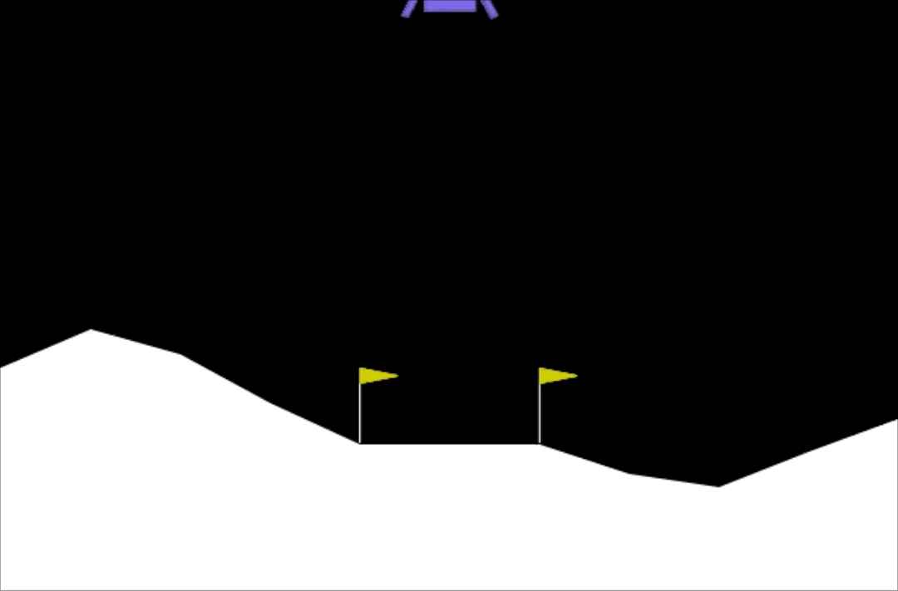
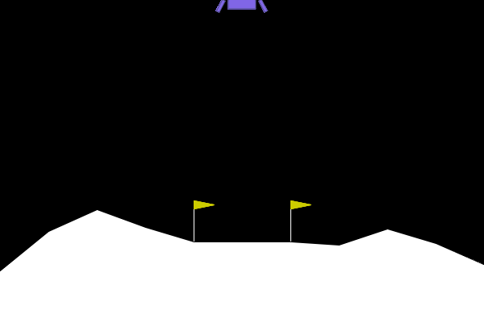
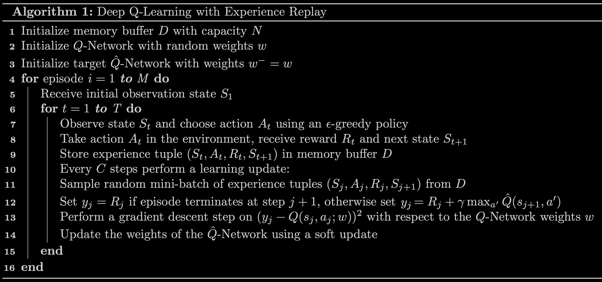
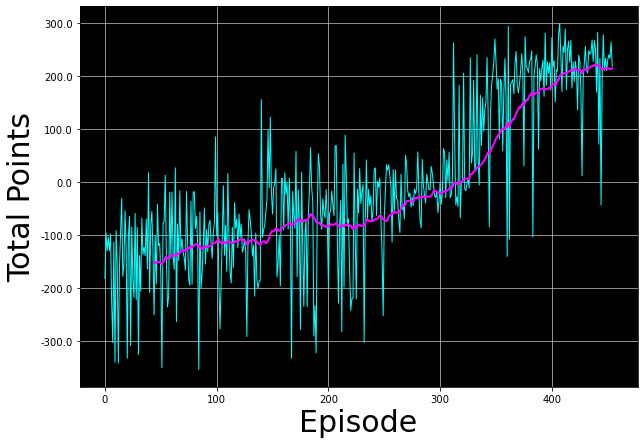

<!-- 本文件由课程原始 Notebook 转换并翻译。代码与公式保留原样。 -->
<!-- 原文件：3. Unsupervised Learning, Recommenders, Reinforcement Learning/week 3/reinforcement learning - lunar lander/C3_W3_A1_Assignment.ipynb -->

# 深度 Q 学习：月球着陆器

本作业将训练一个智能体，使月球着陆器安全降落在指定着陆区。


# 内容提要
- [ 1 - Import Packages ](#1)
- [2 - 超参数](#2)
- [3 - 月球着陆器环境](#3)
  - [3.1 动作空间](#3.1)
  - [3.2 观测空间](#3.2)
  - [3.3 奖励](#3.3)
  - [3.4 回合终止条件](#3.4)
- [4 - 加载环境](#4)
- [5 - 与 Gym 环境交互](#5)
    - [5.1 探索环境动力学](#5.1)
- [6 - 深度 Q 学习](#6)
  - [6.1 目标网络](#6.1)
    - [练习 1](#ex01)
  - [6.2 经验回放](#6.2)
- [7 - 带经验回放的深度 Q 学习算法](#7)
  - [练习 2](#ex02)
- [8 - 更新网络权重](#8)
- [9 - 训练智能体](#9)
- [10 - 观察训练后的智能体](#10)
- [11 - 恭喜完成](#11)
- [12 - 参考文献](#12)

_**注意：**为避免自动评分出错，请勿编辑或删除非评分单元格，也不要在 Notebook 中新增单元格。_ 
_通过作业后，如果想尝试额外代码，可按 Notebook 末尾的说明解锁非评分单元格。_

<a name="1"></a>
## 1 - 导入软件包

我们将使用下列软件包：
- `numpy` 是 Python 科学计算库；
- `deque` 用作经验回放缓冲区的数据结构；
- `namedtuple` 用于存储单条经验；
- `gym` 提供一组可用于测试强化学习算法的环境；本 Notebook 使用 `gym==0.24.0`；
- `PIL.Image` 和 `pyvirtualdisplay` 用于渲染月球着陆器环境；
- 使用 `tensorflow.keras` 构建深度学习模型。
- `utils` 包含本作业的辅助函数，无需修改。

运行下面的单元格，导入所需软件包。

```python
import time
from collections import deque, namedtuple

import gym
import numpy as np
import PIL.Image
import tensorflow as tf
import utils

from pyvirtualdisplay import Display
from tensorflow.keras import Sequential
from tensorflow.keras.layers import Dense, Input
from tensorflow.keras.losses import MSE
from tensorflow.keras.optimizers import Adam
```

```python
# Set up a virtual display to render the Lunar Lander environment.
Display(visible=0, size=(840, 480)).start();

# Set the random seed for TensorFlow
tf.random.set_seed(utils.SEED)
```

<a name="2"></a>
## 2. 超参数

运行下面的单元格设置超参数。

```python
MEMORY_SIZE = 100_000     # size of memory buffer
GAMMA = 0.995             # discount factor
ALPHA = 1e-3              # learning rate  
NUM_STEPS_FOR_UPDATE = 4  # perform a learning update every C time steps
```

<a name="3"></a>
## 3 - 月球着陆器环境

本作业使用 [OpenAI Gym](https://www.gymlibrary.dev/) 提供的强化学习环境。环境定义了智能体要解决的任务；这里的任务是控制月球着陆器安全着陆。

目标是让着陆器安全降落在两个旗杆之间的着陆区，其中心坐标为 `(0,0)`；着陆器也可能落在着陆区外。每个回合开始时，着陆器位于环境顶部中央，并受到随机初始力；燃料不限。若平均得分达到 200，通常认为任务已解决。

<br>
<br>
<figure>
  
      <figcaption style = "text-align: center; font-style: italic">图 1：月球着陆器环境。</figcaption>
</figure>


<a name="3.1"></a>
### 3.1 动作空间

该智能体有四个独立的动作：

* 不执行任何操作；
* 启动右侧发动机；
* 启动主发动机；
* 启动左侧发动机。

每个动作都有相应的数值：

```Python
Do nothing = 0
Fire right engine = 1
Fire main engine = 2
Fire left engine = 3
```

<a name="3.2"></a>
### 3.2 观测空间

智能体的观测空间是一个包含 8 个变量的状态向量：

* 着陆器的 $(x,y)$ 坐标；着陆区中心固定在 $(0,0)$；
* 线速度 $(\dot x,\dot y)$；
* 倾斜角 $\theta$；
* 角速度 $\dot\theta$；
* 两个布尔量 $l$ 和 $r$，分别表示左右支腿是否接触地面。

<a name="3.3"></a>
### 3.3 奖励

环境在每个时间步返回奖励；一个回合的总回报是该回合全部奖励之和。

每个时间步的奖励按以下因素调整：
- 着陆器越接近着陆区，奖励越高；
- 速度越小，奖励越高；
- 姿态越接近水平，奖励越高；
- 每条支腿接触地面时增加 10 分；
- 侧向发动机每工作一帧扣 0.03 分；
- 主发动机每工作一帧扣 0.3 分。

坠毁额外奖励 -100，安全着陆额外奖励 +100。

<a name="3.4"></a>
### 3.4 回合终止条件

一个 episode 在环境进入终止状态时结束，具体包括：

* 月球着陆器坠毁，即着陆器主体接触月面。

* 着陆器的 $x$ 坐标绝对值大于 1，即越过左侧或右侧边界。

完整环境说明参见 [OpenAI Gym 文档](https://www.gymlibrary.dev/environments/box2d/lunar_lander/)全面描述环境。

<a name="4"></a>
## 4 - 加载环境

首先调用 `gym.make()` 创建 `LunarLander-v2` 环境。该版本的变更记录见 [Open AI Gym documentation](https://www.gymlibrary.dev/environments/box2d/lunar_lander/#version-history).

```python
env = gym.make('LunarLander-v2')
```

创建环境后，调用 `.reset()` 将其重置到初始状态；调用 `.render()` 可以显示着陆器。

```python
env.reset()
PIL.Image.fromarray(env.render(mode='rgb_array'))
```



构建神经网络前，需要知道状态向量维度和有效动作数，分别可从 `.observation_space.shape` 与 `.action_space.n` 读取。

```python
state_size = env.observation_space.shape
num_actions = env.action_space.n

print('State Shape:', state_size)
print('Number of actions:', num_actions)
```

```text
State Shape: (8,)
Number of actions: 4
```

<a name="5"></a>
## 5 - 与 Gym 环境交互

Gym 遵循标准的“智能体—环境”交互循环：

<br>
<center>
<video src = "./videos/rl_formalism.m4v" width="840" height="480" controls autoplay loop poster="./images/rl_formalism.png"> </video>
<figcaption style = "text-align:center; font-style:italic">图 2：智能体—环境交互循环。</figcaption>
</center>
<br>

在标准的“智能体—环境”循环中，智能体在离散时间步 $t=0,1,2,...$ 与环境交互。在每个时间步 $t$，智能体根据策略 $\pi$ 和当前状态 $S_t$ 选择动作 $A_t$，获得奖励 $R_t$，并转移到新状态 $S_{t+1}$。

<a name="5.1"></a>
### 5.1 探索环境动力学

在 Gym 环境中，`.step(action)` 推进一个时间步，并返回四个值：

* `observation`（对象）：环境观测；在月球着陆器中，它是包含位置、速度等状态信息的 NumPy 数组，见 [3.2 Observation Space](#3.2).


* `reward`（浮点数）：执行动作后获得的奖励，在本环境中通常为 `numpy.float64`，见 [3.3 Rewards](#3.3).


* `done`（布尔值）：为 `True` 时表示当前回合已经结束；


* `info`（字典）：用于调试的诊断信息；本 Notebook 不使用其内容，但会打印查看。

开始新回合前，调用 `.reset()` 把环境恢复到初始状态。

```python
# Reset the environment and get the initial state.
current_state = env.reset()
```

重置环境后，可以调用 `.step()` 方法让智能体执行动作。每个时间步只能执行一个动作。

在下面的单元格中可以选择不同动作，并观察环境返回值如何变化。本环境中，智能体有四个离散动作，代码使用相应整数表示：

```Python
Do nothing = 0
Fire right engine = 1
Fire main engine = 2
Fire left engine = 3
```

```python
# Select an action
action = 0

# Run a single time step of the environment's dynamics with the given action.
next_state, reward, done, _ = env.step(action)

# Display table with values.
utils.display_table(current_state, action, next_state, reward, done)

# Replace the `current_state` with the state after the action is taken
current_state = next_state
```

```text
<pandas.io.formats.style.Styler at 0x7d3d0aefe7d0>
```

训练时会使用循环，让智能体在一个回合中连续执行多步动作。

<a name="6"></a>
## 6 - 深度 Q 学习

状态空间和动作空间都离散时，可以用贝尔曼方程迭代更新动作价值：

$$
Q_{i+1}(s,a) = R + \gamma \max_{a'}Q_i(s',a')
$$

当 $i\to\infty$ 时，该迭代方法收敛到最优动作价值函数 $Q^*(s,a)$。对于离散状态空间，智能体可以探索状态—动作空间并不断更新 $Q(s,a)$；但对于连续状态空间，遍历全部状态—动作组合几乎不可能，因此需要用函数逼近来估计 $Q(s,a)$。

在深度 Q 学习中，用神经网络近似动作价值函数 $Q(s,a)\approx Q^*(s,a)$，该网络称为 Q 网络。训练时调整网络权重，使贝尔曼方程两侧的均方误差尽可能小。

直接用神经网络估计动作价值往往不稳定。常用的改进包括**目标网络（target network）**和**经验回放（experience replay）**，下面分别介绍。

<a name="6.1"></a>
### 6.1 目标网络

可以通过最小化 Q 网络输出与贝尔曼目标之间的均方误差来训练网络。若直接使用当前 Q 网络，目标值为：

$$
y = R + \gamma \max_{a'}Q(s',a';w)
$$

其中，$w$ 表示 Q 网络的权重。训练时通过调整 $w$ 来最小化以下误差：

$$
\overbrace{\underbrace{R + \gamma \max_{a'}Q(s',a'; w)}_{\rm {y~target}} - Q(s,a;w)}^{\rm {Error}}
$$

问题在于，网络权重每次更新都会改变目标 $y$，这个不断移动的目标容易引起振荡。为提高稳定性，可以创建
一个结构相同但参数单独维护的**目标网络 $\hat Q$** 来生成 $y$。此时误差改写为：

$$
\overbrace{\underbrace{R + \gamma \max_{a'}\hat{Q}(s',a'; w^-)}_{\rm {y~target}} - Q(s,a;w)}^{\rm {Error}}
$$

其中，$w^-$ 和 $w$ 分别是目标网络 $\hat Q$ 与 Q 网络的权重。

训练时用目标网络 $\hat Q$ 计算 $y$，并定期让目标网络缓慢跟随 Q 网络。这里采用**软更新**，按下式更新目标网络权重 $w^-$：
 
$$
w^-\leftarrow \tau w + (1 - \tau) w^-
$$

其中 $\tau\ll 1$。软更新使目标值 $y$ 缓慢变化，从而显著提高学习算法的稳定性。

<a name="ex01"></a>
### 练习 1

本练习将创建 Q 网络、目标网络 $\hat Q$ 和优化器。深度 Q 网络（DQN）学习把状态映射为各动作的 Q 值，从而近似 $Q^*(s,a)$。

为了解决月球着陆器环境，我们将使用一个DQN，其架构如下：

* 一个输入形状为 `state_size` 的 `Input` 层；

* 一个包含 `64` 个单元、使用 `relu` 激活函数（activation function）的 `Dense` 层。

* 一个包含 `64` 个单元、使用 `relu` 激活函数（activation function）的 `Dense` 层。

* 一个包含 `num_actions` 个单元、使用 `linear` 激活函数的 `Dense` 输出层。


在下面的单元格中，按上述结构创建 Q 网络和目标网络；两者架构完全相同。

最后创建 Adam 优化器，并把学习率设为超参数部分定义的 `ALPHA`。请使用本作业已经导入的 Keras 组件。
```Python
from tensorflow.keras.layers import Dense, Input
from tensorflow.keras.optimizers import Adam
```

```python
# UNQ_C1
# GRADED CELL

# Create the Q-Network
q_network = Sequential([
    ### START CODE HERE ### 
    Input(shape=state_size),                      
    Dense(units=64, activation='relu'),            
    Dense(units=64, activation='relu'),            
    Dense(units=num_actions, activation='linear'),
    ### END CODE HERE ### 
    ])

# Create the target Q^-Network
target_q_network = Sequential([
    ### START CODE HERE ### 
    Input(shape=state_size),                       
    Dense(units=64, activation='relu'),            
    Dense(units=64, activation='relu'),            
    Dense(units=num_actions, activation='linear'), 
    ### END CODE HERE ###
    ])

### START CODE HERE ### 
optimizer = Adam(learning_rate=ALPHA)
### END CODE HERE ###
```

```python
# UNIT TEST
from public_tests import *

test_network(q_network)
test_network(target_q_network)
test_optimizer(optimizer, ALPHA)
```

```text
All tests passed!
All tests passed!
All tests passed!
```

<details>
  <summary><font size="3" color="darkgreen"><b>点击查看提示</b></font></summary>
    
```Python
# Create the Q-Network
q_network = Sequential([
    Input(shape=state_size),                      
    Dense(units=64, activation='relu'),            
    Dense(units=64, activation='relu'),            
    Dense(units=num_actions, activation='linear'),
    ])

# Create the target Q^-Network
target_q_network = Sequential([
    Input(shape=state_size),                       
    Dense(units=64, activation='relu'),            
    Dense(units=64, activation='relu'),            
    Dense(units=num_actions, activation='linear'), 
    ])

optimizer = Adam(learning_rate=ALPHA)                                  
```

<a name="6.2"></a>
### 6.2 经验回放

智能体与环境交互时，状态、动作和奖励按时间顺序产生，相邻经验之间高度相关，直接用它们训练会造成不稳定。经验回放（experience replay）把每一步的 $(S_t, A_t, R_t, S_{t+1})$ 存入缓冲区，再随机抽取小批量样本训练，从而降低样本相关性。

本作业使用 `namedtuple` 保存每条经验。

```python
# Store experiences as named tuples
experience = namedtuple("Experience", field_names=["state", "action", "reward", "next_state", "done"])
```

经验回放能够减弱样本相关性，减少振荡和不稳定；同一条经验还可以参与多次更新，从而提高数据利用率。

<a name="7"></a>
## 7 - 带经验回放的深度 Q 学习算法

现在把目标网络和经验回放组合成完整的深度 Q 学习算法。
<br>
<br>
<figure>
  
      <figcaption style = "text-align: center; font-style: italic">图 3：带经验回放的深度 Q 学习。</figcaption>
</figure>

<a name="ex02"></a>
### 练习 2

本练习实现图 3 算法中的第 12 行：计算目标 $y$ 与当前 $Q(s,a)$ 之间的损失。请补全 `compute_loss`，其中目标值为：

$$
\begin{equation}
    y_j =
    \begin{cases}
      R_j & \text{if episode terminates at step  } j+1\\
      R_j + \gamma \max_{a'}\hat{Q}(s_{j+1},a') & \text{otherwise}\\
    \end{cases}       
\end{equation}
$$

实现时注意：

* `compute_loss` 接收一小批经验，并解包为 `states`、`actions`、`rewards`、`next_states` 和 `done_vals`。这些都是 TensorFlow 张量，第一维等于批量大小；例如批量大小为 64 时，`rewards` 和 `done_vals` 都含 64 个元素。


* 不能用普通 `if/else` 逐个处理张量中的目标值。`done_vals` 可直接参与向量化计算：终止状态为 `True`（数值 1）时，`1-done_vals` 为 0，从而去掉下一状态的 Q 值；未终止时该因子为 1，保留折扣后的最大 Q 值。 

最后，计算 `y_targets` 与 `q_values` 之间的均方误差作为损失。可直接调用已导入的 `MSE`：
```Python
from tensorflow.keras.losses import MSE
```

```python
# UNQ_C2
# GRADED FUNCTION: calculate_loss

def compute_loss(experiences, gamma, q_network, target_q_network):
    """ 
    Calculates the loss.
    
    Args:
      experiences: (tuple) tuple of ["state", "action", "reward", "next_state", "done"] namedtuples
      gamma: (float) The discount factor.
      q_network: (tf.keras.Sequential) Keras model for predicting the q_values
      target_q_network: (tf.keras.Sequential) Keras model for predicting the targets
          
    Returns:
      loss: (TensorFlow Tensor(shape=(0,), dtype=int32)) the Mean-Squared Error between
            the y targets and the Q(s,a) values.
    """

    # Unpack the mini-batch of experience tuples
    states, actions, rewards, next_states, done_vals = experiences
    
    # Compute max Q^(s,a)
    max_qsa = tf.reduce_max(target_q_network(next_states), axis=-1)
    
    # Set y = R if episode terminates, otherwise set y = R + γ max Q^(s,a).
    ### START CODE HERE ### 
    y_targets = rewards + (gamma * max_qsa * (1 - done_vals))
    ### END CODE HERE ###
    
    # Get the q_values and reshape to match y_targets
    q_values = q_network(states)
    q_values = tf.gather_nd(q_values, tf.stack([tf.range(q_values.shape[0]),
                                                tf.cast(actions, tf.int32)], axis=1))
        
    # Compute the loss
    ### START CODE HERE ### 
    loss = MSE(y_targets, q_values) 
    ### END CODE HERE ### 
    
    return loss
```

```python
# UNIT TEST    
test_compute_loss(compute_loss)
```

```text
All tests passed!
```

<details>
  <summary><font size="3" color="darkgreen"><b>点击查看提示</b></font></summary>
    
```Python
def compute_loss(experiences, gamma, q_network, target_q_network):
    """ 
    Calculates the loss.
    
    Args:
      experiences: (tuple) tuple of ["state", "action", "reward", "next_state", "done"] namedtuples
      gamma: (float) The discount factor.
      q_network: (tf.keras.Sequential) Keras model for predicting the q_values
      target_q_network: (tf.keras.Sequential) Keras model for predicting the targets
          
    Returns:
      loss: (TensorFlow Tensor(shape=(0,), dtype=int32)) the Mean-Squared Error between
            the y targets and the Q(s,a) values.
    """

    
    # Unpack the mini-batch of experience tuples
    states, actions, rewards, next_states, done_vals = experiences
    
    # Compute max Q^(s,a)
    max_qsa = tf.reduce_max(target_q_network(next_states), axis=-1)
    
    # Set y = R if episode terminates, otherwise set y = R + γ max Q^(s,a).
    y_targets = rewards + (gamma * max_qsa * (1 - done_vals))
    
    # Get the q_values
    q_values = q_network(states)
    q_values = tf.gather_nd(q_values, tf.stack([tf.range(q_values.shape[0]),
                                                tf.cast(actions, tf.int32)], axis=1))
    
    # Calculate the loss
    loss = MSE(y_targets, q_values)
    
    return loss

```

<a name="8"></a>
## 8 - 更新网络权重

下面的 `agent_learn` 实现图 3 中第 12～14 行。它使用 `tf.GradientTape` 记录自定义训练循环中的梯度，再调用 `optimizer.apply_gradients()` 更新 Q 网络权重。`@tf.function` 把函数编译为 TensorFlow 图以提高性能；详情参见 [TensorFlow 文档](https://www.tensorflow.org/guide/function)。

函数最后通过[软更新](#6.1)调整目标网络权重。具体实现可查看 `utils` 模块中的 `update_target_network`。

```python
@tf.function
def agent_learn(experiences, gamma):
    """
    Updates the weights of the Q networks.
    
    Args:
      experiences: (tuple) tuple of ["state", "action", "reward", "next_state", "done"] namedtuples
      gamma: (float) The discount factor.
    
    """
    
    # Calculate the loss
    with tf.GradientTape() as tape:
        loss = compute_loss(experiences, gamma, q_network, target_q_network)

    # Get the gradients of the loss with respect to the weights.
    gradients = tape.gradient(loss, q_network.trainable_variables)
    
    # Update the weights of the q_network.
    optimizer.apply_gradients(zip(gradients, q_network.trainable_variables))

    # update the weights of target q_network
    utils.update_target_network(q_network, target_q_network)
```

<a name="9"></a>
## 9 - 训练智能体

现在按照[图 3](#7)训练智能体。下面再次列出算法并逐行说明，方便对照代码。

* **第 1 行：**创建容量为 `MEMORY_SIZE` 的 `memory_buffer`，其数据结构为 `deque`。


* **第 2 行：**Q 网络已在[练习 1](#ex01)中创建，因此这里跳过。


* **第 3 行：**初始化 `target_q_network`，并令其权重与 `q_network` 相同。


* **第 4 行**：开始外层循环。这里设置 $M =$ `num_episodes = 2000`；使用本实验的默认超参数时，智能体通常能在 `2000` 个 episode 以内学会任务。


* **第 5 行：**调用 `.reset()` 重置环境并取得初始状态。


* **第 6 行：**开始回合内循环。这里 `max_num_timesteps=1000`，因此回合最迟在 1,000 个时间步后结束。


* **第 7 行**：智能体根据当前 `state` 使用 ε-greedy 策略选择 `action`。初始时 $\epsilon =$ `epsilon = 1`，因此训练早期以随机探索为主；随后按给定衰减率逐步减小 ε。当 $\epsilon = 0$ 时，策略完全贪心，只选择当前估计 $Q(s,a)$ 最大的动作。这里把 ε 的下限设为 `0.01`，以便训练期间始终保留少量探索。具体实现见 `utils` 模块中的 `utils.get_action`。


* **第 8 行**：调用环境的 `.step()` 执行给定 `action`，并获得 `reward` 和 `next_state`。


* **第 9 行：**把 `experience(state, action, reward, next_state, done)` 存入 `memory_buffer`。保存 `done` 是为了判断转移是否终止，并据此计算[练习 2](#ex02)中的目标 $y$。


* **第 10 行：**调用 `utils.check_update_conditions` 判断是否更新网络。条件是距离上次更新已达到 `NUM_STEPS_FOR_UPDATE=4` 个时间步，且经验缓冲区至少能提供一个完整的小批量（例如批量大小为 64 时，缓冲区至少含 64 条经验）。


* **第 11～14 行：**若 `update=True`，从 `memory_buffer` 随机采样一个小批量，计算目标 $y$，执行梯度下降并更新网络权重。后面三步由[第 8 节](#8)定义的 `agent_learn` 完成。


* **第 15 行**：每次内层循环结束时，把 `next_state` 设为新的 `state`。如果 `done = True`，说明 episode 已到达终止状态，此时退出内层循环。


* **第 16 行**：每轮外层循环结束时更新 $\epsilon$，并检查任务是否已解决。若最近 `100` 个 episode 的平均得分达到 `200`，则认为环境已解决；否则继续训练。

代码还记录每个回合的总分，用于判断任务是否解决并观察训练趋势；同时使用 `time` 模块统计训练耗时。

<br>
<br>
<figure>
  
      <figcaption style = "text-align: center; font-style: italic">图 4：带经验回放的深度 Q 学习。</figcaption>
</figure>
<br>

**说明：**使用 Notebook 默认参数时，下面的训练单元格通常需要运行 10～15 分钟。

```python
start = time.time()

num_episodes = 2000
max_num_timesteps = 1000

total_point_history = []

num_p_av = 100    # number of total points to use for averaging
epsilon = 1.0     # initial ε value for ε-greedy policy

# Create a memory buffer D with capacity N
memory_buffer = deque(maxlen=MEMORY_SIZE)

# Set the target network weights equal to the Q-Network weights
target_q_network.set_weights(q_network.get_weights())

for i in range(num_episodes):
    
    # Reset the environment to the initial state and get the initial state
    state = env.reset()
    total_points = 0
    
    for t in range(max_num_timesteps):
        
        # From the current state S choose an action A using an ε-greedy policy
        state_qn = np.expand_dims(state, axis=0)  # state needs to be the right shape for the q_network
        q_values = q_network(state_qn)
        action = utils.get_action(q_values, epsilon)
        
        # Take action A and receive reward R and the next state S'
        next_state, reward, done, _ = env.step(action)
        
        # Store experience tuple (S,A,R,S') in the memory buffer.
        # We store the done variable as well for convenience.
        memory_buffer.append(experience(state, action, reward, next_state, done))
        
        # Only update the network every NUM_STEPS_FOR_UPDATE time steps.
        update = utils.check_update_conditions(t, NUM_STEPS_FOR_UPDATE, memory_buffer)
        
        if update:
            # Sample random mini-batch of experience tuples (S,A,R,S') from D
            experiences = utils.get_experiences(memory_buffer)
            
            # Set the y targets, perform a gradient descent step,
            # and update the network weights.
            agent_learn(experiences, GAMMA)
        
        state = next_state.copy()
        total_points += reward
        
        if done:
            break
            
    total_point_history.append(total_points)
    av_latest_points = np.mean(total_point_history[-num_p_av:])
    
    # Update the ε value
    epsilon = utils.get_new_eps(epsilon)

    print(f"\rEpisode {i+1} | Total point average of the last {num_p_av} episodes: {av_latest_points:.2f}", end="")

    if (i+1) % num_p_av == 0:
        print(f"\rEpisode {i+1} | Total point average of the last {num_p_av} episodes: {av_latest_points:.2f}")

    # We will consider that the environment is solved if we get an
    # average of 200 points in the last 100 episodes.
    if av_latest_points >= 200.0:
        print(f"\n\nEnvironment solved in {i+1} episodes!")
        q_network.save('lunar_lander_model.h5')
        break
        
tot_time = time.time() - start

print(f"\nTotal Runtime: {tot_time:.2f} s ({(tot_time/60):.2f} min)")
```

```text
Episode 100 | Total point average of the last 100 episodes: -132.04
Episode 200 | Total point average of the last 100 episodes: -89.677
Episode 300 | Total point average of the last 100 episodes: -45.00
Episode 400 | Total point average of the last 100 episodes: 124.20
Episode 455 | Total point average of the last 100 episodes: 200.05

Environment solved in 455 episodes!

Total Runtime: 531.67 s (8.86 min)
```

下面把每轮总得分及其移动平均值绘制出来，观察智能体在训练过程中的改进。实现细节见 `utils.plot_history`。

```python
# Plot the total point history along with the moving average
utils.plot_history(total_point_history)
```



<a name="10"></a>
## 10 - 观察训练后的智能体运行

智能体训练完成后，可以用 `utils.create_video` 生成它与环境交互的视频。该函数调用 `imageio`，可能产生一些无关警告，下面的代码会将其隐藏。

```python
# Suppress warnings from imageio
import logging
logging.getLogger().setLevel(logging.ERROR)
```

下面使用训练后的 `q_network` 控制智能体，并把交互过程保存为 `videos` 目录下的 MP4 文件。`utils.embed_mp4` 会把视频嵌入 Notebook，便于直接查看。

由于每个回合的初始随机力不同，每次生成的视频也会不同。训练良好的智能体应能适应这些初始差异，并较稳定地降落在着陆区。

```python
filename = "./videos/lunar_lander.mp4"

utils.create_video(filename, env, q_network)
utils.embed_mp4(filename)
```

```text
<IPython.core.display.HTML object>
```

<a name="11"></a>
## 11 - 恭喜完成！

恭喜！你已经使用带经验回放的深度 Q 学习，训练智能体完成月球着陆任务。

<a name="12"></a>
## 12 - 参考文献

若想进一步了解深度 Q 学习，可阅读以下论文：


* Mnih, V., Kavukcuoglu, K., Silver, D., et al. *Human-level control through deep reinforcement learning*. Nature 518, 529–533 (2015).


* Lillicrap, T. P., Hunt, J. J., Pritzel, A., et al. *Continuous control with deep reinforcement learning*. ICLR (2016).


* Mnih, V., Kavukcuoglu, K., Silver, D., et al. *Playing Atari with Deep Reinforcement Learning*. arXiv:1312.5602 (2013).

<details>
  <summary><font size="2" color="darkgreen"><b>如果已经通过作业并希望尝试额外代码，可展开这里的说明。</b></font></summary>
    <p><i><b>请仅在作业通过后修改单元格属性，以免影响自动评分。</b></i>
    <ol>
        <li>在 Notebook 菜单中选择 `View` > `Cell Toolbar` > `Edit Metadata`。</li>
        <li>在需要锁定或解锁的代码单元格上点击 `Edit Metadata`。</li>
        <li>将 `editable` 属性设为：
            <ul>
                <li>要解锁，设为 `true`；</li>
                <li>要锁定，设为 `false`。</li>
            </ul>
        </li>
        <li>完成后选择 `View` > `Cell Toolbar` > `None` 隐藏元数据工具栏。</li>
    </ol>
    <p>下面的演示展示了完整操作：
        <br>
        <span>按上述步骤即可解锁单元格。</span>
</details>
