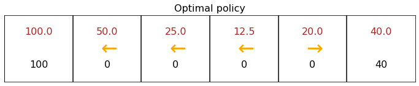
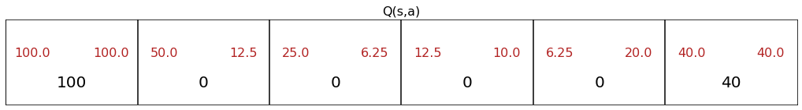

<!-- 本文件由课程原始 Notebook 转换并翻译。代码与公式保留原样。 -->
<!-- 原文件：3. Unsupervised Learning, Recommenders, Reinforcement Learning/week 3/state-action value function/State-action value function example.ipynb -->

# 状态-动作价值函数（state-action value function）示例

在这个 Jupyter Notebook 中，你可以修改火星车（Mars Rover）示例中的奖励和折扣因子，观察状态-动作价值 $Q(s,a)$ 如何随之变化。

```python
import numpy as np
from utils import *
```

```python
# Do not modify
num_states = 6
num_actions = 2
```

```python
terminal_left_reward = 100
terminal_right_reward = 40
each_step_reward = 0

# Discount factor
gamma = 0.5

# Probability of going in the wrong direction
misstep_prob = 0
```

```python
generate_visualization(terminal_left_reward, terminal_right_reward, each_step_reward, gamma, misstep_prob)
```




